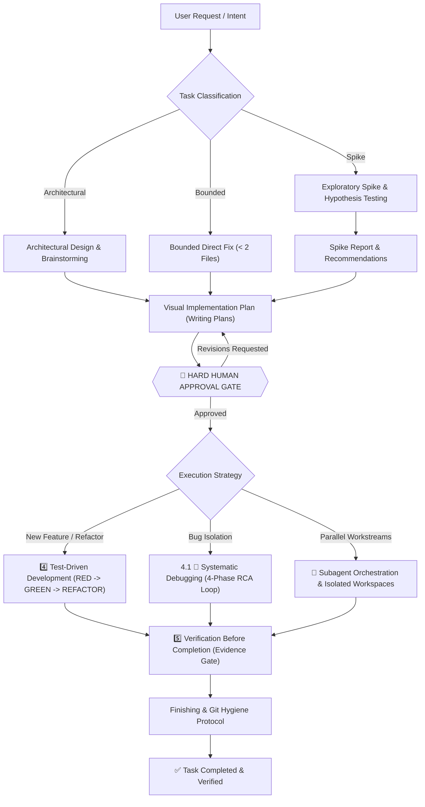

# AI Skills: Ultimate All-in-One AI Coding Agent Pipeline

Comprehensive, production-grade, all-in-one skill pipeline for AI coding agents. Designed to guide agents through the entire software engineering lifecycle: **Idea -> Design -> Plan -> Human Approval Gate -> TDD -> Systematic Debugging -> Subagent Orchestration -> Verification -> Finishing**.

Maintains a **Single Source of Truth** (`Super Ultra Code Plan Implementation.md`) so the agent never loses contextual invariants, safety constraints, or human-approval gates during execution.

---

## Execution Lifecycle


<details>
<summary>View raw Mermaid source</summary>



</details>

---

## Repository Structure

```
ai-skills/
├── README.md                                    # Documentation & architecture flow
├── LICENSE                                      # MIT License
├── package.json                                 # devDependencies: @mermaid-js/mermaid-cli
├── Super Ultra Code Plan Implementation.md      # SINGLE SOURCE OF TRUTH (Master Skill)
├── install.sh                                   # 1-command installer for all harnesses
├── .github/
│   └── workflows/
│       └── ci.yml                               # CI: install, render diagrams, validate, dry-run
├── diagrams/                                    # Auto-generated SVG diagrams (CI artifact)
│   └── lifecycle.svg                            # Lifecycle diagram embedded in README
├── examples/
│   └── worked-example.md                        # Full pipeline walkthrough (filled-in reference)
├── scripts/
│   ├── sync.sh                                  # Bidirectional sync (~/.config/ai <-> repo)
│   ├── render-diagrams.sh                       # Render all mermaid blocks to SVG
│   └── validate-skill.mjs                       # Frontmatter, link, token & mermaid lint
├── templates/                                   # Companion templates (blank scaffolds)
│   ├── implementation-plan-template.md          # Visual work breakdown & task mapping
│   ├── spike-report-template.md                 # Timeboxed exploratory spike & hypotheses
│   ├── systematic-debugging-log-template.md     # 4-phase RCA & bug reproduction log
│   ├── verification-checklist-template.md       # Multi-layer proof & sign-off checklist
│   ├── handoff-template.md                      # Session handoff — resume from exact state
│   └── progress-log-template.md                # Persistent task state across sessions
└── skills/
    └── super-ultra-code-plan/
        └── SKILL.md -> ../../Super Ultra Code Plan Implementation.md  # Harness discovery symlink
```

---

## Quick Start & Installation

Install and configure symlinks across all installed agent harnesses with one command:

```bash
git clone https://github.com/belajarcarabelajar/ai-skills.git
cd ai-skills
./install.sh
```

### Supported Harnesses & Target Paths

| Harness / Ecosystem | Config / Skill Location | Auto-Discovery Support |
|---|---|---|
| **Google Antigravity CLI** (`agy`) | `~/.gemini/antigravity-cli/builtin/skills/super-ultra-code-plan/` | Supported |
| **Universal Agents** | `~/.agents/skills/super-ultra-code-plan/` | Supported |
| **Claude Code** | `~/.claude/skills/super-ultra-code-plan/` | Supported |
| **Personal Config Mirror** | `~/.config/ai/Super Ultra Code Plan Implementation.md` | Supported |

---

## Companion Templates

Agents can instantly scaffold structured artifacts using the ready-to-use templates in `templates/`. Each template includes an embedded Mermaid diagram illustrating its workflow:

- **[`implementation-plan-template.md`](templates/implementation-plan-template.md)**: Visual Mermaid map, task breakdown, failing tests (RED), implementation (GREEN), and verification matrix.
- **[`spike-report-template.md`](templates/spike-report-template.md)**: Hypothesis testing flow, epistemic unknowns exploration, and architectural trade-off evaluations.
- **[`systematic-debugging-log-template.md`](templates/systematic-debugging-log-template.md)**: 4-phase RCA state machine (REPRODUCE -> DIAGNOSE -> FIX -> VERIFY) and bug reproduction log.
- **[`verification-checklist-template.md`](templates/verification-checklist-template.md)**: Evidence gate flowchart, pre-completion checks (test logs, zero warnings, build pass, git hygiene).
- **[`handoff-template.md`](templates/handoff-template.md)**: Session handoff document — fill at the end of every session so the next session can resume exactly where you left off (last verified state, next action, open decisions, blockers).
- **[`progress-log-template.md`](templates/progress-log-template.md)**: Persistent task state log — the single source of truth for a task across multiple sessions (checklist, decisions, evidence trail, session log).

---

## Examples

See the [`examples/`](examples/) folder for a complete filled-in walkthrough:

- **[`worked-example.md`](examples/worked-example.md)**: Full pipeline from Classify through Commit on a real-sized task (adding zod input validation to a REST endpoint). Use this as a reference for what correct output looks like at each phase.

---

## Validation & Quality Checks

Run the automated validation suite locally:

```bash
# Install mermaid-cli (once)
npm install

# Render all diagrams to diagrams/
bash scripts/render-diagrams.sh

# Validate frontmatter, symlinks, templates, scripts & mermaid syntax
node scripts/validate-skill.mjs
```

Verifies:
- YAML frontmatter syntax (`name`, `description`, `triggers`).
- Master file integrity and estimated token budget (~22k tokens).
- Symlink validity in `skills/super-ultra-code-plan/SKILL.md`.
- Presence of all required templates and executable scripts.
- Mermaid syntax validity for every ` ```mermaid` block in the repo (exits 1 on any error).

---

## License

[MIT License](LICENSE) — Copyright (c) 2026 belajarcarabelajar
