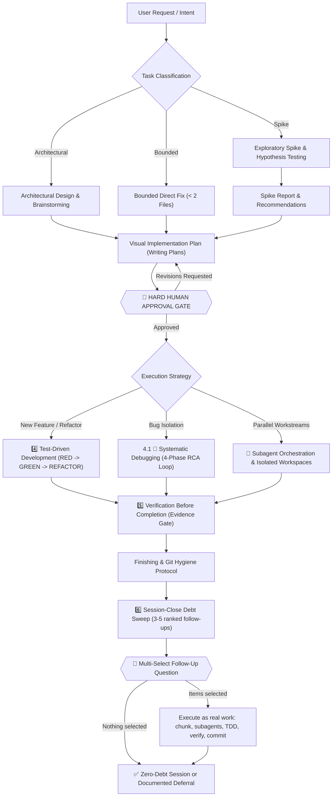

# AI Skills: Ultimate All-in-One AI Coding Agent Pipeline

Comprehensive, production-grade, all-in-one skill pipeline for AI coding agents. Designed to guide agents through the entire software engineering lifecycle: **Idea -> Design -> Plan -> Human Approval Gate -> TDD -> Systematic Debugging -> Subagent Orchestration -> Verification -> Finishing -> Session-Close Debt Sweep**.

Verification is the last gate, not the last step. Once the plan is `Done 100%` and the evidence is green, the agent harvests every noticed-but-unclosed item from the session, ranks 3-5 follow-ups that can be finished right now, and asks them as a single multi-select question through the harness's own prompt widget. The user taps checkboxes instead of retyping, selected items run as real work, and the session ends with zero unexamined coding debt.

Maintains a **Single Source of Truth** (`Super Ultra Code Plan Implementation.md`) so the agent never loses contextual invariants, safety constraints, or human-approval gates during execution.

---

## Execution Lifecycle


<details>
<summary>View raw Mermaid source</summary>



</details>

---

## Execution Model: Subagent-First, High Fan-Out

Execution runs through subagents by default. The parent agent is the orchestrator: it chunks the work, dispatches a batch, then gathers and synthesizes the reports.

- **Task chunking before dispatch:** the work is split into the smallest independently verifiable units (one behavior, one file, one command chain, one hypothesis), and each unit gets its own subagent.
- **High fan-out floor:** aim for 10 or more narrow subagents when the task supports it. Ten small chunks finish faster and isolate failure better than five oversized ones. Dropping below the floor requires a written reason (atomic task, no subagent tool available, or inseparable shared state).
- **Gather and synthesize:** subagent reports are inputs, not conclusions. The parent dedupes, resolves conflicts from the evidence, re-verifies each claim via diff/log/exit status, and merges one result before continuing.
- **Audit gate:** every integrated chunk passes the parent diff audit before it counts as done. A red chunk is re-chunked and re-dispatched alone.

Inline execution exists only as a documented exception, not a default.

---

## Repository Structure

```
ai-skills/
├── README.md                                    # Documentation & architecture flow
├── LICENSE                                      # MIT License
├── package.json                                 # devDependencies: @mermaid-js/mermaid-cli
├── Super Ultra Code Plan Implementation.md      # SINGLE SOURCE OF TRUTH (Master Skill)
├── install.sh                                   # 1-command installer for all harnesses
├── .github/
│   └── workflows/
│       └── ci.yml                               # CI: install, render diagrams, validate, dry-run
├── diagrams/                                    # Auto-generated SVG diagrams (CI artifact)
│   └── lifecycle.svg                            # Lifecycle diagram embedded in README
├── examples/
│   └── worked-example.md                        # Full pipeline walkthrough (filled-in reference)
├── scripts/
│   ├── sync.sh                                  # Bidirectional sync (~/.config/ai <-> repo)
│   ├── render-diagrams.sh                       # Render all mermaid blocks to SVG
│   └── validate-skill.mjs                       # Frontmatter, link, token & mermaid lint
├── templates/                                   # Companion templates (blank scaffolds)
│   ├── implementation-plan-template.md          # Visual work breakdown & task mapping
│   ├── spike-report-template.md                 # Timeboxed exploratory spike & hypotheses
│   ├── systematic-debugging-log-template.md     # 4-phase RCA & bug reproduction log
│   ├── verification-checklist-template.md       # Multi-layer proof & sign-off checklist
│   ├── handoff-template.md                      # Session handoff - resume from exact state
│   ├── progress-log-template.md                 # Persistent task state across sessions
│   ├── adr-template.md                          # Architecture Decision Record with decision tree
│   └── subagent-contract-template.md            # Subagent task contract & parent audit gate
└── skills/
    └── super-ultra-code-plan/                   # Full skill package with bundled templates & examples
        ├── SKILL.md -> ../../Super Ultra Code Plan Implementation.md
        ├── templates -> ../../templates
        └── examples -> ../../examples
```

---

## Quick Start & Installation

Install and configure symlinks across all installed agent harnesses with one command:

```bash
git clone https://github.com/belajarcarabelajar/ai-skills.git
cd ai-skills
./install.sh
```

### Prerequisites

- **Bun >= 1.1.0** ([bun.sh](https://bun.sh)): **mandatory runtime.** All dependency installation uses `bun install` / `bun add`, and all JS/TS execution uses `bun test` / `bun run`. `npm install`, `npm test`, `yarn`, and `pnpm` are strictly prohibited. `curl -fsSL https://bun.sh/install | bash`
- **Node.js is not required.** Every script in this repository runs under Bun, and the only lockfile is `bun.lock`.
- **`tgrep`** ([microsoft/tgrep](https://github.com/microsoft/tgrep)): Mandatory search and log extraction engine. GNU `grep` is strictly prohibited.

### Supported Harnesses & Target Paths

| Harness / Ecosystem | Config / Skill Location | Auto-Discovery Support |
|---|---|---|
| **Google Antigravity CLI** (`agy`) | `~/.gemini/config/skills/super-ultra-code-plan/` | Supported |
| **Universal Agents** | `~/.agents/skills/super-ultra-code-plan/` | Supported |
| **Claude Code** | `~/.claude/skills/super-ultra-code-plan/` | Supported |
| **Personal Config Mirror** | `~/.config/ai/Super Ultra Code Plan Implementation.md` | Supported |

---

## Companion Templates

Agents can instantly scaffold structured artifacts using the ready-to-use templates in `templates/`. Every planning artifact mandatorily includes at least one embedded Mermaid diagram (a plan without Mermaid is incomplete and blocks the approval gate):

- **[`implementation-plan-template.md`](templates/implementation-plan-template.md)**: MANDATORY Mermaid visual map (tasks, dependencies, gates, verification), task breakdown, failing tests (RED), implementation (GREEN), and verification matrix.
- **[`spike-report-template.md`](templates/spike-report-template.md)**: Hypothesis testing flow, epistemic unknowns exploration, and architectural trade-off evaluations.
- **[`systematic-debugging-log-template.md`](templates/systematic-debugging-log-template.md)**: 4-phase RCA state machine (REPRODUCE -> DIAGNOSE -> FIX -> VERIFY) and bug reproduction log.
- **[`verification-checklist-template.md`](templates/verification-checklist-template.md)**: Evidence gate flowchart, pre-completion checks (test logs, zero warnings, build pass, git hygiene).
- **[`handoff-template.md`](templates/handoff-template.md)**: Session handoff document - fill at the end of every session so the next session can resume exactly where you left off (last verified state, next action, open decisions, blockers).
- **[`progress-log-template.md`](templates/progress-log-template.md)**: Persistent task state log - the single source of truth for a task across multiple sessions (checklist, decisions, evidence trail, session log).
- **[`adr-template.md`](templates/adr-template.md)**: Architecture Decision Record (ADR) - structured decision tree, alternative trade-off comparison, and consequences.
- **[`subagent-contract-template.md`](templates/subagent-contract-template.md)**: Subagent task contract - task chunking and fan-out plan, strict scope isolation, permitted target files, gather & synthesize checkpoint, and parent diff audit gate sequence.
- **[`code-review-template.md`](templates/code-review-template.md)**: Reviewer output contract - rule attribution precedence, 8-point bug qualification filter, P0–P3 priority with confidence, exhaustiveness and dedupe rules, suggestion block format, and the binary `correct` / `not correct` verdict.
- **[`follow-up-injection-template.md`](templates/follow-up-injection-template.md)**: Session-close debt sweep - harvested debt candidates, `NOW`/`LATER` classification, the ranked 3-5 follow-up set, the batched multi-select question, the execution record, and the deferred backlog.

---

## Examples

See the [`examples/`](examples/) folder for a complete filled-in walkthrough:

- **[`worked-example.md`](examples/worked-example.md)**: Full pipeline from Classify through Commit on a real-sized task (adding zod input validation to a REST endpoint). Use this as a reference for what correct output looks like at each phase.

---

## Validation & Quality Checks

Run the automated validation suite locally:

```bash
# Install mermaid-cli (once)
bun install

# Render all diagrams to diagrams/
bash scripts/render-diagrams.sh

# Validate frontmatter, symlinks, templates, scripts & mermaid syntax
node scripts/validate-skill.mjs
```

Verifies:
- YAML frontmatter syntax (`name`, `description`, `triggers`).
- Master file integrity and estimated token budget (~33k tokens, measured at ~4 chars/token).
- Symlink validity in `skills/super-ultra-code-plan/SKILL.md`.
- Presence of all required templates and executable scripts.
- Mermaid syntax validity for every ` ```mermaid` block in the repo (exits 1 on any error).

---

## License

[MIT License](LICENSE) — Copyright (c) 2026 belajarcarabelajar
