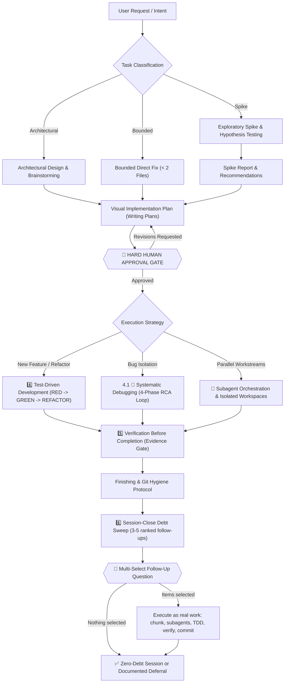

# AI Skills: Ultimate All-in-One AI Coding Agent Pipeline

Comprehensive, production-grade, all-in-one skill pipeline for AI coding agents. Designed to guide agents through the entire software engineering lifecycle: **Idea -> Design -> Plan -> Human Approval Gate -> TDD -> Systematic Debugging -> Subagent Orchestration -> Verification -> Finishing -> Session-Close Debt Sweep**.

Verification is the last gate, not the last step. Once the plan is `Done 100%` and the evidence is green, the agent harvests every noticed-but-unclosed item from the session, ranks 3-5 follow-ups that can be finished right now, and asks them as a single multi-select question through the harness's own prompt widget. The user taps checkboxes instead of retyping, selected items run as real work, and the session ends with zero unexamined coding debt.

Maintains a **Single Source of Truth** (`Super Ultra Code Plan Implementation.md`) so the agent never loses contextual invariants, safety constraints, or human-approval gates during execution.

The skill is four components in sequence — **Brainstorming → Writing Plans → TDD → Verification** — with a human approval gate between each one, plus a **Deep Research** path that runs only when a decision depends on information the codebase does not contain. The sub-agent pipeline that carries out the work is mandatory, not a recommendation.

---

## Execution Lifecycle

<picture>
  <source media="(prefers-color-scheme: dark)" srcset="diagrams/lifecycle-dark.svg">
  
</picture>

<sub>Rendered from the Mermaid source below. Light and dark variants are generated by `scripts/render-diagrams.sh`; the committed files are kept in sync by a CI drift gate.</sub>

<details>
<summary>View raw Mermaid source</summary>



</details>

---

## Execution Model: Subagent-First, High Fan-Out

Execution runs through subagents by default. The parent agent is the orchestrator: it chunks the work, dispatches a batch, then gathers and synthesizes the reports.

- **Task chunking before dispatch:** the work is split into the smallest independently verifiable units (one behavior, one file, one command chain, one hypothesis), and each unit gets its own subagent.
- **High fan-out floor:** aim for 10 or more narrow subagents when the task supports it. Ten small chunks finish faster and isolate failure better than five oversized ones. Dropping below the floor requires a written reason (atomic task, no subagent tool available, or inseparable shared state).
- **Gather and synthesize:** subagent reports are inputs, not conclusions. The parent dedupes, resolves conflicts from the evidence, re-verifies each claim via diff/log/exit status, and merges one result before continuing.
- **Audit gate:** every integrated chunk passes the parent diff audit before it counts as done. A red chunk is re-chunked and re-dispatched alone.

Inline execution exists only as a documented exception, not a default.

---

## Repository Structure

```
ai-skills/
├── README.md                                    # Documentation & architecture flow
├── LICENSE                                      # MIT License
├── package.json                                 # devDependencies: @mermaid-js/mermaid-cli
├── Super Ultra Code Plan Implementation.md      # SINGLE SOURCE OF TRUTH (Master Skill)
├── install.sh                                   # 1-command installer for all harnesses
├── mermaid.config.json                          # Light theme: palette + embedded-font stack
├── mermaid.dark.config.json                     # Dark variant, same layout and font
├── puppeteer-config.json                        # Headless flags for mermaid-cli rendering
├── .github/
│   └── workflows/
│       └── ci.yml                               # CI: bun install, render, drift gate, validate, test
├── diagrams/                                    # Generated SVGs (only the hero pair is committed)
│   ├── lifecycle.svg                            # README hero, light
│   └── lifecycle-dark.svg                       # README hero, dark
├── docs/
│   └── code-plan/
│       ├── <date>-<slug>.manifest.md            # Batch manifest written before the first dispatch
│       └── plans/
│           └── <date>-<slug>.md                 # ultra-plan/v1 plans this repo executed
├── examples/
│   ├── worked-example.md                        # Full pipeline walkthrough (filled-in reference)
│   └── deep-research-worked-example.md          # Citation-grounded report at target density
├── scripts/
│   ├── sync.sh                                  # Bidirectional sync (~/.config/ai <-> repo)
│   ├── render-diagrams.sh                       # Render all mermaid blocks to SVG
│   ├── validate-skill.mjs                       # Frontmatter, link, token, mermaid & a11y lint
│   ├── ultra-plan-runner.mjs                    # ultra-plan/v1 DAG runner + visual map contract
│   ├── ultra-plan-runner.test.mjs               # Contract tests for the runner
│   ├── sync-snippets.mjs                        # Drift guard: snippets/ <-> Snipset database
│   ├── sync-snippets.test.mjs                   # Normalization + drift-detection tests
│   ├── plan-publish.mjs                         # Publish plans into the Obsidian vault (one-way mirror)
│   ├── plan-publish.test.mjs                    # Publish, idempotency, drift, and refusal tests
│   ├── plan-publish-registry.mjs                # Vault + project registry and destination paths
│   ├── plan-publish-registry.test.mjs           # Config, project resolution, enumeration tests
│   ├── plan-publish-frontmatter.mjs             # Pure ultra-plan/v1 -> PARA frontmatter transform
│   ├── plan-publish-frontmatter.test.mjs        # Merge rules, related-link, title fallback tests
│   └── plan-mirror-check.sh                     # Local drift watchdog (systemd --user timer, check only)
├── snippets.manifest.json                      # Maps trigger prompts to Snipset database slots
├── plans.publish.json                          # Vault path, destination template, and project roots for the plan mirror
├── snippets/                                    # Copy-paste trigger prompts
│   ├── orkestrasi-ngoding-plan.md               # Plan + TDD + mandatory subagent fan-out
│   └── orkestrasi-debugging.md                  # RCA + mandatory hypothesis-parallel subagent fan-out
├── templates/                                   # Companion templates (blank scaffolds)
│   ├── implementation-plan-template.md          # Visual work breakdown & task mapping
│   ├── spike-report-template.md                 # Timeboxed exploratory spike & hypotheses
│   ├── systematic-debugging-log-template.md     # 4-phase RCA & bug reproduction log
│   ├── verification-checklist-template.md       # Multi-layer proof & sign-off checklist
│   ├── handoff-template.md                      # Session handoff - resume from exact state
│   ├── progress-log-template.md                 # Persistent task state across sessions
│   ├── adr-template.md                          # Architecture Decision Record with decision tree
│   ├── subagent-contract-template.md            # Subagent task contract & parent audit gate
│   ├── code-review-template.md                  # Reviewer output contract & verdict
│   ├── deep-research-report-template.md         # Citation-grounded long-form research report
│   └── follow-up-injection-template.md          # Session-close debt sweep & follow-up question
└── skills/
    └── super-ultra-code-plan/                   # Full skill package with bundled templates & examples
        ├── SKILL.md -> ../../Super Ultra Code Plan Implementation.md
        ├── templates -> ../../templates
        ├── examples -> ../../examples
        ├── mermaid.config.json -> ../../mermaid.config.json
        └── mermaid.dark.config.json -> ../../mermaid.dark.config.json
```

The skill installs through `skills/super-ultra-code-plan/`, which is a set of symlinks into
the repo root rather than a copy. The master file stays single-sourced, and
`render-diagrams.sh` skips symlinked files so the same diagram is never rendered twice.

---

## Quick Start & Installation

Install and configure symlinks across all installed agent harnesses with one command:

```bash
git clone https://github.com/belajarcarabelajar/ai-skills.git
cd ai-skills
./install.sh
```

### Prerequisites

- **Bun >= 1.1.0** ([bun.sh](https://bun.sh)): **mandatory runtime.** All dependency installation uses `bun install` / `bun add`, and all JS/TS execution uses `bun test` / `bun run`. `npm install`, `npm test`, `yarn`, and `pnpm` are strictly prohibited. `curl -fsSL https://bun.sh/install | bash`
- **Node.js is not required.** Every script in this repository runs under Bun, and the only lockfile is `bun.lock`.
- **`tgrep`** ([microsoft/tgrep](https://github.com/microsoft/tgrep)): Mandatory search and log extraction engine. GNU `grep` is strictly prohibited.

### Supported Harnesses & Target Paths

| Harness / Ecosystem | Config / Skill Location | Auto-Discovery Support |
|---|---|---|
| **OpenCode** | `~/.config/opencode/skills/super-ultra-code-plan/` | Supported |
| **Google Antigravity CLI** (`agy`) | `~/.gemini/config/skills/super-ultra-code-plan/` | Supported |
| **Universal Agents** | `~/.agents/skills/super-ultra-code-plan/` | Supported |
| **Claude Code** | `~/.claude/skills/super-ultra-code-plan/` | Conditional |
| **Personal Config Mirror** | `~/.config/ai/Super Ultra Code Plan Implementation.md` | Supported |

**Conditional** means the target is linked only when that harness is already installed. The
installer checks for the parent directory first (`~/.claude`, `~/.gemini/antigravity-cli/builtin/skills`)
and skips the target rather than fabricating an empty config tree. So a target that is absent after a
successful `./install.sh` means the harness is not installed — it is not a failed install. Run
`./install.sh --dry-run` to see exactly which targets your machine qualifies for.

---

## Mermaid Rendering

Diagrams are rendered to SVG with the pinned [mermaid-cli](https://github.com/mermaid-js/mermaid-cli) v12 (which bundles mermaid 12, Node >= 22.13).

| Concern | How it is handled |
|---|---|
| Theming | `mermaid.config.json` (light) and `mermaid.dark.config.json` (dark) are the single source of truth. The render script never passes `-t`. |
| Font | `Recursive Variable` is pinned so mermaid embeds it in every SVG. Label geometry is then identical on GitHub, docs sites, and PDF export, instead of depending on whichever of Verdana/Arial/Trebuchet the viewer happens to have. |
| Accessibility | Every diagram carries `accTitle` and `accDescr`, which mermaid emits as `<title>`/`<desc>` wired to `aria-labelledby`. The validator fails the build if one is missing. |
| Duplicates | Symlinked files (`skills/*/SKILL.md`) are skipped, so the master file's diagrams are not rendered twice. |
| Orphans | SVGs from deleted diagrams are pruned on every run. A stale artifact is worse than none. |
| Empty runs | Finding zero mermaid blocks is a hard failure, not a silent success. |
| Missing toolchain | A missing `mmdc` fails validation instead of skipping the gate. A skipped gate that reports success is worse than no gate. |
| Dark mode | The README hero ships light and dark, served through `<picture>` and `prefers-color-scheme`. |
| Drift | CI re-renders and fails if the committed hero no longer matches its Mermaid source. |
| Version | Pinned in `bun.lock`, upgraded deliberately. mermaid-cli 12 bundles mermaid 12 and requires Node >= 22.13. |

```bash
bun install                              # pinned toolchain
bun run render-diagrams                  # all blocks -> diagrams/
bun run validate                         # syntax + a11y + config + hero presence
bun test scripts/                        # plan-runner contract tests
bun run ci                               # everything above, in order
```

These run **locally, by you, before the commit** — not on a hosted runner. Two reasons,
and the second is the one that matters:

1. GitHub Actions minutes on the free tier are the scarce resource here, so the workflow
   at `.github/workflows/ci.yml` is `workflow_dispatch`-only by explicit user policy. It
   has no `push` or `pull_request` trigger, and it should not grow one. The file's header
   carries the reasoning and the exact revert.
2. A hosted runner cannot see your vault, your Snipset database, or your working tree. It
   can only check the portable subset, so a green remote result is weaker evidence than
   the same command run locally, not stronger.

> Only `diagrams/lifecycle.svg` and `diagrams/lifecycle-dark.svg` are committed. Every
> other SVG under `diagrams/` is a build artifact that the render step regenerates and the
> gate prunes: GitHub renders Mermaid code blocks natively, so committing them would add
> megabytes of duplicated output for no reader. The exact count moves as templates are
> added, which is why it is not written down here.

### Why the font is embedded

mermaid-cli 12 inlines the diagram font as base64 `@font-face` blocks, which is why each
rendered SVG is roughly 200 KB rather than 12 KB. That is the deliberate trade. Without
embedding, mermaid measures label widths against whatever font the renderer happens to
have, and a viewer with wider metrics than the build machine silently re-flows or clips
labels. Embedding makes the geometry identical on GitHub, in a docs site, and in PDF
export.

`Recursive Variable` is preferred over `Open Sans` for the same reason mermaid itself
recommends it: it is a variable font, so 4 faces cover every weight, where Open Sans
embeds 20 and doubles the file size. Pass `--no-font-embed` only if you accept per-viewer
label drift.

---

## Companion Templates

Agents can instantly scaffold structured artifacts using the ready-to-use templates in `templates/`. Every planning artifact mandatorily includes at least one embedded Mermaid diagram (a plan without Mermaid is incomplete and blocks the approval gate):

- **[`implementation-plan-template.md`](templates/implementation-plan-template.md)**: MANDATORY Mermaid visual map (tasks, dependencies, gates, verification), task breakdown, failing tests (RED), implementation (GREEN), and verification matrix.
- **[`spike-report-template.md`](templates/spike-report-template.md)**: Hypothesis testing flow, epistemic unknowns exploration, and architectural trade-off evaluations.
- **[`systematic-debugging-log-template.md`](templates/systematic-debugging-log-template.md)**: 4-phase RCA state machine (REPRODUCE -> DIAGNOSE -> FIX -> VERIFY) and bug reproduction log.
- **[`verification-checklist-template.md`](templates/verification-checklist-template.md)**: Evidence gate flowchart, pre-completion checks (test logs, zero warnings, build pass, git hygiene).
- **[`handoff-template.md`](templates/handoff-template.md)**: Session handoff document - fill at the end of every session so the next session can resume exactly where you left off (last verified state, next action, open decisions, blockers).
- **[`progress-log-template.md`](templates/progress-log-template.md)**: Persistent task state log - the single source of truth for a task across multiple sessions (checklist, decisions, evidence trail, session log).
- **[`adr-template.md`](templates/adr-template.md)**: Architecture Decision Record (ADR) - structured decision tree, alternative trade-off comparison, and consequences.
- **[`subagent-contract-template.md`](templates/subagent-contract-template.md)**: Subagent task contract - task chunking and fan-out plan, strict scope isolation, permitted target files, gather & synthesize checkpoint, and parent diff audit gate sequence.
- **[`code-review-template.md`](templates/code-review-template.md)**: Reviewer output contract - rule attribution precedence, 8-point bug qualification filter, P0–P3 priority with confidence, exhaustiveness and dedupe rules, suggestion block format, and the binary `correct` / `not correct` verdict.
- **[`deep-research-report-template.md`](templates/deep-research-report-template.md)**: Citation-grounded long-form research report - executive summary, `##` themes with `###` subsections, inline `[n]` citations, LaTeX notation, and a closing synthesis.
- **[`follow-up-injection-template.md`](templates/follow-up-injection-template.md)**: Session-close debt sweep - harvested debt candidates, `NOW`/`LATER` classification, the ranked 3-5 follow-up set, the batched multi-select question, the execution record, and the deferred backlog.

---

## Examples

See the [`examples/`](examples/) folder for a complete filled-in walkthrough:

- **[`worked-example.md`](examples/worked-example.md)**: Full pipeline from Classify through the session-close debt sweep on a real-sized task (adding zod input validation to a REST endpoint). Use this as a reference for what correct output looks like at each phase.
- **[`deep-research-worked-example.md`](examples/deep-research-worked-example.md)**: Citation-grounded research report at target length and density.

---

## Deep Research Workflow

Some implementation choices cannot be settled from the codebase: the decision depends on a
library surface the agent has not observed, on comparing more than two alternatives along
several axes, or on being defensible to a reviewer who never saw the reasoning. The
`🔬 Deep Research Workflow` in the master skill exists for exactly that case, and it runs
between the spike and the implementation plan rather than replacing either.

| Concern | Rule |
|---|---|
| Invocation | Only when the decision depends on information absent from the codebase, the project overlay, and the agent's verified configuration. A question that fits in a spike report or an ADR does not need it. |
| Output | A long-form, citation-grounded report built from [`templates/deep-research-report-template.md`](templates/deep-research-report-template.md). Length follows the scope of the question, never a padded minimum. |
| Shape | Executive summary, 3-7 `##` themes with `###` subsections, closing synthesis. Inline `[n]` citations, LaTeX delimiters for notation, prose over lists, tables for multi-axis comparisons. |
| Provenance | The report lands as a dated artifact under `research/` in the active project. The plan cites its section anchors instead of restating findings; an ADR references the report rather than duplicating its citations. |
| Anti-patterns | Citing unconsulted sources, claiming authorship by a specific external system, padding to an artificial length, or hiding directives in markup are all failures. These are skill rules the agent is held to at review time, not a machine gate: `validate-skill.mjs` currently only asserts that the template and the worked example exist. |

[`examples/deep-research-worked-example.md`](examples/deep-research-worked-example.md) is
the calibration reference: read it before writing the first report to match its length,
citation density, and prose rhythm.

---

## Executing an `ultra-plan/v1` Plan

`scripts/ultra-plan-runner.mjs` is the machine half of the plan contract. It parses the
`ultra-plan/v1` frontmatter, validates the task DAG, enforces idempotent skips, executes
each task's `run[]` steps, and aggregates failures into an error ledger. Zero dependencies,
Bun only.

```bash
bun run plan:check docs/code-plan/plans/<plan>.md   # validate the DAG and the visual map
bun run plan:run  docs/code-plan/plans/<plan>.md   # same, then execute the tasks
```

The visual map check is the part that catches a lying plan. Every task heading must have a
matching node in the Mermaid block, and every `depends_on` edge must match a Mermaid edge
**in both directions** — a task in the diagram with no `depends_on`, or a `depends_on` with
no arrow, is a contradiction between the two representations of the same plan, and the
runner fails rather than guessing which one is right.

### `run[]` is what makes a plan executable

A plan is only machine-runnable to the degree its steps live in `tasks[].run[]`. Each entry
is one command with `cmd`, `expect_exit`, and `retry`; the runner runs them in order,
compares the exit code, retries a transient mismatch, and reports `PASSED`,
`FAILED-BLOCKING`, `FAILED-ISOLATED`, `HALTED-UPSTREAM`, or `SKIPPED-IDEMPOTENT`. A RED
step is expected to fail, so it passes with `expect_exit: 1`.

| Task declares | Runner does |
|---|---|
| `run[]` | Executes the steps. `PASSED` or a classified failure. |
| `skip_if` only | `NEEDS-AGENT` plus a warning. Correct for prose, layouts, design calls. |
| Neither | **Validation error.** Invisible to the runner and exempt from every gate. |

A `skip_if` that only proves a string is present (`grep -q 'Marker' src/x.md`) is a
false-pass channel: it survives the behaviour being reverted, and `plan-mark-done.mjs`
ticks the task on that claim alone. The runner warns. Use a command that fails on
behaviour — a test invocation, a build, a `git diff` query, a state check. A `grep`
filtering a tool's output (`bun test x 2>&1 | grep -q '...'`) is fine, because the tool
has to succeed first.

`validate-skill.mjs` asserts that the plan template and the master skill's plan header both
declare every key the runner reads, comparing the **parsed frontmatter structure** rather
than searching the text. The key list is imported from the runner, so adding an input
without documenting it fails CI. This check exists because the two halves did drift once
with CI green: `files`, `idempotency_key`, `verify_exit`, and `on_precondition_fail` were
all documented and none were read, while `run[]` was read by nothing and documented
nowhere.

This repository's own plans live in [`docs/code-plan/plans/`](docs/code-plan/plans/), with
the pre-dispatch batch manifest beside them in [`docs/code-plan/`](docs/code-plan/). The
manifests are kept because they record the deviations that were approved during execution,
which is the part a finished plan can no longer explain.

---

## Trigger Snippets

Copy-paste prompts for the two most common entry points. They live in
[`snippets/`](snippets/) and are the fastest way to activate the skill correctly.

- **[`orkestrasi-ngoding-plan.md`](snippets/orkestrasi-ngoding-plan.md)**: plan generation, TDD execution, and the mandatory subagent pipeline.
- **[`orkestrasi-debugging.md`](snippets/orkestrasi-debugging.md)**: root cause analysis with hypothesis-parallel investigation, and the mandatory subagent pipeline.

Both snippets carry the same subagent rules, because the most common failure is an agent
that reads a trigger prompt, never sees a subagent requirement in it, and quietly
implements everything inline. Each one states the eight-step pipeline explicitly:
task-chunking, batch manifest, high fan-out floor, non-overlapping scopes, nested
fan-out, gather and synthesize, parent diff audit, and batched dispatch. Inline work is
allowed only as a written exception.

The debugging variant chunks by **hypothesis** rather than by file, so competing
explanations are tested in parallel and a disproven cause is discarded without
contaminating the others.

### Keeping the database in sync

The markdown files are the source of truth. The Snipset database holds a copy, because
that copy is what an agent actually receives when the snippet is triggered.
[`snippets.manifest.json`](snippets.manifest.json) maps each file to its database slot
(uuid, keyword, name, description).

```bash
bun run snippets:status   # table of local vs database hashes
bun run snippets:check    # exit 1 on drift (also runs in CI)
bun run snippets:push     # write local content to the database
```

Both sides are normalized before comparison (em dash, curly quotes, rightwards arrow,
CRLF, trailing whitespace), so a typographic character in the Markdown source is not
reported as drift. A missing Snipset install is reported as a skipped comparison rather
than a failure, because a CI runner has no local database and that is an environment
boundary, not evidence of a problem. Real drift still fails.

`validate-skill.mjs` enforces the invariants that hold everywhere, including CI: the
manifest is valid JSON, every entry has all required fields, no duplicate uuid or
keyword, every referenced file exists, every tracked file carries the subagent contract,
and every required trigger snippet is tracked so it can never be silently left out of the
database.

### Mirroring plans into the Obsidian vault

A plan under `docs/code-plan/plans/` is a markdown file in a project repository, so the
vault cannot search it, render its Mermaid, or show it in the graph. `scripts/plan-publish.mjs`
copies each plan into `01 - Projects/<Project>/plans/` with the vault's PARA frontmatter
merged in. The copy is a **one-way, read-only mirror**: the project repository is the source
of truth, the vault copy is derived state, and the vault copy is never hand-edited. The
publisher never reads a mirror back as an input, so a stale mirror can rot visibly
(`--check` exists to catch that) but can never corrupt a plan.

```bash
bun run mirror:publish <plan.md>...   # mirror the named plans (or pass the flags below directly)
bun run mirror:check                  # exit 1 on drift or a missing mirror
bun run mirror:status                 # table of every plan and its mirror state, always exit 0
```

- **`mirror:publish`** writes one file per plan and stages it in the vault with `git add` when
  `stageInVault` is on, so obsidian-git (configured with `autoCommitOnlyStaged: true`) commits
  it. It stages the single file and never commits or pushes. A re-publish of an unchanged plan
  prints `SKIPPED-IDEMPOTENT`, exits 0, and writes nothing.
- **`mirror:check`** is the CI-style gate: it never writes, and it exits 1 when a mirror's
  recorded `source_hash` no longer matches its source plan or the mirror is missing. Exit 0
  means every enumerated plan is mirrored and current.
- **`mirror:status`** is a report, not a verdict. It always exits 0, including when a mirror is
  missing, so it is safe inside a `&&` chain and in a shell pipeline.

Flags the CLI itself understands, for when you call `bun scripts/plan-publish.mjs` directly:

| Flag | Why it exists |
|---|---|
| `--check [--all]` | Verify only. `--all` enumerates every plan under every `mirror: true` project instead of requiring explicit paths. |
| `--status` | Report mirror state for every plan; never fails. |
| `--dry-run` | Print the destination and whether it would write, then write and stage nothing. |
| `--today YYYY-MM-DD` | Overrides the `updated` frontmatter value. It exists to make that property deterministic in tests; without it the value is today's local date. |
| `PLAN_PUBLISH_CONFIG` | Environment variable holding the path to `plans.publish.json`. It is the only way to point the tool at a different vault or a different set of project roots. |

Exit codes: `0` success or idempotent skip, `1` drift / missing mirror / refused destination /
transform failure, `2` usage error.

### A worktree is not a project

`projects` is a routing table keyed on **path prefix**, and a plan file carries no
project name, so a plan is routed purely by where it sits on disk. That makes a git
worktree of an already-registered project unpublishable: its path is owned by nobody,
and `mirror:publish` refuses rather than guessing.

The tempting fix, registering the worktree as a project in its own right, is wrong,
and the damage is proportional to the repository's history. `mirror: true` does two
things: it permits explicit publishing *and* it enrolls the root in `--check --all`
enumeration, which walks **every** `.md` under `<root>/docs/code-plan/plans/`. A
worktree checkout contains the entire tracked history, so enumerating one republishes
every plan the repository has ever had. Registering the Snipset SEO worktree as a
project mirrored all 274 existing Snipset plans a second time, under a second project
folder, 286 files in one commit.

So a project may declare **`worktrees`**: extra directories that hold the same
project's plans on another branch.

```json
{ "name": "Snipset", "root": "/home/.../Proyek/Snipset", "mirror": true,
  "worktrees": ["/home/.../Proyek/Snipset-seo"] }
```

| Concern | How it is handled |
| --- | --- |
| Routing | `resolveProject()` treats a worktree as a candidate location for its project, so a plan written in a worktree mirrors into `01 - Projects/<Project>/plans/` beside its siblings. It creates no second project and no second index. |
| Enumeration | `enumeratePlans()` reads the **root only**, never the worktrees. This asymmetry is the whole point of the field: routing must accept a worktree, enumeration must not, because the worktree's plans are the root's plans. `enumeratePlans` is asserted against it directly. |
| Precedence | Roots and worktrees compete on the same longest-prefix scale, so a real project nested inside a worktree still wins over the worktree that contains it. |
| Refusal | A `worktrees` value that is not an array, an entry that is empty or not a string, an entry that is already a registered root, and an entry two projects both claim are all load errors. One directory is never routable as two projects. |
| Detection | There is no git-identity check, so nothing infers that two roots are one repository. A worktree has to be declared. `loadRegistry` rejects the collision instead of letting the longer-prefix rule pick a winner by accident. |

A worktree that has been removed from disk should be dropped from `worktrees`. The
field costs nothing while stale, since enumeration never reads it, but a stale entry
silently keeps routing paths that no longer exist to a project that will never mirror
them.

`mirror:check` is deliberately **not** part of `bun run ci`. It reads `plans.publish.json`, which
names one vault by absolute path on one machine, and the plan set it enumerates currently has
mirrors for none of it, so the check is a local gate to run on the machine that owns the vault
rather than something a portable CI runner can ever pass.

### The drift watchdog

`scripts/plan-mirror-check.sh` wraps `mirror:check` for unattended daily runs. It only ever
passes `--check`, so there is deliberately no publish path in that file.

| Concern | How it is handled |
|---|---|
| Scheduling | A `systemd --user` timer, not a GitHub Actions workflow. A workflow on a runner can see neither the vault nor the sibling repositories, so it would either fail forever on a missing path or pass vacuously by enumerating zero plans. |
| Vacuous pass | Reported as a distinct verdict rather than hidden. A gate that passes because it found nothing is worse than no gate, because it manufactures confidence. |
| Exit status | Propagated on purpose, so a failed run shows up in `systemctl --user --failed`. Swallowing it would make the script a log-dumper instead of a watchdog. |
| Missing runtime | `exit 127` when `bun` is absent from both `PATH` and `$HOME/.bun/bin/bun`, because systemd starts services with a minimal environment. |
| Log | `~/.local/state/plan-mirror/mirror-check.log`, append-only, capped at 500 records and 20 detail lines per run. The trim goes through a temp file, so an interrupted run cannot leave a truncated log. |

Disable it with:

```bash
systemctl --user disable --now plan-mirror-check.timer
systemctl --user reset-failed plan-mirror-check.service
```

---

## Validation & Quality Checks

Run the automated validation suite locally:

```bash
# Install the pinned toolchain (once)
bun install

# Render all diagrams to diagrams/
bun run render-diagrams

# Validate frontmatter, symlinks, templates, scripts, mermaid syntax & a11y
bun run validate

# Contract tests for the plan runner and the snippet sync guard
bun test scripts/

# Trigger prompts vs the Snipset database (skips cleanly where no database exists)
bun run snippets:check
```

Or run the whole gate in order with `bun run ci`.

Verifies:
- YAML frontmatter syntax (`name`, `description`, `triggers`).
- Master file integrity, the debt-sweep contract, and the estimated token budget (~34k tokens, measured at ~4 chars/token).
- Symlink validity in `skills/super-ultra-code-plan/SKILL.md`.
- Presence of all required templates and executable scripts.
- Mermaid syntax validity for every ` ```mermaid` block in the repo (exits 1 on any error).
- `accTitle` and `accDescr` present on every diagram.
- Both mermaid config files parse and pin `theme` + `fontFamily`.
- The committed README hero exists in light and dark.
- `ultra-plan-runner` enforces the visual map: task headings, task nodes, and `depends_on` matching the Mermaid edges in both directions.
- Trigger snippets carry the mandatory subagent contract and use Bun rather than the prohibited runtimes.
- `snippets.manifest.json` is consistent: valid, complete, no duplicate uuid or keyword, and every trigger snippet is tracked.
- The plan-publishing contract is documented: publisher CLI reference, idempotency marker, and a valid `plans.publish.json`.

Not covered by `bun run ci`, on purpose: `mirror:check`, which needs a vault this runner
cannot see. Run it locally when you own the vault.

---

## License

[MIT License](LICENSE) — Copyright (c) 2026 belajarcarabelajar
