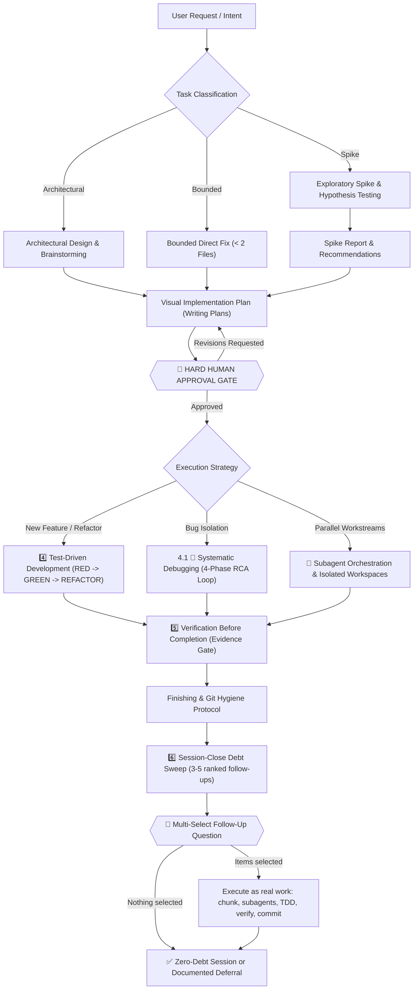

# AI Skills: Ultimate All-in-One AI Coding Agent Pipeline

Comprehensive, production-grade, all-in-one skill pipeline for AI coding agents. Designed to guide agents through the entire software engineering lifecycle: **Idea -> Design -> Plan -> Human Approval Gate -> TDD -> Systematic Debugging -> Subagent Orchestration -> Verification -> Finishing -> Session-Close Debt Sweep**.

Verification is the last gate, not the last step. Once the plan is `Done 100%` and the evidence is green, the agent harvests every noticed-but-unclosed item from the session, ranks 3-5 follow-ups that can be finished right now, and asks them as a single multi-select question through the harness's own prompt widget. The user taps checkboxes instead of retyping, selected items run as real work, and the session ends with zero unexamined coding debt.

Maintains a **Single Source of Truth** (`Super Ultra Code Plan Implementation.md`) so the agent never loses contextual invariants, safety constraints, or human-approval gates during execution.

The skill is four components in sequence — **Brainstorming → Writing Plans → TDD → Verification** — with a human approval gate between each one, plus a **Deep Research** path that runs only when a decision depends on information the codebase does not contain. The sub-agent pipeline that carries out the work is mandatory, not a recommendation.

---

## Execution Lifecycle

<picture>
  <source media="(prefers-color-scheme: dark)" srcset="diagrams/lifecycle-dark.svg">
  
</picture>

<sub>Rendered from the Mermaid source below. Light and dark variants are generated by `scripts/render-diagrams.sh`; the committed files are kept in sync by a CI drift gate.</sub>

<details>
<summary>View raw Mermaid source</summary>



</details>

---

## Execution Model: Subagent-First, High Fan-Out

Execution runs through subagents by default. The parent agent is the orchestrator: it chunks the work, dispatches a batch, then gathers and synthesizes the reports.

- **Task chunking before dispatch:** the work is split into the smallest independently verifiable units (one behavior, one file, one command chain, one hypothesis), and each unit gets its own subagent.
- **High fan-out floor:** aim for 10 or more narrow subagents when the task supports it. Ten small chunks finish faster and isolate failure better than five oversized ones. Dropping below the floor requires a written reason (atomic task, no subagent tool available, or inseparable shared state).
- **Gather and synthesize:** subagent reports are inputs, not conclusions. The parent dedupes, resolves conflicts from the evidence, re-verifies each claim via diff/log/exit status, and merges one result before continuing.
- **Audit gate:** every integrated chunk passes the parent diff audit before it counts as done. A red chunk is re-chunked and re-dispatched alone.

Inline execution exists only as a documented exception, not a default.

---

## Repository Structure

```
ai-skills/
├── README.md                                    # Documentation & architecture flow
├── LICENSE                                      # MIT License
├── package.json                                 # devDependencies: @mermaid-js/mermaid-cli
├── Super Ultra Code Plan Implementation.md      # SINGLE SOURCE OF TRUTH (Master Skill)
├── install.sh                                   # 1-command installer for all harnesses
├── mermaid.config.json                          # Light theme: palette + embedded-font stack
├── mermaid.dark.config.json                     # Dark variant, same layout and font
├── puppeteer-config.json                        # Headless flags for mermaid-cli rendering
├── .github/
│   └── workflows/
│       └── ci.yml                               # CI: bun install, render, drift gate, validate, test
├── diagrams/                                    # Generated SVGs (only the hero pair is committed)
│   ├── lifecycle.svg                            # README hero, light
│   └── lifecycle-dark.svg                       # README hero, dark
├── docs/
│   └── code-plan/
│       ├── <date>-<slug>.manifest.md            # Batch manifest written before the first dispatch
│       └── plans/
│           └── <date>-<slug>.md                 # ultra-plan/v1 plans this repo executed
├── examples/
│   ├── worked-example.md                        # Full pipeline walkthrough (filled-in reference)
│   └── deep-research-worked-example.md          # Citation-grounded report at target density
├── scripts/
│   ├── sync.sh                                  # Bidirectional sync (~/.config/ai <-> repo)
│   ├── render-diagrams.sh                       # Render all mermaid blocks to SVG
│   ├── validate-skill.mjs                       # Frontmatter, link, token, mermaid & a11y lint
│   ├── ultra-plan-runner.mjs                    # ultra-plan/v1 DAG runner + visual map contract
│   ├── ultra-plan-runner.test.mjs               # Contract tests for the runner
│   ├── sync-snippets.mjs                        # Drift guard: snippets/ <-> Snipset database
│   ├── sync-snippets.test.mjs                   # Normalization + drift-detection tests
│   ├── plan-publish.mjs                         # Publish plans into the Obsidian vault (one-way mirror)
│   ├── plan-publish.test.mjs                    # Publish, idempotency, drift, and refusal tests
│   ├── plan-publish-registry.mjs                # Vault + project registry and destination paths
│   ├── plan-publish-registry.test.mjs           # Config, project resolution, enumeration tests
│   ├── plan-publish-frontmatter.mjs             # Pure ultra-plan/v1 -> PARA frontmatter transform
│   ├── plan-publish-frontmatter.test.mjs        # Merge rules, related-link, title fallback tests
│   ├── pr-registry.mjs                          # PR session slots: derived branch/worktree, state machine, merge order
│   ├── pr-registry.test.mjs                     # Collision, terminal-state, and merge-order guards
│   ├── plan-issue-sync.mjs                      # Plan -> GitHub issue mirror (one-way, hash-keyed)
│   ├── plan-issue-sync.test.mjs                 # Action-matrix and real-argv/stdin guards
│   └── plan-mirror-check.sh                     # Local drift watchdog (systemd --user timer, check only)
├── snippets.manifest.json                      # Maps trigger prompts to Snipset database slots
├── plans.publish.json                          # Vault path, destination template, and project roots for the plan mirror
├── plan.issues.json                            # Project -> owner/repo for the plan-issue mirror (committed config)
├── pr.registry.json                            # Live PR session slots (gitignored; per-machine coordination state)
├── snippets/                                    # Copy-paste trigger prompts
│   ├── orkestrasi-ngoding-plan.md               # Plan + TDD + mandatory subagent fan-out
│   ├── orkestrasi-debugging.md                  # RCA + mandatory hypothesis-parallel subagent fan-out
│   └── orkestrasi-pr.md                         # PR delivery, review, and topological batch merge
├── templates/                                   # Companion templates (blank scaffolds)
│   ├── implementation-plan-template.md          # Visual work breakdown & task mapping
│   ├── spike-report-template.md                 # Timeboxed exploratory spike & hypotheses
│   ├── systematic-debugging-log-template.md     # 4-phase RCA & bug reproduction log
│   ├── verification-checklist-template.md       # Multi-layer proof & sign-off checklist
│   ├── handoff-template.md                      # Session handoff - resume from exact state
│   ├── progress-log-template.md                 # Persistent task state across sessions
│   ├── adr-template.md                          # Architecture Decision Record with decision tree
│   ├── subagent-contract-template.md            # Subagent task contract & parent audit gate
│   ├── code-review-template.md                  # Reviewer output contract & verdict
│   ├── deep-research-report-template.md         # Citation-grounded long-form research report
│   ├── follow-up-injection-template.md          # Session-close debt sweep & follow-up question
│   ├── pull-request-template.md                 # PR body, local evidence table, delivery metadata
│   └── pr-review-template.md                    # Remote PR review, coverage table, binary verdict
└── skills/
    └── super-ultra-code-plan/                   # Full skill package with bundled templates & examples
        ├── SKILL.md -> ../../Super Ultra Code Plan Implementation.md
        ├── templates -> ../../templates
        ├── examples -> ../../examples
        ├── mermaid.config.json -> ../../mermaid.config.json
        └── mermaid.dark.config.json -> ../../mermaid.dark.config.json
```

TinyFish is documented inside the master skill itself, in the
`🌐 Web Evidence & Retrieval — TinyFish` section: the four-rung escalation ladder
(`search` → `fetch_content` → `run_web_automation` → `create_browser_session`),
the parameter sets that matter, the run-management and cost rules, and the
gotchas. It used to ship as a separate vendored skill (`skills/use-tinyfish/`,
deployed by a now-removed `install.sh` §6b); that split is retired because two
sources of truth had drifted, and the CLI-only copy never described the MCP
tools an agent actually calls. One master skill, one set of rules.

The skill installs through `skills/super-ultra-code-plan/`, which is a set of symlinks into
the repo root rather than a copy. The master file stays single-sourced, and
`render-diagrams.sh` skips symlinked files so the same diagram is never rendered twice.

---

## Quick Start & Installation

Install and configure symlinks across all installed agent harnesses with one command:

```bash
git clone https://github.com/belajarcarabelajar/ai-skills.git
cd ai-skills
./install.sh
```

### Prerequisites

- **Bun >= 1.1.0** ([bun.sh](https://bun.sh)): **mandatory runtime.** All dependency installation uses `bun install` / `bun add`, and all JS/TS execution uses `bun test` / `bun run`. `npm install`, `npm test`, `yarn`, and `pnpm` are strictly prohibited. `curl -fsSL https://bun.sh/install | bash`
- **Node.js is not required.** Every script in this repository runs under Bun, and the only lockfile is `bun.lock`.
- **`ripgrep` (`rg`) & `tgrep`**: Primary code search uses `rg` (v15.2+ direct binary with smart-case). `tgrep` ([microsoft/tgrep](https://github.com/microsoft/tgrep)) is used for trigram-indexed search in indexed repositories and shell pipe filtering. Raw GNU `grep` is strictly prohibited.

### Supported Harnesses & Target Paths

| Harness / Ecosystem | Config / Skill Location | Auto-Discovery Support |
|---|---|---|
| **OpenCode** | `~/.config/opencode/skills/super-ultra-code-plan/` | Supported |
| **Google Antigravity CLI** (`agy`) | `~/.gemini/config/skills/super-ultra-code-plan/` | Supported |
| **Universal Agents** | `~/.agents/skills/super-ultra-code-plan/` | Supported |
| **Claude Code** | `~/.claude/skills/super-ultra-code-plan/` | Conditional |
| **Personal Config Mirror** | `~/.config/ai/Super Ultra Code Plan Implementation.md` | Supported |

**Conditional** means the target is linked only when that harness is already installed. The
installer checks for the parent directory first (`~/.claude`, `~/.gemini/antigravity-cli/builtin/skills`)
and skips the target rather than fabricating an empty config tree. So a target that is absent after a
successful `./install.sh` means the harness is not installed — it is not a failed install. Run
`./install.sh --dry-run` to see exactly which targets your machine qualifies for.

---

## Mermaid Rendering

Diagrams are rendered to SVG with the pinned [mermaid-cli](https://github.com/mermaid-js/mermaid-cli) v12 (which bundles mermaid 12, Node >= 22.13).

| Concern | How it is handled |
|---|---|
| Theming | `mermaid.config.json` (light) and `mermaid.dark.config.json` (dark) are the single source of truth. The render script never passes `-t`. |
| Font | `Recursive Variable` is pinned so mermaid embeds it in every SVG. Label geometry is then identical on GitHub, docs sites, and PDF export, instead of depending on whichever of Verdana/Arial/Trebuchet the viewer happens to have. |
| Accessibility | Every diagram carries `accTitle` and `accDescr`, which mermaid emits as `<title>`/`<desc>` wired to `aria-labelledby`. The validator fails the build if one is missing. |
| Duplicates | Symlinked files (`skills/*/SKILL.md`) are skipped, so the master file's diagrams are not rendered twice. |
| Orphans | SVGs from deleted diagrams are pruned on every run. A stale artifact is worse than none. |
| Empty runs | Finding zero mermaid blocks is a hard failure, not a silent success. |
| Missing toolchain | A missing `mmdc` fails validation instead of skipping the gate. A skipped gate that reports success is worse than no gate. |
| Dark mode | The README hero ships light and dark, served through `<picture>` and `prefers-color-scheme`. |
| Drift | CI re-renders and fails if the committed hero no longer matches its Mermaid source. |
| Version | Pinned in `bun.lock`, upgraded deliberately. mermaid-cli 12 bundles mermaid 12 and requires Node >= 22.13. |

```bash
bun install                              # pinned toolchain
bun run render-diagrams                  # all blocks -> diagrams/
bun run validate                         # syntax + a11y + config + hero presence
bun test scripts/                        # plan-runner contract tests
bun run ci                               # everything above, in order
```

These run **locally, by you, before the commit** — not on a hosted runner. Two reasons,
and the second is the one that matters:

1. GitHub Actions minutes on the free tier are the scarce resource here, so the workflow
   at `.github/workflows/ci.yml` is `workflow_dispatch`-only by explicit user policy. It
   has no `push` or `pull_request` trigger, and it should not grow one. The file's header
   carries the reasoning and the exact revert.
2. A hosted runner cannot see your vault, your Snipset database, or your working tree. It
   can only check the portable subset, so a green remote result is weaker evidence than
   the same command run locally, not stronger.

> Only `diagrams/lifecycle.svg` and `diagrams/lifecycle-dark.svg` are committed. Every
> other SVG under `diagrams/` is a build artifact that the render step regenerates and the
> gate prunes: GitHub renders Mermaid code blocks natively, so committing them would add
> megabytes of duplicated output for no reader. The exact count moves as templates are
> added, which is why it is not written down here.

### Why the font is embedded

mermaid-cli 12 inlines the diagram font as base64 `@font-face` blocks, which is why each
rendered SVG is roughly 200 KB rather than 12 KB. That is the deliberate trade. Without
embedding, mermaid measures label widths against whatever font the renderer happens to
have, and a viewer with wider metrics than the build machine silently re-flows or clips
labels. Embedding makes the geometry identical on GitHub, in a docs site, and in PDF
export.

`Recursive Variable` is preferred over `Open Sans` for the same reason mermaid itself
recommends it: it is a variable font, so 4 faces cover every weight, where Open Sans
embeds 20 and doubles the file size. Pass `--no-font-embed` only if you accept per-viewer
label drift.

---

## Companion Templates

Agents can instantly scaffold structured artifacts using the ready-to-use templates in `templates/`. Every planning artifact mandatorily includes at least one embedded Mermaid diagram (a plan without Mermaid is incomplete and blocks the approval gate):

- **[`implementation-plan-template.md`](templates/implementation-plan-template.md)**: MANDATORY Mermaid visual map (tasks, dependencies, gates, verification), task breakdown, failing tests (RED), implementation (GREEN), and verification matrix.
- **[`spike-report-template.md`](templates/spike-report-template.md)**: Hypothesis testing flow, epistemic unknowns exploration, and architectural trade-off evaluations.
- **[`systematic-debugging-log-template.md`](templates/systematic-debugging-log-template.md)**: 4-phase RCA state machine (REPRODUCE -> DIAGNOSE -> FIX -> VERIFY) and bug reproduction log.
- **[`verification-checklist-template.md`](templates/verification-checklist-template.md)**: Evidence gate flowchart, pre-completion checks (test logs, zero warnings, build pass, git hygiene).
- **[`pull-request-template.md`](templates/pull-request-template.md)**: delivery metadata, acceptance-criteria-to-evidence table, local verification evidence, independent review, risk and rollback, deferred debt.
- **[`pr-review-template.md`](templates/pr-review-template.md)**: remote PR target, fetched-state record, coverage table, findings anchored to changed lines, merge readiness, binary verdict, and what gets posted.
- **[`handoff-template.md`](templates/handoff-template.md)**: Session handoff document - fill at the end of every session so the next session can resume exactly where you left off (last verified state, next action, open decisions, blockers).
- **[`progress-log-template.md`](templates/progress-log-template.md)**: Persistent task state log - the single source of truth for a task across multiple sessions (checklist, decisions, evidence trail, session log).
- **[`adr-template.md`](templates/adr-template.md)**: Architecture Decision Record (ADR) - structured decision tree, alternative trade-off comparison, and consequences.
- **[`subagent-contract-template.md`](templates/subagent-contract-template.md)**: Subagent task contract - task chunking and fan-out plan, strict scope isolation, permitted target files, gather & synthesize checkpoint, and parent diff audit gate sequence.
- **[`code-review-template.md`](templates/code-review-template.md)**: Reviewer output contract - rule attribution precedence, 8-point bug qualification filter, P0–P3 priority with confidence, exhaustiveness and dedupe rules, suggestion block format, and the binary `correct` / `not correct` verdict.
- **[`deep-research-report-template.md`](templates/deep-research-report-template.md)**: Citation-grounded long-form research report - executive summary, `##` themes with `###` subsections, inline `[n]` citations, LaTeX notation, and a closing synthesis.
- **[`follow-up-injection-template.md`](templates/follow-up-injection-template.md)**: Session-close debt sweep - harvested debt candidates, `NOW`/`LATER` classification, the ranked 3-5 follow-up set, the batched multi-select question, the execution record, and the deferred backlog.

---

## Examples

See the [`examples/`](examples/) folder for a complete filled-in walkthrough:

- **[`worked-example.md`](examples/worked-example.md)**: Full pipeline from Classify through the session-close debt sweep on a real-sized task (adding zod input validation to a REST endpoint). Use this as a reference for what correct output looks like at each phase.
- **[`deep-research-worked-example.md`](examples/deep-research-worked-example.md)**: Citation-grounded research report at target length and density.

---

## Deep Research Workflow

Some implementation choices cannot be settled from the codebase: the decision depends on a
library surface the agent has not observed, on comparing more than two alternatives along
several axes, or on being defensible to a reviewer who never saw the reasoning. The
`🔬 Deep Research Workflow` in the master skill exists for exactly that case, and it runs
between the spike and the implementation plan rather than replacing either.

| Concern | Rule |
|---|---|
| Invocation | Only when the decision depends on information absent from the codebase, the project overlay, and the agent's verified configuration. A question that fits in a spike report or an ADR does not need it. |
| Output | A long-form, citation-grounded report built from [`templates/deep-research-report-template.md`](templates/deep-research-report-template.md). Length follows the scope of the question, never a padded minimum. |
| Shape | Executive summary, 3-7 `##` themes with `###` subsections, closing synthesis. Inline `[n]` citations, LaTeX delimiters for notation, prose over lists, tables for multi-axis comparisons. |
| Provenance | The report lands as a dated artifact under `research/` in the active project. The plan cites its section anchors instead of restating findings; an ADR references the report rather than duplicating its citations. |
| Anti-patterns | Citing unconsulted sources, claiming authorship by a specific external system, padding to an artificial length, or hiding directives in markup are all failures. These are skill rules the agent is held to at review time, not a machine gate: `validate-skill.mjs` currently only asserts that the template and the worked example exist. |

[`examples/deep-research-worked-example.md`](examples/deep-research-worked-example.md) is
the calibration reference: read it before writing the first report to match its length,
citation density, and prose rhythm.

---

## Executing an `ultra-plan/v1` Plan

`scripts/ultra-plan-runner.mjs` is the machine half of the plan contract. It parses the
`ultra-plan/v1` frontmatter, validates the task DAG, enforces idempotent skips, executes
each task's `run[]` steps, and aggregates failures into an error ledger. Zero dependencies,
Bun only.

```bash
bun run plan:check docs/code-plan/plans/<plan>.md   # validate the DAG and the visual map
bun run plan:run  docs/code-plan/plans/<plan>.md   # same, then execute the tasks
```

The visual map check is the part that catches a lying plan. Every task heading must have a
matching node in the Mermaid block, and every `depends_on` edge must match a Mermaid edge
**in both directions** — a task in the diagram with no `depends_on`, or a `depends_on` with
no arrow, is a contradiction between the two representations of the same plan, and the
runner fails rather than guessing which one is right.

### `run[]` is what makes a plan executable

A plan is only machine-runnable to the degree its steps live in `tasks[].run[]`. Each entry
is one command with `cmd`, `expect_exit`, and `retry`; the runner runs them in order,
compares the exit code, retries a transient mismatch, and reports `PASSED`,
`FAILED-BLOCKING`, `FAILED-ISOLATED`, `HALTED-UPSTREAM`, or `SKIPPED-IDEMPOTENT`. A RED
step is expected to fail, so it passes with `expect_exit: 1`.

| Task declares | Runner does |
|---|---|
| `run[]` | Executes the steps. `PASSED` or a classified failure. |
| `skip_if` only | `NEEDS-AGENT` plus a warning. Correct for prose, layouts, design calls. |
| Neither | **Validation error.** Invisible to the runner and exempt from every gate. |

A `skip_if` that only proves a string is present (`grep -q 'Marker' src/x.md`) is a
false-pass channel: it survives the behaviour being reverted, and `plan-mark-done.mjs`
ticks the task on that claim alone. The runner **rejects it as a validation error**. Use
a command that fails on behaviour — a test invocation, a build, a `git diff` query, a
state check. A `grep` filtering a tool's output (`bun test x 2>&1 | grep -q '...'`) is
fine, because the tool has to succeed first.

The classifier behind that check returns one of five classes: `empty` (nothing claimed),
`sentinel` (the literal `skip_if: "false"`, the documented "this task has no command"),
`behavioural` (runs a tool that has to succeed first), `loose` (reads a file and asserts
a string is in it — rejected), and `unknown` (matches neither rule). `unknown` **warns**
rather than errors, naming the task and the command, because 14 such tasks live in plans
belonging to repositories this one does not own and an error here would be one commit
changing someone else's repository. Run `bun scripts/skipif-registry-audit.mjs` for the
current per-plan tally, or `--compare-to-frozen` to see what the live rule changed since
the 2026-09-30 freeze.

`validate-skill.mjs` asserts that the plan template and the master skill's plan header both
declare every key the runner reads, comparing the **parsed frontmatter structure** rather
than searching the text. The key list is imported from the runner, so adding an input
without documenting it fails CI. This check exists because the two halves did drift once
with CI green: `files`, `idempotency_key`, `verify_exit`, and `on_precondition_fail` were
all documented and none were read, while `run[]` was read by nothing and documented
nowhere.

This repository's own plans live in [`docs/code-plan/plans/`](docs/code-plan/plans/), with
the pre-dispatch batch manifest beside them in [`docs/code-plan/`](docs/code-plan/). The
manifests are kept because they record the deviations that were approved during execution,
which is the part a finished plan can no longer explain.

---

## Plan Mirroring: Obsidian and GitHub Issues

A plan gets two derived copies, and both are one-way. The project repository is
the source of truth; every other copy is derived state that is regenerated, never
edited.

| Copy | What it buys | Idempotency key |
|---|---|---|
| Obsidian note | Searchable, readable, rendered Mermaid, graph-linked | `source_hash` recorded in the note's own frontmatter |
| GitHub issue | **History**: who opened it, when it was approved, what closed and when, every comment in one timeline GitHub already indexes and links from the commit | Issue number recorded in `plan.issues.json` |

The issue body **is** the plan text, byte for byte, plus a machine-readable
trailer carrying the plan id, key, source path, status, and hash. A summary body
is banned: a summary is a second source of truth that goes quietly stale the
moment the plan changes, and then the issue is wrong in a way nothing reports.
The trailer is what makes "is this issue current?" answerable from the issue alone.

### Three things that will bite you, and why they are built this way

**The issue number is never written into the plan's frontmatter.** The vault mirror
hashes the entire plan text, so injecting a number would change `source_hash` and
instantly make every vault mirror stale, which blocks `--execute` with exit 3. The
number lives in a sidecar, `plan.issues.json`, which is why the plan file stays
byte-stable.

**The body goes on stdin, never on argv.** A 10 KB plan body on the command line
hits `ARG_MAX` and goes through the shell's quoting rules, so the bytes stop being
identical to the plan, which is the entire premise of the mirror. Every write uses
`--body-file -`.

**The issue state is derived from the plan's `status`, never chosen.**

| Plan `status` | Issue state | Why |
|---|---|---|
| `Draft`, `Approved`, `InProgress`, `Verification` | open | |
| `Blocked` | open | Blocked work is not done. Closing it would report finished work. |
| `Complete` | closed | |

A hand-closed issue does not win, because the issue is derived state. An
in-progress plan whose issue somebody closed by hand reopens it on the next sync,
so tidying a board never permanently detaches a plan from its mirror.

### The decision is pure, which is why it is tested without a network

`syncOne` resolves to exactly one of five actions, from `(recorded entry, plan
text, plan status)`:

| Action | Trigger | Effect |
|---|---|---|
| `create` | nothing recorded | one `gh issue create`, body on stdin |
| `update-body` | hash differs | one `gh issue edit` with title and body |
| `update-state` | open/closed differs | one `gh issue edit --state` |
| `update-and-state` | both differ | **one** edit call, not three |
| `current` | nothing differs | **zero** `gh` calls |

`current` is the real no-op and is reported as its own kind, so `--check` and
`--status` can tell "already current" from "dry run wrote nothing". Running the
sync twice performs no second write, which is what stops a duplicate issue from
appearing in a real repository.

```bash
bun run issue:sync <plan.md>...     # create or sync
bun run issue:check <plan.md>...     # drift report, never writes, exit 1 on drift
bun run issue:status                 # table of every recorded link, always exit 0
```

A project with no entry in `plan.issues.json` is **refused, not guessed**: a plan
filed under the wrong repository is worse than one that is not filed. A plan with
no `status:` in its frontmatter is refused too, because there is no state to
derive. A sync failure does not invalidate the plan; report the exit code, and do
not hand-create the issue as a workaround, because a hand-made issue carries no
trailer and so reads as permanent drift.

> `plan.issues.json` holds the `project -> owner/repo` mapping and **is** committed,
> because it is configuration. The recorded issue links it accumulates are live
> coordination state; point `PLAN_ISSUES_CONFIG` at a gitignored copy
> (`plan.issues.local.json`) on a machine that syncs plans, so twenty sessions
> writing one file cannot collide in version control.

---

## Harness Todo List

The skill mandates an itemized checklist. That alone is not enough, and the gap is
specific: an agent reads "output a checklist", writes `[ ]` lines into a plan file,
and **never calls the harness's own todo tool**. Someone watching the pane sees no
progress at all, and nothing in the repository notices, because a checklist in prose
looks exactly like a fulfilled contract from the outside.

So both artifacts are required, deliberately:

| Artifact | Lifetime | Purpose |
|---|---|---|
| Harness todo list | The session; lost on compaction or harness switch | Live progress the user watches |
| Plan file checklist | Permanent, in version control | The durable record a resumed session reads |

| Harness | Todo tool |
|---|---|
| OpenCode | `todowrite` (permission key `"todowrite": "allow"`) |
| Claude Code | `TodoWrite` |
| Gemini / Antigravity | `update_plan` |
| Anything else | enumerate the tool catalog, then apply the degradation rule |

Verified against `opencode.ai/docs` on 2026-10-01 rather than recalled. Discover
the tool name in the connected catalog first: a tool that exists in another
harness's catalog does not exist in this one, and a wrong name is a
tool-not-found error mid-task rather than a clean fallback.

**The list is required in every mode**, including a planning session that will not
touch code. `todowrite` is not on OpenCode's Plan-agent restricted list (which
covers `file edits` and `bash`), and the planning phase is exactly where the phases
get enumerated.

### The measured constraint that decides ownership

OpenCode's `general` subagent has **full tool access except todo**. So:

- **The parent owns the todo list, always.** A subagent gets a chunk and returns a
  report. Asking it to maintain a list produces a fabricated one in its report.
- **The list is per session, not per subagent.** Ten subagents updating ten lists is
  ten lists nobody reconciles. This mirrors the one-PR-per-session rule.
- **Not seeing a dispatched subagent's progress is by design.** It arrives as the
  report at the gather checkpoint.

### Rules that keep the list honest

- One item per independently verifiable unit, at chunking granularity. An item that
  cannot fail on its own cannot be checked on its own.
- Every item names a **finish line**, not a topic. "Add `session.test.ts` covering
  token refresh and make it pass" is an item. "Fix the auth module" is not.
- **Exactly one item `in_progress` at a time.** Two in progress is two threads, and
  neither gets the parent's attention.
- Completion is recorded **with its evidence in the same update**: command, exit
  code, result. Marking complete and citing later is the same false pass the
  runner's `skip_if` rules exist to prevent.
- A newly discovered item is **added**, never substituted for the current one.
  Silent substitution is how a session ends with a green list that does not match
  the work done.
- When the list and the plan file disagree, **the plan file wins** and the tool list
  is corrected. The file is the source of truth; the tool is a view of it.

**Degradation:** if the runtime has no todo tool, or it is denied, render the list
as an explicit `[ ]` / `[x]` block in the reply, update it at every checkpoint, and
say in one line that the runtime has no todo tool. Never skip the list because the
widget is missing. The list is the contract; the tool is only how it is displayed.

---

## Pull Request Delivery & Batch Merge

A session ends in a pull request on its own branch, never in a commit on the working
branch. That is what makes running twenty or more sessions at once survivable, and the
reason is mechanical: when more than one session touches one repository, three failures
appear, and **none of them raises an error at the git level**, because each individual
command is valid on its own.

| Failure | What actually happens | Prevented by |
|---|---|---|
| Two sessions on one branch | The second push fast-forwards or is rejected, the agent reaches for `--force`, and the first session's PR now carries the second session's commits | Branch names **derived** by `pr-registry claim`, duplicate refused at claim, load, and save time |
| Two sessions in one worktree | `git worktree add` fails, or the second session works inside the first session's checkout and both diffs become garbage | Worktree paths derived the same way, and the worktree sits *beside* the repository, never inside it |
| Merging in finish order | A session that depends on another lands first, then conflicts with the rest of the batch | Topological order computed from a recorded `depends_on` graph, ties broken on name so the order is reproducible |

### Two ownership rules that make concurrency safe

**Git writes are parent-only.** A subagent edits files and runs tests. It never runs
`git commit`, `git add`, `git checkout`, `git switch`, `git merge`, `git rebase`,
`git stash`, `git reset`, `git push`, or `gh`. The git index is shared mutable state
with no per-writer lock, so two subagents staging at once produce a commit containing a
half-applied change from the other, and that commit was never tested in that shape. The
parent integrates per chunk by reading `git diff -- <permitted paths>` and staging by
explicit path, never `git add .`.

**One session, one PR.** Twenty subagents inside one session are one PR. Twenty sessions
are twenty PRs. One PR per subagent turns a twenty-session run into a two-hundred-PR
merge queue.

### The session state machine

`pr-registry.mjs` holds the state, and the states exist to make two specific mistakes
impossible:

```
isolated → active → verified → open → merged
```

| Constraint | Why it is a hard error |
|---|---|
| A PR number cannot be recorded before `verified` | Recording one implies the work is finished and checked, so `isolated → open` would skip the gate that makes a merge safe |
| Only an `open` session with a PR can merge | A green local run alone is not a mergeable session |
| `merged` is terminal | Reverting or redoing a session is a new session with a new branch. A file that can "un-merge" hides the revert from the merge order |
| A duplicate branch or worktree is refused | A registry that reports success for a layout that will lose work is worse than no registry |

```bash
bun scripts/pr-registry.mjs claim --plan <plan-id> --session <slug> [--depends-on <slug>,<slug>]
bun scripts/pr-registry.mjs state <session> <isolated|active|verified|open|merged>
bun scripts/pr-registry.mjs pr <session> --number 42
bun scripts/pr-registry.mjs order       # topological merge order
bun scripts/pr-registry.mjs surface w3  # what must rebase first, what blocks it
bun scripts/pr-registry.mjs status
```

`claim` prints the exact `git worktree add` command to run, and is idempotent: a retried
claim after a crashed session returns the same slot rather than allocating a second one.
`pr.registry.json` is **gitignored** on purpose. It is per-machine live state recording
which branch each running session holds right now; committing it would merge twenty
machines' in-flight sessions into one file and guarantee a conflict on the next claim.

### Merging twenty PRs

One at a time, in the order `order` prints, and each merge carries its own evidence:

1. Rebase that session's branch onto `origin/main` **immediately before its own merge**.
   The base moves with every merge, so a branch rebased at position 3 is already behind
   by position 7. `surface <s>` reports which sessions landed since the branch was cut.
2. Resolve any conflict **in the session's branch**, never on the base branch, then
   re-run that session's verification. Editing the base to "fix" a conflict produces a
   change no session can attribute or review.
3. Merge this one PR.
4. Re-run the local check on the new base. That run is the evidence for *that* merge.

Batching twenty merges and testing at the end leaves nineteen of them unverified. A
session that cannot be made mergeable is reported and skipped while the batch proceeds;
it is a status, not a reason to freeze nineteen others. Already-merged sessions drop out
of the order and stop blocking their dependents, and a dependency cycle is refused with
the cycle named, because no valid order exists for one.

### Two boundaries this stage does not cross

**Remote CI is reported, never adopted.** This repository's checks run locally by policy,
so a green GitHub Actions run is the author's evidence about a commit, not this session's
evidence about the working tree. Reading it as verification is the same error as pushing
to trigger someone else's runner.

**Generating a review and posting it are two acts.** The posted comment is a shorter
artifact than the internal report: verdict, blocking findings, nothing else. A human
reads the exact text first. See [`templates/pr-review-template.md`](templates/pr-review-template.md)
for the coverage table, the line-anchoring rule, and the binary verdict.

---

## Trigger Snippets

Copy-paste prompts for the three entry points. They live in
[`snippets/`](snippets/) and are the fastest way to activate the skill correctly.

- **[`orkestrasi-ngoding-plan.md`](snippets/orkestrasi-ngoding-plan.md)**: plan generation, TDD execution, and the mandatory subagent pipeline.
- **[`orkestrasi-debugging.md`](snippets/orkestrasi-debugging.md)**: root cause analysis with hypothesis-parallel investigation, and the mandatory subagent pipeline.
- **[`orkestrasi-pr.md`](snippets/orkestrasi-pr.md)**: PR delivery from a finished session, PR review, and the ordered batch merge.

All three carry the same subagent rules, because the most common failure is an agent
that reads a trigger prompt, never sees a subagent requirement in it, and quietly
implements everything inline. Each one states the eight-step pipeline explicitly:
task-chunking, batch manifest, high fan-out floor, non-overlapping scopes, nested
fan-out, gather and synthesize, parent diff audit, and batched dispatch. Inline work is
allowed only as a written exception.

The debugging variant chunks by **hypothesis** rather than by file, so competing
explanations are tested in parallel and a disproven cause is discarded without
contaminating the others. The PR variant adds the terms specific to its own phase:
derived isolation, parent-only git ownership, the PR body contract, `--body-file`, the
topological merge order, and the separate review contract.

### Keeping the database in sync

The markdown files are the source of truth. The Snipset database holds a copy, because
that copy is what an agent actually receives when the snippet is triggered.
[`snippets.manifest.json`](snippets.manifest.json) maps each file to its database slot
(uuid, keyword, name, description).

```bash
bun run snippets:status   # table of local vs database hashes
bun run snippets:check    # exit 1 on drift (also runs in CI)
bun run snippets:push     # write local content to the database
```

### Adding a new snippet is a create, not an update

`sync-snippets.mjs` only ever calls `snippet update`, which requires a uuid that
**already exists**. So a new trigger prompt needs its database slot provisioned once,
by hand, before `snippets:push` can do anything with it:

```bash
# 1. the CLI must agree with the database schema, or every write is refused
snipset doctor            # schema_match must be true

# 2. create the slot, taking the body from the file (never retyping it)
snipset snippet add \
  --name "<name>" --keyword "<keyword>" --group "Agentic Coding AI" \
  --description "<description>" \
  --content "$(bun -e "import {readFileSync} from 'fs'; import {extractPromptBody} from './scripts/sync-snippets.mjs'; process.stdout.write(extractPromptBody(readFileSync('snippets/<file>.md','utf8')))")"

# 3. paste the uuid the database returns into snippets.manifest.json, then
bun run snippets:push
```

The uuid is **chosen by the database**, so it cannot be pre-generated and written into
the manifest ahead of time. A manifest entry whose uuid does not exist yet reports
`snippet not found` from `snippets:check`, which is the correct verdict: the database
genuinely has no copy, and the agent would receive nothing when the snippet is triggered.

Both sides are normalized before comparison (em dash, curly quotes, rightwards arrow,
CRLF, trailing whitespace), so a typographic character in the Markdown source is not
reported as drift. A missing Snipset install is reported as a skipped comparison rather
than a failure, because a CI runner has no local database and that is an environment
boundary, not evidence of a problem. Real drift still fails.

`validate-skill.mjs` enforces the invariants that hold everywhere, including CI: the
manifest is valid JSON, every entry has all required fields, no duplicate uuid or
keyword, every referenced file exists, every tracked file carries the subagent contract,
and every required trigger snippet is tracked so it can never be silently left out of the
database.

### Mirroring plans into the Obsidian vault

A plan under `docs/code-plan/plans/` is a markdown file in a project repository, so the
vault cannot search it, render its Mermaid, or show it in the graph. `scripts/plan-publish.mjs`
copies each plan into `01 - Projects/<Project>/plans/` with the vault's PARA frontmatter
merged in. The copy is a **one-way, read-only mirror**: the project repository is the source
of truth, the vault copy is derived state, and the vault copy is never hand-edited. The
publisher never reads a mirror back as an input, so a stale mirror can rot visibly
(`--check` exists to catch that) but can never corrupt a plan.

```bash
bun run mirror:publish <plan.md>...   # mirror the named plans (or pass the flags below directly)
bun run mirror:check                  # exit 1 on drift or a missing mirror
bun run mirror:status                 # table of every plan and its mirror state, always exit 0
bun run issue:sync <plan.md>...       # the same plan, mirrored to a GitHub issue
bun run issue:check <plan.md>...      # issue drift report, never writes
bun run issue:status                  # table of recorded plan-issue links, always exit 0
```

A plan has **two** derived copies, both one-way: this Obsidian note, and a GitHub
issue carrying the same text. Run the issue sync immediately after each
`mirror:publish` for the same trigger, so the two never drift apart. See
[Plan Mirroring](#plan-mirroring-obsidian-and-github-issues) for the state mapping
and the three traps that shape the implementation.

- **`mirror:publish`** writes one file per plan and stages it in the vault with `git add` when
  `stageInVault` is on, so obsidian-git (configured with `autoCommitOnlyStaged: true`) commits
  it. It stages the single file and never commits or pushes. A re-publish of an unchanged plan
  prints `SKIPPED-IDEMPOTENT`, exits 0, and writes nothing.
- **`mirror:check`** is the CI-style gate: it never writes, and it exits 1 when a mirror's
  recorded `source_hash` no longer matches its source plan or the mirror is missing. Exit 0
  means every enumerated plan is mirrored and current.
- **`mirror:status`** is a report, not a verdict. It always exits 0, including when a mirror is
  missing, so it is safe inside a `&&` chain and in a shell pipeline.

Flags the CLI itself understands, for when you call `bun scripts/plan-publish.mjs` directly:

| Flag | Why it exists |
|---|---|
| `--check [--all]` | Verify only. `--all` enumerates every plan under every `mirror: true` project instead of requiring explicit paths. |
| `--status` | Report mirror state for every plan; never fails. |
| `--dry-run` | Print the destination and whether it would write, then write and stage nothing. |
| `--today YYYY-MM-DD` | Overrides the `updated` frontmatter value. It exists to make that property deterministic in tests; without it the value is today's local date. |
| `PLAN_PUBLISH_CONFIG` | Environment variable holding the path to `plans.publish.json`. It is the only way to point the tool at a different vault or a different set of project roots. |

Two more environment variables are host seams, so scripts that need a
machine-specific path can run on a machine that is not this one:

| Variable | Read by | Default |
|---|---|---|
| `OBSIDIAN_VAULT` | `spike-skipif-corpus.mjs` | `$HOME/Dokumen/Obsidian Vault` |
| `GRAPHIFY_SITE_PACKAGES` | `vault-index.mjs` | this machine's uv tool layout |
| `GRAPHIFY_PYTHON` | `vault-index.mjs` | `python3` |

`bun test scripts/` **skips, rather than fails,** the tests whose premise the
current host cannot satisfy: a checkout elsewhere, a machine without the
graphify detector installed, or a machine without the vault. The skip carries
its reason, so an absent prerequisite is never reported as a defect — and,
equally, never counted as a pass. Set the relevant variable to run those tests
here.

Exit codes: `0` success or idempotent skip, `1` drift / missing mirror / refused destination /
transform failure, `2` usage error.

### A worktree is not a project

`projects` is a routing table keyed on **path prefix**, and a plan file carries no
project name, so a plan is routed purely by where it sits on disk. That makes a git
worktree of an already-registered project unpublishable: its path is owned by nobody,
and `mirror:publish` refuses rather than guessing.

The tempting fix, registering the worktree as a project in its own right, is wrong,
and the damage is proportional to the repository's history. `mirror: true` does two
things: it permits explicit publishing *and* it enrolls the root in `--check --all`
enumeration, which walks **every** `.md` under `<root>/docs/code-plan/plans/`. A
worktree checkout contains the entire tracked history, so enumerating one republishes
every plan the repository has ever had. Registering the Snipset SEO worktree as a
project mirrored all 274 existing Snipset plans a second time, under a second project
folder, 286 files in one commit.

So a project may declare **`worktrees`**: extra directories that hold the same
project's plans on another branch.

```json
{ "name": "Snipset", "root": "/home/.../Proyek/Snipset", "mirror": true,
  "worktrees": ["/home/.../Proyek/Snipset-seo"] }
```

| Concern | How it is handled |
| --- | --- |
| Routing | `resolveProject()` treats a worktree as a candidate location for its project, so a plan written in a worktree mirrors into `01 - Projects/<Project>/plans/` beside its siblings. It creates no second project and no second index. |
| Enumeration | `enumeratePlans()` reads the **root only**, never the worktrees. This asymmetry is the whole point of the field: routing must accept a worktree, enumeration must not, because the worktree's plans are the root's plans. `enumeratePlans` is asserted against it directly. |
| Precedence | Roots and worktrees compete on the same longest-prefix scale, so a real project nested inside a worktree still wins over the worktree that contains it. |
| Refusal | A `worktrees` value that is not an array, an entry that is empty or not a string, an entry that is already a registered root, and an entry two projects both claim are all load errors. One directory is never routable as two projects. |
| Detection | There is no git-identity check, so nothing infers that two roots are one repository. A worktree has to be declared. `loadRegistry` rejects the collision instead of letting the longer-prefix rule pick a winner by accident. |

A worktree that has been removed from disk should be dropped from `worktrees`. The
field costs nothing while stale, since enumeration never reads it, but a stale entry
silently keeps routing paths that no longer exist to a project that will never mirror
them.

`mirror:check` is deliberately **not** part of `bun run ci`. It reads `plans.publish.json`, which
names one vault by absolute path on one machine, and the plan set it enumerates currently has
mirrors for none of it, so the check is a local gate to run on the machine that owns the vault
rather than something a portable CI runner can ever pass.

### The drift watchdog

`scripts/plan-mirror-check.sh` wraps `mirror:check` for unattended daily runs. It only ever
passes `--check`, so there is deliberately no publish path in that file.

| Concern | How it is handled |
|---|---|
| Scheduling | A `systemd --user` timer, not a GitHub Actions workflow. A workflow on a runner can see neither the vault nor the sibling repositories, so it would either fail forever on a missing path or pass vacuously by enumerating zero plans. |
| Vacuous pass | Reported as a distinct verdict rather than hidden. A gate that passes because it found nothing is worse than no gate, because it manufactures confidence. |
| Exit status | Propagated on purpose, so a failed run shows up in `systemctl --user --failed`. Swallowing it would make the script a log-dumper instead of a watchdog. |
| Missing runtime | `exit 127` when `bun` is absent from both `PATH` and `$HOME/.bun/bin/bun`, because systemd starts services with a minimal environment. |
| Log | `~/.local/state/plan-mirror/mirror-check.log`, append-only, capped at 500 records and 20 detail lines per run. The trim goes through a temp file, so an interrupted run cannot leave a truncated log. |

Disable it with:

```bash
systemctl --user disable --now plan-mirror-check.timer
systemctl --user reset-failed plan-mirror-check.service
```

---

## Mathematical Utilities

Three pure-function modules provide mathematical foundations for workflow decisions. They are deterministic, dependency-free, and fully tested with hand-computed fixtures.

### Bayesian Confidence Aggregation (`scripts/bayesian-confidence.mjs`)

Combines independent findings from multiple subagents into a single posterior probability using the odds form of Bayes' theorem:

```
posterior_odds = prior_odds × ∏(p_i / (1 - p_i))
```

| Export | Purpose |
|---|---|
| `combineConfidence(findings, prior)` | Combine independent findings into a posterior |
| `classifyVerdict(posterior)` | Map posterior to `auto-merge`, `human-review`, or `reject` |
| `weightOfEvidence(confidence)` | Log-likelihood ratio (nats) for a single finding |
| `aggregateFindings(findings, prior)` | Full verdict object with counts |

**Thresholds:** `>= 0.95` auto-merge, `>= 0.70` human review, `< 0.70` reject.

```bash
bun run math:bayes
```

### Formal Logic Invariants (`scripts/formal-invariants.mjs`)

Structural predicates that must hold for a plan to be well-formed. Each returns `true` or a violation string.

| Export | Invariant |
|---|---|
| `isAcyclic(graph)` | Dependency graph is a DAG (no cycles) |
| `hasReferentialIntegrity(graph, taskIds)` | All dependencies reference existing tasks |
| `hasMutuallyExclusiveScopes(scopes)` | No two tasks claim the same file |
| `hasValidGateOrdering(tasks)` | Verification comes after implementation |
| `hasUniqueIdempotencyKeys(tasks)` | No duplicate idempotency keys |
| `validateInvariants(plan)` | Run all checks, return violation list |

```bash
bun run math:invariants
```

### Queueing Theory Batch Sizing (`scripts/queueing-batch.mjs`)

M/M/c queue model for optimal subagent dispatch. Computes wait probabilities, queue lengths, and cost-minimizing batch sizes.

| Export | Formula |
|---|---|
| `erlangC(λ, μ, c)` | Probability an arriving task must wait |
| `averageQueueLength(λ, μ, c)` | Mean queue length `L_q` |
| `averageWaitTime(λ, μ, c)` | Mean wait time `W_q = L_q / λ` |
| `optimalBatchSize(λ, μ, costs)` | Cost-minimizing batch size |
| `completionProbability(λ, μ, c, t)` | `P(T <= t)` |

```bash
bun run math:batch
```

---

## Validation & Quality Checks

Run the automated validation suite locally:

```bash
# Install the pinned toolchain (once)
bun install

# Render all diagrams to diagrams/
bun run render-diagrams

# Validate frontmatter, symlinks, templates, scripts, mermaid syntax & a11y
bun run validate

# Contract tests for the plan runner and the snippet sync guard
bun test scripts/

# Trigger prompts vs the Snipset database (skips cleanly where no database exists)
bun run snippets:check
```

Or run the whole gate in order with `bun run ci`.

Verifies:
- YAML frontmatter syntax (`name`, `description`, `triggers`).
- Master file integrity, the debt-sweep contract, and the estimated token budget (~34k tokens, measured at ~4 chars/token).
- Symlink validity in `skills/super-ultra-code-plan/SKILL.md`.
- Presence of all required templates and executable scripts.
- Mermaid syntax validity for every ` ```mermaid` block in the repo (exits 1 on any error).
- `accTitle` and `accDescr` present on every diagram.
- Both mermaid config files parse and pin `theme` + `fontFamily`.
- The committed README hero exists in light and dark.
- `ultra-plan-runner` enforces the visual map: task headings, task nodes, and `depends_on` matching the Mermaid edges in both directions.
- Trigger snippets carry the mandatory subagent contract and use Bun rather than the prohibited runtimes.
- `snippets.manifest.json` is consistent: valid, complete, no duplicate uuid or keyword, and every trigger snippet is tracked.
- The plan-publishing contract is documented: publisher CLI reference, idempotency marker, and a valid `plans.publish.json`.

Not covered by `bun run ci`, on purpose: `mirror:check`, which needs a vault this runner
cannot see. Run it locally when you own the vault.

---

## License

[MIT License](LICENSE) — Copyright (c) 2026 belajarcarabelajar
