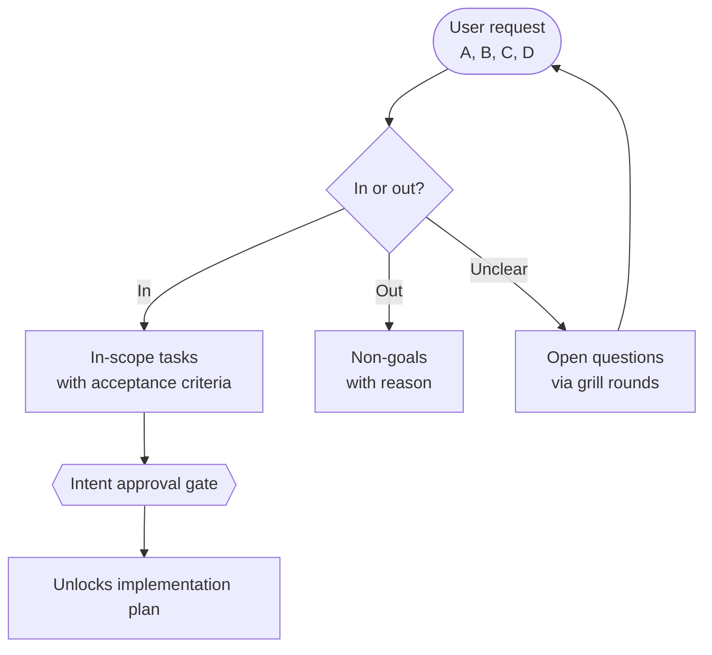
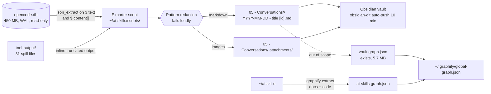

# Intent Lock Report: OpenCode Conversation History → Obsidian (symlink) + ai-skills + graphify

> Brainstorm-phase deliverable. No code, no plan file, no worktree, no branch until Section 8 is approved.
>
> - **Skill path used:** `~/ai-skills/Super Ultra Code Plan Implementation.md` (first hit in the requested fallback chain; 193.7 KB; also symlinked as `~/.config/ai/Super Ultra Code Plan Implementation.md`).
> - **Date:** 2026-10-02
> - **Phase:** 🧠 Brainstorming only. Grounding complete, 5 grill rounds complete.
> - **Active project overlay:** `~/ai-skills` @ `17ba130`, branch `main`, Bun 1.4.2, `bun test scripts/` = 434 pass / 0 fail / 18 files.

## 1. Goal & Context

- **Problem:** All 1009 OpenCode conversations (54,501 messages, 2026-09-23 → 2026-10-02) live only inside a 450 MB SQLite database at `~/.local/share/opencode/opencode.db`. They are not reachable as notes, are not searchable in Obsidian, and are not part of any knowledge graph. The literal request — "access it via symlink in Obsidian" — cannot be satisfied as stated, because no per-session files exist to symlink.
- **Desired outcome:** A repeatable, read-only exporter that turns the conversation database into Obsidian-native markdown under `05 - Conversations/`, plus a graphify knowledge graph for `~/ai-skills` joined with the existing vault graph in the global cross-repo graph.
- **Requester intent (verbatim):** "Saya mau agar semua history percakapan opencode kita itu bisa didapatkan atau diakses secara symlink di obsidian juga, connect ai-skills + grapify."

### Grounding that constrains the design

| Finding | Evidence | Consequence |
|---|---|---|
| No per-session file store exists | `session_v2.path` is `''` for 1009/1009 rows; `~/.local/share/opencode/storage` does not exist | A symlink can never point at the history itself |
| All prose is JSON inside SQLite | 54,501 rows in `session_message`, `json_valid(data)` → 0 invalid; user text at `$.text`, assistant at `$.content[?(@.type=='text')].text`, ordering key `seq` (max 12,992) | An export step is **mandatory** before Obsidian can see anything |
| DB is live and in WAL mode | message count moved 54,317 → 54,401 mid-audit; ~2,444 frames (~10 MB) uncheckpointed | Must open by path with `-wal` present; copying `opencode.db` alone silently loses recent chats |
| Full-fidelity corpus is 369.0 MiB | `tool` 57,116 parts / 224.8 MiB · `reasoning` 32,429 / 73.7 MiB · `text` 14,179 / 9.9 MiB | Accepted knowingly; see D1 |
| Vault already has a content mirror precedent | `scripts/plan-publish.mjs:6`, `plans.publish.json:1-2`, `docs/code-plan/plans/2026-09-26-plan-publish-to-obsidian.md` | New work follows an established pattern instead of inventing one |
| Vault auto-commits and auto-pushes every 10 min | `.obsidian/plugins/obsidian-git` | Exported notes become remote content on their own |
| Vault remote is PRIVATE | `gh repo view` → `"isPrivate":true`, `"visibility":"PRIVATE"` | Limits but does not undo existing exposure |

## 2. Task List (A, B, C, D...)

| ID | Task (user wording) | Interpreted scope | In / Out | Notes |
|---|---|---|---|---|
| A | "semua history percakapan opencode kita itu bisa didapatkan" | Read-only export of **all** 1009 sessions across 16 project directories from `opencode.db` into per-session markdown, full fidelity (user text + assistant text + reasoning + tool calls) | **In-scope** | Owner: Human. `opencode.db` opened `mode=ro`; the `credential` table (2 rows) must never be selected |
| B | "diakses secara symlink di obsidian juga" | Make the exported history reachable from Obsidian under `05 - Conversations/`. **Reinterpreted:** the symlink points at *converter output*, not at the history store, because no such store exists to link to | **In-scope (reframed)** | Owner: Human for the reframing. Literal symlink-to-store is impossible — see Non-Goals N1 |
| C | "connect ai-skills" | Add the exporter to `~/ai-skills` as a standalone script + tests + `package.json` entry, independent of the plan-publish mirror and its exit-3 `MIRROR GATE` | **In-scope** | Owner: Human. Overlay verified: Bun 1.4.2, `bun test scripts/`, 434 passing |
| D | "connect ai-skills + grapify" | Build a knowledge graph for `~/ai-skills` including its markdown docs, then register **both** that graph and the existing vault graph in `~/.graphify/global-graph.json` | **In-scope** | Owner: Human. graphify v0.9.73 already installed in both repos; vault graph already exists (5.7 MB) |
| — | (implied) credential cleanup in the vault | Removing the 29 credential-bearing notes already present in `origin/main` | **Non-goal** | Owner: Human, deferred. Verified live: `backup-codes-kwt-group-11.md` is `PRESENT IN origin/main`; 48 tracked files match credential-ish names; commit `71ce45f` restored 748 files / 50,601 insertions |
| — | (implied) `graphify export obsidian` | Emitting the vault graph as Obsidian notes + canvas | **Non-goal** | Owner: Agent-default. Not selected in grill round 4; available later at zero cost |

- Every row keeps the user's original phrasing next to the agent's interpretation. Row B is a reinterpretation and is flagged as such rather than silently accepted.

## 3. Scope Map

## 4. Non-Goals

- **N1 — Symlinking the OpenCode history store itself.** Impossible: `session_v2.path` is empty for all 1009 rows and no `storage/` directory exists. A symlink can only ever expose the exporter's output.
- **N2 — Cleaning the credentials already pushed to the vault remote.** Verified present in `origin/main`. Explicitly deferred by the requester. The only mitigation in scope is that this design must not make the exposure worse (see D2).
- **N3 — Continuous or scheduled refresh.** Manual re-run only. No daemon, no watcher, no systemd timer.
- **N4 — Any mutation of `opencode.db`.** No schema change, no migration, no `VACUUM`, no writes of any kind. Read-only URI `mode=ro` with `-wal` present.
- **N5 — Reading the `credential` table.** 2 rows; `value` is a secret by construction and must never be selected.
- **N6 — Low-fidelity or markdown-only export modes.** Full fidelity was chosen knowingly at 369.0 MiB.
- **N7 — Coupling the export to `plan-publish.mjs` or the exit-3 `MIRROR GATE`.** A 300 MiB export must not block plan execution.
- **N8 — `graphify export obsidian` emitting the vault graph as notes + canvas.** Available but not selected.
- **N9 — Snipset snippet-registry integration.** No new snippet; the existing `snippets.manifest.json` UUID flow is untouched.

## 5. Decisions & Trade-offs

| # | Decision | Options considered (2-4) | Chosen + why | Who decided |
|---|---|---|---|---|
| D1 | Export fidelity | Full fidelity (~300 MiB) / full + truncated tool output / text+reasoning (~84 MiB) / text only (~10 MiB) | **Full fidelity, accepting ~300 MiB.** Only 9.9 MiB is actual prose; the requester chose completeness knowingly after being shown the split | **Human-locked** (grill R3) |
| D2 | Secret handling | Pattern redaction failing loudly / + session denylist / none | **Pattern-based redaction that reports counts per run.** This is the *only* remaining lever for "don't make it worse", because the requester chose git-tracked output in R1 — so git-ignoring was unavailable | **Human-locked** (grill R3) |
| D3 | Export read path | Direct read-only SQLite / `opencode session export --sanitize` per session / hybrid | **Direct read-only SQLite.** 1009 CLI invocations each boot a server connection and emit JSON that still needs converting; one pass gives direct control over markdown and ordering | **Human-locked** (grill R2) |
| D4 | Destination in vault | New top-level `05 - Conversations/` / `01 - Projects/opencode-history/` / `90 - System/Conversations/` | **New top-level `05 - Conversations/`**, keeping a large generated corpus out of curated PARA folders | **Human-locked** (grill R3) |
| D5 | Git treatment | Inside vault but git-ignored / inside vault tracked like normal notes / symlink to data outside git | **Inside the vault, tracked like normal notes.** Consequence accepted: obsidian-git will commit and push the export within 10 minutes | **Human-locked** (grill R1) |
| D6 | Code location | `~/ai-skills/scripts/` / standalone outside any repo / new project repo | **`~/ai-skills/scripts/`**, following the `plan-publish.mjs` precedent and inheriting the 434-test suite | **Human-locked** (grill R2) |
| D7 | Repo integration shape | Standalone command + tests, no gate coupling / extend `plan-publish.mjs` + `MIRROR GATE` / script + tests + systemd timer | **Standalone command + tests, no gate coupling.** Coupling would make a 300 MiB export block `bun run plan:run` | **Human-locked** (grill R4) |
| D8 | graphify build mode for `~/ai-skills` | `--code-only` AST (free, 38 files) / full extract incl. docs via host-agent tokens / cloud `gpt-oss:120b-cloud` (costs money) / code-only now + defer docs | **Full extract including docs, using the host agent's own tokens.** No provider billing, since no Gemini key is set; the requester accepted the token cost | **Human-locked** (grill R4) |
| D9 | Global graph contents | Both graphs / only ai-skills / defer entirely | **Both** — the existing vault graph and the new ai-skills graph, so cross-repo questions spanning notes and code become possible | **Human-locked** (grill R4) |
| D10 | Note filenames | `YYYY-MM-DD - slug [id].md` / date+time+slug / session id only | **`YYYY-MM-DD - <slugified title> [<session id>].md`**, with first-user-prompt then session-id fallback for the 36 untitled sessions. The id suffix guarantees uniqueness; date-only would interleave badly (188 sessions on 2026-09-26 alone) | **Human-locked** (grill R4) |
| D11 | Image attachments (74 msgs, 13.2 MiB base64) | Extract to attachments folder / strip with placeholder / inline base64 | **Extract to a sibling attachments folder** and reference with Obsidian embeds, so screenshots actually render | **Human-locked** (grill R5) |
| D12 | Truncated tool-output spills (81 files, 50-175 KB) | Inline spill contents / keep pointer / inline with size cap | **Inline the spill file contents**, making each note self-contained rather than pointing outside the vault | **Human-locked** (grill R5) |
| D13 | Re-run behaviour | Full re-export, write only changed / export only new sessions / full re-export, overwrite all | **Full re-export, write only changed files.** Self-correcting after a redaction-rule fix, while git sees no diff for untouched sessions | **Human-locked** (grill R5) |
| D14 | Credential cleanup | Out of scope but don't worsen / blocking prerequisite / fully ignore | **Out of scope, but the design must not make it worse.** Drives D2 and N2 | **Human-locked** (grill R1) |
| D15 | Folder naming for attachments | — | **`05 - Conversations/.attachments/`**, dot-prefixed so Obsidian's file explorer de-emphasises it | **Agent-default** (needs confirmation) — implied by D4 + D11, never put to the requester |
| D16 | Handling of `idle`, `compaction`, `model-switched` message types | — | **Emit as labelled system/session-event sections**, not dropped, since D1 chose full fidelity. 2,775 `idle` + 24 `compaction` rows exist | **Agent-default** (needs confirmation) — implied by D1, never put to the requester |

- Assistant-proposed options are NOT decisions until a Human turn adopts them. D15 and D16 are recorded as agent defaults and are flagged for confirmation at the gate.

## 6. Assumptions

- **A1 — The `-wal` sidecar is always present when the exporter runs.** *Falsified by:* running the exporter against a copied `opencode.db` without `-wal`. *Impact if wrong:* silent loss of the most recent conversations. Mitigation is structural: open by path with `mode=ro`, never copy the file.
- **A2 — `session_message.data` remains valid JSON for every row.** *Currently* 0 of 54,501 rows fail `json_valid`. *Falsified by:* a future opencode migration changing the shape. *Impact if wrong:* the exporter must fail loudly per D2 rather than emit partial notes.
- **A3 — `seq` is a stable, gap-tolerant ordering key.** Unique per session via `session_message_session_seq_idx`; max observed 12,992. *Falsified by:* a re-sequencing migration. *Impact if wrong:* notes would interleave incorrectly, which is subtle and hard to spot.
- **A4 — Reading the 369 MiB corpus will not degrade the live OpenCode session.** *Falsified by:* noticeable input latency during the run. *Impact if wrong:* the run should be interruptible and resumable. The DB is written continuously while the requester works, so contention is plausible.
- **A5 — The vault can absorb ~300 MiB of new notes.** *Currently* 197 MB total with 41 GB free. *Falsified by:* Obsidian search/index slowdown. *Impact if wrong:* revisit D1.
- **A6 — With no `GEMINI_API_KEY` set, graphify falls back to the host agent as the LLM for D8.** Per graphify's own SKILL.md: "graphify needs no API key. Never ask the user for one." *Falsified by:* graphify requiring a key at runtime. *Impact if wrong:* D8 would need a backend choice.
- **A7 — A markdown extraction run over 49 `.md` files plus 38 code files completes in a tolerable number of turns.** *Falsified by:* the run exhausting the session budget. *Impact if wrong:* fall back to `--code-only` (D8's rejected option), which is free and fast. Note C3's runbook measured local models failing on markdown and cloud serialising at ~6 chunks/min.
- **A8 — `05 - Conversations/` does not collide with the PARA sequence.** Vault currently has `00 - Inbox`, `01 - Projects`, `02 - Areas`, `03 - Resources`, `04 - Archives`, `0. Common`, `90 - System`. *Falsified by:* the requester preferring a different slot. *Impact if wrong:* cosmetic only.
- **A9 — Redaction patterns cannot be exhaustive.** D2 is a best-effort net over patterns such as AWS keys, `ghp_`/`gho_` tokens, `-----BEGIN … PRIVATE KEY-----`, JWTs, bearer tokens, and 2FA-style codes. *Falsified by:* a known secret surviving a scan. *Impact if wrong:* **this is the residual risk of D1 + D5 combined** and cannot be engineered away — only narrowed.

## 7. Acceptance Criteria (observable, testable)

- [ ] **AC-1:** Running the exporter produces exactly 1009 session notes under `05 - Conversations/`, matching `SELECT count(*) FROM session_v2`, with filenames of the form `YYYY-MM-DD - <slug> [<session-id>].md`.
- [ ] **AC-2:** The 36 sessions with `title IS NULL` receive a fallback filename derived from the first user prompt, and no two filenames collide.
- [ ] **AC-3:** The exporter opens the database read-only and creates no `-journal`, `-wal`, or `-shm` change; no file under `~/.local/share/opencode/` is modified (verified by mtime/size comparison before and after).
- [ ] **AC-4:** `SELECT value FROM credential` appears nowhere in the source, and no exported note contains a value from the `credential` table.
- [ ] **AC-5:** A redaction self-test fails the build when a known-secret fixture is planted in a fake message payload; the run reports per-pattern redaction counts and exits non-zero if any pattern is untested.
- [ ] **AC-6:** A note rendered from a session containing a `shell` tool call includes the tool name, its input, and its output, and any output that opencode spilled to `tool-output/` is inlined rather than referenced by path.
- [ ] **AC-7:** The 74 base64 image attachments are written as real image files under `05 - Conversations/.attachments/` and embedded in the notes; no note contains a base64 data blob.
- [ ] **AC-8:** Re-running the exporter with an unchanged database writes zero files and produces an empty `git status` in the vault.
- [ ] **AC-9:** Re-running after a redaction-rule change rewrites exactly the affected notes and leaves the rest untouched.
- [ ] **AC-10:** `bun test scripts/` passes with the new test file added (baseline: 434 pass, 0 fail, 18 files), and `bun run validate` still passes.
- [ ] **AC-11:** `graphify-out/graph.json` exists in `~/ai-skills` and `graphify query "<question>"` returns results scoped to that repo.
- [ ] **AC-12:** `graphify global list` lists both the vault and the `ai-skills` graph, and a cross-repo `graphify query` returns nodes from both.
- [ ] **AC-13:** The exporter is reachable as a documented `package.json` script and is NOT invoked by `bun run plan:run` (the exit-3 `MIRROR GATE` path is untouched).

## 8. Approval Gate

- [ ] Human approves this intent lock before any plan is written.
- [ ] Approved scope (tasks A/B/C/D as locked): **A** In-scope — read-only full-fidelity export of all 1009 sessions. **B** In-scope, reframed — Obsidian access via `05 - Conversations/`, where the symlink points at converter output, not at the history store. **C** In-scope — standalone script + tests in `~/ai-skills/scripts/`, decoupled from the plan mirror gate. **D** In-scope — build the `~/ai-skills` graph including docs, then register both graphs in the global cross-repo graph.
- [ ] Agent-defaults to confirm or override: **D15** (`.attachments/` folder name) and **D16** (emit `idle`/`compaction`/`model-switched` as labelled sections rather than dropping them).
- [ ] Known risk accepted on the record: **D1 + D5 + A9** together mean ~300 MiB of tool output, including 29,447 `shell` calls whose output may contain tokens, is written into a git-tracked vault that obsidian-git pushes every 10 minutes. Redaction is a best-effort net, not a guarantee.
- [ ] Deferred follow-up recorded: the 29 credential-bearing notes verified present in `origin/main` (N2) are out of scope for this work and remain unfixed.
- [ ] Next step: invoke the plan snippet to generate the implementation plan from this lock.
