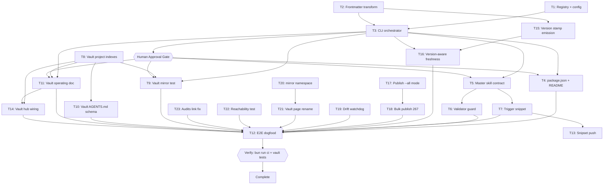
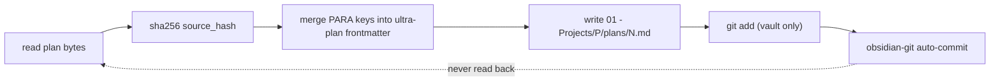

# Plan Publishing to Obsidian — Implementation Plan

> The YAML frontmatter above is the single source of truth for routing, dependency order, retry, and idempotency. Prose and checklists below only explain and must never contradict it. Every `Task N` heading, its `tasks[].id`, and its Mermaid node id are the same identifier. Commands are directly runnable with Bun (never `npm`/`npx`/bare `node`).

## 1. Intent & Scope

- **Goal:** every implementation plan produced by this skill gets a copy inside the local Obsidian vault, carrying the vault's PARA frontmatter, so plans are readable, searchable, and Mermaid-rendered inside Obsidian.
- **Non-Goals:**
  - No two-way sync. The project repo is the source of truth; the vault copy is a read-only mirror.
  - No watcher daemon, no opencode plugin, no systemd unit in this plan.
  - No changes to `Satset/` or `90 - System/Legacy/` (vault-denied paths).
  - No publishing of the vault's own plans (they already live in the vault).
- **Acceptance Criteria:**
  - [ ] AC-1: `bun scripts/plan-publish.mjs <plan.md>` writes exactly one file to `01 - Projects/<Project>/plans/<name>.md` and exits 0.
  - [ ] AC-2: The published file has `title`, `type`, `para`, `status`, `created`, `updated` in its YAML frontmatter, and still parses as the original `ultra-plan/v1` document.
  - [ ] AC-3: Re-running the publish on an unchanged plan writes nothing and exits 0 (`SKIPPED-IDEMPOTENT`).
  - [ ] AC-4: `--check` exits 1 when a published mirror no longer matches its source hash.
  - [ ] AC-5: A `[[wikilink]]` is emitted only when the target file exists on disk; otherwise the `related` property is omitted and a warning is printed.
  - [ ] AC-6: The master skill file states the publish step, and `bun scripts/validate-skill.mjs` fails if that contract is removed.
  - [ ] AC-7: `bun run ci` is green (0 errors) and the vault's own test suite is green.
  - [ ] AC-8: This very plan file is published to the vault as the end-to-end proof (dogfood).
  - [ ] AC-9: Every page this feature creates has an inbound link from a hub, so the vault's "reachable from an index or hub" rule holds for the new pages and not only for their outbound links.

## 2. Visual Implementation Map — MANDATORY



The publish data flow, one-way by construction:



## 3. Interfaces & Contracts

### 3.1 `plans.publish.json` (new, repo root)

Mirrors the existing `snippets.manifest.json` style. Absolute paths, because the publisher runs on exactly one machine.

```json
{
  "vault": "/home/belajarcarabelajar/Dokumen/Obsidian Vault",
  "destDirTemplate": "01 - Projects/{project}/plans",
  "indexTemplate": "01 - Projects/{project}/index.md",
  "stageInVault": true,
  "projects": [
    { "name": "Snipset", "root": "/home/belajarcarabelajar/Proyek/Snipset", "mirror": true },
    { "name": "ram-audit", "root": "/home/belajarcarabelajar/ram-audit", "mirror": true },
    { "name": "ai-skills", "root": "/home/belajarcarabelajar/ai-skills", "mirror": true },
    { "name": "vault", "root": "/home/belajarcarabelajar/Dokumen/Obsidian Vault", "mirror": false }
  ]
}
```

`mirror: false` is the vault's own entry: its plans already live in the vault, so publishing them would copy a file onto itself.

### 3.2 CLI contract

```
bun scripts/plan-publish.mjs <plan.md>... [--dry-run] [--today YYYY-MM-DD]
bun scripts/plan-publish.mjs --check [--all]     # exit 1 on drift or missing mirror
bun scripts/plan-publish.mjs --status            # table, always exit 0
```

- Exit 0 = success or idempotent skip. Exit 1 = drift / missing mirror / transform failure. Exit 2 = usage error.
- `--check` never writes. `--dry-run` prints the destination path and the byte delta, writes nothing, and does not stage.

### 3.3 Frontmatter merge rules

The published frontmatter is the original `ultra-plan/v1` block with these keys added or overwritten:

| Key | Value | Source |
|---|---|---|
| `title` | first `# ` heading of the body | body |
| `type` | `note` | constant |
| `para` | `project` | constant |
| `status` | **the plan's existing `status` value, verbatim** | frontmatter |
| `created` | `YYYY-MM-DD` parsed from the plan filename | filename |
| `updated` | `--today` value, default today | CLI |
| `related` | `["[[<Project> index]]"]` **only if that file exists** | filesystem |
| `source_path` | absolute path of the plan | input |
| `source_hash` | `sha256(plan bytes)`, first 12 hex | input |
| `project` | project name from the registry | config |

`status` is reused rather than remapped. The ultra-plan enum (`Draft|Approved|InProgress|Verification|Complete|Blocked`) is already a valid lifecycle status, and inventing a second enum under a different key would create two sources of truth for one field. The `tasks[]` array, `defaults`, `plan_id`, `schema`, and `runner_contract` are copied through untouched, so the published file is still parseable by `ultra-plan-runner.mjs`.

`type: note` and `para: project` are the values the vault actually uses, measured rather than assumed: `para` appears as `resource` (18), `system` (12), `common` (6), `project` (4) — never `projects`; `type` appears as `note` (717), `reference` (16), `source` (11), `audit` (8), `index` (7), `moc` (6), `system` (4), `log` (2) — never `project`. Introducing a new `type: plan` value would be a schema change, and the vault's own skill forbids that without explicit approval, so a mirror is a `note` that is identifiable by the contract-blessed `source_path`, `source_hash`, and `project` properties instead.

**Most plans have no frontmatter at all.** Measured across the three mirrored projects: of 267 plan files, 40 declare `schema: ultra-plan/v1` and 227 have no YAML frontmatter whatsoever. The transform therefore has to CREATE a frontmatter block when the source has none, not merge into an existing one. A plan is defined as any `*.md` under `docs/code-plan/plans/`; it is not defined by carrying the ultra-plan schema, so `enumeratePlans` globs on the extension and must not filter on `schema:`. An earlier count of 268 included this plan's own dispatch manifest, which was sitting in `plans/` and has been moved to `docs/code-plan/`; a working artifact in the plans directory would have been published to the vault and reported as permanent drift.

A `## Related` section is appended to the body containing the source path as **plain text**, never as a wikilink, because the source lives outside the vault and a link to it would be broken by the vault lint.

### 3.4 Idempotency and drift

- Publish: if the destination exists and its `source_hash` equals the new hash, print `SKIPPED-IDEMPOTENT` and do not write or stage.
- `--check`: for every plan found under each `mirror: true` project root, the destination must exist and its `source_hash` must match. Any mismatch or absence → exit 1.
- Vault staging: `stageInVault: true` runs `git -C <vault> add -- <dest>` after a successful write, because `.obsidian/plugins/obsidian-git/data.json` sets `autoCommitOnlyStaged: true`; without staging, obsidian-git never commits the mirror. It stages only the one file. It does not commit and does not push.

### 3.5 Safety boundaries inherited from the vault

- Never write under `Satset/` or `90 - System/Legacy/`. The publisher refuses any destination matching those prefixes.
- Never emit a `[[wikilink]]` to a path that does not exist.
- Revert: delete `01 - Projects/<Project>/plans/` and the three lines added to the vault `AGENTS.md`; the mirror is fully derived state, so nothing is lost. This instruction is also written into the `plan-publish.mjs` header.

## 4. Tasks

### Task T1: Registry and configuration

- [ ] Step 1: Write failing test `scripts/plan-publish-registry.test.mjs` covering: missing config → throw naming the path; project name resolution from an absolute plan path; `mirror: false` project excluded from `--all` enumeration; unknown root → throw.
- [ ] Step 2: Run — verify fail | cmd: `bun test scripts/plan-publish-registry.test.mjs` | expect: exit non-zero | retry: 0
- [ ] Step 3: Write `plans.publish.json` and `scripts/plan-publish-registry.mjs` exporting `loadRegistry(configPath?)`, `resolveProject(registry, planPath)`, `enumeratePlans(registry)`, `destPathFor(registry, project, planPath)`.
- [ ] Step 4: Run — verify pass | cmd: `bun test scripts/plan-publish-registry.test.mjs` | expect: exit 0, 0 failures
- [ ] Step 5: Commit

### Task T2: Frontmatter transform

- [ ] Step 1: Write failing test `scripts/plan-publish-frontmatter.test.mjs` covering: `related` omitted when the index file is absent; `related` present when it exists; `status` copied verbatim; `created` parsed from filename; `source_hash` is 12 hex chars; a plan with no `# ` heading falls back to the filename stem as `title`; original `tasks[]` array survives byte-identical.
- [ ] Step 2: Run — verify fail | cmd: `bun test scripts/plan-publish-frontmatter.test.mjs` | expect: exit non-zero | retry: 0
- [ ] Step 3: Write `scripts/plan-publish-frontmatter.mjs` exporting pure `mergeFrontmatter(planText, ctx)` and `splitFrontmatter(text)`. No filesystem writes; the existence check is injected via `ctx.exists`.
- [ ] Step 4: Run — verify pass | cmd: `bun test scripts/plan-publish-frontmatter.test.mjs` | expect: exit 0, 0 failures
- [ ] Step 5: Commit

### Task T3: CLI orchestrator

- [ ] Step 1: Write failing test `scripts/plan-publish.test.mjs` using a temp dir as a fake vault: publish writes the file; re-publish is `SKIPPED-IDEMPOTENT`; a changed source rewrites; `--check` exits 1 on drift; a destination under `Satset/` is refused; `--dry-run` writes nothing.
- [ ] Step 2: Run — verify fail | cmd: `bun test scripts/plan-publish.test.mjs` | expect: exit non-zero | retry: 0
- [ ] Step 3: Write `scripts/plan-publish.mjs` with the CLI contract in §3.2, the guard in §3.5, and the header comment carrying the revert instruction.
- [ ] Step 4: Run — verify pass | cmd: `bun test scripts/plan-publish.test.mjs` | expect: exit 0, 0 failures
- [ ] Step 5: Commit

### Task T4: package.json and README

- [ ] Step 1: Add `plans:publish`, `plans:check`, `plans:status` to `package.json` scripts, and add `plan-publish.mjs` to the `ci` chain before `bun test scripts/`.
- [ ] Step 2: Document the three commands in README next to the existing `snippets:*` block, and add the new script to the repository tree listing.
- [ ] Step 3: Run — verify pass | cmd: `bun -e "const p=JSON.parse(await Bun.file('package.json').text());process.exit(p.scripts?.['mirror:publish']&&p.scripts?.['mirror:check']?0:1)"` | expect: exit 0
- [ ] Step 4: Commit

### Task T5: Master skill contract

- [ ] Step 1: Add a `## 📤 Plan Publishing` subsection under Writing Plans stating that after a plan is approved and written to `docs/code-plan/plans/`, the agent MUST run `bun scripts/plan-publish.mjs <plan>` from the project that owns the plan, and that a `SKIPPED-IDEMPOTENT` result is a pass, not a failure.
- [ ] Step 2: State the one-way rule and the read-only-mirror rule in the same subsection.
- [ ] Step 3: Add one Mermaid `flowchart LR` of the publish data flow (same shape as §2) with `accTitle` and `accDescr`, because `validate-skill.mjs` renders every Mermaid block in the repository and fails on a syntax error or missing a11y metadata.
- [ ] Step 4: Run — verify pass | cmd: `bun -e "process.exit((await Bun.file('Super Ultra Code Plan Implementation.md').text()).includes('Plan Publishing')?0:1)"` | expect: exit 0
- [ ] Step 5: Commit

### Task T6: Validator guard

- [ ] Step 1: Add a `planPublishContract` check to `scripts/validate-skill.mjs` asserting the master file contains the `Plan Publishing` heading, the literal `plan-publish.mjs`, and `SKIPPED-IDEMPOTENT`; assert `scripts/plan-publish.mjs` and `plans.publish.json` exist.
- [ ] Step 2: Confirm the guard is a real gate, not a warning: temporarily rename `plans.publish.json`, run the validator, observe exit 1, restore the file.
- [ ] Step 3: Run — verify pass | cmd: `bun scripts/validate-skill.mjs` | expect: exit 0, 0 errors
- [ ] Step 4: Commit

### Task T7: Trigger snippet

- [ ] Step 1: Add one line to `snippets/orkestrasi-ngoding-plan.md` requiring `bun scripts/plan-publish.mjs <plan>` after approval, and a `bun -e` skip check mirroring §4's Step 4 form. Do not introduce `npm`, `npx`, or `node scripts/` — the validator rejects them in this file.
- [ ] Step 2: Confirm `snippets.manifest.json` already tracks this snippet and needs no new entry; the snippet body is what is pushed, so a body edit is enough.
- [ ] Step 3: Run — verify pass | cmd: `bun -e "process.exit((await Bun.file('snippets/orkestrasi-ngoding-plan.md').text()).includes('mirror:publish')?0:1)"` | expect: exit 0
- [ ] Step 4: Commit

### Task T8: Vault project indexes

- [ ] Step 1: Create `01 - Projects/Snipset/index.md`, `01 - Projects/ram-audit/index.md`, `01 - Projects/ai-skills/index.md`, each with `title`, `type: project`, `para: projects`, `status: active`, `created`, `updated`, and a `related` wikilink to an existing vault page.
- [ ] Step 2: Each index links down to its `plans/` subfolder so mirrored plans are reachable from a hub, satisfying the vault page contract.
- [ ] Step 3: Run — verify pass | cmd: `bun -e "const fs=require('node:fs');const v='/home/belajarcarabelajar/Dokumen/Obsidian Vault/01 - Projects/';process.exit(['Snipset','ram-audit','ai-skills'].every(n=>fs.existsSync(v+n+'/index.md'))?0:1)"` | expect: exit 0
- [ ] Step 4: Run vault lint for regressions | cmd: `cd '/home/belajarcarabelajar/Dokumen/Obsidian Vault' && python3 scripts/vault_lint.py '03 - Resources/LLM Wiki' --strict` | expect: exit 0 (unchanged from baseline)
- [ ] Step 5: Commit in the vault repo

### Task T9: Vault mirror contract test

- [ ] Step 1: Write failing `tests/test_plan_mirror.py`: for every `01 - Projects/*/plans/*.md`, assert the file has `title`, `type`, `para`, `status`, `created`, `updated`, `related`, `source_path`, `source_hash`, and that no `[[wikilink]]` target is missing on disk. Skip cleanly when no mirror files exist yet.
- [ ] Step 2: `related` is in the required set on purpose. The vault Page Contract states every active page must have at least one meaningful related page. The transform omits `related` only when the project index is missing, and T8 guarantees an index exists for all three mirrored projects, so requiring it here turns a silent contract violation into a test failure instead of leaving it to a documentation exemption.
- [ ] Step 3: Run — verify pass or clean skip | cmd: `cd '/home/belajarcarabelajar/Dokumen/Obsidian Vault' && python3 -m unittest discover -s tests -p 'test_plan_mirror.py'` | expect: exit 0
- [ ] Step 4: Run the whole vault suite for regressions | cmd: `cd '/home/belajarcarabelajar/Dokumen/Obsidian Vault' && python3 -m unittest discover -s tests -p 'test_*.py'` | expect: exit 0
- [ ] Step 5: Commit in the vault repo

### Task T10: Vault schema line

- [ ] Step 1: **Requires explicit user approval.** The vault's own skill states: "Do not make changes to `AGENTS.md` unless the user explicitly requests a schema change." Adding `01 - Projects/<Project>/plans/` to the Folder Contract is a schema change.
- [ ] Step 2: If approved, add one bullet to the Folder Contract declaring the folder a read-only mirror owned by `ai-skills`, with `source_path` as the provenance field. Change nothing else in the file.
- [ ] Step 3: Run — verify pass | cmd: `bun -e "process.exit((await Bun.file('/home/belajarcarabelajar/Dokumen/Obsidian Vault/AGENTS.md').text()).includes('plans/')?0:1)"` | expect: exit 0
- [ ] Step 4: Commit in the vault repo

### Task T11: Vault operating documentation

- [ ] Step 1: Create `90 - System/Plan-Publishing.md` with YAML properties and sections: what the mirror is, who owns it, how to re-publish, how to revert, and the rule that the mirror is never hand-edited.
- [ ] Step 2: Do NOT link this page from `90 - System/index.md`. T14 owns that file; two chunks writing one hub is an orchestration defect, not a shortcut.
- [ ] Step 3: Run — verify pass | cmd: `bun -e "process.exit((await Bun.file('/home/belajarcarabelajar/Dokumen/Obsidian Vault/90 - System/Plan-Publishing.md').text()).includes('mirror:publish')?0:1)"` | expect: exit 0
- [ ] Step 4: Commit in the vault repo

### Task T14: Vault hub wiring

- [ ] Step 1: Add inbound wikilinks to `90 - System/index.md` for `[[01 - Projects/Snipset/index]]`, `[[01 - Projects/ram-audit/index]]`, `[[01 - Projects/ai-skills/index]]`, and `[[90 - System/Plan-Publishing]]`. Verify every one of those four targets exists on disk before writing the link.
- [ ] Step 2: Reason: the vault page contract requires every active page to be reachable from an index or hub. T8 created the three project indexes with outbound links only, so without this task the linter stays green while the vault silently violates its own contract.
- [ ] Step 3: Preserve the existing structure and wording of `90 - System/index.md`. This is an addition, not a rewrite.
- [ ] Step 4: Run — verify pass | cmd: `bun -e "process.exit((await Bun.file('/home/belajarcarabelajar/Dokumen/Obsidian Vault/90 - System/index.md').text()).includes('01 - Projects/ai-skills/index')?0:1)"` | expect: exit 0
- [ ] Step 5: Re-run the vault linter and confirm `broken_links` is still 1987 | cmd: `cd '/home/belajarcarabelajar/Dokumen/Obsidian Vault' && python3 scripts/vault_lint.py . --json` | expect: exit 0
- [ ] Step 6: Commit in the vault repo

### Task T15: Version stamp emission

- [ ] Step 1: Add an exported `PUBLISHER_VERSION` constant to `scripts/plan-publish-frontmatter.mjs` and emit it as a `publisher_version` property in every published document. Add `publisher_version` to the module's `OWNED_KEYS` so a pre-existing value in a source document is overwritten rather than duplicated.
- [ ] Step 2: Set the constant to `1`. Its value is a stamp, not a package version; it increments only when a change alters published output.
- [ ] Step 3: Document the bump obligation in the module header, next to the existing contract paragraphs: a change that alters what the transform emits MUST increment this constant, because freshness detection compares it.
- [ ] Step 4: Run — verify pass | cmd: `bun test scripts/plan-publish-frontmatter.test.mjs 2>&1 | tail -n 8; echo "EXIT:${PIPESTATUS[0]}"` | expect: exit 0, 0 failures
- [ ] Step 5: Commit

### Task T16: Version-aware freshness

- [ ] Step 1: Make freshness depend on BOTH `source_hash` and `publisher_version`. A mirror is current only when the destination's `source_hash` matches the source plan's hash AND the destination's `publisher_version` equals `PUBLISHER_VERSION`. Anything else is stale and gets rewritten. Apply the same rule in `--check`, so a stale mirror is reported as stale rather than as `OK`.
- [ ] Step 2: Reason, and why this is not a byte-comparison: idempotency was originally keyed on `source_hash` alone, which is a hash of the plan text. Changing the transform therefore left every existing mirror permanently `OK` and never re-published, while `--check` reported success. Comparing computed output bytes instead would fix that, but `updated` is stamped with the current date, so the output legitimately differs every day and all 267 mirrors would be rewritten daily for no reason. A version constant is the cheapest signal that is correct in both directions.
- [ ] Step 3: Import `PUBLISHER_VERSION` from the frontmatter module. Do not duplicate the literal in the CLI; two copies of a version string is how they drift.
- [ ] Step 4: Extend the T6 validator guard in `scripts/validate-skill.mjs` to require that `scripts/plan-publish-frontmatter.mjs` both defines and exports `PUBLISHER_VERSION`. The guard is the mitigation for the discipline risk in T15 Step 3: the stamp must not be deletable silently.
- [ ] Step 5: Tests: a mirror written with a different `publisher_version` is treated as stale and rewritten; a mirror with matching version and hash is `SKIPPED-IDEMPOTENT`; `--check` exits 1 on a version mismatch alone with the source hash still matching; the emitted `publisher_version` equals the imported constant rather than a hardcoded literal.
- [ ] Step 6: Run — verify pass | cmd: `bun test scripts/ 2>&1 | tail -n 8; echo "EXIT:${PIPESTATUS[0]}"` | expect: exit 0, 0 failures
- [ ] Step 7: Re-publish the real mirror and confirm it is rewritten with the new property | cmd: `bun scripts/plan-publish.mjs docs/code-plan/plans/2026-09-26-plan-publish-to-obsidian.md` | expect: `✅ published`, not `SKIPPED-IDEMPOTENT`
- [ ] Step 8: Commit

## 5. Debt Sweep — Selected Follow-Ups (Step 6)

All five harvested items were selected by the user and are executed as real work, not narrated as done. Each is a task in the DAG above.

### Task T17: Bulk publish mode

- [ ] Step 1: Add a `--all` publish mode to `scripts/plan-publish.mjs`. Today `--all` exists only on `--check`; publishing 267 plans requires enumerating them by hand. Reuse `enumeratePlans` from the registry module so the source of truth stays single.
- [ ] Step 2: `--all` must honour `--dry-run`, report per-file outcomes, exit 1 if any file fails while still processing the rest, and print a final tally. A partial bulk failure must be visible, not swallowed by a single non-zero exit.
- [ ] Step 3: Mutually exclusive with explicit plan arguments. `--all` together with a plan path is a usage error, exit 2.
- [ ] Step 4: Run — verify pass | cmd: `bun test scripts/ 2>&1 | tail -n 8; echo "EXIT:${PIPESTATUS[0]}"` | expect: exit 0, 0 failures
- [ ] Step 5: Commit

### Task T18: Bulk publish the backlog

- [ ] Step 1: Measure first | cmd: `bun scripts/plan-publish.mjs --check --all 2>&1 | tail -n 3` | expect: exit 1, a large missing count. This is the pre-change baseline.
- [ ] Step 2: Run the bulk publish | cmd: `bun scripts/plan-publish.mjs --all` | expect: exit 0 with a tally covering every enumerated plan
- [ ] Step 3: Confirm convergence | cmd: `bun scripts/plan-publish.mjs --check --all` | expect: exit 0, every mirror matching its source
- [ ] Step 4: Re-run the vault linter and confirm no new broken links | cmd: `cd '/home/belajarcarabelajar/Dokumen/Obsidian Vault' && python3 scripts/vault_lint.py . --json` | expect: `broken_links` still 1987
- [ ] Step 5: Re-run the vault contract test, which must now execute against real mirrors instead of skipping | cmd: `cd '/home/belajarcarabelajar/Dokumen/Obsidian Vault' && python3 -m unittest discover -s tests -p 'test_plan_mirror.py' -v` | expect: exit 0, no skips
- [ ] Step 6: Commit in the vault repo

### Task T19: Drift watchdog

- [ ] Step 1: Create `scripts/plan-mirror-check.sh` plus an installed entry at `~/.local/bin/plan-mirror-check` that runs `bun scripts/plan-publish.mjs --check --all` and appends a timestamped result to a log under `~/.local/state/plan-mirror/`.
- [ ] Step 2: Wire a `systemd --user` timer to run it daily. Reason a local timer and not a GitHub Actions workflow: the check needs the vault at an absolute local path plus three local repositories, none of which a CI runner can see. A workflow in the vault repo would pass vacuously, which is worse than no gate.
- [ ] Step 3: The script must exit 0 when the check passes and 1 when it drifts, so `systemctl --user` surfaces the failure instead of hiding it.
- [ ] Step 4: Run — verify pass | cmd: `~/.local/bin/plan-mirror-check; echo "EXIT:$?"` | expect: exit 1 today, because T18 has not run yet at the time this is written. After T18 it must exit 0. Report both.
- [ ] Step 5: Commit

### Task T20: `mirror:*` namespace

- [ ] Step 1: Rename the three npm scripts `plans:publish`, `plans:check`, `plans:status` to `mirror:publish`, `mirror:check`, `mirror:status` in `package.json`. Reason: `plan:check` already exists and validates the ultra-plan DAG; the two differ by one character and a typo silently runs the wrong gate.
- [ ] Step 2: Update `README.md` and `snippets/orkestrasi-ngoding-plan.md` to the new names. The snippet is the user-facing trigger, so a stale name there means the mandate invokes a command that no longer exists.
- [ ] Step 3: Do NOT rename the CLI script file, the `plan-publish.mjs` path, or the `Plan-Publishing.md` page. The collision is only in the npm script namespace.
- [ ] Step 4: Run — verify pass | cmd: `bun scripts/validate-skill.mjs 2>&1 | tail -n 6; echo "EXIT:${PIPESTATUS[0]}"` | expect: exit 0
- [ ] Step 5: Commit

### Task T21: Vault page follows the rename

- [ ] Step 1: Update `90 - System/Plan-Publishing.md` to reference `mirror:publish`, `mirror:check`, and `mirror:status`. A vault page documenting commands that no longer exist is worse than no page.
- [ ] Step 2: Change nothing else in that file.
- [ ] Step 3: Run — verify pass | cmd: `bun -e "process.exit((await Bun.file('/home/belajarcarabelajar/Dokumen/Obsidian Vault/90 - System/Plan-Publishing.md').text()).includes('mirror:check')?0:1)"; echo "EXIT:$?"` | expect: 0
- [ ] Step 4: Commit in the vault repo

### Task T22: Reachability test for hub pages

- [ ] Step 1: Create `tests/test_vault_reachability.py` asserting that every hub page — `01 - Projects/*/index.md` and `90 - System/Plan-Publishing.md` — has at least one inbound wikilink from another file in the vault.
- [ ] Step 2: The test must NOT exempt `index.md`. `vault_lint.scan_vault` filters orphans with `path.name not in {"index.md", "overview.md"}`, so the existing linter structurally cannot catch an unreachable index page. That exemption is correct for a general orphan sweep and wrong for a hub-reachability contract, which is why this needs its own test.
- [ ] Step 3: Scope it to hub pages only. Do NOT require an inbound link for every file under `01 - Projects/*/plans/` — a mirrored plan is a leaf, and demanding an inbound link per mirror would mean 267 index pages.
- [ ] Step 4: Tests — the assertion helper must have teeth: drive it against a temp fixture with an orphaned hub, an orphaned `index.md`, and a linked hub, and show which assertion fires in each case.
- [ ] Step 5: Run — verify pass | cmd: `cd '/home/belajarcarabelajar/Dokumen/Obsidian Vault' && python3 -m unittest discover -s tests -p 'test_*.py' 2>&1 | tail -n 5; echo "EXIT:${PIPESTATUS[0]}"` | expect: exit 0
- [ ] Step 6: Commit in the vault repo

### Task T23: Repair the pre-existing broken Audits link

- [ ] Step 1: Establish the fact first. Determine whether `90 - System/Audits/` is a directory with no `index.md`, or has some other entry point, and what the correct wikilink target is. Do not guess a target.
- [ ] Step 2: Fix `[[90 - System/Audits]]` in `90 - System/index.md` to a target that provably resolves under the linter's own resolution order. This link predates this feature; it is the only broken link in a file this feature now edits.
- [ ] Step 3: Run — verify pass | cmd: `bun -e "process.exit((await Bun.file('/home/belajarcarabelajar/Dokumen/Obsidian Vault/90 - System/index.md').text()).includes('90 - System/Audits/index')?0:1)"; echo "EXIT:$?"` | expect: 0
- [ ] Step 4: Confirm the vault's broken-link count DROPS by one, from 1987 to 1986 | cmd: `cd '/home/belajarcarabelajar/Dokumen/Obsidian Vault' && python3 scripts/vault_lint.py . --json` | expect: 1986
- [ ] Step 5: Commit in the vault repo

### Task T12: End-to-end dogfood

- [ ] Step 1: Run the publisher on this plan file | cmd: `bun scripts/plan-publish.mjs docs/code-plan/plans/2026-09-26-plan-publish-to-obsidian.md` | expect: exit 0, one file written under `01 - Projects/ai-skills/plans/`
- [ ] Step 2: Prove idempotency | cmd: `bun scripts/plan-publish.mjs docs/code-plan/plans/2026-09-26-plan-publish-to-obsidian.md` | expect: exit 0, output contains `SKIPPED-IDEMPOTENT`
- [ ] Step 3: Prove the drift guard | cmd: `bun scripts/plan-publish.mjs --check --all` | expect: exit 0
- [ ] Step 4: Full gate | cmd: `bun run ci` | expect: exit 0, 0 errors
- [ ] Step 5: Vault gate | cmd: `cd '/home/belajarcarabelajar/Dokumen/Obsidian Vault' && python3 -m unittest discover -s tests -p 'test_*.py' && python3 scripts/vault_lint.py '03 - Resources/LLM Wiki' --strict` | expect: exit 0
- [ ] Step 6: Confirm the mirror is staged in the vault | cmd: `git -C '/home/belajarcarabelajar/Dokumen/Obsidian Vault' status --porcelain` | expect: the mirror path appears as staged
- [ ] Step 7: Commit both repos

### Task T13: Push the trigger snippet to the Snipset database

- [ ] Step 1: **Requires explicit user approval.** This writes to a live database outside the repository.
- [ ] Step 2: Show the current drift first | cmd: `bun run snippets:status` | expect: exit 0
- [ ] Step 3: Push | cmd: `bun run snippets:push` | expect: exit 0
- [ ] Step 4: Confirm clean | cmd: `bun run snippets:check` | expect: exit 0
- [ ] Step 5: Commit

## 6. Rejected Alternatives

| Alternative | Why rejected |
|---|---|
| Raw `cp` of the plan file | Its `ultra-plan/v1` frontmatter does not satisfy the vault page contract, and a plan body may contain `[[links]]` that do not resolve in the vault. |
| Symlink into the vault | Obsidian does not follow symlinks reliably across the vault boundary, and a broken link in the project repo would surface as a broken node in the vault. |
| opencode plugin hook (`ctx.tool.hook`) | Works — `~/.config/opencode/plugins/rtk.ts` proves the API in this version — but it fires on tool arguments, not on file state, so it would re-copy on every unrelated write. Deferred, not rejected. |
| `inotifywait` watcher | Not installed on this machine, and a daemon that races obsidian-git for the index is a new failure mode. Deferred. |
| Two-way sync | Two sources of truth for one document. Rejected permanently. |

## 7. Risks

| Risk | Mitigation |
|---|---|
| `status` key means different things in the two contracts | Reused verbatim rather than remapped; §3.3 states the enum. |
| Vault has 1987 pre-existing broken links | The mirror adds none: AC-5 plus the T9 wikilink check. |
| obsidian-git `autoCommitOnlyStaged: true` would silently skip the mirror | The publisher stages the single file; T12 Step 6 proves it. |
| T10 edits `AGENTS.md`, which the vault skill protects | Gated on explicit user approval; no other task touches that file. |
| T13 writes outside the repo | Gated on explicit user approval. |

## 8. Approval Gate — Resolved

| Decision | Choice | Consequence in this plan |
|---|---|---|
| Trigger | Explicit step | T5 (master skill) and T7 (trigger snippet) mandate `bun scripts/plan-publish.mjs <plan>` after approval. No plugin, no watcher. |
| Mirror staging | Publisher stages | §3.4: after a successful write, stage the single destination file in the vault. obsidian-git commits it. No `.gitignore` change. |
| T10 `AGENTS.md` schema line | **Approved** | T10 is unblocked. One bullet in the Folder Contract, nothing else in that file. |
| T13 Snipset push | **Approved** | T13 is unblocked. It writes to the live Snipset database and is the last task. |

## 9. Task State

- **Status:** Complete
- **Approved scope:** §1 through §4 plus the four decisions in §8, signed off by the user
- **Completed:** all 23 tasks. T1–T16 built the feature; T17–T23 were the Step 6 debt sweep, all five items selected and executed as real work.
- **Current:** nothing. Plan closed.
- **Blockers:** none
- **Decisions:** one-way mirror, never two-way · `status` reused not remapped · `type: note` / `para: project` from the vault's measured vocabulary · qualified wikilinks only · freshness keyed on `source_hash` AND `publisher_version` · explicit trigger, no daemon · publisher stages each mirror file · npm scripts namespaced `mirror:*` · subagents never commit, the parent does
- **Manifest:** `docs/code-plan/2026-09-26-plan-publish-to-obsidian.manifest.md`

### Final evidence, all parent-run

| Gate | Result |
|---|---|
| `bun run ci` | exit 0 — render, validate, 142 tests, snippets in sync |
| `bun scripts/validate-skill.mjs` | exit 0 — 20 mermaid blocks valid, all a11y present |
| `bun scripts/ultra-plan-runner.mjs <plan>` | exit 0 — 23 tasks, DAG consistent both directions |
| `bun run mirror:check` | exit 0 — all 267 mirrors match their source |
| `bun run mirror:status` | 267/267 current |
| vault `unittest discover -s tests` | 81 tests, OK, exit 0 |
| vault `test_plan_mirror.py` | 9 tests, OK — executing against 267 real mirrors, no longer skipping |
| vault `test_vault_reachability.py` | 31 tests, OK |
| vault `compileall` | exit 0 |
| vault `vault_lint.py .` | 3029 files, **broken_links 1986** — down one from 1987, and the 266 added mirrors introduced none |
| vault `vault_lint.py '03 - Resources/LLM Wiki' --strict` | exit 0 |
| idempotency at scale | 267 skipped-idempotent, verified by 267 checksums identical across a second run |
| watchdog | `exit=1 DRIFT 267/267` → `exit=0 clean` after the fix — the safety net detected the drift and now reports clean |

### Commits
- `ai-skills` `2dd1d4e` feature, `c054bab` bulk publish + namespace + watchdog
- `Obsidian Vault` `4a37d3c` hubs and contract test, `86ea415` 267 mirrors + Audits hub + reachability

### Defects found by running the tool, not by reading it
1. `[[ai-skills index]]` did not resolve; the vault has seven `index.md` files, so a bare stem is ambiguous as well as wrong. Links are now fully qualified.
2. `source_path` was whatever the CLI argument was, so a relative invocation produced a relative provenance path. Now resolved once, early, to absolute.
3. Freshness keyed on `source_hash` alone could not detect a transform change, so a stale mirror stayed `OK` forever under `--check`. Now keyed on `source_hash` AND `publisher_version`.
4. The plan's own `type: project` / `para: projects` appear zero times in 2757 vault files. Corrected to the measured `type: note` / `para: project`.
5. A working artifact sitting in `docs/code-plan/plans/` is indistinguishable from a plan to a glob, so the dispatch manifest was being published and reported as permanent drift.

### Corrections to this plan's own premises
- The plan assumed all plans are `ultra-plan/v1`. Measured: 40 of 267 are; 227 have no frontmatter at all. The transform must create a frontmatter block, not only merge into one.
- The plan asserted four hub pages were all invisible to the orphan check. Only the three `index.md` ones are; `Plan-Publishing.md` is not named `index.md` and the linter does report it.
- The plan's own validator caught four DAG/mermaid inconsistencies introduced while amending it mid-flight, each time because the edge and the `depends_on` entry had to be changed together.

