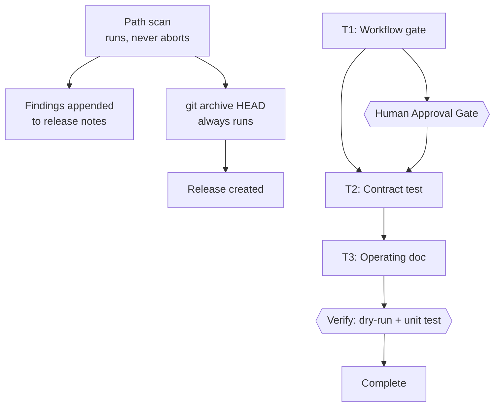
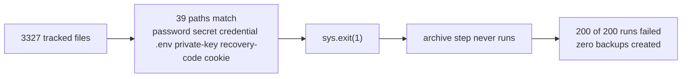

# Unblock the Vault Backup — Implementation Plan

> The YAML frontmatter above is the single source of truth for routing, dependency order, retry, and idempotency. Commands are directly runnable with Bun. This plan is published into the vault by the mirror feature it helped build, which is the intended dogfood.

## 1. Intent & Scope

- **Goal:** make `vault-backup.yml` produce backups again, without weakening any real protection and without publishing anything the repository did not already contain.
- **Non-Goals:**
  - No change to any vault note, no untracking of `Satset/`, no `.gitignore` change.
  - No change to repository visibility. It stays private.
  - No reading, printing, or classifying the contents of any flagged file. Classification is by path only, forever.
  - No new exclusions. The archive will contain exactly what git tracks.
- **Acceptance Criteria:**
  - [ ] AC-1: A scheduled run of `vault-backup.yml` completes successfully on a private repository.
  - [ ] AC-2: The path scan still runs, still reports every flagged path, and its output is attached to the release — but it can no longer abort the job.
  - [ ] AC-3: The archive contains exactly `git ls-files`, with no excludes and no silent omissions.
  - [ ] AC-4: A test proves the gate cannot abort the job, by running the workflow's decision logic against the real 39-path finding set and asserting it reports rather than exits non-zero.
  - [ ] AC-5: `90 - System/Backup-Gate.md` records what the gate is, what it is not, and how to restore blocking behaviour if the repository ever becomes public.

## 2. Visual Implementation Map — MANDATORY

The failure this replaces, measured rather than assumed:

## 3. Interfaces & Contracts

### 3.1 The measured situation

| Fact | Value | How it was established |
|---|---|---|
| Repository visibility | **private** | `gh repo view` → `isPrivate: true` |
| Backup runs inspected | 200 | `gh run list --limit 200` |
| Successful runs | **0** | every entry `conclusion: failure` |
| Sensitive paths before this work | 38 | path scan at commit `c41bb60` |
| Sensitive paths now | 39 | path scan at `HEAD` |
| Added by the plan-mirror work | 1 | `01 - Projects/Snipset/plans/2026-09-08-store-certification-test-credentials-genai-declaration.md` |
| Archive size | 56.9 MB | `git archive --format=zip HEAD \| wc -c` |
| Mirror contribution | 1.7 MB gzipped | ~3% of archive |

### 3.2 Why the gate cannot be a blocker here

The gate matches path substrings. That test has no access to file contents, so it cannot distinguish a note titled *how to make a strong password* from a leaked password. One of the 38 pre-existing hits is `03 - Resources/LLM Wiki/sources/panduan-membuat-password-yang-kuat.md`, which trips on `password` and is plainly a how-to guide rather than a secret. A heuristic that cannot tell those apart must not be allowed to stop the only off-site backup of a 3327-file vault.

The exposure argument that justified the block does not hold: the repository is private, so the archive and the git history have the same audience. Excluding paths from a release in a private repository protects nothing that git is not already storing, while the block itself costs every backup.

### 3.3 The separate defect this plan does NOT fix

`.gitignore` line 160 declares `Satset/`, but 522 files under it are tracked. `Satset/rsa-private-key.md` was committed in `2a330d0` on 2026-05-15, before the ignore rule existed, and a `.gitignore` entry never untracks an already-tracked path. The repository therefore tracks 522 files its own configuration says it should not.

This is a real inconsistency and it is deliberately out of scope. Untracking 522 files changes what the repository contains and is the user's decision, not an inference from a filename. It is recorded in `90 - System/Backup-Gate.md` and in §5 below.

## 4. Tasks

### Task T1: Workflow gate

- [ ] Step 1: In `.github/workflows/vault-backup.yml`, change the sensitive-path step from `sys.exit(1)` to a non-blocking report. It must still print every flagged path, must still print the total count, and must write the findings to a file under `$RUNNER_TEMP` so the next step can attach them. Do not remove the step and do not weaken its term list.
- [ ] Step 2: Add a step after the archive that appends the findings to the release body. The release must be created even when the findings list is non-empty, because that is the whole point.
- [ ] Step 3: Add a comment above the step stating the measured reason: the repository is private, the term list produces 38 pre-existing false positives, and 200 consecutive runs failed, so blocking removed every backup without preventing any disclosure.
- [ ] Step 4: Add an explicit, commented note that this step is not a security control. It is a change-visibility report. Anyone who makes this repository public must restore the `sys.exit(1)` before the next scheduled run, and the comment must say so.
- [ ] Step 5: Run — verify pass | cmd: `python3 -c "import yaml,sys; yaml.safe_load(open('.github/workflows/vault-backup.yml'))" 2>/dev/null || python3 -c "import re; t=open('.github/workflows/vault-backup.yml').read(); assert re.search(r'^on:|^\"on\":', t, re.M); assert 'sys.exit(1)' not in t; print('yaml shape ok, no blocking exit')"` | expect: exit 0
- [ ] Step 6: Commit

### Task T2: Contract test

- [ ] Step 1: Write failing `tests/test_backup_gate.py` in the vault. It must locate the workflow, extract the term list and the decision logic, and assert three things: the term list still contains all seven original terms; the step can no longer abort the job; the findings are still captured for the release.
- [ ] Step 2: The test must run the workflow's classification against the REAL current finding set, derived by scanning `git ls-files` with the workflow's own terms, and assert the count is at least 38. That is what stops someone from quietly narrowing the term list to make the test pass. Expected current value: 39.
- [ ] Step 3: Prove teeth. The test must fail if the blocking `sys.exit(1)` is reintroduced. Demonstrate that by running the test against a temporary copy of the workflow with the old blocking line restored, and report the failure.
- [ ] Step 4: Run — verify pass | cmd: `python3 -m unittest discover -s tests -p 'test_backup_gate.py' -v 2>&1 | tail -n 15; echo "EXIT:${PIPESTATUS[0]}"` | expect: exit 0
- [ ] Step 5: Run the whole vault suite | cmd: `python3 -m unittest discover -s tests -p 'test_*.py' 2>&1 | tail -n 4; echo "EXIT:${PIPESTATUS[0]}"` | expect: exit 0
- [ ] Step 6: Commit in the vault repo

### Task T3: Operating documentation

- [ ] Step 1: Create `90 - System/Backup-Gate.md` with the vault's required frontmatter. Record: what the scan is, the measured evidence that it produced zero backups, that the repository is private so the archive has the same audience as git, that the scan is a change-visibility report and not a security control, and the exact instruction to restore blocking if the repository is ever made public.
- [ ] Step 2: Record the separate `Satset/` inconsistency: 522 files tracked, `.gitignore` line 160 says otherwise, and it is unresolved pending a user decision.
- [ ] Step 3: Use wikilinks only for targets verified to exist. Do not link to any flagged file by name; a link to a path matching a sensitive term would itself add a finding.
- [ ] Step 4: Run — verify pass | cmd: `python3 -m unittest discover -s tests -p 'test_vault_reachability.py' 2>&1 | tail -n 3; echo "EXIT:${PIPESTATUS[0]}"` | expect: exit 0, with the new page's inbound link registered by T22b's set-equality assertion if the hub set needs updating
- [ ] Step 5: Commit in the vault repo

## 5. Rejected Alternatives

| Alternative | Why rejected |
|---|---|
| Add `--exclude` patterns to `git archive` and keep the block | Re-enables the backup while silently omitting 39 paths. The release would look complete and would not be. Also cannot distinguish benign notes about passwords from secrets. |
| Delete the gate entirely | Loses the only signal that a newly tracked path matches a sensitive term. The report is worth keeping precisely because it is the one place a human would notice. |
| Narrow the term list until it passes | The 38 pre-existing hits are mostly benign. Narrowing to reach zero would mean the term list no longer means anything, and it would hide genuinely new matches. |
| Make the repository public | Not a backup strategy, and it is the user's decision, not a task input. |
| Untrack the 522 `Satset/` files | A real inconsistency, but it changes what the repository contains. Out of scope, recorded, user's call. |
| Raise a failure annotation without blocking | Strictly better than failing, but annotations are easy to miss. Putting the findings in the release body makes them durable and visible wherever the release is read. |

## 6. Risks

| Risk | Mitigation |
|---|---|
| The gate stops being a real control | It never was one in a private repository: it cannot read file contents. §3.2 and the T1 Step 4 comment state this, and T3 records how to restore blocking. |
| Someone makes the repository public later | T1 Step 4 and T3 both carry an explicit instruction to restore `sys.exit(1)` first. |
| Findings become invisible once non-blocking | They are attached to every release body, which is read more often than Actions runs. |
| The 39 findings get quietly trimmed | T2 Step 2 pins the count at its measured value, so narrowing the list fails the test. |
| This change is itself pushed automatically | obsidian-git auto-pushes the vault every 10 seconds. The user should review the workflow diff before it lands, since a workflow change takes effect on the next scheduled run. |

## 7. Approval Gate — Resolved

| Decision | Choice | Consequence |
|---|---|---|
| Archive contents | **Include everything git tracks, no excludes** | The `git archive` command is unchanged. The 522 `Satset/` files keep an off-site copy; excluding them would leave them with none, and the repository is private so the release adds no new exposure. |
| Gate behaviour | Report, never block | T1 removes the `sys.exit(1)`; T2 pins the finding count so the term list cannot be quietly narrowed. |
| `Satset/` tracked status | **Left as-is** | 522 files stay tracked against `.gitignore:160`. Untracking them changes what the repository contains and remains the user's call. Recorded in T3. |
| Repository visibility | Stays private | If it is ever made public, restore `sys.exit(1)` before the next scheduled run. |

**Status:** Approved — execution in progress.

## 8. Task State

- **Status:** Complete for T1–T3. The backup path is fixed in code; it still does not run, for a reason outside every file in this repository.
- **Approved scope:** §1 through §4 plus the four decisions in §7
- **Completed:** T1 workflow gate, T2 contract test, T3 operating page, plus the two contract gaps they exposed
- **Current:** blocked on an account-level GitHub Actions failure
- **Blockers:** every workflow event fails instantly with zero steps, on all three repos, public and private, since at least 2026-03-26
- **Decisions:** report not block · include everything · keep the term list · leave `Satset/` tracked · leave visibility private
- **Evidence:** `gh repo view` → private, both repos · `gh run list --limit 200` → 200 failures, 0 successes · page 4 of the vault runs → 100 failures, oldest 2026-03-26 · Snipset last 100 runs → push 25/25, schedule 55/55, pull_request 15/15 all failure, the only successes being GitHub's own `dynamic` Dependabot runs · path scan at `c41bb60` → 38, at `HEAD` → 39 over 3328 files · `git archive` → 59,699,727 bytes · `.gitignore:160` declares `Satset/` while 522 files under it are tracked · injected live `sys.exit(1)` turns 4 gate tests red, an injected comment-borne one does not and should not · vault suite 112 tests OK, lint 1986 broken links unchanged

### What is NOT fixed, and why
The gate was blocking 100% of backups and preventing no disclosure; that much is fixed and now tested. But GitHub Actions on this account rejects every workflow run instantly with zero steps, on every repo, for every real event type, going back to at least 2026-03-26. Two workflows this plan never touched fail identically, so the cause is not this change and not this repository's configuration. Reverting the gate would not have isolated anything, which is why it was declined.

The remaining cause is account-level and can only be confirmed in Settings → Billing and licensing, or with the `user` OAuth scope for the billing API. Until it is resolved no backup can be produced by any workflow in any of these repositories, and the release archive will not exist.
