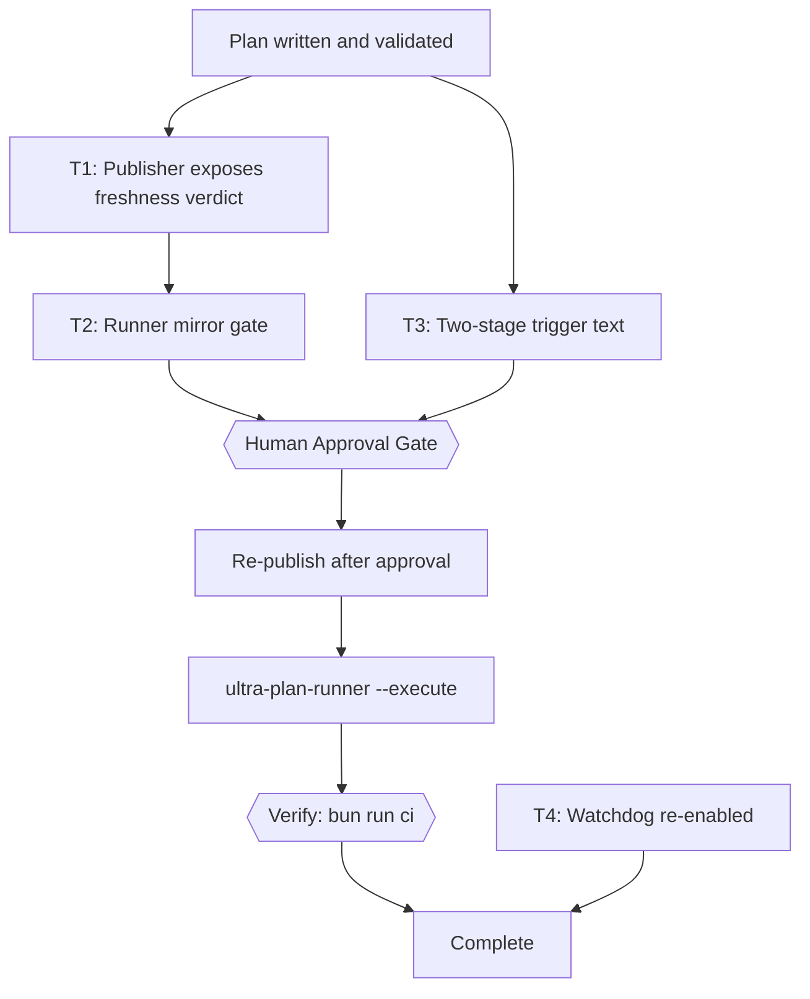
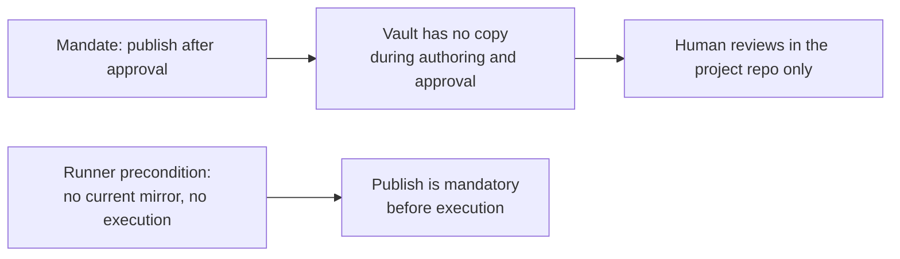

# Publish Every Plan the Moment the Plan Document Is Finished

> The YAML frontmatter above is the single source of truth for routing, dependency order, retry, and idempotency. This plan is published into the vault at `status: Draft` — that is the point. A human reviews it in Obsidian while execution is still pending, which is the whole reason the trigger moves earlier.

## 1. Intent & Scope

- **Goal:** make "the plan is in the Obsidian vault" true at the moment the plan document is finished, instead of after the plan is approved or after every task has executed, so a human can review the plan in Obsidian in parallel with execution.
- **Non-Goals:**
  - No two-way sync. The project repository stays the source of truth and the vault note stays a read-only mirror.
  - No watcher daemon, no new systemd timer for publishing, no plugin hook. The trigger is a documented step plus a runner precondition.
  - No change to the transform, the PARA frontmatter, the registry routing, or `--check --all` semantics.
  - No change to what `SKIPPED-IDEMPOTENT` means.
- **Acceptance Criteria:**
  - [ ] AC-1: `bun scripts/ultra-plan-runner.mjs <plan> --execute` refuses to start when the plan's mirror is missing or stale, exits with a dedicated code, runs zero task steps, and names the mirror path plus the exact publish command that fixes it.
  - [ ] AC-2: The same command runs the DAG normally when the mirror is current, when the plan's project is `mirror: false` in the registry, and when the operator passes the documented escape flag — and the escape prints a warning instead of passing silently.
  - [ ] AC-3: A dry-run (`no --execute`) is never gated, so plan validation keeps working on a machine with no vault at all.
  - [ ] AC-4: The freshness verdict the runner gates on is the publisher's own predicate, imported, not a second implementation of it.
  - [ ] AC-5: The trigger snippet and the master skill both say to publish right after the plan validates and again after approval, and both state that a review verdict is written in the source plan, never in the mirror.
  - [ ] AC-6: The daily drift watchdog is actually running, and the runner's new exit code is documented where the other exit codes are documented.
  - [ ] AC-7: `bun run ci` passes.

## 2. Visual Implementation Map — MANDATORY

Why the trigger moves, measured rather than assumed:

## 3. Interfaces & Contracts

### 3.1 The measured situation

| Fact | Value | How it was established |
|---|---|---|
| Where the mandate lives today | 2 places | `snippets/orkestrasi-ngoding-plan.md` (last sentence) and `Super Ultra Code Plan Implementation.md:762` |
| Wording today | "After the plan is approved, you MUST run the publisher" | both files, read directly |
| Mirrors in the vault | 270, all current | `bun scripts/plan-publish.mjs --check --all` → `All 270 mirror(s) match their source.` |
| Plans declared runnable today | 40 of 267 | `grep -rh '^status:'` across the three project `docs/` trees: 40 declare `schema: ultra-plan/v1`, 227 have no frontmatter |
| `inotifywait` | not installed | `command -v inotifywait` |
| Watchdog unit | loaded, **disabled**, inactive | `systemctl --user is-enabled plan-mirror-check.timer` → `disabled`; `is-active` → exit 3 |
| Runner coupling today | none | `scripts/ultra-plan-runner.mjs` imports only `node:fs` and `node:child_process` |
| Registry reachability from the runner | always | the runner is invoked as `bun ai-skills/scripts/ultra-plan-runner.mjs <plan>`, and `plan-publish-registry.mjs` resolves `plans.publish.json` from its own `__dirname`, so cwd does not matter |

### 3.2 The gate contract

| Case | `--execute` behaviour | Exit |
|---|---|---|
| mirror current | runs the DAG | task ledger decides 0/1 |
| mirror missing or stale | prints the mirror path, the reason, and the exact publish command; runs zero task steps | **3** |
| project is `mirror: false` (the vault's own plans) | runs the DAG, gate not applicable | task ledger decides |
| registry missing, or plan unroutable | fails closed with an actionable message | **3** |
| `--skip-mirror-gate` passed | runs the DAG, prints a warning naming the flag | task ledger decides |
| no `--execute` (dry run) | gate never consulted | 0/1 per validation |

Exit 3 is new and distinct on purpose: 2 is already usage error and 1 is already validation or task failure, so a caller can tell "you forgot to publish" from "the plan is broken" without parsing text.

### 3.3 The one-way rule this must not break

Publishing twice means the second publish overwrites the first. That is correct for a mirror, and it is why a review verdict cannot live in the mirror: the next publish erases it. Review notes go into the source plan's approval section, which is the direction that survives. Both edited files must say this, because a reviewer who writes into the vault note and then watches it vanish has been actively misled by the tooling.

## 4. Tasks

### Task T1: Publisher exposes its freshness verdict for reuse

- **Interfaces:**
  - Consumes: `checkOne(registry, rawPlanPath)` in `scripts/plan-publish.mjs` (currently module-private).
  - Produces: one exported function, `planFreshness(rawPlanPath, opts)`, returning `{ applicable, state, detail, dest, label }` where `state` is one of `OK | MISSING | DRIFT | REFUSED | NO-SOURCE`, and a new exit-code-free caller contract. `applicable` is `false` for a `mirror: false` project.
- **Preconditions (assert FIRST; fail-fast, never improvise a substitute):**
  - [ ] Dependency: `bun --version` exits 0 (else abort: `E_PRECOND_DEP`)
  - [ ] Input contract: `plans.publish.json` still lists the four projects with the same `mirror` flags read in §3.1 (else abort: `E_PRECOND_INPUT`)
  - On failure: STOP this task, record to §6, continue only tasks independent of T1.
- **Idempotency Check (BEFORE Step 1):**
  - [ ] Skip when `skip_if` (frontmatter) exits 0 → mark `SKIPPED-IDEMPOTENT`. A checked box alone never justifies a skip.
- [ ] **Step 1 — Failing test (RED):** in `scripts/plan-publish.test.mjs`, add a case named `exports a single-plan freshness verdict`, using a temp dir as a fake vault: a published-then-unchanged plan reports `OK`; deleting the mirror reports `MISSING`; editing the source reports `DRIFT` with a reason string; a `mirror: false` project reports `applicable: false`. cmd: `bun test scripts/plan-publish.test.mjs` | expect: exit non-zero for the right reason | retry: 0
- [ ] **Step 2 — Implementation (GREEN):** export the verdict. Reuse `resolveProject`, `destPathFor`, `protectedReason`, `readMirrorState`, `stalenessReason`, and `hashOf` as they are. Do not add a second freshness rule; T2's whole value is that it cannot disagree with `--check`.
- [ ] **Step 3 — Verify:** cmd: `bun test scripts/plan-publish.test.mjs` | expect: exit 0, 0 failures | retry: 1 (transient only) | on_fail: mark FAILED, write §6, halt only `T2`, keep independent tasks running
- [ ] **Step 4 — Commit:** `git add scripts/plan-publish.mjs scripts/plan-publish.test.mjs && git commit -m "feat(publish): export the single-plan freshness verdict"`

### Task T2: Runner refuses to execute a plan whose mirror is stale

- **Interfaces:**
  - Consumes: `planFreshness` from T1.
  - Produces: `--skip-mirror-gate` flag, exit code 3, and a `MIRROR GATE: BLOCKED` block printed before any task step runs. Dry-run is untouched.
- **Preconditions (assert FIRST; fail-fast):**
  - [ ] Upstream: `planFreshness` is exported from `scripts/plan-publish.mjs` (else abort: `E_PRECOND_UPSTREAM`)
  - On failure: STOP, record to §6, continue only tasks independent of T2.
- **Idempotency Check (BEFORE Step 1):**
  - [ ] Skip when `skip_if` exits 0 → `SKIPPED-IDEMPOTENT`.
- [ ] **Step 1 — Failing test (RED):** in `scripts/ultra-plan-runner.test.mjs`, add a case named `refuses to execute a plan whose mirror is stale`, driving the real CLI against a temp vault and a temp registry via `PLAN_PUBLISH_CONFIG`: stale mirror → exit 3 and no task step executed; current mirror → the DAG runs; `mirror: false` project → the DAG runs; `--skip-mirror-gate` → the DAG runs and the warning is printed; no `--execute` → the gate is never consulted even with a stale mirror. cmd: `bun test scripts/ultra-plan-runner.test.mjs` | expect: exit non-zero | retry: 0
- [ ] **Step 2 — Implementation (GREEN):** consult the verdict in `main()` after validation passes and only when `--execute` is set. On a blocking verdict print the mirror path, the reason, the project name, and the literal command to fix it, then exit 3. Fail closed when the registry is missing or the plan is unroutable, because a gate that quietly passes when it cannot check is the exact failure mode already documented for the CI version of this check.
- [ ] **Step 3 — Verify:** cmd: `bun test scripts/ultra-plan-runner.test.mjs` | expect: exit 0, 0 failures | retry: 1 (transient only) | on_fail: mark FAILED, write §6, halt only tasks depending on T2
- [ ] **Step 4 — Verify the teeth by hand:** pick one real mirrored plan, publish it, then append a single trailing comment line to the source plan and re-run `--execute` against a plan with no `run[]` steps so nothing can execute. cmd: `bun scripts/ultra-plan-runner.mjs docs/code-plan/plans/2026-09-27-plan-finish-sync-to-obsidian.md --execute; echo "EXIT:$?"` | expect: exit 3 with the mirror path named, after which republish and confirm exit is no longer 3 | retry: 0
- [ ] **Step 5 — Commit:** `git add scripts/ultra-plan-runner.mjs scripts/ultra-plan-runner.test.mjs && git commit -m "feat(runner): gate --execute on a current vault mirror"`

### Task T3: Two-stage publish trigger in the snippet and the master skill

- **Interfaces:**
  - Consumes: `bun scripts/plan-publish.mjs <plan>`, already documented in both files.
  - Produces: an identical publish mandate in `snippets/orkestrasi-ngoding-plan.md` and `Super Ultra Code Plan Implementation.md:762`, placed after the validate step and before the approval gate, plus a re-publish line after approval.
- **Preconditions (assert FIRST; fail-fast):**
  - [ ] Input contract: `snippets.manifest.json` still maps `snippets/orkestrasi-ngoding-plan.md` to uuid `87f42bad-9b3f-441e-ab97-632ceeba4728` (else abort: `E_PRECOND_INPUT`)
  - On failure: STOP, record to §6, continue independent tasks.
- **Idempotency Check (BEFORE Step 1):**
  - [ ] Skip when `skip_if` exits 0 → `SKIPPED-IDEMPOTENT`.
- [ ] **Step 1:** rewrite the mandate in both files as a numbered two-step block: publish immediately after `bun scripts/ultra-plan-runner.mjs <plan>` returns `Validation: OK` and before requesting approval, then publish again after approval and before `plan:run`. Keep the existing `SKIPPED-IDEMPOTENT` and one-way paragraphs exactly as they are.
- [ ] **Step 2:** add to both files, in the same block, that a review verdict is written in the source plan's approval section and never in the mirror, because the next publish overwrites the mirror.
- [ ] **Step 3:** add a third line to the block: the runner now refuses `--execute` on a stale mirror, so a skipped publish fails loudly instead of silently. This is what turns the mandate from advice into a contract.
- [ ] **Step 4 — Verify:** cmd: `bun run snippets:check` | expect: exit 0, source and database agree | retry: 0
- [ ] **Step 5 — Push, only with explicit user go-ahead:** `bun run snippets:push` writes into the user's Snipset database, which is user data and not a repository file. Ask first; if declined, record it in §8 and leave the database stale on purpose rather than silently.
- [ ] **Step 6 — Commit:** `git add snippets/orkestrasi-ngoding-plan.md "Super Ultra Code Plan Implementation.md" && git commit -m "docs(skill): publish the plan when the plan is finished, not after approval"`

### Task T4: Re-enable the daily watchdog and document the new exit code

- **Interfaces:**
  - Consumes: `~/.config/systemd/user/plan-mirror-check.{service,timer}`, already installed and currently disabled.
  - Produces: an active daily timer, and exit code 3 documented next to the existing exit-code text at `Super Ultra Code Plan Implementation.md:765`.
- **Preconditions (assert FIRST; fail-fast):**
  - [ ] Dependency: `systemctl --user is-enabled plan-mirror-check.timer` reports `disabled`, i.e. the unit exists and is off (else abort: `E_PRECOND_INPUT`, because an already-active timer means this task is unnecessary)
  - On failure: STOP, record to §6.
- **Idempotency Check (BEFORE Step 1):**
  - [ ] Skip when `skip_if` exits 0 → `SKIPPED-IDEMPOTENT`.
- [ ] **Step 1:** `systemctl --user enable --now plan-mirror-check.timer`, then confirm with `systemctl --user list-timers plan-mirror-check.timer` that NEXT is populated. Enabling is the fix for a watchdog nobody was watching; leaving it disabled means a plan published outside the snippet is never noticed.
- [ ] **Step 2:** document exit 3 beside the existing exit-code sentence, stating that it means the vault mirror is missing or stale and that the fix is to publish, not to edit the plan.
- [ ] **Step 3 — Verify:** cmd: `systemctl --user is-active plan-mirror-check.timer && bun scripts/plan-publish.mjs --check --all | tail -n 1` | expect: `active`, then `All 270 mirror(s) match their source.` | retry: 1 (transient only)
- [ ] **Step 4 — Commit:** `git add "Super Ultra Code Plan Implementation.md" && git commit -m "docs(skill): document runner exit 3; re-enable daily mirror watchdog"`

## 5. Verification Matrix Before Completion

| Check | Command | Exit Code | Fresh Evidence | Status |
|---|---|---|---|---|
| Publisher tests | `bun test scripts/plan-publish.test.mjs` | 0 | 0 failures | Pending |
| Runner tests | `bun test scripts/ultra-plan-runner.test.mjs` | 0 | 0 failures | Pending |
| Full CI | `bun run ci` | 0 | render-diagrams, validate-skill, all script tests, snippets check | Pending |
| Live mirror state | `bun scripts/plan-publish.mjs --check --all` | 0 | 270 mirrors match | Pending |
| Gate has teeth | real plan + trailing comment + `--execute` | 3 | mirror path named, zero steps run | Pending |
| Watchdog running | `systemctl --user is-active plan-mirror-check.timer` | 0 | `active` | Pending |
| This plan is mirrored | `bun scripts/plan-publish.mjs --check docs/code-plan/plans/2026-09-27-plan-finish-sync-to-obsidian.md` | 0 | `OK` | Pending |

## 6. Error Ledger (aggregated at end; independent tasks not halted)

| Task | Step | Classification | Exit | Root cause | Retry used | Fallback | Status |
|---|---|---|---|---|---|---|---|
| | | | | | | | |

- Classification: `code` | `test` | `contract` | `environment` | `infrastructure` | `pre-existing`.
- Status: `FAILED-ISOLATED` | `FAILED-BLOCKING` | `RESOLVED` | `DEFERRED`.

## 7. Human Approval Gate

- [ ] Partner / Human approval received for this plan before implementation begins.
- [ ] Agreed: publish at `Draft` and again after approval, instead of after approval only.
- [ ] Agreed: the runner refuses `--execute` on a stale mirror, with `--skip-mirror-gate` as the escape.
- [ ] Agreed: review verdicts are written in the source plan, never in the mirror.

## 8. Session-Close Debt Sweep & Follow-Up Backlog

| # | Follow-up (outcome + path + finish line) | Class | `defer: <ceiling>, <upgrade-trigger>` | Status |
|---|---|---|---|---|
| F1 | `snippets:push` propagation, if the user declines the write to their Snipset database | `LATER` | `defer: 1 session, re-ask at next plan-authoring session` | `OPEN` |
| F2 | Vault-side index entries for the newly published Draft plan, if `test_vault_reachability.py` requires the hub set to be updated | `LATER` | `defer: 1 session, triggers when the vault test fails on the new note` | `OPEN` |
| F3 | A 227-plan backlog of sources with no `ultra-plan/v1` frontmatter, none of which can ever be gated by T2 | `LATER` | `defer: 3 sessions, upgrade-trigger = a non-ultra plan actually reaching --execute` | `OPEN` |

- [ ] 3-5 ranked follow-ups injected as one multi-select question (checkboxes) after the final recap.
- [ ] Every selected follow-up executed through the full pipeline with fresh evidence.
- [ ] Declined and out-of-cap items written here so no debt leaves the session unrecorded.
