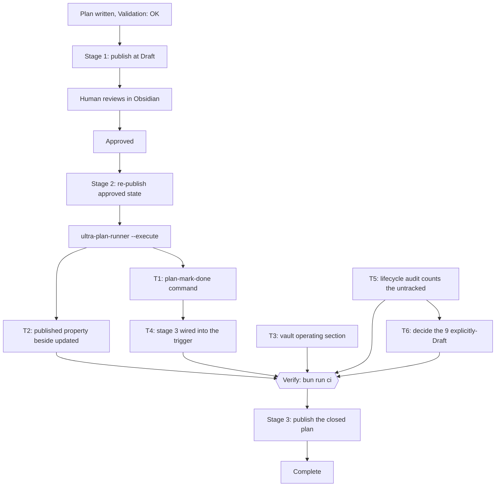
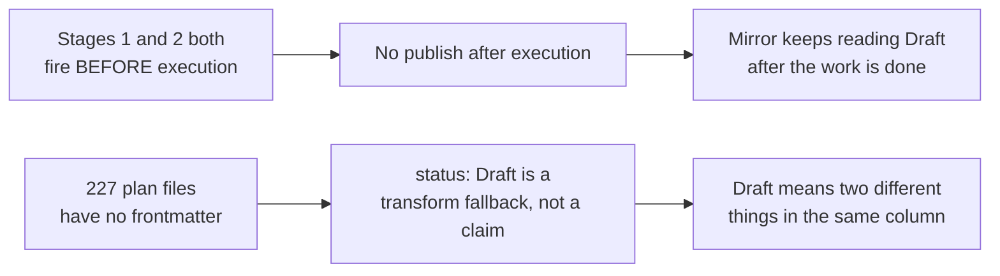

# Close the Vault Mirror After a Plan Finishes Executing

> Published at `status: Draft` on purpose: stage 1 of the pipeline is now the point at which a human reads it, and the whole subject of this plan is a stage that does not yet exist. Read it here, then approve.

## 1. Intent & Scope

- **Goal:** make the Obsidian mirror tell the truth after a plan executes — a third publish stage that carries `Complete` and the ticked task state, a command that ticks a task from recorded evidence rather than from a claim, an honest `published` property, an operating section in the vault, and a measured audit of the 236 mirrors that currently read `Draft`.
- **Non-Goals:**
  - No two-way sync. The mirror stays read-only and derived.
  - No automatic status inference. This plan deliberately does not decide whether an untracked plan is finished; see §3.2.
  - No bulk edit of the 227 untracked plan files. Inventing a lifecycle for them is fabrication, not maintenance.
  - No change to `--check` semantics, to the `mirror: false` rule, or to the vault's Folder Contract.
  - No Obsidian plugin. There is no Dataview in this vault, and adding one is a separate decision.
- **Acceptance Criteria:**
  - [ ] AC-1: A command ticks exactly the step lines belonging to one named task, refuses on a task id that is not in the plan, is a byte-level no-op when the steps are already ticked, and never edits a line it was not asked to edit.
  - [ ] AC-2: A plan that is ticked and re-published ends up with `status: Complete` and zero unticked `- [ ]` step lines in its mirror, and the runner still exits 0 on it afterwards.
  - [ ] AC-3: The mirror carries both `updated` (contract-required, unchanged meaning) and a new `published` property whose value provably differs from `updated` for at least one re-publish of an unchanged plan.
  - [ ] AC-4: The vault has an operating section that states the three stages, states that the runner never writes to a plan, and warns that a mirror reading `Draft` is ambiguous between "just written" and "finished long ago and never re-published".
  - [ ] AC-5: An audit command prints exactly how many plan files carry no frontmatter at all, and the count is quoted in the vault section so the `Draft` distribution can be read without guessing.
  - [ ] AC-6: A dated decision record exists that either lists the 9 explicitly-`Draft` plans and their real status, or states that the user declined the backfill and why.

## 2. Visual Implementation Map — MANDATORY

The gap this closes, measured rather than assumed:

## 3. Interfaces & Contracts

### 3.1 The measured situation

| Fact | Value | How it was established |
|---|---|---|
| Publish stages that exist today | 2, both pre-execution | `snippets/orkestrasi-ngoding-plan.md` publish block, added by the previous plan |
| `executePlan` write access to the plan | none | `ultra-plan-runner.mjs` imports `readFileSync` only; no write path anywhere in the file |
| Mirror `status` fidelity | verbatim copy | source `status: Complete` → mirror `status: Complete` on `2026-09-26-vault-backup-gate-unblock` |
| Checkbox fidelity | verbatim body copy | 17 `- [ ]` in the source plan, 17 in its mirror |
| Mirrors reading `Draft` | 236 of 271 | `grep -rh '^status:'` over the three `plans/` trees in the vault |
| Plan files with NO frontmatter | **227 of 271** | `head -1` frontmatter probe over all three `docs/code-plan/plans/` directories |
| Plan files WITH frontmatter | 44 | 271 − 227 |
| Of those 44, ones with NO `status:` | **0** | every plan that declares frontmatter also declares `status:` |
| Real lifecycle distribution | 21 Complete, 9 Draft, 8 Verification, 3 InProgress, 1 Open, 1 Implemented, 1 ApprovedInProgress | `grep -m1 '^status:'` over the 44 |
| `updated` on a mirror | publish date, not plan date | `mergeFrontmatter` emits `` `updated: ${today}` `` where `today` is the CLI run date |
| `updated` is contract-required | yes | `tests/test_plan_mirror.py:38-48` `REQUIRED_PROPERTIES` and `AGENTS.md` Page Contract |
| Dataview in the vault | absent | `.obsidian/community-plugins.json` lists only `obsidian-git` and `title-generator` |

### 3.2 The 236 are not one problem, and this plan will not pretend otherwise

`status: Draft` in a mirror has two entirely different causes, and conflating them would make any backfill a guess:

- **227 files** declare no frontmatter at all. `mergeFrontmatter` falls back to `status: Draft` when it finds no `status:` line. Those mirrors are not lying about a lifecycle; they are reporting that the source has never been in one. Marking them `Complete` would be asserting something nobody measured.
- **9 files** explicitly declare `status: Draft`. Those are the only ones where the value is a real claim, and it may be a stale one.

So the honest split is: fix the mechanism (T1, T2, T3, T4), measure the ambiguity (T5), and put the 9 in front of the human (T6). No script decides whether finished work is finished.

### 3.3 Why the ticks are applied from a record, not typed by hand

The runner already records what happened: it prints `T1: PASSED`, `T2: SKIPPED-IDEMPOTENT`, `T1: NEEDS-AGENT`, and an Error Ledger. `plan-mark-done` consumes that as evidence rather than accepting a bare `--task T3` with nothing behind it, because a checkbox that anyone can set with a flag is not a record of anything. `--task` is still accepted, and it is labelled in the output as unverified, so an agent that ran the steps itself can close its own task without inventing a log file — but the distinction between "there is evidence" and "the operator asserted it" stays visible in the output.

### 3.4 Why `updated` stays

The obvious fix for a misleading `updated` is to rename it, and that is wrong: `updated` is a required mirror property, enforced by `tests/test_plan_mirror.py` and stated in the vault's own Page Contract. Renaming it would break the vault to fix a vault. The fix is additive — emit `published` beside it — which needs `PUBLISHER_VERSION` bumped to 2 so every existing mirror heals on the next publish. That bump is the same mechanism that healed the mirrors after the earlier qualified-link fix, so it is a known path rather than a new one.

## 4. Tasks

### Task T1: `plan-mark-done`, a command that applies ticks from a record

- **Interfaces:**
  - Consumes: the runner's own output lines (`T1: PASSED`, `T1: SKIPPED-IDEMPOTENT`, `T1: NEEDS-AGENT`) from a log file or stdin, or `--task <id>` as an asserted fallback; a plan path.
  - Produces: `bun scripts/plan-mark-done.mjs <plan.md> --from <log>` and `bun scripts/plan-mark-done.mjs <plan.md> --task T1`. Exit 0 on a change or a clean no-op, 1 on a usage or evidence error, 2 on usage error. It prints one line per task it touched, saying whether the tick came from evidence or from an assertion.
- **Preconditions (assert FIRST; fail-fast, never improvise a substitute):**
  - [ ] Dependency: `bun scripts/ultra-plan-runner.mjs <some-plan>` exits 0 on a known-good plan (else abort: `E_PRECOND_DEP`)
  - [ ] Input contract: the target plan has frontmatter with `schema: ultra-plan/v1` and at least one `tasks[].id` (else abort: `E_PRECOND_INPUT`)
  - On failure: STOP this task, do NOT guess a substitute, record to §6, continue only tasks independent of T1.
- **Idempotency Check (BEFORE Step 1):**
  - [ ] Skip when `skip_if` (frontmatter) exits 0 → mark `SKIPPED-IDEMPOTENT`. A checked box alone never justifies a skip.
- [ ] **Step 1 — Failing test (RED):** `scripts/plan-mark-done.test.mjs`, a fixture plan with two tasks and three step lines under one of them. Cases, all named so `skip_if` can find the suite: `ticks only the step lines of the named task` (the other task's lines are byte-identical afterwards), `refuses an unknown task id`, `is a no-op when the steps are already ticked`, `never touches a non-step line` (a `- [ ]` line in §8 and a `- [ ]` inside a prose sentence both survive), `reports whether the tick came from evidence or from an assertion`, and `fails closed when the log names a task the plan does not have`. cmd: `bun test scripts/plan-mark-done.test.mjs` | expect: exit non-zero for the right reason | retry: 0
- [ ] **Step 2 — Implementation (GREEN):** locate each task's heading (`### Task <id>`) and the checklist lines inside it, up to the next heading. Refuse a task id that appears in neither the frontmatter nor the body. Never rewrite line content other than the single `[ ]`/`[x]` token. Emit the Evidence Ledger table from §6 of the same plan when the log records a failure for the task being closed, so a task cannot be ticked silently over a red step.
- [ ] **Step 3 — Verify:** cmd: `bun test scripts/plan-mark-done.test.mjs` | expect: exit 0, 0 failures | retry: 1 (transient only) | on_fail: mark FAILED, write §6, halt only `T4`, keep independent tasks running
- [ ] **Step 4 — Commit:** `git add scripts/plan-mark-done.mjs scripts/plan-mark-done.test.mjs && git commit -m "feat(plans): add plan-mark-done to apply task ticks from a runner record"`

### Task T2: Emit `published` beside the contract-required `updated`

- **Interfaces:**
  - Consumes: the transform in `scripts/plan-publish-frontmatter.mjs` and its existing test file.
  - Produces: a new `published: <today>` line in every mirror, `PUBLISHER_VERSION` bumped to 2, and a test named `emits published alongside the contract-required updated`.
- **Preconditions (assert FIRST; fail-fast):**
  - [ ] Input contract: `updated` remains in the emitted property list and in `tests/test_plan_mirror.py` `REQUIRED_PROPERTIES` on the vault side (else abort: `E_PRECOND_INPUT`)
  - On failure: STOP, record to §6, continue independent tasks.
- **Idempotency Check (BEFORE Step 1):**
  - [ ] Skip when `skip_if` exits 0 → `SKIPPED-IDEMPOTENT`.
- [ ] **Step 1 — Failing test (RED):** in `scripts/plan-publish-frontmatter.test.mjs`, assert that a merged mirror contains `updated:` AND `published:` with the same value on a first publish, and that `PUBLISHER_VERSION` is 2 — written as an import, never as a literal. In `scripts/plan-publish.test.mjs`, assert that a mirror written by version 1 is reported `DRIFT` with a `publisher_version` reason, so the bump demonstrably forces the 271 existing mirrors to re-publish rather than silently looking current. cmd: `bun test scripts/plan-publish-frontmatter.test.mjs scripts/plan-publish.test.mjs` | expect: exit non-zero | retry: 0
- [ ] **Step 2 — Implementation (GREEN):** add `published` to the `emitted` array immediately after `updated`, and bump `PUBLISHER_VERSION`. Update the module header comment to say plainly that `updated` is the publish date for a mirror and that a mirror's `updated` says nothing about when the plan text last changed — the plan's own history lives in git.
- [ ] **Step 3 — Verify:** cmd: `bun test scripts/plan-publish.test.mjs scripts/plan-publish-frontmatter.test.mjs scripts/plan-publish-registry.test.mjs` | expect: exit 0, 0 failures | retry: 1 (transient only)
- [ ] **Step 4 — Re-publish every mirror and confirm the vault contract still holds:** cmd: `bun scripts/plan-publish.mjs --all && cd "/home/belajarcarabelajar/Dokumen/Obsidian Vault" && python3 -m unittest discover -s tests -p 'test_*.py'` | expect: `271` published, 0 skipped-idempotent, and the vault suite exits 0 with all 112 tests passing | retry: 0
- [ ] **Step 5 — Commit:** `git add scripts/plan-publish-frontmatter.mjs scripts/plan-publish-frontmatter.test.mjs scripts/plan-publish.test.mjs && git commit -m "feat(publish): stamp mirrors with published and bump PUBLISHER_VERSION"`

### Task T3: Document the stages in the vault's own operating section

- **Interfaces:**
  - Consumes: `90 - System/Plan-Publishing.md`, which today has no section on what happens after execution — verified by reading all 113 lines.
  - Produces: two new sections, `## After execution` and `## Reading a mirror's status`, plus a link from `90 - System/index.md` only if the reachability test requires it.
- **Preconditions (assert FIRST; fail-fast):**
  - [ ] Dependency: `python3 -m unittest tests.test_plan_mirror -v` in the vault exits 0 before the edit (else abort: `E_PRECOND_DEP`)
  - On failure: STOP, record to §6, continue independent tasks.
- **Idempotency Check (BEFORE Step 1):**
  - [ ] Skip when `skip_if` exits 0 → `SKIPPED-IDEMPOTENT`.
- [ ] **Step 1:** add `## After execution` recording: the runner never writes to a plan file, so ticking is a separate explicit step; the three stages; the command that applies the ticks; and that the verdict belongs in the source plan, never the mirror.
- [ ] **Step 2:** add `## Reading a mirror's status` recording, as a table: `Draft` from a plan with no frontmatter is a publisher default and means nothing; `Draft` from a plan that declares it is a real claim and may be stale; `updated` on a mirror is the publish date; `published` is the same date under a name that says so; `source_hash` is the only field that proves the mirror matches its source.
- [ ] **Step 3:** quote the 227-of-271 count from T5's output rather than restating a remembered number, and link only to targets that exist.
- [ ] **Step 4 — Verify:** cmd: `cd "/home/belajarcarabelajar/Dokumen/Obsidian Vault" && python3 -m unittest discover -s tests -p 'test_*.py' && python3 scripts/vault_lint.py --strict` | expect: 0 failures, lint clean | retry: 1 (transient only)
- [ ] **Step 5 — Commit in the vault repo:** `git add "90 - System/Plan-Publishing.md" && git commit -m "docs(vault): record the post-execution publish stage and how to read a mirror's status"`

### Task T4: Wire stage 3 into the trigger and the skill

- **Interfaces:**
  - Consumes: T1's command name, the stage block added by the previous plan.
  - Produces: a third numbered step in the snippet's publish block, and the matching paragraph in the master skill, naming the tick command and the final publish.
- **Preconditions (assert FIRST; fail-fast):**
  - [ ] Upstream: `bun scripts/plan-mark-done.mjs --help` exits 0 (else abort: `E_PRECOND_UPSTREAM`)
  - On failure: STOP, record to §6, continue independent tasks.
- **Idempotency Check (BEFORE Step 1):**
  - [ ] Skip when `skip_if` exits 0 → `SKIPPED-IDEMPOTENT`.
- [ ] **Step 1:** extend the snippet's publish block with stage 3: after the debt sweep and the plan is closed, apply the ticks with `plan-mark-done`, confirm `status: Complete` in the source plan's frontmatter, then publish again. State that the ticks are applied in the SOURCE plan, because the mirror is overwritten on every publish.
- [ ] **Step 2:** mirror the same three stages into `Super Ultra Code Plan Implementation.md` under the Plan Publishing heading, keeping the stage 1 and 2 text byte-identical so the two files do not drift in wording.
- [ ] **Step 3:** add one sentence to the stage-3 text: the mirror is only truthful after the final publish, so a plan that was executed but not re-published reads `Draft` and that is a known, measurable state rather than a bug to be guessed at.
- [ ] **Step 4 — Push the snippet, with explicit user go-ahead:** `bun run snippets:push` writes to the user's Snipset database. Ask first; if declined, record it in §8 and leave the database stale on purpose.
- [ ] **Step 5 — Verify:** cmd: `bun run snippets:check && bun scripts/validate-skill.mjs` | expect: both exit 0 | retry: 0
- [ ] **Step 6 — Commit:** `git add snippets/orkestrasi-ngoding-plan.md "Super Ultra Code Plan Implementation.md" && git commit -m "docs(skill): add the post-execution publish stage"`

### Task T5: Measure how many plans have no lifecycle at all

- **Interfaces:**
  - Consumes: `plans.publish.json` and the three registered project roots.
  - Produces: `bun scripts/plan-lifecycle-audit.mjs`, printing counts split by cause — `untracked (no frontmatter)`, `tracked (declares status)`, and a per-status breakdown of the tracked ones. Always exit 0; it is a report, and its own output is the evidence T3 and T6 cite.
- **Preconditions (assert FIRST; fail-fast):**
  - [ ] Dependency: `bun scripts/plan-publish.mjs --status` exits 0 (else abort: `E_PRECOND_DEP`)
  - On failure: STOP, record to §6, continue independent tasks.
- **Idempotency Check (BEFORE Step 1):**
  - [ ] Skip when `skip_if` exits 0 → `SKIPPED-IDEMPOTENT`.
- [ ] **Step 1:** write the script using the existing `enumeratePlans` and `loadRegistry` from `plan-publish-registry.mjs` rather than a second directory walk, and add a case to `scripts/plan-publish-registry.test.mjs` if it needs a new export.
- [ ] **Step 2 — Verify:** cmd: `bun scripts/plan-lifecycle-audit.mjs` | expect: exit 0 and `untracked (no frontmatter)` present in the output | retry: 1 (transient only)
- [ ] **Step 3:** run it and record the real numbers in §8 of this plan, replacing the §3.1 figures if they have moved, so the plan and the measurement cannot disagree.
- [ ] **Step 4 — Commit:** `git add scripts/plan-lifecycle-audit.mjs && git commit -m "feat(plans): add a lifecycle audit that counts untracked plans"`

### Task T6: Put the 9 explicitly-`Draft` plans in front of the human

- **Interfaces:**
  - Consumes: T5's per-status breakdown.
  - Produces: `docs/code-plan/2026-09-27-plan-status-backfill-decision.md`, a dated record listing each of the 9 plans, its real state as far as evidence goes, and either the corrected status or an explicit `decline` with the reason. It is a decision record, not a bulk edit: no plan file's frontmatter is changed by this task.
- **Preconditions (assert FIRST; fail-fast):**
  - [ ] Upstream: `bun scripts/plan-lifecycle-audit.mjs` exits 0 and its tracked breakdown lists exactly 9 `Draft` (else abort: `E_PRECOND_UPSTREAM`)
  - On failure: STOP, record to §6, continue independent tasks.
- **Idempotency Check (BEFORE Step 1):**
  - [ ] Skip when `skip_if` exits 0 → `SKIPPED-IDEMPOTENT`.
- [ ] **Step 1:** list the 9 with their `source_path`, and for each, the evidence available: whether the plan's own body claims completion, whether its referenced files exist, and what git says. A plan whose evidence is inconclusive is recorded as inconclusive, not rounded to a status.
- [ ] **Step 2 — Ask the user, as one multi-select question:** for each plan, `mark Complete`, `leave as Draft`, or `defer`. Do not batch a default; the whole point of this task is that a script cannot decide it.
- [ ] **Step 3:** write the decision record with the date, the 9 rows, and the choice per row. Re-publish only the plans whose status the user actually changed, then re-run `--check --all`.
- [ ] **Step 4 — Commit:** `git add docs/code-plan/2026-09-27-plan-status-backfill-decision.md && git commit -m "docs: record the decision on the nine explicitly-Draft plans"`

## 5. Verification Matrix Before Completion

| Check | Command | Exit Code | Fresh Evidence | Status |
|---|---|---|---|---|
| mark-done tests | `bun test scripts/plan-mark-done.test.mjs` | 0 | 0 failures | Pending |
| publish + transform tests | `bun test scripts/plan-publish.test.mjs scripts/plan-publish-frontmatter.test.mjs` | 0 | 0 failures | Pending |
| Full CI | `bun run ci` | 0 | render-diagrams, validate-skill, all script tests, snippets check | Pending |
| Every mirror re-stamped | `bun scripts/plan-publish.mjs --check --all` | 0 | 271 mirrors match, all carrying `published` | Pending |
| Vault contract intact | `python3 -m unittest discover -s tests -p 'test_*.py'` in the vault | 0 | 112 tests pass | Pending |
| Vault lint strict | `python3 scripts/vault_lint.py --strict` in the vault | 0 | clean | Pending |
| End-to-end on a real plan | tick a task with the command, publish, confirm the mirror shows it | 0 | mirror `status: Complete`, no unticked step lines | Pending |
| Gate still closes | `bun scripts/ultra-plan-runner.mjs <plan> --execute` after ticking without publishing | 3 | still blocked until the final publish | Pending |
| Lifecycle audit | `bun scripts/plan-lifecycle-audit.mjs` | 0 | untracked count printed | Pending |

## 6. Error Ledger (aggregated at end; independent tasks not halted)

| Task | Step | Classification | Exit | Root cause | Retry used | Fallback | Status |
|---|---|---|---|---|---|---|---|
| | | | | | | | |

- Classification: `code` | `test` | `contract` | `environment` | `infrastructure` | `pre-existing`.
- Status: `FAILED-ISOLATED` | `FAILED-BLOCKING` | `RESOLVED` | `DEFERRED`.

## 7. Human Approval Gate

- [ ] Partner / Human approval received for this plan before implementation begins.
- [ ] Agreed: the third stage fires after the debt sweep, not after the last task step.
- [ ] Agreed: `updated` stays and `published` is added, because `updated` is required by the vault's own contract test.
- [ ] Agreed: the 227 untracked plans are left alone, and the 9 explicit ones are decided one by one in T6.
- [ ] Agreed: `snippets:push` needs a separate go-ahead at T4 Step 4.

## 8. Session-Close Debt Sweep & Follow-Up Backlog

| # | Follow-up (outcome + path + finish line) | Class | `defer: <ceiling>, <upgrade-trigger>` | Status |
|---|---|---|---|---|
| F1 | `snippets:push` for stage 3, if the user declines the write at T4 Step 4 | `LATER` | `defer: 1 session, re-ask at the next plan-authoring session` | `OPEN` |
| F2 | The 227 untracked plans, none of which can ever be ticked by T1 because they have no frontmatter | `LATER` | `defer: 3 sessions, upgrade-trigger = a user request to search old plans by status` | `OPEN` |
| F3 | A Dataview board over mirror `status`, which would make the Draft column legible without reading 271 files | `LATER` | `defer: 3 sessions, upgrade-trigger = more than 10 actively-`Draft` plans` | `OPEN` |
| F4 | Ticking the step lines of the 227 untracked plans is impossible without a backfill of their frontmatter first, which is F2 | `LATER` | `defer: 3 sessions, upgrade-trigger = F2 starting` | `OPEN` |

- [ ] 3-5 ranked follow-ups injected as one multi-select question (checkboxes) after the final recap.
- [ ] Every selected follow-up executed through the full pipeline with fresh evidence.
- [ ] Declined and out-of-cap items written here so no debt leaves the session unrecorded.
