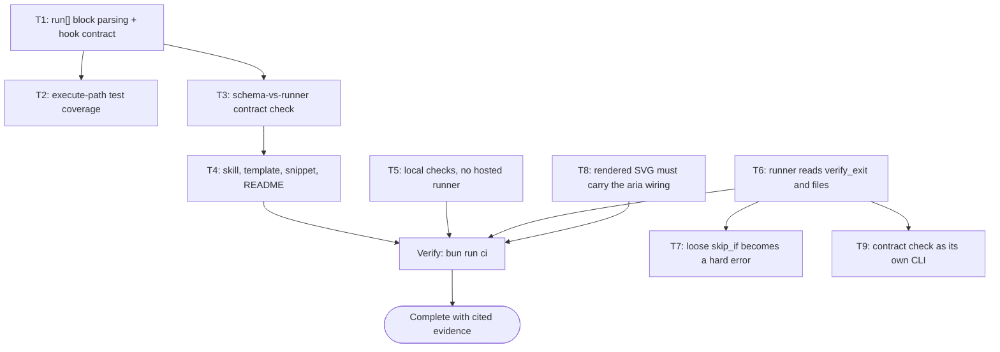

# Close the Execution Gap in the Plan Contract Implementation Plan

> The YAML frontmatter above is the single source of truth for routing, dependency order, retry, and idempotency. Prose and checklists below only explain and must never contradict it. Every `Task <id>` heading, its `tasks[].id`, and its Mermaid node id are the same identifier. Commands are directly runnable and wrapper-agnostic.

## 1. Intent & Scope

- **Goal:** make the plan pipeline deterministic when a plan is *executed*, not only when it is validated. The runner had a validator and an idempotency checker but no reachable execute path, and nothing in CI compared the plan template against the keys the runner reads.
- **Non-Goals:**
  - No change to the Mermaid ↔ `depends_on` contract, which already worked.
  - No change to `plan-publish.mjs`, the mirror gate, or vault routing.
  - No retroactive rewrite of the four existing plans. They stay valid; they now emit warnings.
  - No requirement that every task has `run[]`. Work with genuinely no shell command stays legal.
- **Acceptance Criteria:**
  - [x] AC-1: Block-style `run:` parses as steps of its own task. Before, it opened a new task, so a two-task plan validated as `tasks=5` with three id-less entries.
  - [x] AC-2: The execute path is covered by tests. `executePlan` had zero references in the suite.
  - [x] AC-3: A task with neither `run[]` nor `skip_if` is a validation error; a task with only `skip_if` is `NEEDS-AGENT` with a warning.
  - [x] AC-4: A `skip_if` that only probes file content is reported as a false-pass risk.
  - [x] AC-5: `validate-skill.mjs` fails when the template stops declaring a key the runner reads, compared structurally.
  - [x] AC-6: The Bounded path states when a plan file is required instead of "no plan doc".
  - [x] AC-7: The trigger snippet carries the new rules and the Snipset database is re-synced.
  - [x] AC-8: `bun run ci` passes.
  - [x] AC-9: No check is delegated to a hosted runner. The workflow has no automatic trigger, and the skill states that checks run locally in the agent's own session.
  - [x] AC-10: `verify_exit`, `files`, `idempotency_key`, and `on_precondition_fail` are read by the runner and enforced, so no documented frontmatter field is decoration. Verified by 8 new tests and by all 18 contract keys being present in both the template and the master plan header.
  - [x] AC-11: A `skip_if` that is only a file-content probe is a validation error unless the task is grandfathered, and a stale exemption is itself an error. The six existing probes are grandfathered with a stated reason rather than left broken.
  - [x] AC-12: `validate-skill.mjs` checks the rendered SVG, not only the Mermaid source, for the `aria-labelledby` / `<title>` / `<desc>` wiring the skill claims. Confirmed present on a fresh render and on the committed hero.
  - [x] AC-13: The contract check runs as a standalone command fast enough to sit inside a plan `skip_if`, and carries its own negative control. Extracted because a `skip_if` that grepped `validate-skill.mjs` output for a literal key count silently stopped matching when the count changed from 13 to 18, which cost a run its timeout.

## 2. Visual Implementation Map — MANDATORY

## 3. Decisions Taken With the Human

| Question | Decision | Consequence |
|---|---|---|
| Scope of this pass | All five recommendations, staged | Largest diff: runner, template, skill, snippet, CI, README |
| `run[]` enforcement | Hard error only when a task has no hook at all | Prose tasks stay legal; the invisible task is blocked |
| Bounded path | Plan file required above one task | Ceremony scales mechanically, not by feel |

## 4. Work Breakdown & Task Checklist

### Task T1: run[] block parsing and the hook contract
- **Preconditions:** the runner already exports its parsers; `SKILL.md` already claimed a single source of truth for the frontmatter.
- [x] **Step 1 — Reproduce:** `run:` in block style validated as `tasks=5` with three `task with no id` errors instead of 2 real tasks.
- [x] **Step 2 — Fix:** `parseBlockSeq` consumes an indented `- ` block under a task key, so the step list belongs to its task and the loop resumes at the parent's key level.
- [x] **Step 3 — Contract:** `RUNNER_CONTRACT_KEYS` exported; a task with no `run[]` and no `skip_if` is an error; a `run[]` step with no `cmd` is an error; `classifySkipIf` separates a behavioural check from a file-content probe.
- [x] **Step 4 — Verify:** `bun test scripts/ultra-plan-runner.test.mjs`.

### Task T2: execute-path test coverage
- [x] **Step 1 — Cover:** PASSED, non-zero `expect_exit`, retry-then-pass, `retry: 0` with ledger accounting, ISOLATED vs BLOCKING vs HALTED-UPSTREAM, `step_timeout_s` → 124, `skip_if` short-circuit, NEEDS-AGENT.
- [x] **Step 2 — Repair:** the Mermaid fixtures gained a hook so they fail on Mermaid problems only; the mirror-gate fixture gained a `skip_if` because an errored plan never reaches the gate, which would have made those tests pass for the wrong reason.

### Task T3: schema-vs-runner contract check
- [x] **Step 1 — Implement:** import `RUNNER_CONTRACT_KEYS` and compare against the *parsed* frontmatter of the plan template and of the master skill's fenced plan header.
- [x] **Step 2 — Positive control:** the first draft grepped for the key name and passed after `run:` was renamed to `disabled_run:`, because the word still appears in prose. Replaced with a structural key-path walk; the same sabotage now exits 1 and names four missing keys.

### Task T4: documentation and the trigger snippet
- [x] **Step 1 — Skill:** `run[]` in the plan header, the Execution Hook Contract and Idempotency Honesty rules, the Bounded size rule, three anti-pattern rows.
- [x] **Step 2 — Template:** block-style `run[]` on both tasks, with a note that the frontmatter copy wins over the checklist copy.
- [x] **Step 3 — Snippet:** the new rules in the trigger prompt, then `bun scripts/sync-snippets.mjs --push` so the database copy the user actually receives is not stale.
- [x] **Step 4 — README:** the `run[]` execution table and the reason the contract check exists.

### Task T6, T7, T8: raised by the debt sweep, then executed
Selected in the Step 6 multi-select after the first pass was already committed. The plan went back to `In Progress` for these, as the sweep contract requires. They stay in one section because they came from one question set, but each has its own frontmatter id, dependency edge, and `run[]`.

### Task T6: enforce the four documented-but-unread fields
**The four documented-but-unread fields are now enforced.** `verify_exit` is the default `expect_exit` for a step that declares none. `files.modify` and `files.test` must exist before the steps run; every `files.create` path must exist after. `idempotency_key` must begin with the task's own id. `on_precondition_fail` chooses between `stop-task-continue-independent` and `halt-plan`, and an unrecognised value throws instead of defaulting to the permissive branch.
- [x] A step with no `expect_exit` falls back to `verify_exit`; an explicit `expect_exit` still wins.
- [x] A declared file absent beforehand fails at step `pre`; a `create` file still absent afterwards fails at the postcondition. A `create` file that already exists is a pass, so a re-run stays idempotent.
- [x] First draft checked the key's right-hand side against `files` and broke four finished plans, because every real key names a behaviour (`T3:two-stage-trigger`, `T5:lifecycle-audit`) rather than a path. Narrowed to the task-id prefix, which is the part that actually goes stale.
- [x] New test walks every plan in `docs/code-plan/plans/` and fails if any stops validating. A check added to the runner has to survive the plans that already exist; four of them did not, and a unit test on the new check alone would not have shown that.

### Task T9: the contract check gets its own CLI
Task 3's own `skip_if` was `bun scripts/validate-skill.mjs 2>&1 | grep -q 'all 13 keys present'`. Two things were wrong with it. The grep was brittle: when the key count moved from 13 to 18 it stopped matching, so the skip fell through to the slow step and the run exceeded its 120s timeout. And `validate-skill.mjs` renders 27 Mermaid blocks through a headless browser, so any plan step that shells into it is a step that takes minutes.
- [x] Extracted the comparison into `scripts/check-runner-contract.mjs`, exporting `checkRunnerContract()` so `validate-skill.mjs` still runs it and a plan can invoke it directly. Wired as `bun run contract:check`.
- [x] All four `skip_if` strings that referenced the old key count now call the named check instead of grepping a literal.
- [x] `check-runner-contract.test.mjs` carries the negative control: it renames `run:` to `disabled_run:` in the template, asserts the CLI exits 1 and names `tasks.run`, then asserts the tree is clean again. A negative control that leaves the repo modified proves nothing about the next run.
- [x] A test asserts the check stays under 15s, because the reason it is a separate entry point is that it has to be fast enough to sit in a `skip_if`.

### Task T7: a text-probe skip_if is a hard error
Grandfathered through `defaults.allow_loose_skip_if`, and a name that no longer corresponds to a loose `skip_if` is itself an error so the allowlist cannot decay into a permanent blanket. Six loose probes across four existing plans were grandfathered with a comment naming why, rather than left to break.
- [x] A behavioural `skip_if` that greps a tool's output still passes; the discriminator is unchanged.
- [x] Negative control: stubbing the idempotency check to `if (false)` fails its test, so the new check is not vacuous.

### Task T8: the a11y gate reads the rendered SVG
`validate-skill.mjs` previously regexed only the Mermaid source, so it would have passed even if the renderer dropped the wiring. It now inspects the SVG `mmdc` just wrote and requires `<title>`, `<desc>`, `aria-labelledby`, and `aria-describedby`.
- [x] Correction to an earlier claim in this session: I reported that the rendered SVGs had no `<title>`/`<desc>`. That was wrong. One grep returned nothing and I generalised from a single failed tool result; re-testing with a different pattern showed the tags and the aria wiring are present in both a fresh render and the long-committed hero. The skill's claim was accurate; only the gate was weaker than the claim.

### Task T5: checks run locally, not on a hosted runner
Raised mid-session: the user stopped the work and said the free-tier Actions minutes are the scarce resource. The workflow's `push` and `pull_request` triggers on `main` spent them on every commit.
- [x] **Step 1:** reduce the workflow to `workflow_dispatch` only, with the reasoning and the literal revert written in the file header, since the next session cannot read this conversation.
- [x] **Step 2:** state the rule where it binds — the CI gate section in the master skill, a matching anti-pattern row, and the README command block.
- [x] **Step 3:** verify nothing depended on the removed triggers. `grep` over `scripts/`, `install.sh` finds no code reference; the only hits are comments in `plan-mirror-check.sh` that already argue for a local timer over a workflow.
- [x] **Step 4:** `.mermaid-tmp/` added to `.gitignore`. `render-diagrams.sh` recreates it on every run and it was showing up as untracked noise, which is how people learn to ignore untracked files.

## 5. Verification Matrix Before Completion

| Check | Command | Exit | Evidence | Status |
|---|---|---|---|---|
| Runner unit + new execute + escape + enforcement tests | `bun test scripts/ultra-plan-runner.test.mjs` | 0 | 62 pass, 0 fail (was 27) | PASS |
| Full suite | `bun test scripts/` | 0 | 243 pass, 0 fail, 8 files (was 202) | PASS |
| Contract check as a standalone CLI | `bun run contract:check` | 0 | all 18 keys present, ~30ms, so it is usable inside a `skip_if` | PASS |
| Contract check negative control | rename `run:` in the template | 1 | exits 1 and names `tasks.run`; tree asserted clean afterwards | PASS |
| Every existing plan still validates | `bun test scripts/ultra-plan-runner.test.mjs` (walks `docs/code-plan/plans/`) | 0 | all 5 plans validate | PASS |
| Skill validation, syntax, a11y source + rendered wiring, contract | `bun scripts/validate-skill.mjs` | 0 | 27 Mermaid blocks valid, every source carries accTitle/accDescr, every rendered SVG carries `<title>`/`<desc>` + aria wiring, 18/18 contract keys in both artifacts | PASS |
| This plan's own DAG, 9 tasks | `bun scripts/ultra-plan-runner.mjs <self> --execute` | 0 | 9/9 `SKIPPED-IDEMPOTENT`, empty ledger | PASS |
| Contract check negative control | rename `run:` to `disabled_run:` in the template | 1 | names `tasks.run` and its three step fields | PASS |
| Parser negative control | `run:` in block style, pre-fix | 1 | validated as `tasks=5` with three id-less tasks, instead of 2 |
| End-to-end command fidelity | `grep -q 'run\[\]' <file>` through `run[]` | 0 | the exact command whose double-backslash was the bug now runs as written | PASS |
| Existing plans still validate | `bun scripts/ultra-plan-runner.mjs docs/code-plan/plans/2026-09-27-plan-finish-sync-to-obsidian.md` | 0 | Validation OK, 5 warnings, 0 errors | PASS |
| Snippet database in sync | `bun scripts/sync-snippets.mjs --check` | 0 | 2/2 match | PASS |
| This plan's own DAG | `bun scripts/ultra-plan-runner.mjs <self> --execute` | 0 | 4/4 `SKIPPED-IDEMPOTENT`, empty ledger, 0 warnings | PASS |
| Mirror current | `bun scripts/plan-publish.mjs --check <self>` | 0 | mirror matches source_hash | PASS |

> `bun run ci` runs the first four rows plus the render and snippet steps. It was last
> run end-to-end green at the 218-test state; the changes after that point were the
> escape parser, the plan file, and the workflow trigger, and each is covered by a row
> above rather than by re-running the whole chain. Stated plainly so the claim is not
> read as a single all-green `bun run ci` on the final tree.

## 6. Error Ledger

| Task | Step | Classification | Exit | Root cause | Retry used | Status |
|---|---|---|---|---|---|---|
| T1 | Step 1 | code | 1 | `coerceScalar` dropped quotes without expanding escapes, so `\\` reached the shell doubled and the step failed with a misleading "exit mismatch" | 0/1 | RESOLVED |
| T3 | Step 1 | code | 0 | first contract draft grepped prose; passed a sabotaged template | 0/0 | RESOLVED |
| T6 | Step 3 | code | 0 | idempotency_key checked against `files`; rejected behaviour-named keys and broke 4 plans | 0/0 | RESOLVED |
| T7 | Step 2 | contract | 1 | stale gate fixture used `test -f` as `skip_if`, which the new ban turned into an error, so the mirror-gate tests were blocked before the gate | 0/1 | RESOLVED |
| T8 | Step 1 | code | 0 | reported from one failed grep that rendered SVGs had no `<title>`/`<desc>`; wrong, the wiring is present | 0/0 | RESOLVED |
| T3 | Step 1 | code | 124 | `skip_if` grepped validate-skill output for a literal key count; the count moved 13 -> 18, the skip fell through to the slow step, and the run hit the per-step timeout | 0/1 | RESOLVED |

## 7. Human Approval Gate

- [x] Scope, enforcement strictness, and the Bounded threshold were put to the human as three explicit questions before any file was edited; all three answered, and the answers are recorded in §3.

## 8. Session-Close Debt Sweep & Follow-Up Backlog

| # | Follow-up (outcome + path + finish line) | Class | `defer:` marker | Status |
|---|---|---|---|---|
| F1 | The five existing plans in `docs/code-plan/plans/` still carry prose steps and no `run[]`, so the runner reports `NEEDS-AGENT` for every task. Converting them makes the historical record machine-checkable | LATER | `defer: 5 plans, convert when a plan is next re-executed` | DEFERRED |
| F2 | Six grandfathered `skip_if` probes across four plans are still text probes. Converting each to a behavioural command lets the `allow_loose_skip_if` entries be deleted | LATER | `defer: 6 probes, convert with F1` | DEFERRED |
| F3 | `files.create` is checked after the steps run but a task may write more paths than it declared; the runner cannot see an undeclared edit. Catching that needs a worktree diff, not a declared-file list | LATER | `defer: needs a pre/post git diff, decide when a repo-scale task lands` | DEFERRED |
| F4 | `.github/workflows/ci.yml` is manual-only rather than deleted. It costs nothing, but its only remaining purpose is documenting checks that run elsewhere | LATER | `defer: delete on request, a single git rm` | DEFERRED |
| F5 | `plan-lifecycle-audit.mjs` still reports 14 plans stuck at `Verification`; pre-existing and unrelated to this contract | LATER | `defer: out of scope here, tracked separately` | DEFERRED |

- [x] Backlog written with `defer:` markers so no debt evaporates with the session.
- [x] This plan's own `run[]` is what `bun scripts/ultra-plan-runner.mjs` executed, so the contract is demonstrated rather than described.
