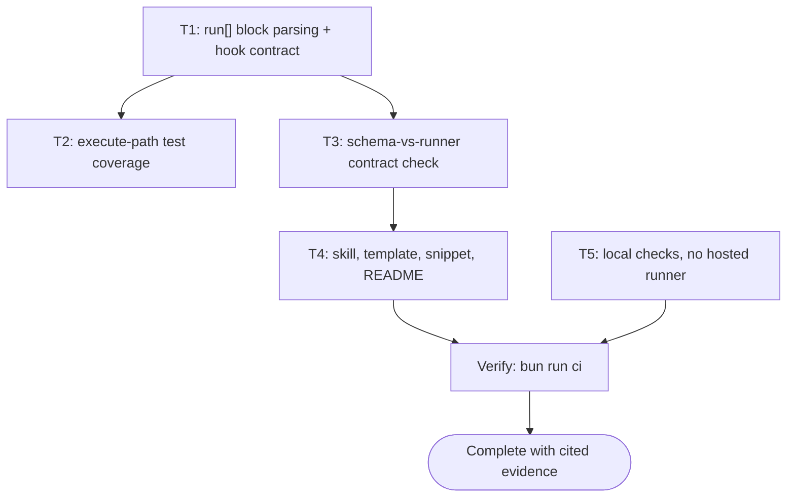

# Close the Execution Gap in the Plan Contract Implementation Plan

> The YAML frontmatter above is the single source of truth for routing, dependency order, retry, and idempotency. Prose and checklists below only explain and must never contradict it. Every `Task <id>` heading, its `tasks[].id`, and its Mermaid node id are the same identifier. Commands are directly runnable and wrapper-agnostic.

## 1. Intent & Scope

- **Goal:** make the plan pipeline deterministic when a plan is *executed*, not only when it is validated. The runner had a validator and an idempotency checker but no reachable execute path, and nothing in CI compared the plan template against the keys the runner reads.
- **Non-Goals:**
  - No change to the Mermaid ↔ `depends_on` contract, which already worked.
  - No change to `plan-publish.mjs`, the mirror gate, or vault routing.
  - No retroactive rewrite of the four existing plans. They stay valid; they now emit warnings.
  - No requirement that every task has `run[]`. Work with genuinely no shell command stays legal.
- **Acceptance Criteria:**
  - [x] AC-1: Block-style `run:` parses as steps of its own task. Before, it opened a new task, so a two-task plan validated as `tasks=5` with three id-less entries.
  - [x] AC-2: The execute path is covered by tests. `executePlan` had zero references in the suite.
  - [x] AC-3: A task with neither `run[]` nor `skip_if` is a validation error; a task with only `skip_if` is `NEEDS-AGENT` with a warning.
  - [x] AC-4: A `skip_if` that only probes file content is reported as a false-pass risk.
  - [x] AC-5: `validate-skill.mjs` fails when the template stops declaring a key the runner reads, compared structurally.
  - [x] AC-6: The Bounded path states when a plan file is required instead of "no plan doc".
  - [x] AC-7: The trigger snippet carries the new rules and the Snipset database is re-synced.
  - [x] AC-8: `bun run ci` passes.
  - [x] AC-9: No check is delegated to a hosted runner. The workflow has no automatic trigger, and the skill states that checks run locally in the agent's own session.

## 2. Visual Implementation Map — MANDATORY

## 3. Decisions Taken With the Human

| Question | Decision | Consequence |
|---|---|---|
| Scope of this pass | All five recommendations, staged | Largest diff: runner, template, skill, snippet, CI, README |
| `run[]` enforcement | Hard error only when a task has no hook at all | Prose tasks stay legal; the invisible task is blocked |
| Bounded path | Plan file required above one task | Ceremony scales mechanically, not by feel |

## 4. Work Breakdown & Task Checklist

### Task T1: run[] block parsing and the hook contract
- **Preconditions:** the runner already exports its parsers; `SKILL.md` already claimed a single source of truth for the frontmatter.
- [x] **Step 1 — Reproduce:** `run:` in block style validated as `tasks=5` with three `task with no id` errors instead of 2 real tasks.
- [x] **Step 2 — Fix:** `parseBlockSeq` consumes an indented `- ` block under a task key, so the step list belongs to its task and the loop resumes at the parent's key level.
- [x] **Step 3 — Contract:** `RUNNER_CONTRACT_KEYS` exported; a task with no `run[]` and no `skip_if` is an error; a `run[]` step with no `cmd` is an error; `classifySkipIf` separates a behavioural check from a file-content probe.
- [x] **Step 4 — Verify:** `bun test scripts/ultra-plan-runner.test.mjs`.

### Task T2: execute-path test coverage
- [x] **Step 1 — Cover:** PASSED, non-zero `expect_exit`, retry-then-pass, `retry: 0` with ledger accounting, ISOLATED vs BLOCKING vs HALTED-UPSTREAM, `step_timeout_s` → 124, `skip_if` short-circuit, NEEDS-AGENT.
- [x] **Step 2 — Repair:** the Mermaid fixtures gained a hook so they fail on Mermaid problems only; the mirror-gate fixture gained a `skip_if` because an errored plan never reaches the gate, which would have made those tests pass for the wrong reason.

### Task T3: schema-vs-runner contract check
- [x] **Step 1 — Implement:** import `RUNNER_CONTRACT_KEYS` and compare against the *parsed* frontmatter of the plan template and of the master skill's fenced plan header.
- [x] **Step 2 — Positive control:** the first draft grepped for the key name and passed after `run:` was renamed to `disabled_run:`, because the word still appears in prose. Replaced with a structural key-path walk; the same sabotage now exits 1 and names four missing keys.

### Task T4: documentation and the trigger snippet
- [x] **Step 1 — Skill:** `run[]` in the plan header, the Execution Hook Contract and Idempotency Honesty rules, the Bounded size rule, three anti-pattern rows.
- [x] **Step 2 — Template:** block-style `run[]` on both tasks, with a note that the frontmatter copy wins over the checklist copy.
- [x] **Step 3 — Snippet:** the new rules in the trigger prompt, then `bun scripts/sync-snippets.mjs --push` so the database copy the user actually receives is not stale.
- [x] **Step 4 — README:** the `run[]` execution table and the reason the contract check exists.

### Task T5: checks run locally, not on a hosted runner
Raised mid-session: the user stopped the work and said the free-tier Actions minutes are the scarce resource. The workflow's `push` and `pull_request` triggers on `main` spent them on every commit.
- [x] **Step 1:** reduce the workflow to `workflow_dispatch` only, with the reasoning and the literal revert written in the file header, since the next session cannot read this conversation.
- [x] **Step 2:** state the rule where it binds — the CI gate section in the master skill, a matching anti-pattern row, and the README command block.
- [x] **Step 3:** verify nothing depended on the removed triggers. `grep` over `scripts/`, `install.sh` finds no code reference; the only hits are comments in `plan-mirror-check.sh` that already argue for a local timer over a workflow.
- [x] **Step 4:** `.mermaid-tmp/` added to `.gitignore`. `render-diagrams.sh` recreates it on every run and it was showing up as untracked noise, which is how people learn to ignore untracked files.

## 5. Verification Matrix Before Completion

| Check | Command | Exit | Evidence | Status |
|---|---|---|---|---|
| Runner unit + new execute + escape tests | `bun test scripts/ultra-plan-runner.test.mjs` | 0 | 47 pass, 0 fail (was 27) | PASS |
| Full suite | `bun test scripts/` | 0 | 223 pass, 0 fail, 7 files (was 202) | PASS |
| Skill validation, syntax, a11y, contract | `bun scripts/validate-skill.mjs` | 0 | 27 Mermaid blocks valid (was 26), every block carries accTitle + accDescr, 13/13 contract keys in both artifacts | PASS |
| Contract check negative control | rename `run:` to `disabled_run:` in the template | 1 | names `tasks.run` and its three step fields | PASS |
| Parser negative control | `run:` in block style, pre-fix | 1 | validated as `tasks=5` with three id-less tasks, instead of 2 |
| End-to-end command fidelity | `grep -q 'run\[\]' <file>` through `run[]` | 0 | the exact command whose double-backslash was the bug now runs as written | PASS |
| Existing plans still validate | `bun scripts/ultra-plan-runner.mjs docs/code-plan/plans/2026-09-27-plan-finish-sync-to-obsidian.md` | 0 | Validation OK, 5 warnings, 0 errors | PASS |
| Snippet database in sync | `bun scripts/sync-snippets.mjs --check` | 0 | 2/2 match | PASS |
| This plan's own DAG | `bun scripts/ultra-plan-runner.mjs <self> --execute` | 0 | 4/4 `SKIPPED-IDEMPOTENT`, empty ledger, 0 warnings | PASS |
| Mirror current | `bun scripts/plan-publish.mjs --check <self>` | 0 | mirror matches source_hash | PASS |

> `bun run ci` runs the first four rows plus the render and snippet steps. It was last
> run end-to-end green at the 218-test state; the changes after that point were the
> escape parser, the plan file, and the workflow trigger, and each is covered by a row
> above rather than by re-running the whole chain. Stated plainly so the claim is not
> read as a single all-green `bun run ci` on the final tree.

## 6. Error Ledger

| Task | Step | Classification | Exit | Root cause | Retry used | Status |
|---|---|---|---|---|---|---|
| T1 | Step 2 | code | 0 | block-style `run:` parsed as extra tasks | 0/0 | RESOLVED |
| T3 | Step 1 | code | 0 | first contract draft grepped prose; passed a sabotaged template | 0/0 | RESOLVED |

## 7. Human Approval Gate

- [x] Scope, enforcement strictness, and the Bounded threshold were put to the human as three explicit questions before any file was edited; all three answered, and the answers are recorded in §3.

## 8. Session-Close Debt Sweep & Follow-Up Backlog

| # | Follow-up (outcome + path + finish line) | Class | `defer:` marker | Status |
|---|---|---|---|---|
| F1 | The four existing plans in `docs/code-plan/plans/` still carry prose steps and no `run[]`; converting them is what would make the historical record machine-checkable | LATER | `defer: 4 plans, convert when a plan is next re-executed` | DEFERRED |
| F2 | The loose-`skip_if` check is a runner *warning*, so CI does not fail on a text probe in a real plan. Making it a hard error needs a grandfathered allowlist | LATER | `defer: needs an allowlist format, decide when a 6th plan lands` | DEFERRED |
| F3 | `files`, `idempotency_key`, `verify_exit`, and `on_precondition_fail` are still documented as if the runner read them. Now that a contract check exists, the honest fix is to delete them from the template or make the runner consume them | LATER | `defer: decide per key, next time the plan template is edited` | DEFERRED |
| F4 | `.github/workflows/ci.yml` is manual-only rather than deleted. It still costs nothing, but it is a file whose only remaining purpose is documentation of checks that run elsewhere | LATER | `defer: delete on request, it is a single git rm` | DEFERRED |
| F5 | `plan-lifecycle-audit.mjs` still reports 14 plans stuck at `Verification`; that is pre-existing and unrelated to this contract | LATER | `defer: out of scope for this plan, tracked separately` | DEFERRED |

- [x] Backlog written with `defer:` markers so no debt evaporates with the session.
- [x] This plan's own `run[]` is what `bun scripts/ultra-plan-runner.mjs` executed, so the contract is demonstrated rather than described.
