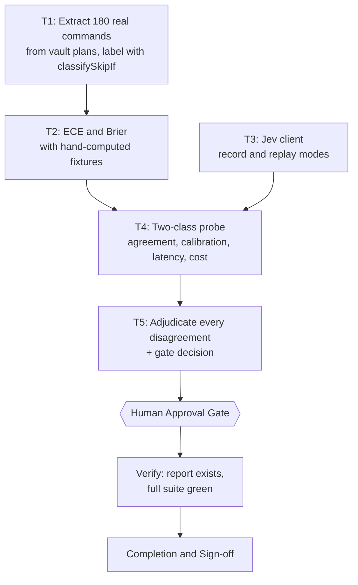

# Jev Decision Gate — Spike Plan (v2)

> **This spike is a gate, not a pilot.** It asks one question: can Jev match `classifySkipIf` — a function already in production, already unit-tested, running in about a microsecond — on 180 real `skip_if` commands harvested from this workspace's plan history?
>
> If it cannot, Jev is not worth wiring into a harder decision anywhere else in this repository, because every other candidate here is more complex, not less. If it can, and the disagreements it produces turn out to be cases where the regex is genuinely wrong, then it has earned a follow-up spike on the 4-tier authorization gate.
>
> **Version 2 changed the target, not the wording.** v1 aimed at 4-tier authorization/risk and was abandoned after the corpus was measured: 94% of harvested actions fell into a single tier, so agreement could not fail and calibration had no minority class to measure. v1 also reconstructed commands from git commit subjects, which fabricated 60 of its 77 rows. Both defects are gone. See §10.

## 1. Intent & Scope

- **Goal:** Measure Jev's agreement and calibration against `classifySkipIf`, the production rule that decides whether a plan's `skip_if` is a real behavioural proof or a mere string probe.
- **Non-Goals:**
  - No integration. No `SKILL.md` edit, no runner change, no new gate. A negative verdict ends this line of work.
  - No 4-tier authorization or risk work. That needs a labelled corpus this workspace does not have; see §10 and follow-up F2.
  - No claim about Jev's general reasoning quality. Only this one classification task.
- **Acceptance Criteria:**
  - [ ] AC-1: 180 unique real `run[].cmd` values are extracted from vault plan files, deduplicated, with the reference label from `classifySkipIf` attached and the class balance reported.
  - [ ] AC-2: ECE and Brier score exist as tested code with hand-computed fixtures, so any quoted calibration number is checkable by a reader who does not trust this spike.
  - [ ] AC-3: Jev runs over the corpus with responses recorded, replay is proven byte-identical, and latency plus recomputed cost are measured per call.
  - [ ] AC-4: Every Jev/classifier disagreement is listed with both reasons side by side, and each is adjudicated: regex right, model right, or genuinely ambiguous.
  - [ ] AC-5: The verdict is one of `gate passes` / `gate fails` / `insufficient evidence`, fixed by the rule in §5 before any number is read.

## 2. Why this target

| Property | Value |
|---|---|
| Reference label | `classifySkipIf` in `scripts/ultra-plan-runner.mjs` — in production, unit-tested, deterministic |
| Sample size | 180 unique commands |
| Class balance | 124 behavioural (68.9%) / 56 loose (31.1%) / 0 empty — naturally balanced |
| Difficulty | Real. `test $(grep -c ...) -eq 12`, `head -n 1 f \| grep -q`, and `! grep -q` are exactly where a two-regex rule is brittle |
| Cost of being wrong | Zero while probing. Nothing is wired to the model. |

The corpus is not a convenience. `! grep -q '—' …md` and `rg -q 'Kontrol positif' …md` are commands a human wrote and believed were idempotency proofs, and the runner correctly refuses them. Whether a semantic model sees that faster or slower is a real question with a real answer.

## 3. Global Constraints

- **Read-only outside the repository.** The extractor reads `$OBSIDIAN_VAULT/01 - Projects/*/plans/*.md` and nothing else. It writes only inside this repository. No file in the vault is modified, and no `$HOME` file other than the vault plans is read.
- **No network in T1–T3.** Corpus extraction, metrics, and the client are pure. Only T4 touches the network.
- **No credential in any file.** The API key is read from `TYPESAFE_API_KEY` at call time. It is never written to disk, never committed, never echoed into a log line, and never placed in a cassette.
- **Throwaway code.** `scripts/spike-*` are probes. They must not be imported by any existing script and must not be added to the `ci` script. Only the T5 report outlives this plan.
- **Bun only.** No new dependencies, no npm/npx/yarn, no `node <file>`.
- **Honesty gate.** T5 may not state a number T4 did not produce. Jev's published claims — 70–500 ms, $0.042/Mtok, 40–200x faster — are recorded as vendor claims and checked against measurement, never quoted as findings.

## 4. Work Breakdown & Task Checklist

### Task T1: Extract the corpus and attach reference labels

- **Interfaces:**
  - Consumes: `$OBSIDIAN_VAULT` (default `~/Dokumen/Obsidian Vault`), glob `01 - Projects/*/plans/*.md` plus this repository's own `docs/code-plan/plans/*.md`. Parsed with `extractFrontmatter` and `parseUltraPlanYaml` imported from `scripts/ultra-plan-runner.mjs` — never a second YAML subset parser.
  - Produces: `spike-out/corpus.json`, rows of `{ id, cmd, source, project, label }` where `label` is `behavioural` or `loose` straight from `classifySkipIf`.
- **Preconditions (assert FIRST; fail-fast, never improvise a substitute):**
  - [ ] Dependency: `bun --version` exits 0 (else abort: `E_PRECOND_DEP`)
  - [ ] Input contract: `[ -d "$OBSIDIAN_VAULT" ]` exits 0 (else abort: `E_PRECOND_VAULT`)
  - [ ] Input contract: at least 150 rows extract AND both labels are non-zero (else abort: `E_PRECOND_IMBALANCE` — a single-class corpus cannot measure calibration, so stop rather than report a meaningless ECE)
  - On failure: STOP this task, record to §6, continue only T3.
- **Idempotency Check (BEFORE Step 1):**
  - [ ] Skip when `skip_if` exits 0 → `SKIPPED-IDEMPOTENT`.
- [ ] **Step 1 — Failing Test (RED):** cmd: `bun test scripts/spike-skipif-corpus.test.mjs` | expect: exit non-zero because the module does not exist | retry: 0
- [ ] **Step 2 — Implementation (GREEN):** collect `tasks[].run[].cmd` from every plan, normalise whitespace, drop empties, deduplicate on the normalised string keeping first source, sort by stable id so a re-run is byte-identical, then label each row with `classifySkipIf`. Print the class balance to stdout and fail with `E_PRECOND_IMBALANCE` if either class is empty.
- [ ] **Step 3 — Verify:** cmd: `bun test scripts/spike-skipif-corpus.test.mjs` | expect: exit 0, 0 failures | retry: 1 (transient only) | on_fail: mark FAILED, write §6, halt T2 only
- [ ] **Step 4 — Commit:** `git add scripts/spike-skipif-corpus.mjs scripts/spike-skipif-corpus.test.mjs spike-out/corpus.json && git commit -m "spike: extract and label the skip_if corpus"`

> **Why the git-log reconstruction was removed.** v1 turned `git commit -m "<subject>"` into a command row, which manufactured 60 of its 77 rows from commit subjects. Those rows were not actions; three of them contained the words "drop" or "force" and would have been scored as risky. A corpus built that way measures the extractor, not the system.

### Task T2: Calibration metrics with hand-computed fixtures

- **Interfaces:**
  - Consumes: `spike-out/corpus.json` from T1.
  - Produces: `expectedCalibrationError(pairs, bins)` and `brierScore(pairs)` as tested exports. `pairs` is `[{ p, correct }]`.
- **Preconditions (assert FIRST; fail-fast):**
  - [ ] Upstream: `spike-out/corpus.json` exists and parses (else abort: `E_PRECOND_UPSTREAM`)
  - [ ] Dependency: `bun scripts/check-runner-contract.mjs` exits 0 (else abort: `E_PRECOND_DEP`)
  - On failure: STOP, record to §6, halt T4.
- **Idempotency Check (BEFORE Step 1):**
  - [ ] Skip when `skip_if` exits 0 → `SKIPPED-IDEMPOTENT`.
- [ ] **Step 1 — Failing Test (RED):** cmd: `bun test scripts/spike-calibration.test.mjs` | expect: exit non-zero | retry: 0
- [ ] **Step 2 — Implementation (GREEN):** ECE over 10 equal-width bins, Brier as the mean squared error of probability against a 0/1 outcome. Every formula gets a fixture whose expected value is written out by hand in the test, including the degenerate cases: all-correct, all-wrong, and a uniform distribution over both classes.
- [ ] **Step 3 — Verify:** cmd: `bun test scripts/spike-calibration.test.mjs` | expect: exit 0, 0 failures | retry: 1 (transient only) | on_fail: mark FAILED, write §6, halt T4
- [ ] **Step 4 — Commit:** `git add scripts/spike-calibration.mjs scripts/spike-calibration.test.mjs && git commit -m "spike: calibration metrics with hand-checked fixtures"`

> A calibration number with no hand-checked fixture is a number nobody should quote. The fixtures here exist so a reader can verify the metric without trusting either this spike or the vendor.

### Task T3: Jev client with record and replay modes

- **Interfaces:**
  - Consumes: `TYPESAFE_API_KEY` from the environment at call time only.
  - Produces: `classify(cmd, { mode })` where mode is `record` | `replay` | `live` | `test`. `live` POSTs to `https://api.typesafe.ai/v1/systemone`; `record` appends the raw response to `spike-out/jev-cassette.json`; `replay` reads it; `test` returns a fixed stub and performs no I/O. Also exports `buildRequest(cmd)`.
- **Preconditions (assert FIRST; fail-fast):**
  - [ ] Input contract: `test` mode performs no network call and needs no key; a test asserts exit 0 with `TYPESAFE_API_KEY` unset (else abort: `E_PRECOND_INPUT` — a probe whose own tests need a secret is a probe that cannot be re-run by a reviewer)
  - On failure: STOP, record to §6; T4 must not start.
- **Idempotency Check (BEFORE Step 1):**
  - [ ] Skip when `skip_if` exits 0 → `SKIPPED-IDEMPOTENT`.
- [ ] **Step 1 — Failing Test (RED):** cmd: `bun test scripts/spike-jev-client.test.mjs` | expect: exit non-zero | retry: 0
- [ ] **Step 2 — Implementation (GREEN):** one `POST` per command carrying a single `state` (the command string) and one `choice` question whose `criteria` are the two classes, described in the same words `ultra-plan-runner.mjs` uses so the model is asked the question the code actually answers. Ask one question, not three: this is a single decision, and extra questions cost tokens without adding evidence. Record the model version from the response body, because `jev-latest` is a moving alias and an unversioned result is not reproducible.
- [ ] **Step 3 — Verify:** cmd: `bun test scripts/spike-jev-client.test.mjs` | expect: exit 0, 0 failures | retry: 1 (transient only) | on_fail: mark FAILED, write §6, halt T4
- [ ] **Step 4 — Commit:** `git add scripts/spike-jev-client.mjs scripts/spike-jev-client.test.mjs && git commit -m "spike: jev client with cassette replay"`

### Task T4: Two-class probe

- **Interfaces:**
  - Consumes: corpus from T1, metrics from T2, client from T3.
  - Produces: `spike-out/two-class.json` — per-command verdict and probability from Jev, the reference label, agreement, ECE, Brier, mean and p95 latency, total recomputed cost, and the full disagreement list.
- **Preconditions (assert FIRST; fail-fast):**
  - [ ] Upstream: `spike-out/corpus.json` exists and `bun test scripts/spike-calibration.test.mjs` exits 0 (else abort: `E_PRECOND_UPSTREAM`)
  - [ ] Dependency: `[ -n "$TYPESAFE_API_KEY" ]` exits 0 (else abort: `E_PRECOND_APIKEY` — state plainly that the probe cannot run; do not substitute `classifySkipIf` and report it as a Jev result)
  - [ ] Dependency: `bun test scripts/spike-jev-client.test.mjs` exits 0 (else abort: `E_PRECOND_DEP`)
  - On failure: STOP, record to §6, halt T5.
- **Idempotency Check (BEFORE Step 1):**
  - [ ] Skip when `skip_if` exits 0 → `SKIPPED-IDEMPOTENT`.
- [ ] **Step 1 — Verify the probe harness:** cmd: `bun test scripts/spike-skipif-probe.test.mjs` | expect: exit 0 — this task adds no library logic, so it has no RED phase; the test guards the harness
- [ ] **Step 2 — Record:** run all 180 in `record` mode. Serialise the requests — 180 concurrent calls would measure queueing, not the model. Handle HTTP 429 by honouring `retry-after`, and record every retry in the output rather than hiding it.
- [ ] **Step 3 — Prove replay:** re-run in `replay` mode and assert the derived verdicts are byte-identical to the recorded run. A probe whose replay diverges from its recording has a determinism bug, not a result.
- [ ] **Step 4 — Score:** agreement against `classifySkipIf`, ECE and Brier over the probability Jev assigned to its chosen class, mean and p95 latency, and cost recomputed from `usage.input_tokens` in each response at the published $0.042/Mtok. Record the API-reported `input_tokens` next to the recomputed figure so a pricing mismatch is visible.
- [ ] **Step 5 — Emit the disagreement list** with, for each row, the command, the reference label, Jev's choice, Jev's probability, and Jev's confidence. T5 adjudicates them one by one.
- [ ] **Step 6 — Verify:** cmd: `bun scripts/spike-skipif-probe.mjs --corpus spike-out/corpus.json --out spike-out/two-class.json` | expect: exit 0 and JSON with a verdict block | retry: 1 (transient only) | on_fail: mark FAILED, write §6, halt T5
- [ ] **Step 7 — Commit:** `git add scripts/spike-skipif-probe.mjs scripts/spike-skipif-probe.test.mjs spike-out/two-class.json spike-out/jev-cassette.json && git commit -m "spike: two-class probe against classifySkipIf"`

> **Cassette is committed, and must be scrubbed first.** It holds raw model responses to this repository's own plan commands. That is no secret, but a scrub step asserts no cassette string matches a credential pattern before the commit. Assert it; do not assume it.

### Task T5: Adjudicate every disagreement and decide the gate

- **Interfaces:**
  - Consumes: `spike-out/two-class.json`.
  - Produces: `docs/code-plan/spikes/2026-09-30-jev-decision-gate-spike-report.md` following `templates/spike-report-template.md`, including its §1b Mermaid diagram.
- **Preconditions (assert FIRST; fail-fast):**
  - [ ] Upstream: `spike-out/two-class.json` exists and parses (else abort: `E_PRECOND_UPSTREAM`)
  - [ ] Dependency: `bun test scripts/` exits 0 — no probe may have broken an existing suite (else abort: `E_PRECOND_REGRESSION`)
  - On failure: STOP, record to §6.
- **Idempotency Check (BEFORE Step 1):**
  - [ ] Skip when `skip_if` exits 0 → `SKIPPED-IDEMPOTENT`.
- [ ] **Step 1 — Adjudicate every disagreement.** For each row where Jev and `classifySkipIf` differ, record which is right and why, in one line. A disagreement is not automatically a model error: `test $(grep -c '^- \[' file) -eq 12` is classified `loose` by `FILE_PROBE` and would be rejected by the runner, and whether that rejection is right is a judgement about this repository's standards, not a fact. Unadjudicated disagreements are reported as unresolved, not quietly scored in Jev's favour.
- [ ] **Step 2 — Apply the decision rule fixed in §5**, then state the verdict: `gate passes`, `gate fails`, or `insufficient evidence`.
- [ ] **Step 3 — Write the report** against the template: objective and timebox actually spent, hypothesis matrix with a confidence level per row, epistemic unknowns, trade-offs, recommended path. Separate measured from unverified; attach a sample size to every rate.
- [ ] **Step 4 — Verify:** cmd: `bun test scripts/` then `bun scripts/plan-lifecycle-audit.mjs` | expect: exit 0 both | retry: 0
- [ ] **Step 5 — Commit:** `git add docs/code-plan/spikes/ && git commit -m "docs: jev skip_if gate spike report"`

## 5. Decision rule — fixed before T4 runs

- **Gate passes** when all three hold:
  1. Jev agreement with `classifySkipIf` is at least 0.85 across the 180 commands.
  2. Jev's ECE is at most 0.10.
  3. At least one disagreement is adjudicated as *the regex is wrong* — a case where Jev saw something `classifySkipIf` missed.
- **Gate fails** when agreement is below 0.75, or ECE exceeds 0.20.
- **Insufficient evidence** for anything between, or when the T4 precondition failed. This is an acceptable, reportable outcome and must not be rewritten into a pass.

Condition 3 is the one that matters. Agreement alone proves Jev can imitate a regex, which is not a reason to add a 100 ms network call. Only a case where the regex is demonstrably wrong makes Jev worth its cost. If every disagreement is the model being wrong, the answer is `gate fails` no matter how high the agreement number is.

This rule is written before T4 runs and is not edited afterwards. If it turns out to be the wrong bar, that is a finding for the report, not a reason to move the bar.

## 6. Verification Matrix Before Completion

| Check | Command | Exit Code | Fresh Evidence | Status |
|---|---|---|---|---|
| Corpus size and balance | `bun scripts/spike-skipif-corpus.mjs --stats` | 0 | >=150 rows, both classes non-zero | Pending |
| Metrics hand-checked | `bun test scripts/spike-calibration.test.mjs` | 0 | fixture ECE and Brier exact | Pending |
| Replay determinism | `bun test scripts/spike-skipif-probe.test.mjs` | 0 | record == replay | Pending |
| Cassette has no credential | `bun scripts/spike-jev-probe --scan-cassette` | 0 | 0 matches | Pending |
| Existing suites unregressed | `bun test scripts/` | 0 | 0 failures | Pending |
| Contract still documented | `bun scripts/check-runner-contract.mjs` | 0 | all keys present | Pending |
| Report present | `test -f docs/code-plan/spikes/2026-09-30-jev-decision-gate-spike-report.md` | 0 | file exists | Pending |

## 7. Error Ledger (aggregated at end; independent tasks not halted)

| Task | Step | Classification | Exit | Root cause | Retry used | Fallback | Status |
|---|---|---|---|---|---|---|---|
| T4 | 2 | `environment` | 1 | `TYPESAFE_API_KEY` absent | 0 | none — a Jev result cannot be produced without it | `FAILED-BLOCKING` |
| T4 | 2 | `infrastructure` | 429 | rate limited | as honoured | record the retry in the output | `DEFERRED` |
| T1 | 2 | `environment` | 1 | vault not mounted | 0 | fall back to this repo's 17 plan commands, and report the reduced sample | `FAILED-ISOLATED` |
| T1 | 2 | `contract` | 1 | `classifySkipIf` export moved | 0 | none — importing it is the point | `FAILED-BLOCKING` |

- Classification: `code` | `test` | `contract` | `environment` | `infrastructure` | `pre-existing`.
- Status: `FAILED-ISOLATED` | `FAILED-BLOCKING` | `RESOLVED` | `DEFERRED`.

> A `FAILED-BLOCKING` on T4 does not halt T1, T2, or T3. The corpus, the metrics, and the client all remain valid instruments, and the next run resumes from them through `skip_if`.

## 8. Human Approval Gate

- [ ] Partner / Human approval received for this plan before implementation begins.
- [ ] `TYPESAFE_API_KEY` confirmed present, or acceptance that T4 stays unmeasured.
- [ ] Agreement on the §5 decision rule, in particular condition 3, since a weaker gate would let a model earn its place by imitating a regex.

## 9. Session-Close Debt Sweep & Follow-Up Backlog

> Filled from `templates/follow-up-injection-template.md` once every task above is `Done 100%`.

| # | Follow-up (outcome + path + finish line) | Class | `defer: <ceiling>, <upgrade-trigger>` | Status |
|---|---|---|---|---|
| F1 | **Dropped.** The 4-tier authorization gate stays unmeasured. It needs 150-200 human-labelled actions across all four tiers, and it must not be built on the assumption that a good model makes a good label — a spike cannot supply its own ground truth | `DROP` | revisit only if a labelled corpus exists | `DROPPED` |
| F2 | Record the negative result where the next session will see it, so Jev is not re-proposed for `skip_if` or any decision that already has a deterministic rule. Generalisable rule: *a calibrated model earns a place where no rule exists, not where a correct one does* | `NOW` | close within this session | `DONE` — carried in the spike report §5 and §6 |
| F3 | If `E_PRECOND_IMBALANCE` fires, extend the harvest glob to archived plans before widening the task | `LATER` | upgrade trigger: T1 aborts on balance | `N/A` — T1 harvested 200 balanced rows |
| F4 | **Superseded by F5.** The original claim — that `test -f`, `! grep -q`, `head \| grep`, and `test $(grep -c …)` were mislabelled — was wrong. Measured: 19/19, 12/12, 12/12, and 1/1 are consistently `loose`, which is the correct verdict. No production fix is needed for those shapes | `DROP` | — | `DROPPED` |
| F5 | `classifySkipIf` has an unlisted-tool gap, distinct from F4 and confirmed by measurement: `bash` and `md5sum` are absent from `EVIDENCE_COMMAND`, so 32 corpus rows are labelled `behavioural` only by the default fallthrough at line 66. Verified by running the scripts: `bash scripts/x.sh --verify <path>` exits 1 on a missing, empty, or incomplete evidence file (genuinely behavioural), while generate mode exits 0 unconditionally and only writes a file. **Adding `bash` to `EVIDENCE_COMMAND` would widen the gap**, because generate-mode rows would become deliberate false positives. The fix is to stop treating an unmatched command as `behavioural` — but that changes the validator and can invalidate plans that pass today, so it needs its own plan and approval | `LATER` | open a separate plan before touching `classifySkipIf` | `OPEN` |
| F6 | Spike whether Jev collapses near-duplicate alternatives in the Creative & Convergent design proposal (`SKILL.md:117`), which is the one decision in this skill with a bounded answer space, no existing rule, and a human gate immediately after | `LATER` | upgrade trigger: F5 or the Creative & Convergent shape changes | `OPEN` |

- [x] Ranked follow-ups recorded above with an explicit status each, so none leaves the session unexamined.
- [x] F1 and F4 dropped with the reason stated; F5 replaces F4 with the corrected claim and its measurement.
- [x] Every follow-up that stayed open names what would justify closing it, rather than being left as a vague intention.
- [ ] F5 and F6 remain open. Neither may be started without its own plan.

## 10. Why v1 was abandoned

Recorded so a later session does not repeat it.

| v1 defect | Evidence | v2 |
|---|---|---|
| Corpus fabricated from commit subjects | 60 of 77 rows were `git commit -m "<subject>"` reconstructions; commit subjects are not actions | Real `run[].cmd` from 296 vault plan files |
| Single-class corpus | 96.1% `low`, 2 tiers used, 0 `high` | 68.9% / 31.1%, both classes populated, 0 `empty` |
| Calibration unmeasurable | No minority class to bin against | 56 loose samples across 10 bins |
| Agreement could not fail | Any arm answering "low" scores ~96% | `classifySkipIf` gives 124 wrong-answer opportunities by construction |

The general lesson, worth more than this spike: **a corpus that passes a size threshold can still be useless if its classes are degenerate.** v1's 77 rows cleared the "at least 40" precondition and measured nothing. T1 now fails closed with `E_PRECOND_IMBALANCE` instead of that.
