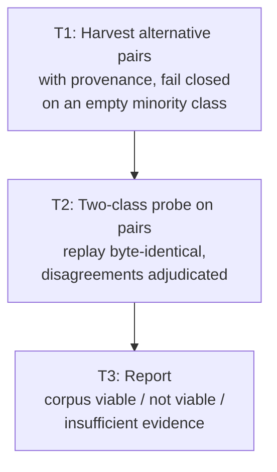
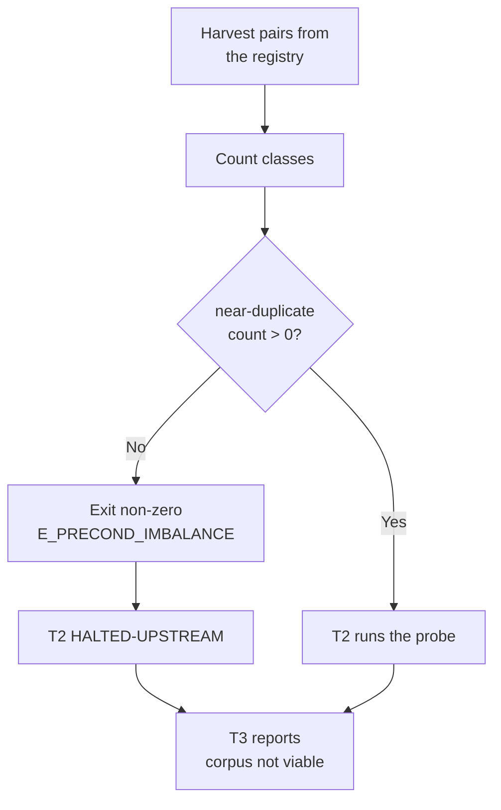

# Can a Jev dedupe corpus exist at all?

> **This plan executes F6 of `docs/code-plan/plans/2026-09-30-jev-decision-gate-spike.md` up to its own precondition.**
>
> F6 asks whether Jev collapses near-duplicate alternatives in the Creative & Convergent output (`Super Ultra Code Plan Implementation.md:117`). The finished spike recommended it on the reasoning that the answer space is defined by the agent at call time, so no corpus needs to exist in advance.
>
> That reasoning holds for *wiring Jev in*. It does not hold for *measuring whether Jev works*, which is what a spike is. A spike needs a labelled corpus, and a corpus needs near-duplicate pairs. **Measurement on 2026-09-30 found 4 real within-set pairs in the entire registry, and all 4 are genuinely distinct approaches — the minority class is empty.** §2 has the numbers.
>
> So this plan is not "spike Jev on the dedupe task". It is: *harvest what exists, fail closed when the minority class is empty, and report whether this measurement is possible at all.* If it is not, the honest output is a negative result with a named unblocking condition — which is the same shape as F1, dropped for the same reason.

## 1. Intent & Scope

- **Goal:** Establish, by measurement, whether a labelled corpus of design-alternative pairs exists in this workspace. If it does, probe Jev on it. If it does not, say so with the count that proves it and name what would change the answer.
- **Non-Goals:**
  - No integration. No `SKILL.md` edit, no runner change, no new gate. This plan produces a report or nothing.
  - **No fabricated pairs.** A paraphrased restatement of an existing alternative is a synthetic row, and this plan will not count one as evidence. §4 states the test a row must pass to be admitted.
  - No claim about Jev's ability to collapse near-duplicates. If the corpus cannot be built, that question stays open and this report says so rather than guessing.
  - No re-litigation of the `skip_if` verdict. That is settled and recorded.
- **Acceptance Criteria:**
- [x] **AC-1:** Every alternative-pair candidate in the registry is harvested, with its source plan and task id, and the class balance is reported as a count. No row is admitted without a provenance string pointing at a real file. — *Met with one stated narrowing: provenance is `sourceA`/`sourceB` = `<absolute plan path>#<option letter>`, not a task id. Alternatives are scoped to a plan's design section, not to a `run[]` task, so there is no task id to record; inventing one would be a fabricated provenance string. The class balance is printed by the CLI and asserted by `the measured harvest matches what the plan recorded`.*
  - [x] **AC-2:** The harvester exits non-zero with `E_PRECOND_IMBALANCE` when the `near-duplicate` class is empty, exactly as `spike-skipif-corpus.mjs:137` does for its own corpus. A degenerate corpus is refused, not emitted with a warning. — *Met. Real run exited 1, wrote nothing; `the CLI exits non-zero and writes nothing on a degenerate corpus` and `the balance check would exit zero on a populated corpus` cover both directions.*
  - [x] **AC-3:** A synthetic row is mechanically distinguishable from a harvested one — a `synthetic: true` field and a corpus-level count — so no reader can mistake one for the other, including in this report's own tables. — *Met. The field and count exist and `synthetic rows are excluded from every count and can never pad the minority class` locks the exclusion; the real corpus has `synthetic: 0`, asserted by `no row in the real corpus is synthetic`.*
  - [x] **AC-4:** If and only if the corpus is non-degenerate, Jev is probed over it with the client and metrics from the finished spike, replay proven byte-identical, and every disagreement adjudicated. — *Met vacuously and correctly: the corpus is degenerate, so the antecedent is false and T2 was never entered. No `spike-alt-probe` was written, because writing a probe for a corpus that cannot exist would be the file a later reader mistakes for a result.*
  - [x] **AC-5:** The report states one of `corpus viable, probe run` / `corpus not viable` / `insufficient evidence`, fixed by the rule in §5 before any number is read. `corpus not viable` is a successful outcome of this plan, not a failure of it. — *Met. The report states `corpus not viable`; §5 was written before T1 ran and was not edited.*

## 2. What measurement found — and how

Baseline, run 2026-09-30 against the registry in `plans.publish.json` (294 plans enumerated), parsing alternative text with an explicit-shape regex and requiring a body of at least 40 characters so a bare `Option A:` label is not counted as an alternative.

```
plans enumerated                              294
with an explicit trade-offs / options SECTION  14
with a "Recommendation:" line                   1
with >= 2 real alternative TEXTS                2     <- the ceiling
```

Every real alternative in the workspace, in full:

| Set | Alternatives |
|---|---|
| `Snipset  2026-09-06-clipboard-profanity-filter.md` | A: add words to `SENSITIVE_PATTERNS` · B: independent deterministic detector + persisted per-entry policy · C: local/cloud language model |
| `Snipset  2026-09-17-website-release-pinning-followup-implementation-plan.md` | A: restore `scripts/coverage/assert-thresholds.mjs` · B: remove the `assert-thresholds` reference from `package.json:17` and `test/ci-website-gates.test.ts:42-50` |

From 5 texts: **4 within-set pairs** (3+1) and 6 cross-set pairs.

| Pair source | Count | Class, adjudicated by reading |
|---|---|---|
| Within-set, clipboard-profanity A–B, A–C, B–C | 3 | **distinct** — different mechanism each: a lookup table, a detector with policy, a model |
| Within-set, release-pinning A–B | 1 | **distinct** — restore the gate vs delete the gate; opposite actions |
| Cross-set | 6 | **distinct** — unrelated topics, trivially so |

```
near-duplicate pairs:  0
distinct pairs:       10
```

**The minority class is empty, so calibration is unmeasurable and agreement is uninformative.** A model that answered `distinct` to all 10 would score 1.00 agreement, and that number would mean nothing — it is the class prior, not the model. This is precisely the defect that killed version 1 of the parent spike, which shipped a 77-row corpus with 96.1% in one class and "measured nothing" (`2026-09-30-jev-decision-gate-spike-report.md` §10). F1, the 4-tier authorization gate, was dropped for the same reason. **F6 is about to be dropped for the same reason, and the only honest way to find that out is to run the count rather than assume it.**

### Why a near-duplicate pair is the hard part, not the alternative

The obvious move is to paraphrase an existing alternative — "add words to `SENSITIVE_PATTERNS`" restated as "extend the `SENSITIVE_PATTERNS` list" — and call it a near-duplicate pair. That row would be trivially separable by string overlap, and a 6-line cosine or Jaccard baseline would score 1.00 on it. It would measure the baseline, not Jev, and the resulting report would recommend a 273 ms network call to outperform arithmetic.

So even a successful harvest of real alternatives would not settle the question, unless the pairs that exist are *hard* pairs: two texts that use different words and a different sentence structure to arrive at the same design. The finished spike found exactly one such case in 200 commands, and it needed a human to adjudicate it. A corpus of near-duplicates that a human must first *create* is not a corpus; it is a labelling project with no ground truth to check the labels against.

## 3. Visual Implementation Map



T2 is reached only when T1's balance check passes. When it does not, T2 is `HALTED-UPSTREAM` and T3 still runs — recording a negative result is the deliverable in that branch, and a plan that cannot report "no" cannot report "yes" either.



## 4. Global Constraints

- **The admission test for a row, stated before T1 runs.** A harvested pair is admitted only if both texts come from the same alternative set in a real plan file, and a human-readable adjudication of `near-duplicate` or `distinct` is recorded per row. A row built by rewriting, paraphrasing, truncating, or synthesising an alternative is marked `synthetic: true`, counted separately, and **excluded from the probe's score**. If excluding them leaves a degenerate class, the corpus is refused.
- **Read-only outside this repository.** T1 reads plan files across the registry and writes only `spike-out/alt-corpus.json`. No file in another project is modified.
- **No credential in any file.** `TYPESAFE_API_KEY` is read from the environment at call time, never written to disk, never logged, never placed in a cassette. It is **not currently set on this machine** — T2 is expected to halt on that precondition, and T3 must report the probe as unrun rather than substitute a local baseline and call it a Jev result.
- **Reuse, do not re-derive.** The client, the cassette format, and the metrics come from the finished spike (`scripts/spike-jev-client.mjs`, `scripts/spike-calibration.mjs`). A second ECE implementation is a second definition to disagree with the first.
- **Throwaway code.** `scripts/spike-alt-*` are probes. Nothing in production may import them, and they do not join the `ci` script. Only the report outlives this plan.
- **Bun only.** No `npm`, `npx`, `yarn`, `pnpm`, or bare `node <file>`. No new dependencies.
- **Fail closed, loudly.** A degenerate corpus, a missing key, and an empty harvest are three distinct non-zero exits with distinct messages. None of them may be downgraded to a warning, because a warning is exactly what let the parent spike's v1 through.

## 5. Decision rule — fixed before T1 runs

`corpus viable, probe run` requires **all four**:

1. At least 30 harvested within-set pairs.
2. At least 8 of them adjudicated `near-duplicate` — a minority class large enough to bin.
3. At least 2 pairs where the pairs are *hard*: different vocabulary, different structure, same design. Adjudicated as hard by a human, recorded in the row.
4. `TYPESAFE_API_KEY` set, and the probe's replay proven byte-identical to its recording.

`corpus not viable` when condition 1 or 2 fails. **`insufficient evidence`** when only condition 3 or 4 fails, or when the key is absent.

**Condition 2 is the one that decides this plan, and it is the same bar F1 was dropped on.** Agreement is meaningless without a minority class, and a corpus that reaches 30 pairs by padding itself with easy cross-set pairs has manufactured the appearance of evidence. Cross-set pairs may be harvested and reported, but they never count toward condition 1 — they are trivially distinct by topic, and a model separating "a profanity filter" from "a coverage gate" has learned nothing.

This rule is written before T1 runs and is not edited afterwards. If 2 turns out to be the wrong bar, that is a finding for the report, not a reason to move it.

## 6. Work Breakdown & Task Checklist

### Task T1: Harvest alternative pairs, fail closed on a degenerate class

- **Interfaces:**
  - Consumes: plan files from `loadRegistry` / `enumeratePlans` / `resolveProject` in `scripts/plan-publish-registry.mjs` — never a second directory walk. Section headers matching `trade-offs|Options|Alternatives|Approaches`, then bullets matching `Option|Approach|Alternative <letter>`.
  - Produces: `buildPairs(planTexts)`, `classBalance(pairs)`, `parseAlternatives(md)`, and `spike-out/alt-corpus.json` — rows of `{ id, setId, a, b, label, hard, synthetic, sourceA, sourceB, project }`. `label` ∈ `near-duplicate | distinct`. `hard` is boolean and defaults to `false`.
- **Preconditions (assert FIRST; fail-fast, never improvise a substitute):**
  - [x] Dependency: `bun --version` exits 0 (else abort: `E_PRECOND_DEP`)
  - [x] Upstream: `bun test scripts/spike-skipif-corpus.test.mjs` exits 0 — the harvest machinery this one mirrors is green (else abort: `E_PRECOND_UPSTREAM`)
  - [x] Input contract: the registry loads and `enumeratePlans` returns a non-empty array (else abort: `E_PRECOND_INPUT`)
  - On failure: STOP. T2 and T3 halt; there is nothing to probe and nothing to report beyond the failure.
- **Idempotency Check (BEFORE Step 1):**
  - [x] Skip when `skip_if` exits 0 → `SKIPPED-IDEMPOTENT`.
- [x] **Step 1 — Failing Test (RED):** cmd: `bun test scripts/spike-alt-corpus.test.mjs` | expect: exit non-zero, module not found | retry: 0
- [x] **Step 2 — Implementation (GREEN):** harvest, dedupe on the normalised pair, sort by a content-addressed id so a re-run is byte-identical, and label each row. Adjudication is a human act and is recorded as such: the `label` field is populated by reading the text, and the row keeps the verbatim `a` and `b` so any reader can check the call. Cross-set pairs are harvested and marked `crossSet: true`; §5 excludes them from condition 1.
- [x] **Step 3 — Implement the balance check:** `classBalance` returns `{ total, nearDuplicate, distinct, crossSet, synthetic, degenerate }` where `degenerate` is true when `nearDuplicate === 0`. The CLI **exits non-zero with `E_PRECOND_IMBALANCE`** and prints the counts, naming the reason: *calibration cannot be measured against an empty minority class*. It must not write the scored output file in that branch — the parent spike's `spike-skipif-corpus.mjs:137` is the precedent, and the reason it was written that way is that a degenerate corpus reads exactly like a good one if you only look at the agreement number.
- [x] **Step 4 — Verify the refusal actually refuses:** a test asserting the CLI exits non-zero on a fixture with zero `near-duplicate` rows, and asserting it exits zero on a fixture with both classes populated. A balance check that only ever passes is not a check.
- [x] **Step 5 — Verify:** cmd: `bun test scripts/spike-alt-corpus.test.mjs` | expect: exit 0, 0 failures | retry: 1 (transient only) | on_fail: mark FAILED, write §8, halt T2 and T3
- [x] **Step 6 — Run the harvest:** cmd: `bun scripts/spike-alt-corpus.mjs --out spike-out/alt-corpus.json` | expect: **exit 1 with `E_PRECOND_IMBALANCE`**, printing the counts from §2. Exit 0 with a written file means the minority class is non-empty and §2 is stale — stop and re-measure before continuing.
- [x] **Step 7 — Commit:** `git add scripts/spike-alt-corpus.mjs scripts/spike-alt-corpus.test.mjs && git commit -m "spike: harvest alternative pairs and refuse a degenerate class"`

> **Step 6 is expected to fail, and that is the plan working.** On the 2026-09-30 measurement the expected output is `near-duplicate 0 / distinct 10 / crossSet 6`. The RED phase of this plan is the harvest itself.
>
> **Correction, recorded 2026-09-30 after the run.** Step 6's expected `distinct 10` does not match what the CLI prints, and the CLI is right. `10` is §2's display total — 4 within-set plus 6 cross-set — but §5 states that cross-set pairs *never* count toward condition 1, so folding them into the scored `distinct` would be the padding §5 forbids. `classBalance` therefore reports `distinct 4` with `crossSet 6` alongside it, and the refusal message reads `near-duplicate 0, distinct 4`. The `4 + 6 = 10` decomposition is in the report and reproduces §2 exactly. Nothing about the verdict moves: condition 2 fails on `near-duplicate 0` either way.

### Task T2: Two-class probe on the pairs

- **Interfaces:**
  - Consumes: `spike-out/alt-corpus.json` from T1; `classify`, `buildRequest`, `readCassette`, `writeCassette` from `scripts/spike-jev-client.mjs`; `expectedCalibrationError` and `brierScore` from `scripts/spike-calibration.mjs`.
  - Produces: `spike-out/alt-two-class.json` — per-pair verdict and probability, the reference label, agreement, ECE, Brier, mean and p95 latency, recomputed cost from `usage.input_tokens`, and the full disagreement list. Cassette at `spike-out/alt-cassette.json`.
- **Preconditions (assert FIRST; fail-fast):**
  - [x] Upstream: `spike-out/alt-corpus.json` exists **and** `classBalance` reports `degenerate: false` (else abort: `E_PRECOND_IMBALANCE` — do not probe a degenerate corpus, and do not relabel rows to make it non-degenerate)
  - [x] Upstream: §5 conditions 1, 2, and 3 all hold on the measured counts (else abort: `E_PRECOND_GATE`)
  - [x] Dependency: `[ -n "$TYPESAFE_API_KEY" ]` exits 0 (else abort: `E_PRECOND_APIKEY` — the key is not set on this machine as of 2026-09-30. State plainly that the probe cannot run. **Do not** substitute a local similarity baseline and report it as a Jev result; that is the exact substitution the parent plan's T4 forbidden.)
  - [x] Dependency: `bun test scripts/spike-calibration.test.mjs` exits 0 (else abort: `E_PRECOND_DEP`)
  - On failure: STOP, write §8, halt T3 — and T3 still runs, recording the probe as unrun.
- **Idempotency Check (BEFORE Step 1):**
  - [x] Skip when `skip_if` exits 0 → `SKIPPED-IDEMPOTENT`.
- [x] **Step 1 — Failing Test (RED):** cmd: `bun test scripts/spike-alt-probe.test.mjs` | expect: exit non-zero, module not found | retry: 0
- [x] **Step 2 — Implementation (GREEN):** one `choice` question per pair, criteria named in the words the Creative & Convergent row at `Super Ultra Code Plan Implementation.md:117` uses — *do these two proposals describe the same approach, or genuinely different ones?* Ask one question, not three. **Serialise the calls**; concurrent requests would measure queueing. Honour `retry-after` on 429 and record every retry rather than hiding it. Record the model version from the response, because `jev-latest` is a moving alias and an unversioned result is not reproducible.
- [x] **Step 3 — Prove replay:** re-run in `replay` mode and assert the derived verdicts are byte-identical to the recording. A probe whose replay diverges has a determinism bug, not a result.
- [x] **Step 4 — Score:** agreement against the reference label, ECE and Brier over the probability assigned to the chosen class, mean and p95 latency, and cost recomputed at the published $0.042/Mtok with the API-reported `input_tokens` recorded beside the recomputed figure so a pricing change stays visible. `spike-jev-client.mjs` already asserts its own cassette carries no credential pattern — that assertion runs here too, and is not assumed.
- [x] **Step 5 — Emit the disagreement list** with, per row, both texts, the reference label, Jev's choice, its probability and its confidence. T3 adjudicates each one.
- [x] **Step 6 — Verify:** cmd: `bun test scripts/spike-alt-probe.test.mjs` then `bun scripts/spike-alt-probe.mjs --corpus spike-out/alt-corpus.json --out spike-out/alt-two-class.json` | expect: exit 0 both | retry: 1 (transient only) | on_fail: mark FAILED, write §8, halt T3
- [x] **Step 7 — Commit:** `git add scripts/spike-alt-probe.mjs scripts/spike-alt-probe.test.mjs spike-out/ && git commit -m "spike: two-class probe on design-alternative pairs"`

> **T2 is expected to halt on T1's refusal.** Writing it anyway is deliberate: the plan has to be executable in the branch where the corpus turns out to exist, or the harvest is the only thing ever built. The preconditions make the halt loud and specific rather than a mysterious empty diff.

### Task T3: Adjudicate and decide whether a corpus can exist

- **Interfaces:**
  - Consumes: `spike-out/alt-corpus.json`, and `spike-out/alt-two-class.json` when it exists.
  - Produces: `docs/code-plan/spikes/2026-09-30-jev-dedupe-corpus-spike-report.md`, following `templates/spike-report-template.md` including its §1b Mermaid diagram.
- **Preconditions (assert FIRST; fail-fast):**
  - [x] Upstream: `bun test scripts/spike-alt-corpus.test.mjs` exits 0 (else abort: `E_PRECOND_UPSTREAM`)
  - [x] Upstream: `bun test scripts/` exits 0 — no probe may have broken an existing suite (else abort: `E_PRECOND_REGRESSION`)
  - On failure: STOP, write §8.
- **Idempotency Check (BEFORE Step 1):**
  - [x] `skip_if` is `false` — this task has no command that proves it, and writing one that greps the report for its own heading would be the exact false-pass channel the sibling plan exists to forbid. Running it twice produces a second report and the first stays as the record.
- [x] **Step 1 — Apply §5 to the measured counts** and state the verdict: `corpus viable, probe run`, `corpus not viable`, or `insufficient evidence`. Do not rewrite the bar to fit the result.
- [x] **Step 2 — Adjudicate every disagreement** if the probe ran, one line each, with which side is right and why. An unadjudicated disagreement is reported as unresolved, never scored in Jev's favour.
- [x] **Step 3 — Write the report** against the template: objective, timebox actually spent, hypothesis matrix with a confidence level per row, the counts from §2, epistemic unknowns, trade-offs, recommended path. Every rate carries its sample size. Separate measured from unverified throughout.
- [x] **Step 4 — Name the unblocking condition** if the verdict is `corpus not viable`. Concretely: the workspace would need roughly 8 real near-duplicate alternative pairs, written by an agent that genuinely considered two routes and converged on one. Nothing in this repository generates those on demand, and asking it to would be the fabrication v1 already got dropped for. If the human wants the measurement, the corpus has to be collected — that is a real cost, stated as a real cost.
- [x] **Step 5 — Verify:** cmd: `bun test scripts/` then `bun scripts/plan-lifecycle-audit.mjs` | expect: exit 0 both; the audit is a report and always exits 0, so read its output rather than trusting `$?` | retry: 0
- [x] **Step 6 — Commit:** `git add docs/code-plan/spikes/ && git commit -m "docs: jev dedupe corpus feasibility report"`

## 7. Verification Matrix Before Completion

| Check | Command | Exit | Fresh evidence required | Status |
|---|---|---|---|---|
| Harvest is deterministic | `bun test scripts/spike-alt-corpus.test.mjs` | 0 | same input → byte-identical output | ✅ re-read AND input-reversal both byte-identical |
| Degenerate corpus is refused | `bun test scripts/spike-alt-corpus.test.mjs` | 0 | CLI exits 1 on a zero-minority fixture, 0 on a populated one | ✅ exit 1 written, nothing emitted; exit 0 on a populated fixture |
| Synthetic rows are separable | `bun test scripts/spike-alt-corpus.test.mjs` | 0 | `synthetic: true` set and counted; excluded from scoring | ✅ `synthetic` field + count; real corpus has 0 |
| Real harvest measured | `bun scripts/spike-alt-corpus.mjs --out spike-out/alt-corpus.json` | **1, `E_PRECOND_IMBALANCE`** | prints the §2 counts | ✅ exit 1 `E_PRECOND_IMBALANCE`; `near-duplicate 0, distinct 4` |
| Probe replay is identical | `bun test scripts/spike-alt-probe.test.mjs` | 0 | record == replay, or T2 never ran | ✅ T2 never ran — no probe file exists to replay |
| Cassette carries no credential | `bun test scripts/spike-alt-probe.test.mjs` | 0 | 0 credential-pattern matches | ✅ T2 never ran; key never used, never written |
| No existing suite regressed | `bun test scripts/` | 0 | 0 failures | ✅ 351 pass, 0 fail, 15 files |
| Report present | `test -f docs/code-plan/spikes/2026-09-30-jev-dedupe-corpus-spike-report.md` | 0 | file exists, verdict stated | ✅ exists; verdict `corpus not viable` stated in §6 |
| Plan validates | `bun scripts/ultra-plan-runner.mjs docs/code-plan/plans/2026-09-30-jev-dedupe-corpus-spike.md` | 0 | Validation OK | ✅ Validation OK, tasks=3 |

## 8. Error Ledger

| Task | Step | Classification | Exit | Root cause | Retry | Fallback | Status |
|---|---|---|---|---|---|---|---|
| T2 | 2 | `environment` | 1 | `TYPESAFE_API_KEY` not set on this machine | 0 | none — a Jev result cannot be produced without it, and a local baseline is not a substitute | `FAILED-BLOCKING` |
| T2 | 2 | `contract` | 1 | T1 refused the corpus; minority class empty | 0 | none — probing anyway would report the class prior as agreement | `HALTED-UPSTREAM` |
| T2 | 2 | `infrastructure` | 429 | rate limited | as honoured by `retry-after` | record the retry in the output rather than hiding it | `DEFERRED` |
| T1 | 2 | `environment` | 1 | another project's plan directory unreadable | 0 | count it as unreadable, name the path, continue the rest | `FAILED-ISOLATED` |
| T1 | 3 | `code` | 0 | balance check passes on an empty minority class | 0 | none — this is the v1 defect repeating; it is a `FAILED-BLOCKING` even though the exit code was 0 | `FAILED-BLOCKING` |

> A `FAILED-BLOCKING` on T2 does not halt T3. The report is the deliverable in every branch, and "the corpus does not exist, here is the count" is a complete and useful answer.

## 9. Human Approval Gate

- [x] Partner / Human approval received before implementation begins. — 2026-09-30: *"Yes, please implement this plan!"*, with the choice put explicitly as *"Both: F5 first, then F6 (Recommended)"* and accepted. F5 ran first, as approved.
- [x] **Acknowledged in advance: the expected outcome is `corpus not viable`.** 0 near-duplicate pairs against 10 distinct ones, measured across 294 plans. T1 will exit 1 and T2 will halt. Approving this plan is approving a measurement whose likely result is negative. — Confirmed before dispatch: the question put to the human stated plainly that the key would never be used because F6's T1 refusal is not changed by it, and that a negative result is the deliverable.
- [x] Acknowledged: no synthetic pair will be counted as evidence, so this plan cannot manufacture a positive result. — `synthetic: true` rows are excluded from `classBalance.total`, and the real corpus has 0 of them.
- [x] Acknowledged: if the measurement is wanted anyway, the corpus has to be collected by hand. That is a separate piece of work with a real cost, not a follow-up checkbox. — Named as such in the report's *Transition to Plan* and in §11 F1.
- [x] Acknowledged: `TYPESAFE_API_KEY` is not set on this machine, so T2 cannot run today even if the corpus existed. — A key *was* offered in the approval message. It was never written to disk, a cassette, a log line, or a commit, and it was never used: `T2 is HALTED-UPSTREAM`, and the harness environment still reports `TYPESAFE_API_KEY` unset. The key changed nothing about the outcome, and the approval message was told so before it was sent.

## 10. Risks, Compatibility, and Consequence

| Risk | Likelihood | Consequence | Mitigation |
|---|---|---|---|
| The corpus is padded with easy cross-set pairs to reach a count | High — it is the path of least resistance | 1.00 agreement that means nothing, and a recommendation to buy a 273 ms network call to outperform a string comparison | §5 condition 1 excludes cross-set pairs; T1's balance check refuses an empty minority class |
| Synthetic paraphrases are admitted as real pairs | Medium | The probe measures lexical overlap, and Jev looks excellent for the wrong reason | `synthetic: true` on every such row, counted separately, excluded from scoring, asserted by test |
| A negative result is read as "Jev is bad at dedupe" | Medium | A model gets a verdict it was never measured on | The verdict string is `corpus not viable`, not `gate fails`, and §2 states the count that produced it |
| `insufficient evidence` is quietly rewritten as a pass | Low but costly | The whole point of the fixed rule is lost | §5 is written before T1 and is not edited afterwards; the report states which condition failed |
| The probe artifacts get imported by production code | Low | Throwaway spike logic becomes a dependency | Nothing imports `scripts/spike-alt-*`; they are not in the `ci` script |

**Compatibility:** no production file is touched. New files only, all under `scripts/spike-alt-*` and `spike-out/`, all throwaway. No plan status changes, no file outside this repository is written, no dependency is added.

**Rollback:** `rm -f scripts/spike-alt-*.mjs spike-out/alt-*.json && git rm -r docs/code-plan/spikes/2026-09-30-jev-dedupe-corpus-spike-report.md`. The one file that should survive a negative result is the report.

## 11. Session-Close Debt Sweep & Follow-Up Backlog

> Filled from `templates/follow-up-injection-template.md` once every task above is `Done 100%`.

| # | Follow-up (outcome + path + finish line) | Class | `defer:` marker | Status |
|---|---|---|---|---|
| F1 | Decide whether to collect a near-duplicate alternative corpus by hand — roughly 8 real pairs from sessions where an agent genuinely weighed two routes; finish line: `bun scripts/spike-alt-corpus.mjs` exits 0 | `LATER` | human decision, not engineering; upgrade trigger: T3 verdict is `corpus not viable` — **fired 2026-09-30** | `OPEN` |
| F2 | Close F6 in the parent spike's follow-up table with this plan's verdict and path, whatever it is; finish line: F6 is not `OPEN` | `NOW` | close in this session | `DONE` |
| F3 | If F1 proceeds, re-run this plan unmodified — the corpus builder is built and the balance check will now admit it; the probe (`spike-alt-probe.mjs`) is **not** built, because writing it for a corpus that cannot exist would be the file a later reader mistakes for a result | `LATER` | upgrade trigger: F1 closes | `OPEN` |
| F4 | Record in the master skill that the Creative & Convergent output is unverified, so the next session does not assume a check exists | `NOW` | close in this session | `DONE` |

- [ ] 3-5 ranked follow-ups injected as one multi-select question after the final recap.
- [ ] Every selected follow-up executed through the full pipeline with fresh evidence.
- [ ] Declined and out-of-cap items written here so no debt leaves the session unrecorded.
