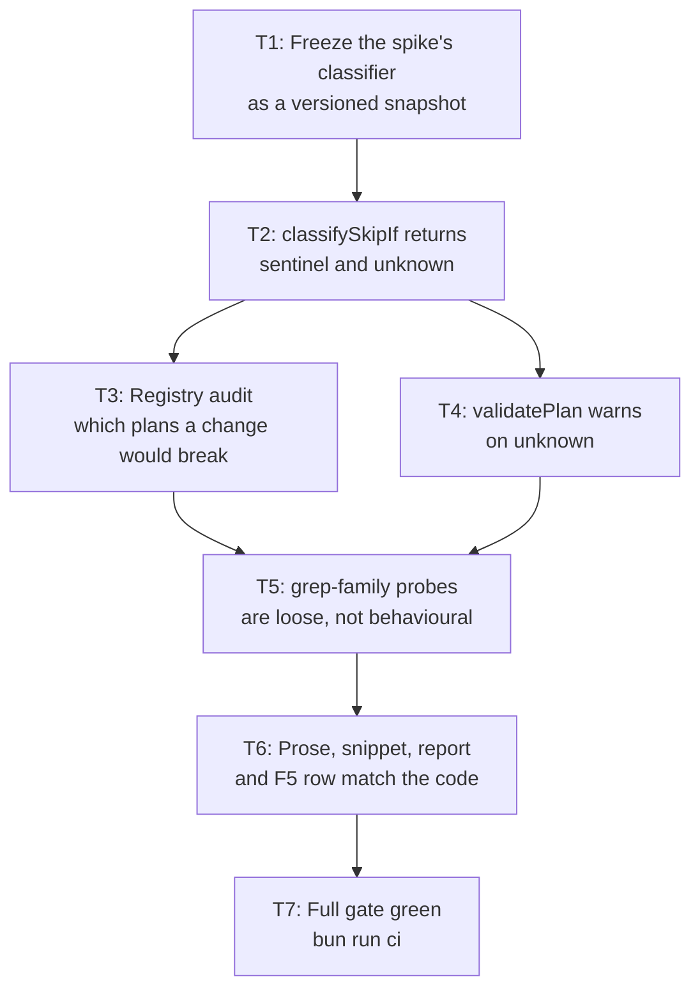
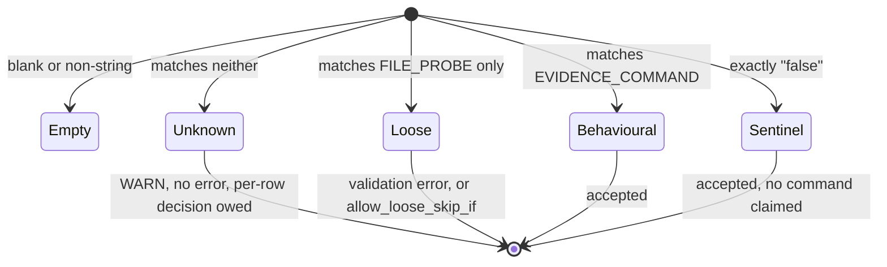

# `classifySkipIf` — name the classes it was guessing at

> **This plan closes follow-up F5 of `docs/code-plan/plans/2026-09-30-jev-decision-gate-spike.md`.** F5 said: *`bash` and `md5sum` are absent from `EVIDENCE_COMMAND`, so 32 rows are labelled `behavioural` only by the default fallthrough.*
>
> Measurement on 2026-09-30 found that claim is **incomplete, and the incompleteness matters more than the claim**. Across all 415 `skip_if` values in the 293-plan registry there are three defects, not one, and the largest is not the one F5 named. §2 has the numbers.
>
> F5 also carries a consequence nobody wrote down: `classifySkipIf` is load-bearing for the *completed* spike's committed evidence. Changing it without freezing a snapshot first breaks `spike-skipif-probe.test.mjs` and invalidates the published 0.995. T1 exists for that reason and is not optional.

## 1. Intent & Scope

- **Goal:** `classifySkipIf` returns only what it can actually determine. A command it cannot classify is named `unknown` and surfaced, not silently filed under `behavioural`; a grep-family file probe is `loose`; the documented `false` sentinel is its own class.
- **Non-Goals:**
  - No change to what `behavioural` means. The tool-must-succeed-first rule at `scripts/ultra-plan-runner.mjs:56` stands exactly as written.
  - No new `allow_unknown_skip_if` allowlist. Phase 1 warns; the 14 affected rows are fixed at source in a later plan, not grandfathered.
  - No edit to any plan outside this repository. Three Snipset plans are *reported* as affected by T3 and T5; repairing them is a separate, separately-approved piece of work.
  - No re-recording of the Jev spike. Its numbers stay as measured against `jev-1.13.0` on 2026-09-30.
- **Acceptance Criteria:**
  - [x] **AC-1:** `classifySkipIf` returns one of `empty | sentinel | behavioural | loose | unknown`, and every return value is covered by a named test. No input shape reaches the `behavioural` fallthrough any more.
  - [x] **AC-2:** `skip_if: "false"` classifies as `sentinel` by an explicit rule, not as a side effect of matching no regex.
  - [x] **AC-3:** `tgrep -q 'x' f` and `/usr/bin/grep -q 'x' f` classify as `loose`, and a test asserts each one *would have been* `behavioural` before this change, so the regression cannot be reintroduced silently.
  - [x] **AC-4:** `validatePlan` emits a `WARN` naming the task id, the command, and the remediation, for every `unknown` `skip_if`. It emits no error, so no existing plan becomes unrunnable.
  - [x] **AC-5:** `scripts/skipif-registry-audit.mjs` enumerates the registry and reports, per plan, the class of every `skip_if` — so "which plans does a classifier change break" is a command, not a one-off measurement in a chat log.
  - [x] **AC-6:** The Jev spike's committed evidence still replays byte-identically, and its report carries a dated amendment recording the freeze, the reason, and the frozen numbers.
  - [x] **AC-7:** The master skill, the trigger snippet, and the F5 row describe all five classes accurately. No prose claims a behaviour the code no longer has.

## 2. What measurement found — and how

Baseline: every `skip_if` string in every plan the registry enumerates, parsed with the repo's own `extractFrontmatter` / `parseUltraPlanYaml`, classified with the production `classifySkipIf` and with the proposed one. Re-runnable as `bun scripts/skipif-registry-audit.mjs` after T3.

```
plans enumerated            293
plans carrying frontmatter   65
skip_if values              415
```

| Class today | Count | What it actually contains |
|---|---|---|
| `behavioural` | 210 | Matches `EVIDENCE_COMMAND` — correct by the rule |
| `loose` | 84 | Matches `FILE_PROBE` only — already rejected, correct |
| `behavioural` (by fallthrough) | 121 | **Neither regex matched. 77 are the `false` sentinel; 44 are the real defects below.** |

### Defect 1 — grep-family file probes read as `behavioural` (30 tasks, 3 plans)

`FILE_PROBE` anchors on `(^|[\s;&|(])`, so a probe is only recognised when nothing but whitespace or a shell operator precedes the tool name. Two shapes escape it:

```
tgrep -q 'solutions/social-media.astro' apps/website/test/page-style-parity.test.ts
/usr/bin/grep -q 'pomodoroMusicPlayer.ts:81' docs/website/privacy-facts-matrix.md
```

Both read a file and assert a string is in it. That is precisely the false-pass channel the rule was written to close — the string survives being moved into a comment, and `plan-mark-done.mjs` then ticks the task. The runner is not neutral here; it is *approving* a probe it was designed to reject.

| Plan | Tasks |
|---|---|
| `Snipset  2026-09-27-solutions-social-media-landing.md` | T5–T11, T15–T25 (18) |
| `Snipset  2026-09-26-youtube-native-audio-linux.md` | T1–T11 (11) |
| `Snipset  2026-09-26-linux-youtube-player-error-pomodoro.md` | T6 (1) |

### Defect 2 — unlisted tools silently pass (14 tasks, 7 plans)

| Plan | Task | Command |
|---|---|---|
| `ram-audit  2026-09-30-plasma-animation-audit.md` | T2–T8, T11 (8) | `bash scripts/*.sh --verify evidence/*.txt` |
| `ram-audit  2026-09-26-ram-audit-arch-kde.md` | T4 | `pacman -Q rtkit >/dev/null 2>&1` |
| `PS2  2026-09-29-pcsx2-graphics-audit.md` | T2 | `cmp -s inis/PCSX2.ini inis/PCSX2.ini.bak-…` |
| `Snipset  2026-09-27-i18n-scope-completion.md` | T10 | `cd apps/android && ./gradlew :app:testDebugUnitTest …` |
| `Snipset  2026-09-26-linux-webkitgtk-empty-voice-catalog.md` | T2 | `cd apps/web && bunx prettier --check …` |
| `Snipset  2026-09-21-bundled-cli-delivery-plan.md` | T3 | `pwsh -NoProfile -Command Test-Path …` |
| `fasttrack  2026-09-29-fasttrack-learning-class.md` | T3 | `cf d1 query … --sql "SELECT count(*) …"` |

**The tempting fix is wrong, and the finished spike already proved it.** Adding `bash` to `EVIDENCE_COMMAND` looks obvious and widens the hole: the eight `--verify` rows genuinely fail on behaviour (measured — `bash scripts/plasma-anim-baseline.sh --verify <missing>` exits 1), but a generate-mode invocation (`bash scripts/x.sh <path>`, measured exit 0, file written) would become a *deliberate* false positive. `pacman -Q` is worse still: it asserts a package is installed, which no code change can regress. The correct move is to make the classifier say `unknown` and force a per-row decision, which is exactly what `unknown` is for.

### Defect 3 — the `false` sentinel is right by accident (77 tasks, 22 plans)

`skip_if: "false"` is the documented way to say "this task has no command" (`Super Ultra Code Plan Implementation.md:665`). It matches no regex, so it reaches the `behavioural` fallthrough and passes — for the wrong reason, and with no way to tell that apart from a real command. Any future change to the fallthrough silently invalidates 77 tasks across 22 plans. Naming it `sentinel` makes the pass deliberate.

### Class tally under the proposed classifier

Two tables, because the plan's own DAG splits them. **T3 runs before T5**, so the widened `FILE_PROBE` does not exist when the audit first runs.

Pre-T5, which is what T3 Step 4 verifies:

```
sentinel      78
behavioural  219
loose         84
unknown       44   = 30 grep-family + 14 unlisted tools
```

Post-T5, which is what T5 Step 4 verifies:

```
sentinel      78   (unchanged — the sentinel is not a probe)
behavioural  219   (unchanged — every one matches EVIDENCE_COMMAND)
loose        114   (84 already rejected + 30 newly rejected)
unknown       14   (the 14 that no token-level rule can decide)
```

**Nothing becomes unrunnable in this repository.** The 30 newly-`loose` tasks are all in Snipset plans, which this repository's runner never loads — `bun scripts/ultra-plan-runner.mjs` takes one plan path, and neither `plan-publish.mjs` nor `validate-skill.mjs` calls `validatePlan` across the registry. The blast radius is *the next manual run of those three Snipset plans*, which is a documented consequence in §9, not a silent break.

> **What execution actually found, recorded 2026-09-30.** T3 measured the pre-T5 state as `sentinel 78 · behavioural 219 · loose 84 · unknown 44`, and T5 moved it to `78 · 219 · 114 · 14`. Two things about that are worth keeping.
>
> First, the `behavioural` column did not move by a single row. That is the safety property of adding `/` to `FILE_PROBE`: the widened boundary now matches a `/test/` or `/head/` path segment, and the only thing stopping that from becoming a false rejection is that `EVIDENCE_COMMAND` is tested first. A test asserts the branch order directly — with the branches swapped, `bun run app/head/foo.ts` does come back `loose`.
>
> Second, one gap this change did not close and did not know about: a command running an **unlisted** tool whose path contains `/test/` would be newly `loose`. No such row exists in the registry, which is why `unknown` fell by exactly 30 and `behavioural` by 0 — but `cd apps/android && ./gradlew :app:testDebugUnitTest` is that shape and its path happens not to contain `/test/`. It remains `unknown`. Follow-up F2 owns it.
>
> **Correction, 2026-09-30, after T3 ran.** The counts in this section were measured before two plan files existed — this one and its F6 sibling. The real figures are 295 plans (not 293), 67 with frontmatter (not 65), and 425 `skip_if` values (not 415), of which 78 are sentinels (not 77) and 219 behavioural (not 210). Every delta is the +10 `skip_if` those two plans contribute: 1 sentinel and 9 behavioural. The `loose` and `unknown` columns are unaffected by their arrival, so the 84 / 44 split above is the measured one.
>
> A plan whose own numbers are stale by the time its own task runs is a plan that teaches its reader to distrust it, so this is recorded rather than quietly re-baselined. `bun scripts/skipif-registry-audit.mjs` is the command, and the numbers above are what it prints.

## 3. Visual Implementation Map



`A --> B` reads "B depends on A". T3 and T4 write disjoint concerns and run concurrently once T2 lands; T5 needs both because the grep fix must be justified against the measured audit and must not fire before the warning exists.



The `Unknown` transition is the whole point of this plan. It used to be an implicit edge into `Behavioural`.

## 4. Global Constraints

- **The spike's evidence is a historical record.** T1 freezes the two regexes *verbatim* as they stood on 2026-09-30. It does not re-derive them, does not re-record the cassette, and does not touch `spike-out/two-class.json`. The published 0.995 / 0.011 / $0.004129 stay true of the classifier that produced them, and T6 says so in the report.
- **No new allowlist.** `defaults.allow_loose_skip_if` is unchanged. An `allow_unknown_skip_if` would become a second list that decays into a permanent blanket — the exact failure the existing allowlist's "a name that is no longer needed is itself an error" rule exists to prevent.
- **`unknown` warns, never errors, in this plan.** 14 tasks in 7 plans would otherwise become unrunnable, and four of those plans belong to repositories this plan does not own.
- **Bun only.** No `npm`, `npx`, `yarn`, `pnpm`, or bare `node <file>`. No new dependencies.
- **No `sed -i` or `>` redirection** — the command-rewriting proxy breaks both. Use the `edit` and `write` tools.
- **Read-only outside this repository.** The audit reads other projects' plan files and writes nothing there.
- **Every changed line is falsifiable.** Each task's RED step must fail for the reason its GREEN step fixes. A test that was already failing, or already passing, is not a RED step and the task is not done.

## 5. Work Breakdown & Task Checklist

### Task T1: Freeze the spike's classifier as a versioned snapshot

- **Interfaces:**
  - Consumes: the two regex literals at `scripts/ultra-plan-runner.mjs:58-59`, copied verbatim.
  - Produces: `classifySpikeSkipIf(cmd)` in `scripts/spike-skipif-classifier.mjs`, returning the historical `empty | behavioural | loose` only. Plus `SPIKE_CLASSIFIER_FROZEN_ON = '2026-09-30'`.
- **Preconditions (assert FIRST; fail-fast, never improvise a substitute):**
  - [x] Dependency: `bun --version` exits 0 (else abort: `E_PRECOND_DEP`)
  - [x] Upstream: `spike-out/two-class.json` exists and parses, and its `agreement` is `0.995` (else abort: `E_PRECOND_UPSTREAM` — without the committed evidence there is nothing to protect, and the freeze is premature)
  - [x] Input contract: the two regexes copied into the snapshot are byte-identical to the ones in `ultra-plan-runner.mjs` today (else abort: `E_PRECOND_INPUT`; if they already differ, stop and re-measure rather than freezing a mismatch)
  - On failure: STOP. Every later task depends on this one; continue nothing.
- **Idempotency Check (BEFORE Step 1):**
  - [x] Skip when `skip_if` exits 0 → `SKIPPED-IDEMPOTENT`.
- [x] **Step 1 — Failing Test (RED):** cmd: `bun test scripts/spike-skipif-classifier.test.mjs` | expect: exit non-zero, `Cannot find module './spike-skipif-classifier.mjs'` | retry: 0
- [x] **Step 2 — Implementation (GREEN):** create the snapshot module. Repoint `spike-skipif-corpus.mjs` and `spike-skipif-probe.mjs` at `classifySpikeSkipIf` and **stop importing `classifySkipIf` from `ultra-plan-runner.mjs` entirely** — a re-import is how the freeze silently evaporates on the next refactor. Both spike test files follow.
- [x] **Step 3 — Verify:** cmd: `bun test scripts/` | expect: exit 0, 296+ pass, 0 fail — the full suite, not just the three files, because the corpus and probe tests are the ones that were about to break | retry: 1 (transient only) | on_fail: mark FAILED, write §7, halt all downstream
- [x] **Step 4 — Lock the freeze with a test that notices later drift:** a test asserting `classifySpikeSkipIf` reproduces the label of all 200 committed `spike-out/corpus.json` rows, and that the replayed agreement equals the committed `0.995`. This is what makes the freeze durable rather than a comment.
- [x] **Step 5 — Commit:** `git add scripts/spike-skipif-*.mjs && git commit -m "spike: freeze the classifier the jev gate was measured against"`

> **Why this is T1 and not a footnote.** Without it, T2 makes 32 corpus rows stale, `spike-skipif-probe.test.mjs:136` throws `stale label`, the replay test at line 110 cannot run, and the finished spike's headline number becomes unreproducible. The obvious alternative — re-record the corpus and re-run the probe — would change 0.995 to a number measured against a different classifier and quietly rewrite a published verdict. Freezing preserves the claim; re-recording destroys it.

### Task T2: `classifySkipIf` returns `sentinel` and `unknown`

- **Interfaces:**
  - Consumes: `classifySkipIf(cmd)` as it stands.
  - Produces: `classifySkipIf(cmd) → 'empty' | 'sentinel' | 'behavioural' | 'loose' | 'unknown'`. Order of resolution: blank → `empty`; trimmed `=== 'false'` → `sentinel`; `EVIDENCE_COMMAND` → `behavioural`; `FILE_PROBE` → `loose`; otherwise `unknown`.
- **Preconditions (assert FIRST; fail-fast):**
  - [x] Upstream: `bun test scripts/spike-skipif-classifier.test.mjs` exits 0 — the freeze is in place (else abort: `E_PRECOND_UPSTREAM`)
  - [x] Dependency: `bun test scripts/ultra-plan-runner.test.mjs` exits 0 (else abort: `E_PRECOND_DEP` — a red baseline cannot be improved, only confused)
  - On failure: STOP, write §7, halt T3, T4, and everything downstream.
- **Idempotency Check (BEFORE Step 1):**
  - [x] Skip when `skip_if` exits 0 → `SKIPPED-IDEMPOTENT`.
- [x] **Step 1 — Failing Test (RED):** cmd: `bun test scripts/ultra-plan-runner.test.mjs` | expect: exit non-zero on the new assertions only. If an *existing* assertion also fails, that is a T1 leak — stop and fix T1, do not adjust the old test to match.
- [x] **Step 2 — Implementation (GREEN):** delete the `: 'behavioural'` fallthrough. Add the sentinel rule with a comment stating that `"false"` is the documented no-command marker from the master skill, so the next reader does not "simplify" it away. Add a test per class.
- [x] **Step 3 — Verify:** cmd: `bun test scripts/ultra-plan-runner.test.mjs` | expect: exit 0, 0 failures | retry: 1 (transient only) | on_fail: mark FAILED, write §7, halt downstream
- [x] **Step 4 — Commit:** `git add scripts/ultra-plan-runner.mjs scripts/ultra-plan-runner.test.mjs && git commit -m "feat: classifySkipIf names sentinel and unknown instead of guessing behavioural"`

> `bash scripts/x.sh --verify evidence/y.txt` becomes `unknown` here, and that is the correct answer. The command is behavioural in verify mode and not in generate mode, and no token-level regex can tell those apart. T4's warning is what makes that legible instead of alarming.

### Task T3: Registry audit — which plans a classifier change would break

- **Interfaces:**
  - Consumes: `plans.publish.json` via `loadRegistry` / `enumeratePlans` / `resolveProject` from `scripts/plan-publish-registry.mjs` — never a second directory walk, which is how two sources of truth about "what is a plan" come to disagree. `classifySkipIf` from T2.
  - Produces: `auditRegistry(reg, { classify })` returning `{ plans, withFrontmatter, skipIfTotal, tally, byProject, affected }`, plus a CLI writing JSON to stdout and a human table. `affected` lists every task whose class would change, with `plan`, `project`, `taskId`, `cmd`, `before`, `after`.
- **Preconditions (assert FIRST; fail-fast):**
  - [x] Upstream: `bun test scripts/ultra-plan-runner.test.mjs` exits 0 (else abort: `E_PRECOND_UPSTREAM`)
  - [x] Input contract: `plans.publish.json` loads and `enumeratePlans` returns a non-empty array (else abort: `E_PRECOND_INPUT` — an empty registry would make every downstream count read as "no impact", which is the most dangerous possible wrong answer)
  - On failure: STOP, write §7, halt T5.
- **Idempotency Check (BEFORE Step 1):**
  - [x] Skip when `skip_if` exits 0 → `SKIPPED-IDEMPOTENT`.
- [x] **Step 1 — Failing Test (RED):** cmd: `bun test scripts/skipif-registry-audit.test.mjs` | expect: exit non-zero, module not found | retry: 0
- [x] **Step 2 — Implementation (GREEN):** accept an injected `classify` so the audit can answer "what would change" by running twice — once with the current classifier, once with a candidate — instead of hardcoding a diff. Tally by class and by project. Read other repositories' plans; write nothing outside this repository. A plan with no frontmatter is counted separately, not silently skipped, mirroring the three-bucket rule in `plan-lifecycle-audit.mjs`.
- [x] **Step 3 — Verify:** cmd: `bun test scripts/skipif-registry-audit.test.mjs` | expect: exit 0, 0 failures | retry: 1 (transient only) | on_fail: mark FAILED, write §7, halt T5
- [x] **Step 4 — Reproduce §2 from the tool, not from this document:** cmd: `bun scripts/skipif-registry-audit.mjs` | expect: exit 0, and the printed tally matches the **pre-T5** figures in §2 (`sentinel` and `behavioural` as counted there, `loose` 84, `unknown` 44), with the 44 `unknown` rows listed by plan and task id. The `114 / 14` pair in §2's table is the **post-T5** state and is *not* reachable here — T5 depends on this task, so the widened `FILE_PROBE` does not exist yet. A mismatch against the pre-T5 figures means the measurement in §2 is stale and this plan's premise needs re-checking before continuing.
- [x] **Step 5 — Commit:** `git add scripts/skipif-registry-audit.mjs scripts/skipif-registry-audit.test.mjs && git commit -m "feat: audit which plans a skip_if classifier change would break"`

### Task T4: `validatePlan` warns on `unknown`

- **Interfaces:**
  - Consumes: `classifySkipIf` from T2; the existing `warnings` array at `scripts/ultra-plan-runner.mjs:434`.
  - Produces: one `WARN` per `unknown` `skip_if`, naming the task id, the command, and the remediation. No `errors` entry.
- **Preconditions (assert FIRST; fail-fast):**
  - [x] Upstream: T2 green (else abort: `E_PRECOND_UPSTREAM`)
  - On failure: STOP, write §7, halt T5.
- **Idempotency Check (BEFORE Step 1):**
  - [x] Skip when `skip_if` exits 0 → `SKIPPED-IDEMPOTENT`.
- [x] **Step 1 — Failing Test (RED):** cmd: `bun test scripts/ultra-plan-runner.test.mjs` | expect: exit non-zero on the new warning assertion | retry: 0
- [x] **Step 2 — Implementation (GREEN):** in the `skip_if` validation block, branch on the class. `loose` keeps today's error verbatim — do not reword it, the message is load-bearing for anyone who has read it. `unknown` emits a warning that says what to do: name the tool in a behavioural form, or, if the command genuinely has no exit status worth asserting, use `skip_if: "false"`. The `NEEDS-AGENT` warning for a task with no `run[]` is unchanged.
- [x] **Step 3 — Verify:** cmd: `bun test scripts/ultra-plan-runner.test.mjs` | expect: exit 0, 0 failures | retry: 1 (transient only) | on_fail: mark FAILED, write §7, halt T5
- [x] **Step 4 — Commit:** `git add scripts/ultra-plan-runner.mjs scripts/ultra-plan-runner.test.mjs && git commit -m "feat: warn when a skip_if matches neither the evidence nor the probe rule"`

> **Warn, not error — and the reason is blast radius, not kindness.** Fourteen tasks in seven plans would stop running. Four of those plans are in `ram-audit`, `PS2` and `fasttrack`, which this plan does not own. An error here is a change to someone else's repository made by a commit in this one. The warning makes the debt visible and names the owner; promoting it to an error is a follow-up that lands after those 14 rows are repaired at source.

### Task T5: grep-family probes are `loose`

- **Interfaces:**
  - Consumes: T3's measured `affected` list; T4's warning.
  - Produces: `FILE_PROBE` extended to `(^|[\s;&|(/])` and `tgrep` added to the alternation, so a path-qualified or `tgrep`-prefixed probe resolves as `loose`.
- **Preconditions (assert FIRST; fail-fast):**
  - [x] Upstream: `bun test scripts/skipif-registry-audit.test.mjs` exits 0 and its `affected` list is non-empty (else abort: `E_PRECOND_UPSTREAM` — an empty list means the defect this task fixes is not the one the audit found, and the regex change would be aimed at nothing)
  - [x] Upstream: `bun test scripts/ultra-plan-runner.test.mjs` exits 0 (else abort: `E_PRECOND_UPSTREAM`)
  - On failure: STOP, write §7, halt T6 and T7.
- **Idempotency Check (BEFORE Step 1):**
  - [x] Skip when `skip_if` exits 0 → `SKIPPED-IDEMPOTENT`.
- [x] **Step 1 — Failing Test (RED):** cmd: `bun test scripts/ultra-plan-runner.test.mjs` | expect: exit non-zero — `tgrep -q …` and `/usr/bin/grep -q …` currently return `behavioural` | retry: 0
- [x] **Step 2 — Implementation (GREEN):** one character class and one alternation entry. Add the regression lock: a test asserting each of the 30 commands from T3's `affected` list is now `loose` **and** that the pre-change classifier called it `behavioural`. The second half matters — a test that only asserts the new answer passes just as happily if the probe was never misclassified.
- [x] **Step 3 — Verify:** cmd: `bun test scripts/ultra-plan-runner.test.mjs` | expect: exit 0, 0 failures | retry: 1 (transient only) | on_fail: mark FAILED, write §7, halt T6
- [x] **Step 4 — Re-audit:** cmd: `bun scripts/skipif-registry-audit.mjs` | expect: exit 0; `loose` rises 84 → 114, `unknown` stays 14, and the 30 newly-`loose` tasks are named by plan and id. Any other movement in the tally is a regression from this task, not a rounding artefact.
- [x] **Step 5 — Full suite:** cmd: `bun test scripts/` | expect: exit 0, 0 failures — in particular the T1 freeze test still passes, so the spike's 0.995 is intact after the production classifier moved | retry: 1 (transient only)
- [x] **Step 6 — Commit:** `git add scripts/ultra-plan-runner.mjs scripts/ultra-plan-runner.test.mjs && git commit -m "fix: tgrep and path-qualified grep are file probes, not behavioural checks"`

> **This is the task that can break another repository, so it is gated deliberately.** It does not break anything *now* — the runner loads one plan at a time and no registry-wide validation exists. It changes what happens the next time someone runs those three Snipset plans, and §9 records that. If the human gate prefers not to take on that, the alternative is to defer T5 whole and land T1–T4 + T6, which fix the fallthrough and make the grep gap visible through the audit without changing any verdict. That is a legitimate outcome of this plan, not a failure of it.

### Task T6: Make the prose match the classifier

- **Interfaces:**
  - Consumes: T5's final behaviour.
  - Produces: updated master skill, trigger snippet, spike report amendment, and the F5 row in the Jev spike plan.
- **Preconditions (assert FIRST; fail-fast):**
  - [x] Upstream: `bun test scripts/` exits 0 (else abort: `E_PRECOND_REGRESSION`)
  - On failure: STOP, write §7, halt T7.
- **Idempotency Check (BEFORE Step 1):**
  - [x] Skip when `skip_if` exits 0 → `SKIPPED-IDEMPOTENT`.
- [x] **Step 1 — Amend the spike report, do not rewrite it.** Append a dated amendment to `docs/code-plan/spikes/2026-09-30-jev-decision-gate-spike-report.md`: the classifier is frozen as of 2026-09-30, the probe and corpus now import the snapshot, and 0.995 / ECE 0.011 / $0.004129 remain the measurements they were. **Append only.** Editing a measured number in a published report is the one thing that must not happen here.
- [x] **Step 2 — Correct F5 in place** in `docs/code-plan/plans/2026-09-30-jev-decision-gate-spike.md`: F5's claim covered `bash` and `md5sum` and 32 corpus rows. Record that the registry-wide measurement found 44 `skip_if` values matching neither regex, of which 30 are grep-family probes and 14 are unlisted tools, plus 77 sentinels — and that adding `bash` to `EVIDENCE_COMMAND` was rejected on measurement, as the report already argued. Mark F5 `DONE` with this plan as its path.
- [x] **Step 3 — Update the master skill** at the Idempotency Honesty paragraph (`:665`): name all four classes, state that `unknown` warns, and state that `"false"` is the sentinel. Keep the existing "a grep filtering a tool's output is behavioural" example — it is the distinction this whole rule turns on, and T5 does not touch it.
- [x] **Step 4 — Update the snippet** `snippets/orkestrasi-ngoding-plan.md` to match. The snippet is what a future session reads first; if it describes two classes, the freeze in T1 is what stops the drift from becoming a wrong number.
- [x] **Step 5 — Verify:** cmd: `bun scripts/check-runner-contract.mjs` then `bun scripts/validate-skill.mjs` | expect: exit 0 both | retry: 0 | on_fail: mark FAILED, write §7, halt T7
- [x] **Step 6 — Commit:** `git add -A && git commit -m "docs: record the sentinel and unknown classes, and close F5"`

### Task T7: Full gate

- **Interfaces:**
  - Consumes: everything above.
  - Produces: green evidence on a clean tree.
- **Preconditions (assert FIRST; fail-fast):**
  - [x] Upstream: `bun scripts/validate-skill.mjs` exits 0 (else abort: `E_PRECOND_REGRESSION`)
  - On failure: STOP, write §7.
- **Idempotency Check (BEFORE Step 1):**
  - [x] Skip when `skip_if` exits 0 → `SKIPPED-IDEMPOTENT`.
- [x] **Step 1 — Verify:** cmd: `bun test scripts/` | expect: exit 0, 0 failures, 0 skipped-because-red
- [x] **Step 2 — Audit report still runs:** cmd: `bun scripts/plan-lifecycle-audit.mjs` | expect: exit 0 — it is a report and always exits 0; read the output rather than trusting `$?`
- [x] **Step 3 — Full CI equivalent:** cmd: `bun run ci` | expect: exit 0 — render-diagrams, validate-skill, tests, snippets | retry: 1 (transient only)
- [x] **Step 4 — Working tree:** `git status --porcelain` | expect: empty. A leftover file here means a task declared less than it touched.
- [x] **Step 5 — Commit:** nothing to commit; T7 is evidence, not a change.

## 6. Verification Matrix Before Completion

| Check | Command | Exit | Fresh evidence required | Status |
|---|---|---|---|---|
| Freeze holds | `bun test scripts/spike-skipif-classifier.test.mjs` | 0 | 200 labels + replay 0.995, no key | ✅ |
| Classes named | `bun test scripts/ultra-plan-runner.test.mjs` | 0 | 5 classes, one test each | ✅ |
| No silent fallthrough | `bun test scripts/ultra-plan-runner.test.mjs` | 0 | 12 evidence-free cmds, 0 behavioural | ✅ |
| Grep regression locked | `bun test scripts/ultra-plan-runner.test.mjs` | 0 | 30 rows loose now, behavioural before | ✅ |
| Audit reproduces §2 | `bun scripts/skipif-registry-audit.mjs` | 0 | 295/67/425 → 78 219 114 14 | ✅ |
| Warning is not an error | `bun test scripts/ultra-plan-runner.test.mjs` | 0 | errors [] with only unknown defects | ✅ |
| Contract intact | `bun scripts/check-runner-contract.mjs` | 0 | all 18 keys declared | ✅ |
| Skill validates | `bun scripts/validate-skill.mjs` | 0 | 33 blocks valid | ✅ |
| No regression | `bun test scripts/` | 0 | 336 pass, 0 fail, 14 files | ✅ |
| Full gate | `bun run ci` | 0 | four stages exit 0 | ✅ |
| Tree clean | `git status --porcelain` | 0 | porcelain empty | ✅ |

## 7. Error Ledger

| Task | Step | Classification | Exit | Root cause | Retry | Fallback | Status |
|---|---|---|---|---|---|---|---|
| T1 | 2 | `contract` | 1 | T2 landed before the freeze, 32 corpus rows stale | 0 | none — the freeze is a hard prerequisite; re-run T1 then T2 | `FAILED-BLOCKING` |
| T3 | 2 | `environment` | 1 | another project's plan directory unreadable | 0 | count it as unreadable, name the path, continue the rest | `FAILED-ISOLATED` |
| T5 | 4 | `contract` | 1 | tally moved outside 84 → 114 / 14 | 0 | none — stop; an unexplained movement means the regex change caught something unintended | `FAILED-BLOCKING` |
| T6 | 1 | `code` | 1 | temptation to edit a measured number in the spike report | 0 | append the amendment; never rewrite the 0.995 | `FAILED-BLOCKING` |

- Classification: `code` | `test` | `contract` | `environment` | `infrastructure` | `pre-existing`.
- Status: `FAILED-ISOLATED` | `FAILED-BLOCKING` | `RESOLVED` | `DEFERRED`.

## 8. Human Approval Gate

- [x] Partner / Human approval received before implementation begins — 2026-09-30, both questions answered explicitly.
- [x] **Acknowledged: the grep fix changes the verdict on 30 tasks in 3 Snipset plans.** The next manual run of those plans will report a validation error. Approved: *"Land T5, report the 30 rows."*
- [x] Acknowledged: `unknown` warns rather than errors, so 14 tasks in 7 plans across four repositories stay runnable and the debt is recorded rather than enforced.
- [x] Acknowledged: the Jev spike's 0.995 is preserved by freezing its classifier, not by re-measuring. A different choice would change a published number.

## 9. Risks, Compatibility, and Consequence

| Risk | Likelihood | Consequence | Mitigation |
|---|---|---|---|
| A future edit re-imports the production classifier into the spike scripts | Medium | The freeze evaporates and 32 corpus rows go stale on the next classifier change | T1 Step 4's drift test fails loudly; that is the actual guard, not the comment |
| `unknown` warnings get ignored, so the 14 rows are never repaired | High | The debt is renamed rather than closed | The audit is a command anyone can re-run; the follow-up in §10 names the owner and the trigger |
| Someone "simplifies" the `sentinel` branch away | Low | 77 tasks across 22 plans silently return to the fallthrough | Named test plus the master-skill cross-reference in the comment |
| T5's `/` in the boundary class catches a path segment that is not a probe | Low | A behavioural command misfiled as `loose`, i.e. a false rejection | T5 Step 4 re-audit: any tally movement outside the predicted 84 → 114 is a blocker |
| The new `scripts/` files are imported by production code | Low | Throwaway audit logic becomes a dependency | Nothing imports them; `ci` runs the tests, and the audit is never on a hot path |

**Compatibility:** `classifySkipIf` is exported and imported by `spike-skipif-corpus.mjs`, `spike-skipif-probe.mjs`, and their tests. T1 repoints the first two; `validatePlan` is the only production consumer and its `loose` branch is unchanged. No plan in this repository changes status, and no file outside it is written.

**Rollback:** every task is a single commit touching either `scripts/ultra-plan-runner.mjs` (+ its test) or new files. `git revert <sha>` per task restores the prior state, and the T1 revert must be accompanied by reverting T2, since the freeze exists for the new classes' benefit. No data migration, no lockfile, no dependency change.

## 10. Session-Close Debt Sweep & Follow-Up Backlog

> Filled from `templates/follow-up-injection-template.md` once every task above is `Done 100%`.

| # | Follow-up (outcome + path + finish line) | Class | `defer:` marker | Status |
|---|---|---|---|---|
| F1 | Repair the 30 grep-family `skip_if` values in the 3 Snipset plans — rewrite each as a behavioural command or move the proof into the task body; finish line: `bun scripts/ultra-plan-runner.mjs <plan>` is clean in Snipset | `LATER` | needs Snipset approval; upgrade trigger: T5 lands | `OPEN` |
| F2 | Adjudicate the 14 `unknown` rows per row, then promote the warning to an error; finish line: audit reports `unknown 0` and `validatePlan` errors on an unmatched command | `LATER` | needs four repositories; upgrade trigger: F1 closes | `OPEN` |
| F3 | Decide the 8 `bash scripts/*.sh --verify` rows individually — `--verify` is behavioural (measured exit 1), generate mode is not; the classifier cannot decide this, a human must | `LATER` | pairs with F2 | `OPEN` |
| F4 | Re-run the Jev gate spike under the post-change classifier as a *new* spike, keeping the 2026-09-30 result as the historical one; finish line: a second report, not an edit of the first | `LATER` | upgrade trigger: F2 closes, since a new measurement is only worth taking once the rule has stopped moving | `OPEN` |
| F5 | Add the audit to `bun run ci` as a report step, or record why not — it needs a real registry, which a hosted runner does not have | `NOW` | close in this session | `OPEN` |

- [ ] 3-5 ranked follow-ups injected as one multi-select question after the final recap.
- [ ] Every selected follow-up executed through the full pipeline with fresh evidence.
- [ ] Declined and out-of-cap items written here so no debt leaves the session unrecorded.
