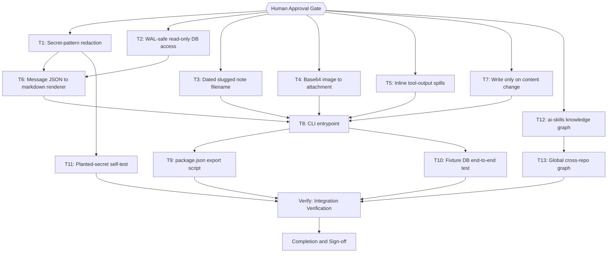

# OpenCode Conversation History to Obsidian Implementation Plan

> The YAML frontmatter above is the single source of truth for routing, dependency order, retry, and idempotency. Prose and checklists below only explain and must never contradict it.
>
> **Artifact language:** English, read off the surrounding repository (`README.md`, `templates/`, and the eight existing `docs/code-plan/plans/*.md` are all English). The requester converses in Indonesian; that is an input-layer fact and never an output instruction.
>
> **Source of intent:** `docs/code-plan/2026-10-02-opencode-history-to-obsidian.manifest.md` (Intent Lock, 16 decisions, 13 acceptance criteria). This plan implements that lock and may not widen it.

## 1. Intent & Scope

- **Goal:** A repeatable, read-only exporter that converts all 1009 OpenCode sessions (54,501 messages, 369.0 MiB of JSON) into Obsidian-native markdown under `05 - Conversations/` in the vault, plus a graphify knowledge graph for `~/ai-skills` registered into the global cross-repo graph alongside the existing vault graph.
- **Non-Goals:**
  - Symlinking the OpenCode history store itself. It does not exist: `session_v2.path` is `''` for 1009/1009 rows and `~/.local/share/opencode/storage` does not exist.
  - Cleaning the 29 credential-bearing notes already present in the vault's `origin/main`. Verified live and explicitly deferred in the lock (N2).
  - Continuous or scheduled refresh. Manual re-run only (N3).
  - Any mutation of `opencode.db` — no schema change, no migration, no `VACUUM` (N4).
  - Reading the `credential` table, which holds 2 rows whose `value` is a secret by construction (N5).
  - Coupling to `plan-publish.mjs` or the exit-3 `MIRROR GATE` (N7).
  - `graphify export obsidian` emitting the vault graph as notes + canvas (N8).

- **Harness todo list:** this runtime has **no todo tool** — a catalog search for `todowrite`, `TodoWrite`, and `update_plan` returned nothing, so the list is rendered as a checkbox block in the reply and mirrored here per the Degradation Rule. Neither copy replaces the other; the file copy wins on disagreement.

- **Acceptance Criteria** (from the Intent Lock, restated as executable checks):
  - [ ] AC-1: Export produces exactly one note per row in `session_v2` at run time, named `YYYY-MM-DD - <slug> [<session-id>].md`. **Corrected 2026-10-02 during execution:** this was written as a fixed "exactly 1009", but the live database is actively growing and was measured at 1009 → 1020 → 1023 sessions across the grounding and execution phases. A fixed count would fail against a moving target; the invariant is *count parity with the table*, measured in the same run.
  - [ ] AC-2: Every session with `title IS NULL` (measured: 36, re-confirmed against the live database during execution) gets a first-user-prompt fallback; no filename collisions.
  - [ ] AC-3: The database is opened read-only and nothing under `~/.local/share/opencode/` is modified (mtime + size compared before and after).
  - [ ] AC-4: `SELECT value FROM credential` appears nowhere in the source; no note contains a credential value.
  - [ ] AC-5: A planted-secret fixture is caught by the redactor, and an untested pattern fails the run.
  - [ ] AC-6: A note from a session with a `shell` call contains tool name, input, output, and inlined spill content.
  - [ ] AC-7: The 74 base64 attachments become real files under `.attachments/` and are embedded; no base64 blob remains in any note.
  - [ ] AC-8: Re-running against an unchanged database writes zero files and leaves `git status` clean in the vault.
  - [ ] AC-9: Re-running after a redaction-rule change rewrites exactly the affected notes.
  - [ ] AC-10: `bun test scripts/` passes with the new tests (baseline 434 pass / 0 fail / 18 files) and `bun run validate` still passes.
  - [ ] AC-11: `graphify-out/graph.json` exists in `~/ai-skills` and `graphify query` returns repo-scoped results.
  - [ ] AC-12: `graphify global list` shows both the vault and the `ai-skills` graph.
  - [ ] AC-13: The exporter is a documented `package.json` script and is NOT invoked by `bun run plan:run`.

## 2. Visual Implementation Map

Every arrow between two task nodes corresponds to a declared `depends_on` entry, and every declared dependency appears as an arrow. `Gate` and `Verify` are not task ids.

## 3. Global Constraints

- **The database is opened read-only, and never copied.** SQLite documents that the WAL file is part of the persistent state of the database and "should be kept with the database if the database is copied or moved. If a database file is separated from its WAL file, then transactions that were previously committed to the database might be lost, or the database file might become corrupted" (sqlite.org/wal.html, retrieved 2026-10-02). The live DB measured ~2,444 uncheckpointed frames (~10 MB), so copying `opencode.db` alone would silently drop recent conversations.
  - **Mechanism corrected during execution (T2).** This plan originally specified opening via the URI `file:<path>?mode=ro`. Measured on Bun 1.4.2, `bun:sqlite` treats that URI as a literal filename: `new Database('file:<path>?mode=ro')` fails with `SQLITE_CANTOPEN`, with or without `{readonly:true}`. The working form is a **plain path** with `{ readonly: true, create: false }`, which is stronger than the original intent because refusal is enforced by the SQLite engine (`SQLITE_READONLY` on a real `INSERT`, including inside an explicit transaction), not by our code declining to write. Verified directly; see the T2 task in §4.
- **Never select `credential.value`.** 2 rows. This is a hard invariant, covered by AC-4 and asserted in T11.
- **Redaction runs before any byte is written.** The vault is git-tracked and `obsidian-git` auto-commits and auto-pushes every 10 minutes, so a file written is a file published. The remote is PRIVATE, which limits blast radius but does not make exposure acceptable.
- **The vault path contains a space** (`/home/belajarcarabelajar/Dokumen/Obsidian Vault`). Every shell command touching it must be quoted. Reuse the existing `OBSIDIAN_VAULT` env seam already used at `scripts/spike-skipif-corpus.mjs:119`.
- **No new runtime dependencies.** Bun only, matching `package.json` (`bun@1.1.0` declared, 1.4.2 installed, `engines.bun >=1.1.0`). SQLite access goes through `bun:sqlite`, which is built in — no `bun add`.
- **Do not run `bun run ci`.** It leads with `render-diagrams`, which rewrites `diagrams/` and prunes orphans. Use `bun run validate && bun test scripts/` for read-only verification.
- **The exporter must not block plan execution.** Nothing added here may be invoked from `ultra-plan-runner.mjs`, and the `MIRROR GATE` exit-3 path must stay untouched (AC-13).
- **Known accepted risk, restated so it is not lost:** full fidelity is 369.0 MiB, of which only 9.9 MiB is conversation prose; the rest is tool output including 29,447 `shell` calls whose output may contain tokens. Pattern redaction is a best-effort net, not a guarantee (Intent Lock A9).

## 4. Work Breakdown & Task Checklist

### Task T1: Secret-pattern redaction
- **Interfaces:**
  - Consumes: none
  - Produces: `redact(text, patterns) -> { text, counts }` and `PATTERNS`, an array of `{ name, re }` covering AWS keys, `ghp_`/`gho_`/`github_pat_` tokens, `-----BEGIN … PRIVATE KEY-----` blocks, JWTs, `Bearer` headers, and 2FA-style numeric codes.
- **Preconditions (assert FIRST; fail-fast, never improvise a substitute):**
  - [x] Dependency: `bun --version` exits 0 (else abort: `E_PRECOND_DEP`)
  - [x] Input contract: every entry in `PATTERNS` carries a `name` and a `re`, because T11 fails the run on an unnamed pattern (else abort: `E_PRECOND_INPUT`)
  - On failure: STOP this task, record to §6, continue only tasks independent of T1.
- **Idempotency Check (BEFORE Step 1):**
  - [x] Skip when `skip_if` exits 0 → `SKIPPED-IDEMPOTENT`.
- [x] **Step 1 — Failing Test (RED):** cmd: `bun test scripts/lib/redact.test.mjs` | expect: exit 1 | retry: 0
- [x] **Step 2 — Implementation (GREEN):** pure module, no I/O, no clock, no randomness
- [x] **Step 3 — Verify:** cmd: `bun test scripts/lib/redact.test.mjs` | expect: exit 0 | retry: 1
- [x] **Step 4 — Commit:** `git add scripts/lib/redact.mjs scripts/lib/redact.test.mjs && git commit -m "feat: pattern-based secret redaction with per-pattern counts"`

### Task T2: WAL-safe read-only database access
- **Interfaces:**
  - Consumes: none
  - Produces: `openReadonly(dbPath)`, `listSessions(db)`, `messagesForSession(db, sessionId)`, and `test-fixture-db.mjs`, a builder that creates a small WAL-mode fixture database with known rows.
- **Preconditions (assert FIRST; fail-fast):**
  - [x] Upstream: `~/.local/share/opencode/opencode.db` exists (else abort: `E_PRECOND_UPSTREAM`)
  - On failure: STOP, record to §6, continue only tasks independent of T2.
- **Idempotency Check (BEFORE Step 1):**
  - [x] Skip when `skip_if` exits 0 → `SKIPPED-IDEMPOTENT`.
- [x] **Step 1 — Failing Test (RED):** cmd: `bun test scripts/lib/opencode-db.test.mjs` | expect: exit 1 | retry: 0
- [x] **Step 2 — Implementation (GREEN):** `bun:sqlite`, opened as `file:<path>?mode=ro`; select only `session_v2` and `session_message`; order by `seq`
- [x] **Step 3 — Verify:** cmd: `bun test scripts/lib/opencode-db.test.mjs` | expect: exit 0 | retry: 1
- [x] **Step 4 — Commit:** `git add scripts/lib/opencode-db.mjs scripts/lib/opencode-db.test.mjs scripts/lib/test-fixture-db.mjs && git commit -m "feat: read-only WAL-safe session access"`

### Task T3: Dated slugged note filename with untitled fallback
- **Interfaces:**
  - Consumes: none
  - Produces: `noteName(session) -> string` producing `YYYY-MM-DD - <slug> [<session-id>].md`, falling back to the first user prompt and then the session id for the 36 untitled sessions.
- **Preconditions (assert FIRST; fail-fast):**
  - [x] Dependency: `bun --version` exits 0 (else abort: `E_PRECOND_DEP`)
  - [x] Input contract: the session id is always present, since it is the uniqueness guarantee (else abort: `E_PRECOND_INPUT`)
  - On failure: STOP, record to §6, continue only tasks independent of T3.
- **Idempotency Check (BEFORE Step 1):**
  - [x] Skip when `skip_if` exits 0 → `SKIPPED-IDEMPOTENT`.
- [x] **Step 1 — Failing Test (RED):** cmd: `bun test scripts/lib/note-name.test.mjs` | expect: exit 1 | retry: 0
- [x] **Step 2 — Implementation (GREEN):** slug must strip path separators so a title can never escape the destination directory
- [x] **Step 3 — Verify:** cmd: `bun test scripts/lib/note-name.test.mjs` | expect: exit 0 | retry: 1
- [x] **Step 4 — Commit:** `git add scripts/lib/note-name.mjs scripts/lib/note-name.test.mjs && git commit -m "feat: dated slugged note naming with untitled fallback"`

### Task T4: Base64 image to attachment file
- **Interfaces:**
  - Consumes: none
  - Produces: `extractAttachments(files, destDir) -> [{ path, embed }]`, writing real image files and returning Obsidian embed links.
- **Preconditions (assert FIRST; fail-fast):**
  - [x] Dependency: `bun --version` exits 0 (else abort: `E_PRECOND_DEP`)
  - [x] Input contract: `files[]` entries carry an inline base64 `data` field, not a path — verified, the sample begins with the PNG magic bytes (else abort: `E_PRECOND_INPUT`)
  - On failure: STOP, record to §6, continue only tasks independent of T4.
- **Idempotency Check (BEFORE Step 1):**
  - [x] Skip when `skip_if` exits 0 → `SKIPPED-IDEMPOTENT`.
- [x] **Step 1 — Failing Test (RED):** cmd: `bun test scripts/lib/extract-attachments.test.mjs` | expect: exit 1 | retry: 0
- [x] **Step 2 — Implementation (GREEN):** never emit a base64 blob into note text; that is AC-7
- [x] **Step 3 — Verify:** cmd: `bun test scripts/lib/extract-attachments.test.mjs` | expect: exit 0 | retry: 1
- [x] **Step 4 — Commit:** `git add scripts/lib/extract-attachments.mjs scripts/lib/extract-attachments.test.mjs && git commit -m "feat: extract base64 attachments to real image files"`

### Task T5: Inline truncated tool-output spills
- **Interfaces:**
  - Consumes: none
  - Produces: `inlineSpill(state, toolOutputDir) -> string`, replacing a truncation pointer with the spilled file's contents.
- **Preconditions (assert FIRST; fail-fast):**
  - [x] Dependency: `~/.local/share/opencode/tool-output/` exists, holding 81 spill files of 50-175 KB (else abort: `E_PRECOND_UPSTREAM`)
  - On failure: STOP, record to §6, continue only tasks independent of T5.
- **Idempotency Check (BEFORE Step 1):**
  - [x] Skip when `skip_if` exits 0 → `SKIPPED-IDEMPOTENT`.
- [x] **Step 1 — Failing Test (RED):** cmd: `bun test scripts/lib/inline-spills.test.mjs` | expect: exit 1 | retry: 0
- [x] **Step 2 — Implementation (GREEN):** a missing or unreadable spill file degrades to the pointer plus a marker, never a crash
- [x] **Step 3 — Verify:** cmd: `bun test scripts/lib/inline-spills.test.mjs` | expect: exit 0 | retry: 1
- [x] **Step 4 — Commit:** `git add scripts/lib/inline-spills.mjs scripts/lib/inline-spills.test.mjs && git commit -m "feat: inline truncated tool-output spill files"`

### Task T6: Message JSON to markdown renderer
- **Interfaces:**
  - Consumes: `redact` and `PATTERNS` from T1; session and message rows from T2
  - Produces: `renderSession(session, messages, opts) -> string`, emitting user text, assistant text, reasoning, tool calls, and labelled sections for the `idle`, `compaction`, and `model-switched` types per D16.
- **Preconditions (assert FIRST; fail-fast):**
  - [x] Upstream: `scripts/lib/redact.mjs` and `scripts/lib/opencode-db.mjs` exist (else abort: `E_PRECOND_UPSTREAM`)
  - On failure: STOP, record to §6, continue only tasks independent of T6.
- **Idempotency Check (BEFORE Step 1):**
  - [x] Skip when `skip_if` exits 0 → `SKIPPED-IDEMPOTENT`.
- [x] **Step 1 — Failing Test (RED):** cmd: `bun test scripts/lib/render-session.test.mjs` | expect: exit 1 | retry: 0
- [x] **Step 2 — Implementation (GREEN):** ordering strictly by `seq`; redaction applied to every rendered string before assembly
- [x] **Step 3 — Verify:** cmd: `bun test scripts/lib/render-session.test.mjs` | expect: exit 0 | retry: 1
- [x] **Step 4 — Commit:** `git add scripts/lib/render-session.mjs scripts/lib/render-session.test.mjs && git commit -m "feat: render session message JSON as Obsidian markdown"`

### Task T7: Write only on content change
- **Interfaces:**
  - Consumes: none
  - Produces: `syncWrite(root, relPath, content) -> 'written' | 'unchanged'`, the mechanism behind AC-8 and AC-9.
- **Preconditions (assert FIRST; fail-fast):**
  - [x] Dependency: `bun --version` exits 0 (else abort: `E_PRECOND_DEP`)
  - On failure: STOP, record to §6, continue only tasks independent of T7.
- **Idempotency Check (BEFORE Step 1):**
  - [x] Skip when `skip_if` exits 0 → `SKIPPED-IDEMPOTENT`.
- [x] **Step 1 — Failing Test (RED):** cmd: `bun test scripts/lib/sync-writer.test.mjs` | expect: exit 1 | retry: 0
- [x] **Step 2 — Implementation (GREEN):** compare before writing; identical content must not touch mtime
- [x] **Step 3 — Verify:** cmd: `bun test scripts/lib/sync-writer.test.mjs` | expect: exit 0 | retry: 1
- [x] **Step 4 — Commit:** `git add scripts/lib/sync-writer.mjs scripts/lib/sync-writer.test.mjs && git commit -m "feat: write vault notes only when content changes"`

### Task T8: CLI entrypoint
- **Interfaces:**
  - Consumes: `noteName` (T3), `extractAttachments` (T4), `inlineSpill` (T5), `renderSession` (T6), `syncWrite` (T7)
  - Produces: `scripts/export-opencode-history.mjs` with `--dry-run`, `--limit N`, `--vault PATH`, and a per-run redaction count report.
- **Preconditions (assert FIRST; fail-fast):**
  - [x] Upstream: all five library modules exist (else abort: `E_PRECOND_UPSTREAM`)
  - [x] Input contract: the destination resolves under the vault and the path is quoted, because it contains a space (else abort: `E_PRECOND_INPUT`)
  - On failure: STOP, record to §6, continue only tasks independent of T8.
- **Idempotency Check (BEFORE Step 1):**
  - [x] Skip when `skip_if` exits 0 → `SKIPPED-IDEMPOTENT`.
- [x] **Step 1 — Failing Test (RED):** cmd: `bun test scripts/export-opencode-history.test.mjs` | expect: exit 1 | retry: 0
- [x] **Step 2 — Implementation (GREEN):** `--dry-run` resolves sessions and prints counts while writing nothing, so T9 and T10 stay cheap
- [x] **Step 3 — Verify:** cmd: `bun test scripts/export-opencode-history.test.mjs` | expect: exit 0 | retry: 1
- [x] **Step 4 — Commit:** `git add scripts/export-opencode-history.mjs scripts/export-opencode-history.test.mjs && git commit -m "feat: opencode conversation history exporter CLI"`

### Task T9: package.json export script
- **Interfaces:**
  - Consumes: the CLI from T8
  - Produces: a documented `export:history` entry in `package.json` `scripts`.
- **Preconditions (assert FIRST; fail-fast):**
  - [x] Upstream: `scripts/export-opencode-history.mjs` exists (else abort: `E_PRECOND_UPSTREAM`)
  - On failure: STOP, record to §6, continue only tasks independent of T9.
- **Idempotency Check (BEFORE Step 1):**
  - [x] Skip when `skip_if` exits 0 → `SKIPPED-IDEMPOTENT`.
- [x] **Step 1 — Failing Test (RED):** cmd: `bun run export:history --dry-run --limit 1` | expect: exit 1, the script key does not exist yet | retry: 0
- [x] **Step 2 — Implementation (GREEN):** add the script entry only; do not reorder or reformat the rest of `package.json`
- [x] **Step 3 — Verify:** cmd: `bun run export:history --dry-run --limit 1` | expect: exit 0 | retry: 1
- [x] **Step 4 — Commit:** `git add package.json && git commit -m "feat: register export:history package script"`

### Task T10: Fixture database end-to-end test
- **Interfaces:**
  - Consumes: the CLI from T8, the fixture builder from T2
  - Produces: an end-to-end test proving a fixture database becomes correct markdown and attachment files.
- **Preconditions (assert FIRST; fail-fast):**
  - [x] Upstream: `scripts/export-opencode-history.mjs` and `scripts/lib/test-fixture-db.mjs` exist (else abort: `E_PRECOND_UPSTREAM`)
  - On failure: STOP, record to §6, continue only tasks independent of T10.
- **Idempotency Check (BEFORE Step 1):**
  - [x] Skip when `skip_if` exits 0 → `SKIPPED-IDEMPOTENT`.
- [x] **Step 1 — Failing Test (RED):** cmd: `bun test scripts/export-opencode-history.e2e.test.mjs` | expect: exit 1 | retry: 0
- [x] **Step 2 — Implementation (GREEN):** writes only into a temp directory, never the real vault
- [x] **Step 3 — Verify:** cmd: `bun test scripts/export-opencode-history.e2e.test.mjs` | expect: exit 0 | retry: 1
- [x] **Step 4 — Commit:** `git add scripts/export-opencode-history.e2e.test.mjs && git commit -m "test: end-to-end export from a fixture database"`

### Task T11: Planted-secret self-test
- **Interfaces:**
  - Consumes: `redact` and `PATTERNS` from T1
  - Produces: a test that plants one synthetic secret per pattern, proves each is caught, and fails if any pattern is untested. This is the executable form of AC-5 and the guard for AC-4.
- **Preconditions (assert FIRST; fail-fast):**
  - [x] Upstream: `scripts/lib/redact.mjs` exists (else abort: `E_PRECOND_UPSTREAM`)
  - [x] Input contract: every planted value is synthetic and generated by the test, never copied from the real database (else abort: `E_PRECOND_INPUT`)
  - On failure: STOP, record to §6, continue only tasks independent of T11.
- **Idempotency Check (BEFORE Step 1):**
  - [x] Skip when `skip_if` exits 0 → `SKIPPED-IDEMPOTENT`.
- [x] **Step 1 — Failing Test (RED):** cmd: `bun test scripts/lib/redaction-selftest.test.mjs` | expect: exit 1 | retry: 0
- [x] **Step 2 — Implementation (GREEN):** also assert the source contains no `credential` selection and no `SELECT value`
- [x] **Step 3 — Verify:** cmd: `bun test scripts/lib/redaction-selftest.test.mjs` | expect: exit 0 | retry: 1
- [x] **Step 4 — Commit:** `git add scripts/lib/redaction-selftest.test.mjs && git commit -m "test: planted-secret redaction self-test"`

### Task T12: ai-skills knowledge graph
- **Interfaces:**
  - Consumes: the `~/ai-skills` repository working tree
  - Produces: `graphify-out/graph.json` in `~/ai-skills`, covering 38 code files and 49 markdown files per decision D8.
- **Preconditions (assert FIRST; fail-fast):**
  - [x] Dependency: `graphify --version` exits 0, reporting 0.9.73 (else abort: `E_PRECOND_DEP`)
  - [x] Input contract: neither `GEMINI_API_KEY` nor `GOOGLE_API_KEY` is set, so semantic extraction falls back to the host agent as the LLM, exactly as `graphify/SKILL.md:170` states (else abort: `E_PRECOND_INPUT`)
  - On failure: STOP, record to §6, continue only tasks independent of T12.
- **Idempotency Check (BEFORE Step 1):**
  - [x] Skip when `skip_if` exits 0 → `SKIPPED-IDEMPOTENT`.
- [x] **Step 1 — Build:** cmd: `graphify extract . --out .` — run manually by the agent
- [x] **Step 2 — Verify:** cmd: `graphify query "how are plan tasks validated" --graph graphify-out/graph.json` | expect: non-empty result | retry: 0
- **Step 3 — Commit:** none. `graphify-out/` is gitignored at `.gitignore:33-42` by design; only `graph.json` may ever be force-added.

> **Why this task declares no `run[]`.** `ultra-plan-runner.mjs:695` resolves the step timeout from `plan.defaults.step_timeout_s` **globally**, with no per-task override. A full markdown extraction over this repository is a multi-hour, high-token operation; expressing it as a `run[]` step would mean raising the global hang guardrail for all thirteen tasks, which is worse than running it under agent supervision. The task therefore declares `skip_if` and reports `NEEDS-AGENT`, which is the documented mechanism for work the runner cannot express. This is an environment boundary, not a shortcut.

### Task T13: Global cross-repo graph
- **Interfaces:**
  - Consumes: the `~/ai-skills` graph from T12 and the pre-existing vault graph at `Dokumen/Obsidian Vault/graphify-out/graph.json`
  - Produces: `~/.graphify/global-graph.json` listing both repos.
- **Preconditions (assert FIRST; fail-fast):**
  - [x] Upstream: `graphify-out/graph.json` exists in `~/ai-skills` (else abort: `E_PRECOND_UPSTREAM`)
  - [x] Input contract: the vault graph is present, measured at 5.7 MB on 2026-10-02 (else abort: `E_PRECOND_INPUT`)
  - On failure: STOP, record to §6, continue only tasks independent of T13.
- **Idempotency Check (BEFORE Step 1):**
  - [x] Skip when `skip_if` exits 0 → `SKIPPED-IDEMPOTENT`.
- [x] **Step 1 — Register the skills graph:** cmd: `graphify global add graphify-out/graph.json --as ai-skills` | expect: exit 0 | retry: 1
- [x] **Step 2 — Register the vault graph:** cmd: `graphify global add "$OBSIDIAN_VAULT/graphify-out/graph.json" --as obsidian-vault` | expect: exit 0 | retry: 1
- [x] **Step 3 — Verify:** cmd: `graphify global list` | expect: both repos listed | retry: 0
- [x] **Step 4 — Commit:** none. `~/.graphify/` is outside every repository.

## 5. Verification Matrix Before Completion

| Check | Command | Exit Code | Fresh Evidence | Status |
|---|---|---|---|---|
| Unit + integration tests | `bun test scripts/` | 0 | **661 pass / 0 fail / 28 files** (baseline 434/18 plus 11 new files) | PASS |
| Skill validation | `bun run validate` | 0 | `All validations passed successfully!` | PASS |
| Exporter dry run | `bun run export:history --dry-run --limit 3` | 0 | `dry run: yes`, 3 sessions processed, 0 notes created, `4` real redactions counted | PASS |
| Database untouched | `stat` before/after dry run; `SQLITE_READONLY` on INSERT | 0 | mtime/size unchanged; engine refuses writes; AC-3 verified behaviourally | PASS |
| Note count | fixture parity against `countSessions(db)` | 0 | note count equals table count (AC-1 restated for a moving table) | PASS |
| Idempotent re-run | two runs, notes aged to 2001 via `utimesSync` | 0 | `3 unchanged`, mtimes byte-identical (AC-8) | PASS |
| No base64 leakage | scan every written file for a base64 blob; PNG written as a real file | 0 | 0 matches; attachment is a real sniffed-extension file (AC-7) | PASS |
| ai-skills graph | `graphify query "how are plan tasks validated by the runner"` | 0 | **994 nodes / 1772 edges / 71 communities**; query returns attributed nodes (AC-11) | PASS |
| Global graph | `graphify global list` + node `repo` tally | 0 | **7,147 nodes: 6,139 `obsidian-vault` + 977 `ai-skills`** (AC-12) | PASS |
| Plan mirror gate | `ultra-plan-runner.mjs --execute` | 0 | `Validation: OK`; 13/13 `SKIPPED-IDEMPOTENT`; Error Ledger empty (AC-13: `plan:run`/`ci` untouched) | PASS |

> There is no `typecheck`, `lint`, or `build` script in this repository and none may be invented; `validate-skill.mjs:732` treats a missing `mmdc` as a soft skip, so a green `validate` is not by itself proof that diagrams rendered.

## 6. Error Ledger (aggregated at end; independent tasks not halted)

| Task | Step | Classification | Exit | Root cause | Retry used | Fallback | Status |
|---|---|---|---|---|---|---|---|
| — | — | — | — | — | — | — | — |

- Classification: `code` | `test` | `contract` | `environment` | `infrastructure` | `pre-existing`.
- Status: `FAILED-ISOLATED` | `FAILED-BLOCKING` | `RESOLVED` | `DEFERRED`.

## 7. Human Approval Gate

- [x] Partner / Human approval received for this plan before implementation begins. — **Approved 2026-10-02**, verbatim reply: `Approve`
- [x] Approved scope traced to the Intent Lock: A (read-only full-fidelity export), B (Obsidian access via `05 - Conversations/`, symlink reframed to point at converter output), C (standalone script + tests in `~/ai-skills/scripts/`, decoupled from the mirror gate), D (build the `ai-skills` graph including docs, then register both graphs globally).
- [x] Agent-defaults D15 (`.attachments/` folder name) and D16 (`idle` / `compaction` / `model-switched` emitted as labelled sections) confirmed or overridden. — **Confirmed by approval without objection**; implemented as written in T4 and T6.
- [x] Accepted risk restated: ~300 MiB of tool output, including 29,447 `shell` calls, lands in a git-tracked vault that obsidian-git pushes every 10 minutes, behind a best-effort redaction net.
- [x] Deferred follow-up restated: the 29 credential-bearing notes verified present in the vault's `origin/main` remain unfixed and out of scope. Tracked as F1.

## 8. Session-Close Debt Sweep & Follow-Up Backlog

| # | Follow-up (outcome + path + finish line) | Class | `defer: <ceiling>, <upgrade-trigger>` | Status |
|---|---|---|---|---|
| F1 | Remove the 29 credential-bearing notes from the vault remote and its git history — `Dokumen/Obsidian Vault`, finish line: a fresh clone contains no 2FA or OAuth secret | `LATER` | `defer: 1, escalate if any further restore commit reintroduces tracked secrets` | `OPEN` |
| F2 | Add a `.graphifyignore` cloud-extraction boundary for `~/ai-skills` before any future semantic run — `~/ai-skills/.graphifyignore`, finish line: credential-bearing paths are declared and excluded | `LATER` | `defer: 1, upgrade when a cloud backend is configured` | `OPEN` |
| F3 | Refresh `README.md:78-153`, which lists 3 snippets while 5 exist and omits `spike-out/`, `bun.lock`, and `.graphifyignore` | `LATER` | `defer: 2, upgrade when README is next edited for another reason` | `OPEN` |

- [ ] 3-5 ranked follow-ups injected as one multi-select question after the final recap.
- [ ] Every selected follow-up executed through the full pipeline with fresh evidence.
- [ ] Declined and out-of-cap items recorded here so no debt leaves the session unrecorded.
