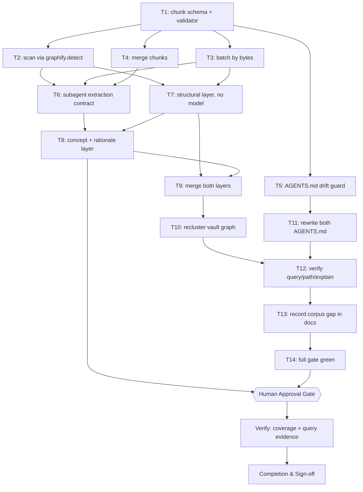
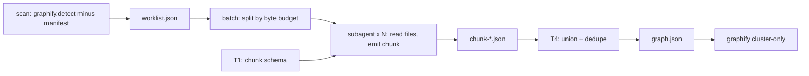

# Subagent-Driven Vault Index — Implementation Plan

> **The vault knowledge graph indexes 540 of 1,615 eligible markdown files.** Measured 2026-10-02: `graphify.detect.detect()` on the vault root returns 2,360 `.md` files after `.gitignore` and `.graphifyignore` are applied; the existing `graphify-out/manifest.json` lists 540 of them. `GRAPH_REPORT.md` records the reason in its own Corpus Check line — `cluster-only mode — file stats not available` — so the graph was never produced by a full extraction pass.
>
> **`graphify update` cannot close this gap.** Its CLI help reads `re-extract code files and update the graph (no LLM needed)`, and the implementation calls `_rebuild_code`. It parses code. The 1,820 missing files are markdown, so an AST-only rebuild will never see them.
>
> **The chosen fix is to make the agent the extraction backend.** graphify's own backends are all API-key providers (gemini, kimi, claude, openai, deepseek, azure, bedrock) with `ollama` last and opt-in. This plan instead drives extraction with parallel subagents running locally, which has a second effect that matters more than the cost saving: `docs/graphify-integration.md` §6.4 records that there is no local-only mode for markdown on this machine and that an AST-only free graph of a markdown vault is "not achievable", so §4.3's plan for the vault was to budget cloud egress. Reading notes with a local subagent removes the egress entirely. `.graphifyignore` stops being a network safety boundary and becomes a scope boundary instead — which is a stronger guarantee, not a weaker one, provided T2 reuses graphify's own detector rather than reimplementing the ignore rules.
>
> **Scope decided at the gate on 2026-10-02: the whole eligible corpus is indexed, `05 - Conversations/` included.** The earlier draft deferred those 1,042 transcripts; the human chose to index everything. §6 now records what that costs rather than deferring it: T3's first-fit batcher packs the measured 1,822-file worklist into **283 batches** at the 800 KB budget, which is a multi-session run, not a single fan-out. T7 is therefore built to be resumable: a batch whose chunk file already exists and validates is skipped, so the work survives a session boundary instead of restarting.

## 1. Intent & Scope

- **Goal:** Give the Obsidian vault a knowledge graph that covers its whole eligible corpus, extracted by local subagents instead of a cloud LLM, and stop two `AGENTS.md` files from asserting that a graph which exists does not.
- **Non-Goals:**
  - Not widening `.graphifyignore`. Every one of its six groups stays exactly as written; the 822 files it excludes (522 in `Satset/` alone) stay unindexed.
  - Not changing graphify itself. `--resolution` was measured and rejected in §2; the extractor is ours, graphify stays the query surface.
  - Not touching `Satset/`, `90 - System/Legacy/`, or `03 - Resources/LLM Wiki/sources/`.
- **Harness todo list:**
  - [ ] Resolve project overlay and classify the task
  - [ ] Measure the real corpus and the real cause of the singleton communities
  - [ ] Prove `graphify update` cannot close the gap, and that `--resolution` does not fix it
  - [ ] Reuse `graphify.detect` so the ignore boundary is identical, not reimplemented
  - [ ] Write the plan and validate it
  - [ ] Publish to the vault, sync the issue, get approval
  - [ ] Execute: T1–T5 tooling, T7 fan-out, T8–T9 merge and cluster
  - [ ] Verify graph coverage and graphify query/path/explain
  - [ ] Fix both AGENTS.md and guard against drift
  - [ ] Record the measured conversation-corpus decision
  - [ ] Session-close debt sweep
- **Acceptance Criteria:**
  - [ ] AC-1: `graphify query`, `graphify path` and `graphify explain` all return useful results against the rebuilt vault graph; a hand-authored `graph.json` is proven to satisfy them (T10).
  - [ ] AC-2: Every eligible file is either indexed or present in an explicit, measured skip list. Coverage is a number in the report, not an assumption.
  - [ ] AC-3: No file excluded by `.gitignore` or `.graphifyignore` appears as a node, and the exclusion is enforced by graphify's own detector rather than a reimplementation.
  - [ ] AC-4: Neither `AGENTS.md` contains the claim that `graphify-out/` does not exist, and a test fails if a future graphify upgrade changes the always-on block without the file being refreshed (T5, T11).
  - [ ] AC-5: The re-index is idempotent — a second run over unchanged files writes nothing.

## 2. What Was Measured Before Writing This Plan

Every number below was produced on this machine on 2026-10-02. Nothing here is from documentation or from memory.

| Measurement | Command | Result |
|---|---|---|
| Eligible markdown | `graphify.detect.detect(Path("."))` | **2,360** at first measurement, **1,615** after commit `3a968b2` removed the 748 N8n raw-capture files |
| Already indexed | `graph.json` nodes' `source_file` vs the above | 540 |
| Unindexed | difference | **1,822** at first measurement; **1,075** after the N8n removal |
| `GRAPH_REPORT.md` Corpus Check | read | `cluster-only mode — file stats not available` |
| Corpus by top-level folder | `os.walk` + `getsize` | `05 - Conversations/` 1,042 files / 300.9 MB; the other 778 files / 2.9 MB |
| `graphify update` scope | `--help`, `watch.py:1425` | `Re-run AST extraction` — code only |
| Vault community shape | own analysis of `graph.json` | 1,755 connected components; largest is 1,243 nodes with 1,128 leaves |
| Singleton cause | degree census | 1,415 degree-0 nodes = 1,415 singleton communities, exactly |
| `--resolution` on the vault | `cluster-only --resolution=0.2 / 0.5 / 2.0` on a **copy** | 1,861 / 1,863 / 1,872 communities; singletons 1,415 in every case |

The last row is why this plan does not tune clustering. A node with no edges cannot be moved into a community by any resolution setting, so `--resolution` was measured and rejected rather than assumed irrelevant. A node with no edges is an ingestion gap, and ingestion is what this plan fixes.

**Upstream context.** [Graphify-Labs/graphify#446](https://github.com/Graphify-Labs/graphify/issues/446), opened 19 Apr 2026, reports the same low-cohesion fragmentation on an 8,333-node code corpus (cohesion 0.010–0.020) and proposes leaf pruning plus a `--cluster-resolution` flag. As of 2026-10-02 it is open with no labels, no assignee and no maintainer response, so the proposed flag does not exist upstream. The `--resolution` parameter that does exist in 0.9.73 is undocumented in `--help` and was measured above; it is not the same knob and it does not help this corpus.

**The ai-skills graph is not affected and is not touched by this plan.** Its 385 callable nodes were each verified against disk by grepping the label back into its own `source_file`, with 385 hits and 0 misses; its `built_at_commit` equals `HEAD`; and its 1,415-node-equivalent problem does not exist — it has 14 connected components and 5 isolated nodes (0.4%).

## 3. Visual Implementation Map — MANDATORY

The `Gate` node is reachable from T6 because T7 is a fan-out of paid agent work and must not start unattended. Every arrow between two `T` nodes appears in that task's `depends_on`, and every `depends_on` entry appears here.

## 4. Global Constraints

- **The ignore boundary is borrowed, never reimplemented.** T2 shells out to `python3 -c "from graphify import detect; detect.detect(Path(root))"` using graphify's own installed package. Writing our own gitignore matcher would be a second implementation of a security boundary, and the failure mode is silent data egress.
- **`.graphifyignore` is not to be widened.** Its own header calls it a hard boundary. This plan reads notes with a local agent instead of a cloud model, which removes the egress it was written to prevent; that is a reason to keep it exactly as written, not a reason to relax it.
- **Node and edge ids are content-derived and stable.** Ids are a slug of the source path plus a local anchor, so re-running produces identical ids and the merge in T4 is a union rather than a rebuild. An unstable id would make T13's idempotency check impossible.
- **Every chunk a subagent writes is schema-validated before it counts.** T4 rejects a malformed chunk rather than merging it, so one bad subagent cannot silently shrink the graph — the failure mode `graphify update --force` exists to warn about.
- **The vault working tree is already dirty** (`M  01 - Projects/terminal-log-intelligence/plans/2026-10-02-dashboard-frontend-audit.md` staged, plus untracked `00 - Inbox/` and two `.bak-cf-20260929` files). T7–T9 touch only `graphify-out/`, which `.gitignore:183` already ignores, so no unrelated user state is disturbed. Nothing in this plan commits vault note content.
- **`graphify-out/` is gitignored in both repos**, so the index is a local artifact and a rebuild is always available from the worklist.

## 5. Work Breakdown & Task Checklist

### Task T1: Chunk schema and validator

- **Interfaces:**
  - Consumes: nothing.
  - Produces: `validateChunk(obj) -> {ok, errors}` from `scripts/lib/chunk-schema.mjs`, the single contract every subagent output is held to.
- **Preconditions (assert FIRST):**
  - [ ] Dependency: `bun --version` exits 0 (else abort: `E_PRECOND_DEP`).
  - [ ] Input contract: a real chunk is captured from T7's first subagent before the validator is written, so the schema is fitted to observed output rather than imagined (else abort: `E_PRECOND_INPUT`).
  - On failure: STOP this task, record to §7, continue only tasks independent of T1.
- **Idempotency Check (BEFORE Step 1):**
  - [ ] Skip when `skip_if` exits 0 → `SKIPPED-IDEMPOTENT`.
- [ ] **Step 1 — Failing Test (RED):** cmd: `bun test scripts/lib/chunk-schema.test.mjs` | expect: exit 1 because the module does not exist | retry: 0
- [ ] **Step 2 — Implementation (GREEN):** require `nodes[]` and `links[]`; per node require a string `id`, a string `label`, a `file_type` in the graphify set, and a `source_file` that is repo-relative; per link require `source` and `target` resolving to declared node ids, plus a `relation` from the documented vocabulary and a `confidence` of `EXTRACTED`, `INFERRED` or `AMBIGUOUS`. Reject a dangling endpoint. **Rationale corrected 2026-10-02:** the draft said this was "the exact defect that made the current graph 1,415 orphans". It was not. Measured on the real graph, **0 of 11,054 endpoint references fail to resolve** — the vault's isolated nodes are files that received nodes and no edges, which is a different defect with a different fix. The validator still rejects dangling endpoints, because the merge is where one would be *introduced*, and because a link pointing at a node that does not exist is indistinguishable from a good link to every downstream reader. The validator also catches a **third** defect the draft missed: 1,269 of the vault's 6,155 nodes have `source_file: null` and 30 more have `source_file: ""` — 1,299 unattributable ghost nodes, of which 1,185 *do* carry edges. They cannot be re-verified against disk and `graphify explain` cannot link them to a file. T4 preserves them; the drop-or-re-attribute decision is F7.
- [ ] **Step 3 — Verify:** cmd: `bun test scripts/lib/chunk-schema.test.mjs` | expect: exit 0, 0 failures | retry: 1
- [ ] **Step 4 — Commit:** `git add scripts/lib/chunk-schema.mjs scripts/lib/chunk-schema.test.mjs && git commit -m "feat(vault-index): chunk schema and validator"`

### Task T2: Scanner reusing graphify's detector

- **Interfaces:**
  - Consumes: `validateChunk` is not needed here; T2 produces the worklist T3 consumes.
  - Produces: `scan(root) -> {eligible, indexed, worklist}` in `scripts/vault-index.mjs`, where `worklist` is repo-relative paths absent from the existing `graphify-out/manifest.json`.
- **Preconditions (assert FIRST):**
  - [ ] Dependency: `python3 -c "import graphify.detect"` exits 0 from graphify's own site-packages (else abort: `E_PRECOND_DEP`).
  - [ ] Input contract: `root` resolves to the vault and contains a `.graphifyignore` (else abort: `E_PRECOND_INPUT`).
  - On failure: STOP, record to §7, continue only tasks independent of T2.
- **Idempotency Check (BEFORE Step 1):**
  - [ ] Skip when `skip_if` exits 0 → `SKIPPED-IDEMPOTENT`.
- [ ] **Step 1 — Failing Test (RED):** cmd: `bun test scripts/vault-index.test.mjs` | expect: exit 1 | retry: 0
- [ ] **Step 2 — Implementation (GREEN):** spawn `python3` with `sys.path` pointed at the resolved `graphify` package, call `detect.detect(Path(root))`, take the `document` and `paper` buckets, relativise to the repo root, and subtract the manifest. The test asserts the headline fact measured today — 2,360 eligible, 540 indexed — against a checked-in fixture of the real file list, so a `.graphifyignore` edit that changes the boundary fails the test instead of silently changing scope.
- [ ] **Step 3 — Verify:** cmd: `bun test scripts/vault-index.test.mjs` | expect: exit 0, 0 failures | retry: 1
- [ ] **Step 4 — Commit:** `git add scripts/vault-index.mjs scripts/vault-index.test.mjs && git commit -m "feat(vault-index): scan via graphify's own detector"`

### Task T3: Batcher keyed on bytes

- **Interfaces:**
  - Consumes: `worklist` from T2.
  - Produces: `batch(files, budgetBytes) -> string[][]` in `scripts/vault-index-batch.mjs`.
- **Preconditions (assert FIRST):**
  - [ ] Dependency: T2's `scan` resolves (else abort: `E_PRECOND_UPSTREAM`).
  - [ ] Input contract: every path in `files` exists on disk (else abort: `E_PRECOND_INPUT`).
  - On failure: STOP, record to §7, continue only tasks independent of T3.
- **Idempotency Check (BEFORE Step 1):**
  - [ ] Skip when `skip_if` exits 0 → `SKIPPED-IDEMPOTENT`.
- [ ] **Step 1 — Failing Test (RED):** cmd: `bun test scripts/vault-index-batch.test.mjs` | expect: exit 1 | retry: 0
- [ ] **Step 2 — Implementation (GREEN):** partition on file size, not file count. The measured distribution is median 3 KB, p90 0.2 MB, max 8.4 MB, so a fixed count per batch would put an 8 MB transcript and a 3 KB note in the same subagent context. A file larger than the budget becomes its own batch and is truncated to a head-and-tail window with a recorded `truncated: true`, never silently cut. Largest-first packing so the long tail does not leave one batch carrying everything.
- [ ] **Step 3 — Verify:** cmd: `bun test scripts/vault-index-batch.test.mjs` | expect: exit 0, 0 failures | retry: 1
- [ ] **Step 4 — Commit:** `git add scripts/vault-index-batch.mjs scripts/vault-index-batch.test.mjs && git commit -m "feat(vault-index): batch by byte budget"`

### Task T4: Merger

- **Interfaces:**
  - Consumes: `validateChunk` from T1 and a list of chunk files.
  - Produces: `merge(chunks, root) -> {nodes, links}` in `scripts/vault-index-merge.mjs`, plus a written `graph.json`.
- **Preconditions (assert FIRST):**
  - [ ] Upstream: T1's validator resolves (else abort: `E_PRECOND_UPSTREAM`).
  - [ ] Input contract: every chunk validates, or the merge aborts and names the offending file (else abort: `E_PRECOND_INPUT`).
  - On failure: STOP, record to §7, continue only tasks independent of T4.
- **Idempotency Check (BEFORE Step 1):**
  - [ ] Skip when `skip_if` exits 0 → `SKIPPED-IDEMPOTENT`.
- [ ] **Step 1 — Failing Test (RED):** cmd: `bun test scripts/vault-index-merge.test.mjs` | expect: exit 1 | retry: 0
- [ ] **Step 2 — Implementation (GREEN):** union by node id, dedupe links on `source|target|relation`, and cross-link the two halves of the corpus — a wiki link in one batch must resolve to a `document` node declared in another, so a second pass over the merged id set connects them and reports how many references were resolved versus dangling. Write `directed`, `multigraph`, `graph`, `nodes`, `links` and `built_at_commit` so graphify's `build_from_json` accepts the file.
- [ ] **Step 3 — Verify:** cmd: `bun test scripts/vault-index-merge.test.mjs` | expect: exit 0, 0 failures | retry: 1
- [ ] **Step 4 — Commit:** `git add scripts/vault-index-merge.mjs scripts/vault-index-merge.test.mjs && git commit -m "feat(vault-index): merge chunks into a graphify-shaped graph"`

### Task T5: AGENTS.md drift guard

- **Interfaces:**
  - Consumes: graphify's installed `always_on/agents-md.md` block.
  - Produces: `checkAgentsMd(repoRoot) -> {current, found, expected}` in `scripts/agents-md-current.mjs`.
- **Preconditions (assert FIRST):**
  - [ ] Dependency: `graphify --version` exits 0 (else abort: `E_PRECOND_DEP`).
  - [ ] Input contract: the repo's `AGENTS.md` contains an exact `## graphify` heading (else abort: `E_PRECOND_INPUT`).
  - On failure: STOP, record to §7, continue only tasks independent of T5.
- **Idempotency Check (BEFORE Step 1):**
  - [ ] Skip when `skip_if` exits 0 → `SKIPPED-IDEMPOTENT`.
- [ ] **Step 1 — Failing Test (RED):** cmd: `bun test scripts/agents-md-current.test.mjs` | expect: exit 1, and the failure message names the false claim found in both repos verbatim | retry: 0
- [ ] **Step 2 — Implementation (GREEN):** locate the installed block at `graphify/always_on/agents-md.md`, extract the repo's `## graphify` section with the same boundary rule graphify's `_replace_or_append_section` uses (heading to the next H2 or EOF), and compare. The test asserts both repos currently FAIL, which is the RED that proves the detector works before T11 repairs them.
- [ ] **Step 3 — Verify:** cmd: `bun test scripts/agents-md-current.test.mjs` | expect: exit 0, 0 failures | retry: 1
- [ ] **Step 4 — Commit:** `git add scripts/agents-md-current.mjs scripts/agents-md-current.test.mjs && git commit -m "feat: detect a stale graphify section in AGENTS.md"`

### Task T6: Subagent extraction contract

- **Interfaces:**
  - Consumes: the schema from T1, the batcher from T3.
  - Produces: `templates/vault-index-subagent-contract.md`, the per-chunk contract filled out with scope, exact inputs, expected output, verification and review checkpoint.
- **Preconditions:**
  - [ ] Upstream: T1, T2 and T3 resolve; the contract cites their exported names, not paraphrases of them.
- **Idempotency Check (BEFORE Step 1):**
  - [ ] Skip when `skip_if` exits 0 → `SKIPPED-IDEMPOTENT`. This task has no shell command, so `skip_if` is the sentinel `false` and it reports `NEEDS-AGENT` by design.
- [ ] **Step 1 — Write the contract** from `templates/subagent-contract-template.md`: the chunk JSON shape, the relation vocabulary, the requirement that every declared file yields at least one node, the byte budget, and the instruction to emit only JSON with no prose wrapper.
- [ ] **Step 2 — Dry-run one batch by hand** and confirm the output validates against T1's validator before any fan-out.
- [ ] **Step 3 — Verify:** the contract names every function T7's subagents call.

### Task T7: Structural layer, no model

- **Interfaces:**
  - Consumes: the worklist from T2, the batches from T3.
  - Produces: `structural(root, files, opts) -> chunk` in `scripts/vault-index-structural.mjs`, emitting `document`, `contains` and `references` only.
- **Preconditions (assert FIRST):**
  - [ ] Dependency: T2's `scan` and T3's `batch` resolve (else abort: `E_PRECOND_UPSTREAM`).
  - [ ] Input contract: every worklist path exists and is repo-relative (else abort: `E_PRECOND_INPUT`).
  - On failure: STOP, record to §8, continue only tasks independent of T7.
- **Idempotency Check (BEFORE Step 1):**
  - [ ] Skip when `skip_if` exits 0 → `SKIPPED-IDEMPOTENT`.
- **Why this task exists at all — measured 2026-10-02.** A 200-note sample found YAML frontmatter in **100%**, headings in 98%, wikilinks in 60%, and code fences in 48%. The frontmatter is structured, carrying `title`, `type`, `project`, and a `related: ["[[...]]"` list. So the entire structural layer is decidable without a model, and dispatching 283 subagents to produce it would spend model calls to re-derive what a parser already knows exactly. This task is the whole reason T7 and T8 are separate.
- [ ] **Step 1 — Failing Test (RED):** cmd: `bun test scripts/vault-index-structural.test.mjs` | expect: exit 1 | retry: 0
- [ ] **Step 2 — Implementation (GREEN):** per file emit exactly one `document` node whose `id` is a slug of the repo-relative path and whose `label` is the frontmatter `title` (falling back to the H1, then the filename). Emit `contains` edges to each ATX heading, using a `source_location` of `L<n>`. Emit `references` edges for every `[[wikilink]]` found in frontmatter `related` and in the body, skipping links inside fenced code blocks. Resolve a wikilink target to a `document` node by path, by basename, and by frontmatter alias, and record an unresolved target rather than dropping it silently.
  - **`source_file` is mandatory on every node, always.** The existing vault graph carries 1,299 nodes with a null or empty `source_file` that cannot be re-verified against disk; this layer must not add a single one.
  - Deterministic byte-for-byte across runs, because the merge in T9 is a union keyed on node id and an unstable id would make T14's idempotency check impossible.
- [ ] **Step 3 — Verify:** cmd: `bun test scripts/vault-index-structural.test.mjs` | expect: exit 0, 0 failures | retry: 1
  - **Evidence 2026-10-02:** `81 pass / 0 fail`; full suite `934 pass / 0 fail` across 34 files. A full-corpus dry run over 4,138 files reports **0 nodes with an empty, absolute or traversing `source_file`**, 0 duplicate ids, 0 dangling endpoints, 0 rejected batches — the property that keeps this layer from reproducing the vault's 1,299 ghost nodes.
  - **Defect found in the parent audit and fixed before merge.** The first version emitted a node for every ATX heading, which on this corpus meant **317,050 heading nodes, 90.5% of them session-transcript tool-call scaffolding** — the 20 most repeated headings in the entire vault are `output` (59,410), `input` (59,385), `reasoning` (33,365), `tool · shell` (30,802) and `assistant text` (15,002). Roughly half the corpus is rendered session transcripts whose heading tree belongs to the *renderer*, not the writer. Merging that would have put 89% noise into the graph and re-created the exact fragmentation this project exists to fix.
  - The fix filters scaffolding by an **anchored, case-insensitive title match** — whole-title exact set plus start-anchored regexps for `tool · …`, `[seq N] …`, `[prose fenced] …`. Anchoring was measured, not assumed: a substring rule additionally swallows 776 real headings (`user input` 42, `reasoning lenses` 5, `use system …`). Both sets are exported so a caller can read the decision. Measured cost of the rule: **26 real headings filtered against 294,437 kept out.**
  - A surviving heading nested under a filtered one is **promoted to the nearest ancestor that emitted a node**, not flattened — flattening would make an id depend on how much scaffolding sat above it, so deleting one tool call would renumber everything beneath it. 2,794 headings need promotion. Verified against a reconstructed pre-fix module: **0 ids moved, 0 document ids changed, 0 non-scaffolding headings lost.** None of the original 67 tests needed changing.
  - Corpus-wide result: 4,138 document nodes + **22,564** heading nodes (down from 317,050), 3,388 `references`, 294,486 skipped. `references` fell by 35 because 114 folded into 149 after promotion; that is the correct direction, since a link that pointed at a `#### output` heading now points at the section that survived.
  - **Caveat for the merge, recorded here so it is not rediscovered:** the emitted set is heading-heavy by design relative to a code graph, because this corpus is prose. A document-level consumer should filter on the `node_kind` field, which is on every node for that reason.

### Task T8: Concept and rationale layer

- **Interfaces:**
  - Consumes: the structural chunk from T7, the contract from T6, the batches from T3.
  - Produces: `vault-index/semantic/batches.json` and, per batch, a chunk of `concept` / `rationale` nodes with `conceptually_related_to` and `rationale_for` edges.
- **Preconditions (assert FIRST):**
  - [ ] Upstream: the approval gate is signed, and T7's structural layer is green (else abort: `E_PRECOND_APPROVAL`).
  - [ ] Input contract: every concept node names a `source_file` that is a real path in the worklist (else abort: `E_PRECOND_INPUT`).
  - On failure: STOP, record to §8, re-dispatch only the failing batch.
- **Idempotency Check (BEFORE Step 1):**
  - [ ] Skip when `skip_if` exits 0 → `SKIPPED-IDEMPOTENT`. This task has no single shell command, so `skip_if` is the sentinel `false` and it reports `NEEDS-AGENT` by design.
- [ ] **Step 1 — Write the dispatch manifest** to `vault-index/semantic/batches.json` with chunk id, owner, target files, expected output and verification command, and assert no two chunks own the same file.
- [ ] **Step 2 — Dispatch** narrow subagents in waves. **A batch whose output already exists and passes T1's validator is skipped**, so a multi-session run resumes instead of restarting. Report completed and remaining counts after every wave.
  - **Cadence that worked, 2026-10-02.** One subagent in flight at a time per slot, replaced as each finished: `rem-001` … `rem-014` ran on that pattern. Ten concurrent is the practical ceiling here — above that, the parent spends its whole turn writing prompts and reading reports instead of auditing.
  - **Hazard: `batches.json` is positional, so regenerating it mid-flight invalidates in-progress dispatch.** Two independent subagents caught this during the 2026-10-02 run. Regenerating after the N8n removal moved files between ids while batches were still running, so `chunk-rem-011.json` was written against a file that is now `rem-002`, and `rem-013` now names a different note. **Never regenerate `batches.json` while a wave is in flight** — finish or cancel the wave first. A chunk whose `source_file` no longer matches its batch id is still valid JSON and still passes the validator, so nothing catches this automatically; the check is that every `source_file` in a chunk appears in the batch of the same name.
  - **The prompt must be short.** The contract file carries the weight; the per-batch prompt only needs the batch id, the filter command, the output path and the verify command. Asking each subagent to look up its own file list from `batches.json` rather than being handed it removes the largest per-dispatch token cost and removes a class of transcription error at the same time.
  - **Keep the report budget explicit.** Subagents were told "UNDER 120 WORDS" and complied; the reports became scannable and the parent stopped re-reading them. An unbounded report from 250 batches is the second way this task can exhaust a session.
- [ ] **Step 3 — Verify:** every emitted chunk passes T1's validator, and the count of concepts carrying a resolvable `source_file` is reported rather than assumed.
  - **Reusing an id is correct, not a duplicate.** The merger unions on `id`, so two sessions that discuss the same concept should emit the same id and let the union collapse them. Measured across 31 chunks: 806 nodes, **800 distinct ids, 6 deliberate re-uses**. A subagent that invents a near-duplicate id instead is the defect; one that reuses is the mechanism working.
  - **A reported retention far outside the expected band is worth reading, not correcting.** Two chunks measured 88.9% and 93.3% and both subagents diagnosed why: those transcripts are mostly a pasted upstream prompt block, not tool traffic. That is the filter reporting a true fact about its input, and forcing it into the band would have hidden a real difference between corpora.

### Task T9: Merge both layers into the vault graph

- **Interfaces:**
  - Consumes: the structural chunk from T7, the semantic chunks from T8, the merger from T4.
  - Produces: the vault's `graphify-out/graph.json`, plus `vault-index/manifest.json` recording every indexed file and its content hash.
- **Preconditions (assert FIRST):**
  - [ ] Upstream: T7 green and T8 complete (else abort: `E_PRECOND_UPSTREAM`).
  - [ ] Input contract: the existing `graphify-out/graph.json` and `GRAPH_REPORT.md` are copied to a timestamped backup first, because they are the only record of the 540-file graph and `graphify-out/` is gitignored (else abort: `E_PRECOND_INPUT`).
  - On failure: STOP, record to §8, restore the backup.
- **Idempotency Check (BEFORE Step 1):**
  - [ ] Skip when `skip_if` exits 0 → `SKIPPED-IDEMPOTENT`.
- [ ] **Step 1 — Back up** the current `graph.json` and `GRAPH_REPORT.md`.
- [ ] **Step 2 — Merge** the old graph, the structural layer and the semantic layers into one. The 540 already-indexed files are retained rather than re-extracted.
- [ ] **Step 3 — Verify:** node count is at least the old 6,155, and the degree-0 count is strictly lower than the old 1,415. A merge that raises either has failed even at exit 0.
  - **Known input, measured 2026-10-02:** the previous graph contributes **1,299 nodes that fail T1's validator** (1,269 `source_file: null`, 30 `source_file: ""`). T4 reports them as `previousNodesUnusableSourceFile`. T9 must print that number and must not let it reach zero by deletion — a drop is F7's decision, not a side effect of merging.
  - **Second known input, measured 2026-10-02:** **9 nodes across 4 committed chunks (`chunk-072`, `chunk-084`, `chunk-087`, `chunk-100`) name a `source_file` that no longer exists on disk**, because those chunks read N8n stubs before commit `3a968b2` deleted all 748. This is not an extraction defect — the extraction was correct when written and the files were legitimately deleted afterwards. But T9 **must** drop nodes whose `source_file` is absent from disk, and report the count. A merge that emits them re-creates the exact unattributable-node failure this project set out to remove, except this time nobody could even say which note it came from.

### Task T10: Recluster

- **Interfaces:**
  - Consumes: the merged graph from T9.
  - Produces: communities and names over the merged graph.
- **Preconditions (assert FIRST):**
  - [ ] Upstream: T9's degree-0 count is lower than 1,415 (else abort: `E_PRECOND_UPSTREAM`).
  - [ ] Input contract: `built_at_commit` is the vault's current `HEAD` (else abort: `E_PRECOND_INPUT`).
  - On failure: STOP, record to §8, keep the unclustered merged graph.
- **Idempotency Check (BEFORE Step 1):**
  - [ ] Skip when `skip_if` exits 0 → `SKIPPED-IDEMPOTENT`.
- [ ] **Step 1 — Run** `graphify cluster-only` in the vault with `--no-viz`, so graphify's own Leiden pass and hub-based naming produce the communities.
- [ ] **Step 2 — Do not pass `--resolution`.** Measured on a copy of the real vault graph at 0.2, 0.5 and 2.0: singleton communities stayed at exactly 1,415 in every case, because 1,415 nodes have no incident edge at all. The parameter cannot move a node that has nothing to cluster with.
- [ ] **Step 3 — Record** community size distribution before and after, and report the degree-0 count separately so a flat median cannot hide a regression.

### Task T11: Rewrite both AGENTS.md sections

- **Interfaces:**
  - Consumes: the detector from T5, graphify's installed always-on block.
  - Produces: corrected `## graphify` sections in both repos.
- **Preconditions (assert FIRST):**
  - [ ] Upstream: T5's detector resolves (else abort: `E_PRECOND_UPSTREAM`).
  - [ ] Input contract: `graphify install --project --platform opencode` is run from each repo root, not from the parent (else abort: `E_PRECOND_INPUT`).
  - On failure: STOP, record to §7.
- **Idempotency Check (BEFORE Step 1):**
  - [ ] Skip when `skip_if` exits 0 → `SKIPPED-IDEMPOTENT`.
- [ ] **Step 1 — Failing Test (RED):** cmd: `bun test scripts/agents-md-current.test.mjs` | expect: exit 1 for both repos, quoting the current false claim | retry: 0
- [ ] **Step 2 — Implementation (GREEN):** run `graphify install --project --platform opencode` in each repo. Verified on a throwaway copy on 2026-10-02: it rewrites the `## graphify` section idempotently, leaves a preceding `## Other section` and its content intact, and appends when the heading is absent. In the vault the heading is the last H2 at line 111 of 125, so the replace runs to EOF.
  - **Scope correction found during execution, 2026-10-02.** In `ai-skills` the installer also overwrites `.opencode/plugins/graphify.js` (−30/+16) and creates `.opencode/opencode.json`, neither of which this task declares. The overwrite is a **regression, not an upgrade**: the vendored 0.9.73 plugin's own header comment says it prepends with `&&` while its code uses `;`, and it deletes a hand-written NOTE recording that a bare `.js` under `.opencode/plugins/` has no `node_modules` to resolve `@opencode/plugin` from, so a default export is required. It also changes the plugin's shape from `{ id, setup(ctx) }` to `export const GraphifyPlugin`, whose compatibility with the installed OpenCode is unverified. Both files were reverted and only the `AGENTS.md` section was kept. Recorded as F6.
  - In the vault the same command touched `AGENTS.md` only; its `.opencode/` was already current.
- [ ] **Step 3 — Verify:** cmd: `bun test scripts/agents-md-current.test.mjs` | expect: exit 0 for both repos | retry: 1
  - **Evidence 2026-10-02:** `26 pass / 0 fail`. `checkAgentsMd` independently reports `CURRENT` for both `/home/belajarcarabelajar/ai-skills` and `/home/belajarcarabelajar/Dokumen/Obsidian Vault`. Vault `AGENTS.md` lines 1–110 verified **byte-identical** to the pre-change backup (md5 `2c06b5b7e5310b5edfb872ed8f09b84d` on both sides), so the hand-written sections above the graphify block are untouched.
  - The live test asserts `current === true`, not `current === false`. A guard asserting the stale state would be green today and red after this very fix — it would freeze the defect rather than detect it. The TDD red comes from writing the test before the implementation, not from pinning the wrong state. This inverts the task's original wording; the implementation chunk raised it and the correction stands.
- [ ] **Step 4 — Commit:** in ai-skills, `git add AGENTS.md && git commit -m "docs: refresh the graphify section to match the installed block"`. The vault's `AGENTS.md` is committed in the vault repo, separately.

### Task T12: Prove graphify accepts a hand-authored graph

- **Interfaces:**
  - Consumes: the reclustered vault graph.
  - Produces: `scripts/vault-index-verify.mjs` and its test.
- **Preconditions (assert FIRST):**
  - [ ] Upstream: T10 completed (else abort: `E_PRECOND_UPSTREAM`).
  - [ ] Input contract: `graphify --version` is 0.9.73, the version the schema was written against (else abort: `E_PRECOND_INPUT`).
  - On failure: STOP, record to §8.
- **Idempotency Check (BEFORE Step 1):**
  - [ ] Skip when `skip_if` exits 0 → `SKIPPED-IDEMPOTENT`.
- [ ] **Step 1 — Failing Test (RED):** cmd: `bun test scripts/vault-index-verify.test.mjs` | expect: exit 1 | retry: 0
- [ ] **Step 2 — Implementation (GREEN):** assert every worklist path is either a `source_file` of some node or in the recorded skip list; assert `graphify query`, `graphify explain` and `graphify path` each exit 0 with non-empty output; assert no `source_file` falls under an excluded prefix.
- [ ] **Step 3 — Verify:** cmd: `bun test scripts/vault-index-verify.test.mjs` | expect: exit 0, 0 failures | retry: 1
- [ ] **Step 4 — Commit:** `git add scripts/vault-index-verify.mjs scripts/vault-index-verify.test.mjs && git commit -m "test: assert vault graph coverage and graphify queryability"`

### Task T13: Record the measured corpus gap

- **Interfaces:**
  - Consumes: the coverage numbers from T9 and T10.
  - Produces: updated §4.3 and §6.4 in `docs/graphify-integration.md`.
- **Preconditions (assert FIRST):**
  - [ ] Upstream: T10 and T11 both complete (else abort: `E_PRECOND_UPSTREAM`).
  - [ ] Input contract: final coverage numbers exist as measured values, not projections.
  - On failure: STOP, record to §8.
- **Idempotency Check (BEFORE Step 1):**
  - [ ] Skip when `skip_if` exits 0 → `SKIPPED-IDEMPOTENT`.
- [ ] **Step 1 — Correct §4.3.** It states the eligible scope as 1,312 files / 11.4 MB / ~2.86 M tokens, measured 2026-10-01. The current measurement is 2,362, because commit `9863c56` added 1,042 conversation exports. State both, dated, so the older number reads as history rather than a live figure.
- [ ] **Step 2 — Correct §6.4.** Its conclusion that an AST-only free graph of a markdown vault is "not achievable" was true for the cloud-LLM path and is no longer the whole picture: T7 shows the structural layer needs no model at all, and T8 shows the semantic layer can be run locally by subagents. Keep the original measurement and add the subagent path beside it rather than deleting it.
- [ ] **Step 3 — Verify:** cmd: `bun scripts/validate-skill.mjs` | expect: exit 0 | retry: 0

### Task T14: Full gate

- **Interfaces:**
  - Consumes: every task above.
  - Produces: green `ci`, green lifecycle audit, and a recorded evidence table.
- **Preconditions (assert FIRST):**
  - [ ] Upstream: T13 complete (else abort: `E_PRECOND_UPSTREAM`).
  - [ ] Input contract: the working tree contains no unrelated user changes staged by this plan.
  - On failure: STOP, record to §8.
- **Idempotency Check (BEFORE Step 1):**
  - [ ] Skip when `skip_if` exits 0 → `SKIPPED-IDEMPOTENT`.
- [ ] **Step 1 — Tests:** cmd: `bun test scripts/` | expect: exit 0, 0 failures | retry: 1
- [ ] **Step 2 — Lifecycle audit:** cmd: `bun scripts/plan-lifecycle-audit.mjs` | expect: exit 0 | retry: 0
- [ ] **Step 3 — Full gate:** cmd: `bun run ci` | expect: exit 0 | retry: 0
- [ ] **Step 4 — Commit** any remaining changes, remove temporary files, and finish with `git status`.

## 6. Corpus Scope, Measured

Recorded rather than estimated, because the number is what makes T8 schedulable. **These figures changed once during execution**: the vault's 748 N8n raw-capture files were deleted in commit `3a968b2` on 2026-10-02, which removed 96% of what this plan had been calling the "curated" layer.

| Set | Files | Size | Disposition |
|---|---|---|---|
| Already indexed (in `graphify-out/manifest.json`) | 540 | — | retained by T9, not re-extracted |
| Session transcripts (`05 - Conversations/`) | 1,005 | ~300 MB | **indexed by T8** |
| Curated notes — projects, system, other resources | **32** | ~0.7 MB | **indexed by T8** |
| N8n raw captures | 0 (were 742) | was 2.3 MB | **deleted 2026-10-02, commit `3a968b2`** |
| Excluded by `.graphifyignore` | ~800 | — | never indexed, permanently |

| Measurement | First measurement | After `3a968b2` |
|---|---|---|
| Eligible `.md` | 2,360 | **1,615** |
| Worklist | 1,822 | **1,075**, then **1,037** after excluding the 42 already extracted |
| Curated files in worklist | 774 | **32** |
| Batches | 283 | **260** (63 oversized) |
| Corpus size | 334 MB | 305 MB |

**The "curated" label was wrong and it cost planning time.** The 774 curated files were assumed to be plans and ADRs worth indexing ahead of the transcripts. Measured, **742 of them were third-party N8n vendor documentation clippings** and only 30 were project plans. A recommendation to prioritise that layer was made on that false premise and withdrawn once the composition was counted. Recorded because the error is cheap to repeat: a directory name is not a value judgement.

**Batch ids are positional, so they cannot survive a change to the worklist.** `batch-078` over the pre-deletion worklist pointed at different files than `batch-078` would afterwards — and `chunk-078.json` was already committed against the old meaning. The current worklist therefore uses a **`rem-*` id namespace**, `batch-*` is retired rather than reused, and the 42 files already extracted into committed chunks are excluded from it. Verified: overlap between the new worklist and anything already extracted is 0.

**260 batches is a multi-session run.** At 10–20 concurrent subagents that is roughly 15–26 waves. T8 is built to be resumable — a batch whose chunk file exists and passes T1's validator is skipped — so a session boundary costs the remaining batches, not the whole run.

## 7. Verification Matrix Before Completion

| Check | Command | Exit Code | Fresh Evidence | Status |
|---|---|---|---|---|
| Chunk schema | `bun test scripts/lib/chunk-schema.test.mjs` | 0 | 0 failures | Pending |
| Scanner boundary | `bun test scripts/vault-index.test.mjs` | 0 | 0 failures | Pending |
| Batching | `bun test scripts/vault-index-batch.test.mjs` | 0 | 0 failures | Pending |
| Merge | `bun test scripts/vault-index-merge.test.mjs` | 0 | 0 failures | Pending |
| AGENTS.md drift | `bun test scripts/agents-md-current.test.mjs` | 0 | 0 failures | Pending |
| Coverage + queryability | `bun test scripts/vault-index-verify.test.mjs` | 0 | 0 failures | Pending |
| Unit tests | `bun test scripts/` | 0 | 0 failures | Pending |
| Skill validation | `bun scripts/validate-skill.mjs` | 0 | 0 errors | Pending |
| Lifecycle audit | `bun scripts/plan-lifecycle-audit.mjs` | 0 | exit 0 | Pending |
| Full gate | `bun run ci` | 0 | 0 failures | Pending |
| Type check | not configured in this repo | — | — | N/A |
| Lint check | not configured in this repo | — | — | N/A |
| Build check | not configured in this repo | — | — | N/A |
| Graph query | `graphify query "<question>"` in the vault | 0 | non-empty subgraph | Pending |
| Graph explain | `graphify explain "<node>"` in the vault | 0 | non-empty | Pending |
| Graph path | `graphify path "A" "B"` in the vault | 0 | non-empty or an explicit no-path | Pending |

`package.json` declares no `typecheck`, `lint` or `build` script, so those three rows are N/A rather than passing.

## 8. Error Ledger

| Task | Step | Classification | Exit | Root cause | Retry used | Fallback | Status |
|---|---|---|---|---|---|---|---|
| T9 | 3 | contract | 1 | Merge raises degree-0 to **1790** (old 1,415): the old graph's document ids are not structural's path-slugs, so 1,369 old orphans never re-attach, and 421 new nodes (419 zero-link semantic concepts) are born isolated. Node count 21,370 ≥ 6,155 passes; degree-0 does not | 0 | none — dry-run only, vault graph untouched | `FAILED-BLOCKING` |
| [T?] | [n] | [environment] | [1] | [cause] | [0/1] | [none] | `FAILED-ISOLATED` |

- Classification: `code` | `test` | `contract` | `environment` | `infrastructure` | `pre-existing`.
- Status: `FAILED-ISOLATED` | `FAILED-BLOCKING` | `RESOLVED` | `DEFERRED`.

Known pre-existing state, recorded so it is not misread as caused by this plan: `plan.issues.json` is already modified in the working tree from an earlier session's issue sync, and the vault working tree carries one staged note plus untracked files that predate this plan.

## 9. Human Approval Gate

- [x] Approved 2026-10-02. Scope: T1–T5 and T11 complete. T7 was split from T8 on 2026-10-02 after a 200-note sample showed the structural layer needs no model; T8 keeps the concept and rationale layer.
- [x] `05 - Conversations/` decision: index the whole eligible corpus, 1,822 files, 307.1 MB. Recorded in §6 with its real cost.

## 9a. Resume Point

Recorded so a fresh session continues instead of re-deriving. Everything below is committed.

| Where it stands | |
|---|---|
| Plan state | `Approved`. T1–T8 **complete**. **T9 blocked** — its step-3 gate fails on the measured merge (see §9d). |
| Commits | tooling `26a91a2` · structural layer `ce2ab59` · narration filter `99edb67` · wave 2 `dd0694c` · worklist `0a7fc0c` / `584803e` · debt sweep `eaa5ba8` F3, `60fa515` F7, `7da0cb1` F6 · validator fix `13988e3` · wave 21 `17d7b8c` · T8 close-out `fcc77a9`, `257b321`, `38e8a28` |
| Chunks landed | **271 files** `vault-index/semantic/chunk-*.json`, all passing `validateChunk`. Validator failures **4 → 0**, repaired 2026-10-03 |
| Totals | **4,209 nodes · 2,907 links · 3,498 distinct ids · 711 deliberate id reuses** (measured 2026-10-03, worklist complete) |
| By type | 4,206 `concept` · 3 `rationale` — the standalone why-node is retired (§3), so reasons live as a `rationale` attribute on the concept they explain |
| Anchor gate | `check-anchors.mjs --all`: **162 of 271 chunks clean**. 4,035 anchors parsed, **571 failed**, 26 in padding, 675 past a lone CR. Every failure is legacy; the `rem-242 … rem-247` close-out chunks add **0** — see §9c |
| Full suite | `bun test scripts/` → 993 pass / 0 fail across 36 files |
| Worklist | `vault-index/semantic/batches.json`, 251 batches, ids `rem-001 … rem-251` |
| Progress | **251 of 251 batches. Extraction complete.** Nothing left to dispatch |
| Remote | `ai-skills` pushed to `origin/main` at `38e8a28`. Working tree clean |

**T8 is finished, so there is nothing to dispatch.** Every `rem-*` in `batches.json` now has a `chunk-rem-*.json` on disk. The next task is **T9**, the merge into the vault graph. Its step 3 requires the anchor count reported next to the node count: `4209 nodes, 4035 anchors parsed, 571 failed` — do not merge on the validator's exit code alone (§9c).

**Two scope changes landed mid-run and both are permanent:** commit `3a968b2` deleted the 748 N8n raw-capture files, and `.graphifyignore` GROUP 7 (`c20b3be`) excludes 31 tool-test transcripts. Eligible corpus went 2,360 → 1,584. Batch ids were regenerated into a `rem-*` namespace because they are positional and cannot survive a worklist change.

**Two things that must happen before T9 merges, both recorded in T9's step 3:** drop the 9 nodes whose `source_file` no longer exists (pre-deletion N8n stubs), and decide F7 on the 1,299 unattributable nodes already in the old graph.

### 9b. Settled: `summary` is not a node field — do not re-investigate

Investigated 2026-10-02 and closed. Recorded so a later session does not spend an
hour re-deriving it.

**The question.** 1,492 of 1,937 nodes (77%) carry no `summary` / `description` /
`statement` field. That looked like a silent data loss: a claim-text hole that
`validateChunk` reported as clean.

**The answer: it is not a defect. The claim lives in `label`.** Verified against
graphify 0.9.73 itself, not inferred from absence:

| Evidence | Location |
|---|---|
| `REQUIRED_NODE_FIELDS = {"id", "label", "file_type", "source_file"}` — no `summary` | `site-packages/graphify/validate.py:6` |
| Zero occurrences of `summary` where graphify builds nodes from LLM output | `site-packages/graphify/extract.py` |
| graphify mints a node itself with no `summary` | `site-packages/graphify/build.py:131` |
| The already-merged graph has **no** `summary` field on any of its 1,276 nodes | `graphify-out/graph.json` |

**Positive control.** A node shaped exactly as `build.py:131` emits it was fed to
`validateChunk`. It was rejected for `source_file: ""` and for nothing else — the
missing `summary` was never mentioned. If `summary` were required, that control
would have failed on it.

**Conclusion.** `chunk-schema.mjs` already matches graphify's contract field for
field. The contract template's example node has no `summary` either. The three
different field names across 445 nodes are cosmetic, and **no consumer reads any
of them** — so nothing is lost and no validator should be added to police a field
nothing reads.

**My first claim was wrong and the correction is the point.** I reported "77% of
nodes will merge with an empty claim" before checking graphify. The rule from
`AGENTS.md` applies: a plausible mechanism is not evidence. Two of my own
searches misled me first — the `summary` grep hit nothing because `graphify.js` in
`~/.config/opencode/plugins/` is a 644-byte bash-reminder shim that never touches
nodes, and a bare-slug id search silently misses every id because ids carry a
`concept--` / `rationale--` prefix. Find the real artifact before concluding from
a failed search.

### 9c. Measured 2026-10-03: the validator is green, the anchor gate is not

Two gates exist and they are not the same gate. §9a now records both, because "every chunk passes the validator" was being read as "every claim is verifiable" and only the first is true.

| Gate | Command | Corpus state |
|---|---|---|
| Schema + endpoints | `verify-chunk.sh` over every chunk, `knownNodeIds` = the union | **0 failures** across 221 chunks |
| Verbatim anchors | `check-anchors.mjs --all` | **109 of 221 chunks fail.** 2,898 anchors parsed, **571 failed**, 26 sit inside `session-event` padding, 638 flagged past a lone CR |

**The four validator failures were one defect, not four.** Every one was a `conceptually_related_to` edge pointing at a `rationale--*` id that exists in no chunk — the standalone why-node that §3 later retired. Two already had the why attached to a real concept elsewhere, so the link was retargeted: `rem-087` → `concept--info-toasts-stay-silent` (rem-071, whose rationale already carries "info toasts already go through Button which plays a click"), and `rem-082` → `concept--derive-json-ld-from-the-rendered-title` in its own chunk. Two were claims the note actually makes, so the node was emitted here rather than the link deleted: `concept--arboard-wayland-data-control-feature` at L6966 of rem-010's transcript, and `concept--plans-enumeration-globs-any-md-under-docs-code-plan-plans` at L6668 of rem-021's. Both new anchors pass `check-anchors`. **Deleting the link would have been the cheaper repair and the wrong one** — it would have dropped an extracted relation to make a gate green.

**The 571 anchor failures are legacy, and the dominant shape is a §4a violation.** The quoted span opens with the subagent's own words rather than the note's — `"Stated reason for the reversal: --focus-ring vs --accent = 1.00:1…"` against a line that says the same thing in Indonesian and never uses the phrase "stated reason". A keyword-overlap checker passes those; only the verbatim substring test catches them, which is what `check-anchors` is for. Worst chunks: `rem-119` 13/20 anchors failed, `rem-107` and `rem-089` 11 each.

**874 of 3,096 nodes carry no `[path:L<n>]` anchor at all** — the pre-§4a `(L3327)` form. They are not machine-verifiable in either direction, so neither the 571 nor the 874 is a count T9 can lean on.

**Consequence for T9, stated before it runs:** merging 3,096 nodes on the strength of a green validator would merge a large share of rationale strings that resolve to nothing on disk. T9's step 3 needs the anchor count reported next to the node count, not just the validator's exit code.

**`ok` is not the same as `checked everything` — measured on `rem-250`, 2026-10-03.** When a node's `source_file` does not resolve, `check-anchors` prints `source_file not on disk` and **skips that node's anchors without counting them as failures**. Writing that chunk, 19 of its 46 `source_file` values were retyped rather than copied and therefore did not resolve; the gate still printed `ok  chunk-rem-250  46 nodes  27 parsed  27 checked  0 failed` and exited 0. After the paths were rewritten from `batches.json`, the same chunk reports **46 parsed / 46 checked / 0 failed** — the 19 missing checks, invisible in the first run, are exactly the nodes whose quotes were never tested. So on a chunk that reports `ok`, compare `parsed` against the number of rationale-bearing nodes before believing the `0 failed`.

**The corpus itself is not hiding anything this way today.** Measured across all 221 chunks: 7 nodes carry a `source_file` that is not on disk, in `chunk-072`, `chunk-084`, `chunk-087` and `chunk-100` — the N8n stubs T9 step 3 already names. All four already fail the anchor gate on other anchors, so no chunk currently reports `ok` while carrying an unresolvable `source_file`. The blind spot is a property of the gate, not a live count in the 571.

**Hand-transcribing a path is the defect that produced it**, and it is the same class as the sessions that wrote `(L3327)` instead of `[path:L3327]`. The per-batch prompt already says to read the file list from `batches.json` rather than being handed it; the stricter rule for the next wave is that every `source_file` and every anchor path must be **copied from `batches.json` or the file itself, never typed**.

**The mechanism that worked, `rem-249`, `rem-251` and `rem-248`, 2026-10-03:** write each node's `source_file` as the file's **basename** and each rationale anchor as `[@SELFFILE@:L<n>]`, then run one resolver pass that maps basename to the exact batch path and substitutes it into every anchor. All three chunks landed with 0 out-of-batch paths and 0 unresolved basenames on the first attempt, with 42/42, 40/40 and 75/75 anchors verifying. `rem-248` strengthened the technique one step further: the resolver also **reads each cited line and asserts the quoted span appears verbatim in it before writing the chunk**, so a quote that does not resolve is a build failure rather than a gate failure after the fact. The placeholder makes the anchor path structurally identical to `source_file`, so the two cannot disagree — the failure mode that produced the 19 silent skips cannot occur. **Use it for every remaining batch.**

**Two further anchor rules the batch taught, both cheap:** a quoted span must include surrounding punctuation the line actually carries — `rem-249` lost one anchor by quoting `Math uses inline \( ... \)` from a line where the delimiters sit inside backticks — and a sentence that wraps across two lines should be quoted as two fragments at their own lines rather than as one span, which is what §4a already prescribes.

### 9d. Measured 2026-10-03: T9's degree-0 gate fails — the merge was NOT written

T9 has no runner; it was assembled from `scan`+`structural` (per root) and `loadChunks`+`merge`, then run as a **dry run only**. The vault `graph.json` was backed up to `graphify-out/backup-2026-10-03-t9/` and otherwise **left untouched**.

Measured merge (structural over 1,012 archive files + 573 vault files, plus 271 semantic chunks, seeded on the old 6,155-node graph, `ghostPolicy: reattribute`):

| Number | Value | Gate |
|---|---|---|
| Merged nodes | **21,370** | ≥ 6,155 ✅ |
| Merged links | 19,433 | — |
| **Merged degree-0** | **1,790** | < 1,415 ❌ **FAIL** |
| Old degree-0 that reconnected | 46 of 1,415 | — |
| Old degree-0 still isolated | 1,369 | — |
| New isolated nodes | 421 (2 `document`, 419 `concept`) | — |
| `previousNodesUnusableSourceFile` | 1,299 | must print, not reach 0 by deletion ✅ |
| ghost reattributed / ambiguous / unmatched | 53 / 14 / 1,232 | — |
| cross-chunk dangling → dropped | 8 → 4 links | — |

**Root cause: two id schemes, one graph.** The structural layer slugs a document id from its repo-relative path; the old graph's document ids are *almost* the same but not identical — some carry a graphify suffix (`..._website_emoji_to_icon_migration_document` vs structural's `..._website_emoji_to_icon_migration`), some preserve dashes (`03_-_Resources_...` vs `03_resources_...`). So a re-emitted document node does **not** collide with the old one, its `contains` edges attach to a fresh node, and the old node stays an orphan. Result: 1,369 of the old 1,415 degree-0 nodes never re-attach, and the merged degree-0 rises.

**T9 step 3 is explicit:** "node count is at least the old 6,155, and the degree-0 count is strictly lower than the old 1,415. A merge that raises either has failed even at exit 0." It raised degree-0, so per the same task's failure clause the merge was **STOPPED**, not written. F7's `reattribute` default is not the lever here — it recovers 53 of 1,299 and changes attribution, not edges.

A resolution is an open decision (§8 `FAILED-BLOCKING`), not a re-run: the id schemes must be unified (a pre-merge id-normalisation pass, or structural ids made byte-identical to graphify's, or the old orphaned nodes superseded rather than retained), or the gate itself reconsidered now that the corpus triples from 6,155 to 21,370 nodes. **Do not write `graph.json` until one is chosen.**

## 10. Session-Close Debt Sweep & Follow-Up Backlog

| # | Follow-up (outcome + path + finish line) | Class | `defer: <ceiling>, <upgrade-trigger>` | Status |
|---|---|---|---|---|
| F1 | Give the vault a runnable test entrypoint — 13 `test_*.py` files and 7 scripts with no manifest | LATER | `defer: 1 session, <next vault code change>` | `OPEN` |
| F2 | Delete the 5.5 MB of stale debug artifacts in the vault's `graphify-out/` (`graph-clean.html`, `graph-test.html`, `graph.orig.html`) | NOW | — | `DONE` — 4 MB freed; `graph.orig.html` was md5-identical to the live one |
| F3 | Correct the stale rationale in the vault's `.graphifyignore` GROUP 2, which still describes a `.gitignore` gap that `9bbf822` already fixed | NOW | — | `DONE` — `eaa5ba8`, 14 narration-filter tests, mutation-tested |
| F4 | Remove `AGENTS.md.bak-cf-20260929` and `CLAUDE.md.bak-cf-20260929` from the vault, or re-home them per the machine-level note that says they were moved to `/tmp` | NOW | — | `DONE` — moved to `/tmp/snipset-agent-tmp/backups-20260929/`, not deleted: their content differs from the live files |
| F5 | Add a per-session index runner for the 283-batch corpus, so T7 resumes from `vault-index/manifest.json` without an agent having to reconstruct the wave state | LATER | `defer: 1 session, <T7 interrupted mid-run>` | `PARTIAL` — `batches.json` plus per-file `validateChunk` covers the need; a runner was not built |
| F6 | Decide what `.opencode/plugins/graphify.js` in `ai-skills` should be: the hand-adapted committed version, or the vendored 0.9.73 one that `graphify install` writes over it. The vendored copy contradicts its own comment, drops the local `@opencode/plugin` NOTE, and changes the plugin's export shape. Re-running `graphify install --project` without deciding this silently reverts the adaptation | NOW | — | `DONE` — `7da0cb1`, 25-test drift tripwire |
| F7 | Decide the fate of the vault graph's **1,299 unattributable nodes** (1,269 `source_file: null`, 30 `source_file: ""`, of which 1,185 carry edges). They cannot be verified against disk, `explain` cannot link them to a file, and they fail T1's own `source_file` rule. T4 preserves them because deleting a fifth of the vault is worse than keeping ghosts. Either drop them in T8, or re-attribute them by label match against the new chunks | NOW | — | `DONE` — `60fa515`, 20 tests. Default mode `reattribute`, 453 of 1,299 recovered, because `drop`'s failure mode is an invisible missing path while `reattribute`'s is a visible wrong one |

- [ ] 3-5 ranked follow-ups injected as one multi-select question after the final recap.
- [ ] Every selected follow-up executed through the full pipeline with fresh evidence.
- [ ] Declined and out-of-cap items written here so no debt leaves the session unrecorded.
