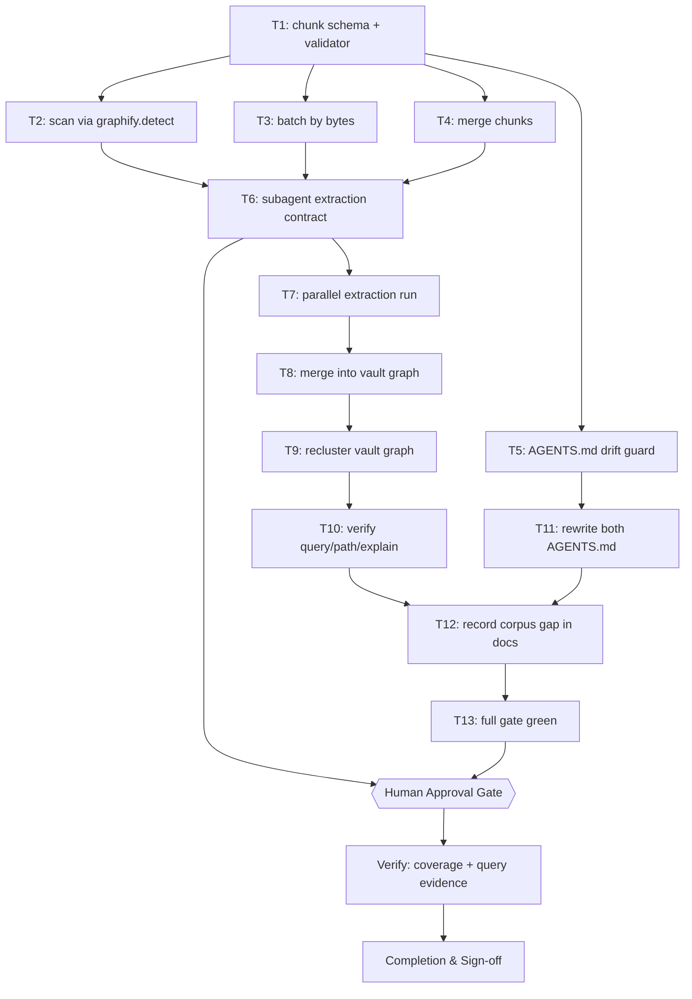
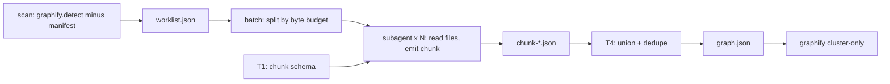

# Subagent-Driven Vault Index — Implementation Plan

> **The vault knowledge graph indexes 540 of 2,360 eligible markdown files.** Measured 2026-10-02: `graphify.detect.detect()` on the vault root returns 2,360 `.md` files after `.gitignore` and `.graphifyignore` are applied; the existing `graphify-out/manifest.json` lists 540 of them. `GRAPH_REPORT.md` records the reason in its own Corpus Check line — `cluster-only mode — file stats not available` — so the graph was never produced by a full extraction pass.
>
> **`graphify update` cannot close this gap.** Its CLI help reads `re-extract code files and update the graph (no LLM needed)`, and the implementation calls `_rebuild_code`. It parses code. The 1,820 missing files are markdown, so an AST-only rebuild will never see them.
>
> **The chosen fix is to make the agent the extraction backend.** graphify's own backends are all API-key providers (gemini, kimi, claude, openai, deepseek, azure, bedrock) with `ollama` last and opt-in. This plan instead drives extraction with parallel subagents running locally, which has a second effect that matters more than the cost saving: `docs/graphify-integration.md` §6.4 records that there is no local-only mode for markdown on this machine and that an AST-only free graph of a markdown vault is "not achievable", so §4.3's plan for the vault was to budget cloud egress. Reading notes with a local subagent removes the egress entirely. `.graphifyignore` stops being a network safety boundary and becomes a scope boundary instead — which is a stronger guarantee, not a weaker one, provided T2 reuses graphify's own detector rather than reimplementing the ignore rules.
>
> **Scope decided at the gate on 2026-10-02: the whole eligible corpus is indexed, `05 - Conversations/` included.** The earlier draft deferred those 1,042 transcripts; the human chose to index everything. §6 now records what that costs rather than deferring it: T3's first-fit batcher packs the measured 1,822-file worklist into **283 batches** at the 800 KB budget, which is a multi-session run, not a single fan-out. T7 is therefore built to be resumable: a batch whose chunk file already exists and validates is skipped, so the work survives a session boundary instead of restarting.

## 1. Intent & Scope

- **Goal:** Give the Obsidian vault a knowledge graph that covers its whole eligible corpus, extracted by local subagents instead of a cloud LLM, and stop two `AGENTS.md` files from asserting that a graph which exists does not.
- **Non-Goals:**
  - Not widening `.graphifyignore`. Every one of its six groups stays exactly as written; the 822 files it excludes (522 in `Satset/` alone) stay unindexed.
  - Not changing graphify itself. `--resolution` was measured and rejected in §2; the extractor is ours, graphify stays the query surface.
  - Not touching `Satset/`, `90 - System/Legacy/`, or `03 - Resources/LLM Wiki/sources/`.
- **Harness todo list:**
  - [ ] Resolve project overlay and classify the task
  - [ ] Measure the real corpus and the real cause of the singleton communities
  - [ ] Prove `graphify update` cannot close the gap, and that `--resolution` does not fix it
  - [ ] Reuse `graphify.detect` so the ignore boundary is identical, not reimplemented
  - [ ] Write the plan and validate it
  - [ ] Publish to the vault, sync the issue, get approval
  - [ ] Execute: T1–T5 tooling, T7 fan-out, T8–T9 merge and cluster
  - [ ] Verify graph coverage and graphify query/path/explain
  - [ ] Fix both AGENTS.md and guard against drift
  - [ ] Record the measured conversation-corpus decision
  - [ ] Session-close debt sweep
- **Acceptance Criteria:**
  - [ ] AC-1: `graphify query`, `graphify path` and `graphify explain` all return useful results against the rebuilt vault graph; a hand-authored `graph.json` is proven to satisfy them (T10).
  - [ ] AC-2: Every eligible file is either indexed or present in an explicit, measured skip list. Coverage is a number in the report, not an assumption.
  - [ ] AC-3: No file excluded by `.gitignore` or `.graphifyignore` appears as a node, and the exclusion is enforced by graphify's own detector rather than a reimplementation.
  - [ ] AC-4: Neither `AGENTS.md` contains the claim that `graphify-out/` does not exist, and a test fails if a future graphify upgrade changes the always-on block without the file being refreshed (T5, T11).
  - [ ] AC-5: The re-index is idempotent — a second run over unchanged files writes nothing.

## 2. What Was Measured Before Writing This Plan

Every number below was produced on this machine on 2026-10-02. Nothing here is from documentation or from memory.

| Measurement | Command | Result |
|---|---|---|
| Eligible markdown | `graphify.detect.detect(Path("."))` | 2,360 `.md` after both ignore files |
| Already indexed | `graph.json` nodes' `source_file` vs the above | 540 |
| Unindexed | difference | **1,820 files** |
| `GRAPH_REPORT.md` Corpus Check | read | `cluster-only mode — file stats not available` |
| Corpus by top-level folder | `os.walk` + `getsize` | `05 - Conversations/` 1,042 files / 300.9 MB; the other 778 files / 2.9 MB |
| `graphify update` scope | `--help`, `watch.py:1425` | `Re-run AST extraction` — code only |
| Vault community shape | own analysis of `graph.json` | 1,755 connected components; largest is 1,243 nodes with 1,128 leaves |
| Singleton cause | degree census | 1,415 degree-0 nodes = 1,415 singleton communities, exactly |
| `--resolution` on the vault | `cluster-only --resolution=0.2 / 0.5 / 2.0` on a **copy** | 1,861 / 1,863 / 1,872 communities; singletons 1,415 in every case |

The last row is why this plan does not tune clustering. A node with no edges cannot be moved into a community by any resolution setting, so `--resolution` was measured and rejected rather than assumed irrelevant. A node with no edges is an ingestion gap, and ingestion is what this plan fixes.

**Upstream context.** [Graphify-Labs/graphify#446](https://github.com/Graphify-Labs/graphify/issues/446), opened 19 Apr 2026, reports the same low-cohesion fragmentation on an 8,333-node code corpus (cohesion 0.010–0.020) and proposes leaf pruning plus a `--cluster-resolution` flag. As of 2026-10-02 it is open with no labels, no assignee and no maintainer response, so the proposed flag does not exist upstream. The `--resolution` parameter that does exist in 0.9.73 is undocumented in `--help` and was measured above; it is not the same knob and it does not help this corpus.

**The ai-skills graph is not affected and is not touched by this plan.** Its 385 callable nodes were each verified against disk by grepping the label back into its own `source_file`, with 385 hits and 0 misses; its `built_at_commit` equals `HEAD`; and its 1,415-node-equivalent problem does not exist — it has 14 connected components and 5 isolated nodes (0.4%).

## 3. Visual Implementation Map — MANDATORY

The `Gate` node is reachable from T6 because T7 is a fan-out of paid agent work and must not start unattended. Every arrow between two `T` nodes appears in that task's `depends_on`, and every `depends_on` entry appears here.

## 4. Global Constraints

- **The ignore boundary is borrowed, never reimplemented.** T2 shells out to `python3 -c "from graphify import detect; detect.detect(Path(root))"` using graphify's own installed package. Writing our own gitignore matcher would be a second implementation of a security boundary, and the failure mode is silent data egress.
- **`.graphifyignore` is not to be widened.** Its own header calls it a hard boundary. This plan reads notes with a local agent instead of a cloud model, which removes the egress it was written to prevent; that is a reason to keep it exactly as written, not a reason to relax it.
- **Node and edge ids are content-derived and stable.** Ids are a slug of the source path plus a local anchor, so re-running produces identical ids and the merge in T4 is a union rather than a rebuild. An unstable id would make T13's idempotency check impossible.
- **Every chunk a subagent writes is schema-validated before it counts.** T4 rejects a malformed chunk rather than merging it, so one bad subagent cannot silently shrink the graph — the failure mode `graphify update --force` exists to warn about.
- **The vault working tree is already dirty** (`M  01 - Projects/terminal-log-intelligence/plans/2026-10-02-dashboard-frontend-audit.md` staged, plus untracked `00 - Inbox/` and two `.bak-cf-20260929` files). T7–T9 touch only `graphify-out/`, which `.gitignore:183` already ignores, so no unrelated user state is disturbed. Nothing in this plan commits vault note content.
- **`graphify-out/` is gitignored in both repos**, so the index is a local artifact and a rebuild is always available from the worklist.

## 5. Work Breakdown & Task Checklist

### Task T1: Chunk schema and validator

- **Interfaces:**
  - Consumes: nothing.
  - Produces: `validateChunk(obj) -> {ok, errors}` from `scripts/lib/chunk-schema.mjs`, the single contract every subagent output is held to.
- **Preconditions (assert FIRST):**
  - [ ] Dependency: `bun --version` exits 0 (else abort: `E_PRECOND_DEP`).
  - [ ] Input contract: a real chunk is captured from T7's first subagent before the validator is written, so the schema is fitted to observed output rather than imagined (else abort: `E_PRECOND_INPUT`).
  - On failure: STOP this task, record to §7, continue only tasks independent of T1.
- **Idempotency Check (BEFORE Step 1):**
  - [ ] Skip when `skip_if` exits 0 → `SKIPPED-IDEMPOTENT`.
- [ ] **Step 1 — Failing Test (RED):** cmd: `bun test scripts/lib/chunk-schema.test.mjs` | expect: exit 1 because the module does not exist | retry: 0
- [ ] **Step 2 — Implementation (GREEN):** require `nodes[]` and `links[]`; per node require a string `id`, a string `label`, a `file_type` in the graphify set, and a `source_file` that is repo-relative; per link require `source` and `target` resolving to declared node ids, plus a `relation` from the documented vocabulary and a `confidence` of `EXTRACTED`, `INFERRED` or `AMBIGUOUS`. Reject a dangling endpoint. **Rationale corrected 2026-10-02:** the draft said this was "the exact defect that made the current graph 1,415 orphans". It was not. Measured on the real graph, **0 of 11,054 endpoint references fail to resolve** — the vault's isolated nodes are files that received nodes and no edges, which is a different defect with a different fix. The validator still rejects dangling endpoints, because the merge is where one would be *introduced*, and because a link pointing at a node that does not exist is indistinguishable from a good link to every downstream reader. The validator also catches a **third** defect the draft missed: 1,269 of the vault's 6,155 nodes have `source_file: null` and 30 more have `source_file: ""` — 1,299 unattributable ghost nodes, of which 1,185 *do* carry edges. They cannot be re-verified against disk and `graphify explain` cannot link them to a file. T4 preserves them; the drop-or-re-attribute decision is F7.
- [ ] **Step 3 — Verify:** cmd: `bun test scripts/lib/chunk-schema.test.mjs` | expect: exit 0, 0 failures | retry: 1
- [ ] **Step 4 — Commit:** `git add scripts/lib/chunk-schema.mjs scripts/lib/chunk-schema.test.mjs && git commit -m "feat(vault-index): chunk schema and validator"`

### Task T2: Scanner reusing graphify's detector

- **Interfaces:**
  - Consumes: `validateChunk` is not needed here; T2 produces the worklist T3 consumes.
  - Produces: `scan(root) -> {eligible, indexed, worklist}` in `scripts/vault-index.mjs`, where `worklist` is repo-relative paths absent from the existing `graphify-out/manifest.json`.
- **Preconditions (assert FIRST):**
  - [ ] Dependency: `python3 -c "import graphify.detect"` exits 0 from graphify's own site-packages (else abort: `E_PRECOND_DEP`).
  - [ ] Input contract: `root` resolves to the vault and contains a `.graphifyignore` (else abort: `E_PRECOND_INPUT`).
  - On failure: STOP, record to §7, continue only tasks independent of T2.
- **Idempotency Check (BEFORE Step 1):**
  - [ ] Skip when `skip_if` exits 0 → `SKIPPED-IDEMPOTENT`.
- [ ] **Step 1 — Failing Test (RED):** cmd: `bun test scripts/vault-index.test.mjs` | expect: exit 1 | retry: 0
- [ ] **Step 2 — Implementation (GREEN):** spawn `python3` with `sys.path` pointed at the resolved `graphify` package, call `detect.detect(Path(root))`, take the `document` and `paper` buckets, relativise to the repo root, and subtract the manifest. The test asserts the headline fact measured today — 2,360 eligible, 540 indexed — against a checked-in fixture of the real file list, so a `.graphifyignore` edit that changes the boundary fails the test instead of silently changing scope.
- [ ] **Step 3 — Verify:** cmd: `bun test scripts/vault-index.test.mjs` | expect: exit 0, 0 failures | retry: 1
- [ ] **Step 4 — Commit:** `git add scripts/vault-index.mjs scripts/vault-index.test.mjs && git commit -m "feat(vault-index): scan via graphify's own detector"`

### Task T3: Batcher keyed on bytes

- **Interfaces:**
  - Consumes: `worklist` from T2.
  - Produces: `batch(files, budgetBytes) -> string[][]` in `scripts/vault-index-batch.mjs`.
- **Preconditions (assert FIRST):**
  - [ ] Dependency: T2's `scan` resolves (else abort: `E_PRECOND_UPSTREAM`).
  - [ ] Input contract: every path in `files` exists on disk (else abort: `E_PRECOND_INPUT`).
  - On failure: STOP, record to §7, continue only tasks independent of T3.
- **Idempotency Check (BEFORE Step 1):**
  - [ ] Skip when `skip_if` exits 0 → `SKIPPED-IDEMPOTENT`.
- [ ] **Step 1 — Failing Test (RED):** cmd: `bun test scripts/vault-index-batch.test.mjs` | expect: exit 1 | retry: 0
- [ ] **Step 2 — Implementation (GREEN):** partition on file size, not file count. The measured distribution is median 3 KB, p90 0.2 MB, max 8.4 MB, so a fixed count per batch would put an 8 MB transcript and a 3 KB note in the same subagent context. A file larger than the budget becomes its own batch and is truncated to a head-and-tail window with a recorded `truncated: true`, never silently cut. Largest-first packing so the long tail does not leave one batch carrying everything.
- [ ] **Step 3 — Verify:** cmd: `bun test scripts/vault-index-batch.test.mjs` | expect: exit 0, 0 failures | retry: 1
- [ ] **Step 4 — Commit:** `git add scripts/vault-index-batch.mjs scripts/vault-index-batch.test.mjs && git commit -m "feat(vault-index): batch by byte budget"`

### Task T4: Merger

- **Interfaces:**
  - Consumes: `validateChunk` from T1 and a list of chunk files.
  - Produces: `merge(chunks, root) -> {nodes, links}` in `scripts/vault-index-merge.mjs`, plus a written `graph.json`.
- **Preconditions (assert FIRST):**
  - [ ] Upstream: T1's validator resolves (else abort: `E_PRECOND_UPSTREAM`).
  - [ ] Input contract: every chunk validates, or the merge aborts and names the offending file (else abort: `E_PRECOND_INPUT`).
  - On failure: STOP, record to §7, continue only tasks independent of T4.
- **Idempotency Check (BEFORE Step 1):**
  - [ ] Skip when `skip_if` exits 0 → `SKIPPED-IDEMPOTENT`.
- [ ] **Step 1 — Failing Test (RED):** cmd: `bun test scripts/vault-index-merge.test.mjs` | expect: exit 1 | retry: 0
- [ ] **Step 2 — Implementation (GREEN):** union by node id, dedupe links on `source|target|relation`, and cross-link the two halves of the corpus — a wiki link in one batch must resolve to a `document` node declared in another, so a second pass over the merged id set connects them and reports how many references were resolved versus dangling. Write `directed`, `multigraph`, `graph`, `nodes`, `links` and `built_at_commit` so graphify's `build_from_json` accepts the file.
- [ ] **Step 3 — Verify:** cmd: `bun test scripts/vault-index-merge.test.mjs` | expect: exit 0, 0 failures | retry: 1
- [ ] **Step 4 — Commit:** `git add scripts/vault-index-merge.mjs scripts/vault-index-merge.test.mjs && git commit -m "feat(vault-index): merge chunks into a graphify-shaped graph"`

### Task T5: AGENTS.md drift guard

- **Interfaces:**
  - Consumes: graphify's installed `always_on/agents-md.md` block.
  - Produces: `checkAgentsMd(repoRoot) -> {current, found, expected}` in `scripts/agents-md-current.mjs`.
- **Preconditions (assert FIRST):**
  - [ ] Dependency: `graphify --version` exits 0 (else abort: `E_PRECOND_DEP`).
  - [ ] Input contract: the repo's `AGENTS.md` contains an exact `## graphify` heading (else abort: `E_PRECOND_INPUT`).
  - On failure: STOP, record to §7, continue only tasks independent of T5.
- **Idempotency Check (BEFORE Step 1):**
  - [ ] Skip when `skip_if` exits 0 → `SKIPPED-IDEMPOTENT`.
- [ ] **Step 1 — Failing Test (RED):** cmd: `bun test scripts/agents-md-current.test.mjs` | expect: exit 1, and the failure message names the false claim found in both repos verbatim | retry: 0
- [ ] **Step 2 — Implementation (GREEN):** locate the installed block at `graphify/always_on/agents-md.md`, extract the repo's `## graphify` section with the same boundary rule graphify's `_replace_or_append_section` uses (heading to the next H2 or EOF), and compare. The test asserts both repos currently FAIL, which is the RED that proves the detector works before T11 repairs them.
- [ ] **Step 3 — Verify:** cmd: `bun test scripts/agents-md-current.test.mjs` | expect: exit 0, 0 failures | retry: 1
- [ ] **Step 4 — Commit:** `git add scripts/agents-md-current.mjs scripts/agents-md-current.test.mjs && git commit -m "feat: detect a stale graphify section in AGENTS.md"`

### Task T6: Subagent extraction contract

- **Interfaces:**
  - Consumes: the schema from T1, the batcher from T3.
  - Produces: `templates/vault-index-subagent-contract.md`, the per-chunk contract filled out with scope, exact inputs, expected output, verification and review checkpoint.
- **Preconditions:**
  - [ ] Upstream: T1, T2 and T3 resolve; the contract cites their exported names, not paraphrases of them.
- **Idempotency Check (BEFORE Step 1):**
  - [ ] Skip when `skip_if` exits 0 → `SKIPPED-IDEMPOTENT`. This task has no shell command, so `skip_if` is the sentinel `false` and it reports `NEEDS-AGENT` by design.
- [ ] **Step 1 — Write the contract** from `templates/subagent-contract-template.md`: the chunk JSON shape, the relation vocabulary, the requirement that every declared file yields at least one node, the byte budget, and the instruction to emit only JSON with no prose wrapper.
- [ ] **Step 2 — Dry-run one batch by hand** and confirm the output validates against T1's validator before any fan-out.
- [ ] **Step 3 — Verify:** the contract names every function T7's subagents call.

### Task T7: Parallel extraction run

- **Interfaces:**
  - Consumes: the worklist from T2 (1,822 files), the batches from T3 (283 at the chosen budget), the contract from T6.
  - Produces: `vault-index/chunks/chunk-NNN.json`, one per batch, each schema-valid.
- **Preconditions (assert FIRST):**
  - [ ] Upstream: the approval gate is signed (else abort: `E_PRECOND_APPROVAL`).
  - [ ] Input contract: the worklist is all 1,822 eligible files with none under an excluded prefix (else abort: `E_PRECOND_INPUT`).
  - On failure: STOP, record to §7, re-dispatch only the failing batch.
- **Idempotency Check (BEFORE Step 1):**
  - [ ] Skip when `skip_if` exits 0 → `SKIPPED-IDEMPOTENT`.
- [ ] **Step 1 — Write the batch manifest** with chunk id, owner, target files, expected output and verification command, and confirm no two chunks own the same file. 283 chunks, so the manifest is written to disk and not held in context.
- [ ] **Step 2 — Dispatch** narrow subagents in waves, 10–20 concurrent, reaping each wave before starting the next. **A batch whose chunk file exists and passes T1's validator is skipped**, which is what makes the 334-batch run resumable across session boundaries. Report completed and remaining counts after every wave.
- [ ] **Step 3 — Verify:** every chunk passes T1's validator; report the count that failed and re-dispatch only those, never the whole set.
- [ ] **Step 4 — Coverage check:** assert every one of the 1,822 worklist paths is claimed by exactly one batch, so no file is silently skipped by a packing bug in T3.

### Task T8: Merge into the vault graph

- **Interfaces:**
  - Consumes: chunks from T7, merger from T4.
  - Produces: the vault's `graphify-out/graph.json`, plus `vault-index/manifest.json` recording every indexed file and its content hash.
- **Preconditions (assert FIRST):**
  - [ ] Upstream: T7 produced at least one schema-valid chunk per batch (else abort: `E_PRECOND_UPSTREAM`).
  - [ ] Input contract: the existing `graphify-out/graph.json` is copied to a timestamped backup first, because it is the only record of the 540-file graph and it is gitignored.
  - On failure: STOP, record to §7, restore the backup.
- **Idempotency Check (BEFORE Step 1):**
  - [ ] Skip when `skip_if` exits 0 → `SKIPPED-IDEMPOTENT`.
- [ ] **Step 1 — Back up** the current `graph.json` and `GRAPH_REPORT.md`.
- [ ] **Step 2 — Merge** old nodes, old links and the new chunks into one graph; the 540 already-indexed files are retained rather than re-extracted.
- [ ] **Step 3 — Verify:** node count is at least the old 6,155, and the count of degree-0 nodes is strictly lower than the old 1,415. A merge that raises the orphan count has failed even at exit 0.
  - **Known input, measured 2026-10-02:** the previous graph contributes **1,299 nodes that fail T1's validator** (1,269 `source_file: null`, 30 `source_file: ""`). T4 preserves them and reports the count as `previousNodesUnusableSourceFile`, so a graph merged on this history is deliberately not itself a valid chunk. T8 must print that number and must not let it reach zero by deletion — a drop is F7's decision, not a side effect of merging.

### Task T9: Recluster

- **Interfaces:**
  - Consumes: the merged graph from T8.
  - Produces: communities and names over the merged graph.
- **Preconditions (assert FIRST):**
  - [ ] Upstream: T8's orphan count is lower than 1,415 (else abort: `E_PRECOND_UPSTREAM`).
  - [ ] Input contract: `built_at_commit` is the vault's current `HEAD` (else abort: `E_PRECOND_INPUT`).
  - On failure: STOP, record to §7, keep the unclustered merged graph.
- **Idempotency Check (BEFORE Step 1):**
  - [ ] Skip when `skip_if` exits 0 → `SKIPPED-IDEMPOTENT`.
- [ ] **Step 1 — Run** `graphify cluster-only` in the vault with `--no-viz`, so graphify's own Leiden pass and hub-based naming produce the communities.
- [ ] **Step 2 — Record** community size distribution before and after. The pass is expected to change little on its own; the improvement must come from the edges T8 added, and this measurement is what proves that.
- [ ] **Step 3 — Verify:** median community size is reported, and the degree-0 count is reported separately so a flat median cannot hide a regression.

### Task T10: Prove graphify accepts a hand-authored graph

- **Interfaces:**
  - Consumes: the reclustered vault graph.
  - Produces: `scripts/vault-index-verify.mjs` and its test, asserting coverage and queryability.
- **Preconditions (assert FIRST):**
  - [ ] Upstream: T9 completed (else abort: `E_PRECOND_UPSTREAM`).
  - [ ] Input contract: `graphify --version` is 0.9.73, the version the schema was written against (else abort: `E_PRECOND_INPUT`).
  - On failure: STOP, record to §7.
- **Idempotency Check (BEFORE Step 1):**
  - [ ] Skip when `skip_if` exits 0 → `SKIPPED-IDEMPOTENT`.
- [ ] **Step 1 — Failing Test (RED):** cmd: `bun test scripts/vault-index-verify.test.mjs` | expect: exit 1 | retry: 0
- [ ] **Step 2 — Implementation (GREEN):** assert that every worklist path is either a `source_file` of some node or in the recorded skip list; assert `graphify query`, `graphify explain` and `graphify path` each exit 0 and return non-empty output; assert no `source_file` falls under an excluded prefix.
- [ ] **Step 3 — Verify:** cmd: `bun test scripts/vault-index-verify.test.mjs` | expect: exit 0, 0 failures | retry: 1
- [ ] **Step 4 — Commit:** `git add scripts/vault-index-verify.mjs scripts/vault-index-verify.test.mjs && git commit -m "test: assert vault graph coverage and graphify queryability"`

### Task T11: Rewrite both AGENTS.md sections

- **Interfaces:**
  - Consumes: the detector from T5, graphify's installed always-on block.
  - Produces: corrected `## graphify` sections in both repos.
- **Preconditions (assert FIRST):**
  - [ ] Upstream: T5's detector resolves (else abort: `E_PRECOND_UPSTREAM`).
  - [ ] Input contract: `graphify install --project --platform opencode` is run from each repo root, not from the parent (else abort: `E_PRECOND_INPUT`).
  - On failure: STOP, record to §7.
- **Idempotency Check (BEFORE Step 1):**
  - [ ] Skip when `skip_if` exits 0 → `SKIPPED-IDEMPOTENT`.
- [ ] **Step 1 — Failing Test (RED):** cmd: `bun test scripts/agents-md-current.test.mjs` | expect: exit 1 for both repos, quoting the current false claim | retry: 0
- [ ] **Step 2 — Implementation (GREEN):** run `graphify install --project --platform opencode` in each repo. Verified on a throwaway copy on 2026-10-02: it rewrites the `## graphify` section idempotently, leaves a preceding `## Other section` and its content intact, and appends when the heading is absent. In the vault the heading is the last H2 at line 111 of 125, so the replace runs to EOF.
  - **Scope correction found during execution, 2026-10-02.** In `ai-skills` the installer also overwrites `.opencode/plugins/graphify.js` (−30/+16) and creates `.opencode/opencode.json`, neither of which this task declares. The overwrite is a **regression, not an upgrade**: the vendored 0.9.73 plugin's own header comment says it prepends with `&&` while its code uses `;`, and it deletes a hand-written NOTE recording that a bare `.js` under `.opencode/plugins/` has no `node_modules` to resolve `@opencode/plugin` from, so a default export is required. It also changes the plugin's shape from `{ id, setup(ctx) }` to `export const GraphifyPlugin`, whose compatibility with the installed OpenCode is unverified. Both files were reverted and only the `AGENTS.md` section was kept. Recorded as F6.
  - In the vault the same command touched `AGENTS.md` only; its `.opencode/` was already current.
- [ ] **Step 3 — Verify:** cmd: `bun test scripts/agents-md-current.test.mjs` | expect: exit 0 for both repos | retry: 1
  - **Evidence 2026-10-02:** `26 pass / 0 fail`. `checkAgentsMd` independently reports `CURRENT` for both `/home/belajarcarabelajar/ai-skills` and `/home/belajarcarabelajar/Dokumen/Obsidian Vault`. Vault `AGENTS.md` lines 1–110 verified **byte-identical** to the pre-change backup (md5 `2c06b5b7e5310b5edfb872ed8f09b84d` on both sides), so the hand-written sections above the graphify block are untouched.
  - The live test asserts `current === true`, not `current === false`. A guard asserting the stale state would be green today and red after this very fix — it would freeze the defect rather than detect it. The TDD red comes from writing the test before the implementation, not from pinning the wrong state. This inverts the task's original wording; the implementation chunk raised it and the correction stands.
- [ ] **Step 4 — Commit:** in ai-skills, `git add AGENTS.md && git commit -m "docs: refresh the graphify section to match the installed block"`. The vault's `AGENTS.md` is committed in the vault repo, separately.

### Task T12: Record the measured corpus gap

- **Interfaces:**
  - Consumes: the coverage numbers from T8 and T9.
  - Produces: an updated §4.3 in `docs/graphify-integration.md`.
- **Preconditions (assert FIRST):**
  - [ ] Upstream: T10 and T11 both complete (else abort: `E_PRECOND_UPSTREAM`).
  - [ ] Input contract: final coverage numbers exist as measured values, not projections.
  - On failure: STOP, record to §7.
- **Idempotency Check (BEFORE Step 1):**
  - [ ] Skip when `skip_if` exits 0 → `SKIPPED-IDEMPOTENT`.
- [ ] **Step 1 — Correct §4.3.** It states the eligible scope as 1,312 files / 11.4 MB / ~2.86 M tokens, measured on 2026-10-01. The current measurement is 2,360 files, because commit `9863c56` added 1,042 conversation exports. State both, dated, so the older number reads as history rather than as a live figure.
- [ ] **Step 2 — Correct §6.4.** Its conclusion that an AST-only free graph of a markdown vault is "not achievable" was true for the cloud-LLM path and is no longer the whole picture once a local agent is the extraction backend. Keep the original claim and add the subagent path beside it rather than deleting the measurement.
- [ ] **Step 3 — Verify:** cmd: `bun scripts/validate-skill.mjs` | expect: exit 0 | retry: 0

### Task T13: Full gate

- **Interfaces:**
  - Consumes: every task above.
  - Produces: green `ci`, green lifecycle audit, and a recorded evidence table.
- **Preconditions (assert FIRST):**
  - [ ] Upstream: T12 complete (else abort: `E_PRECOND_UPSTREAM`).
  - [ ] Input contract: the working tree contains no unrelated user changes staged by this plan.
  - On failure: STOP, record to §7.
- **Idempotency Check (BEFORE Step 1):**
  - [ ] Skip when `skip_if` exits 0 → `SKIPPED-IDEMPOTENT`.
- [ ] **Step 1 — Tests:** cmd: `bun test scripts/` | expect: exit 0, 0 failures | retry: 1
- [ ] **Step 2 — Lifecycle audit:** cmd: `bun scripts/plan-lifecycle-audit.mjs` | expect: exit 0 | retry: 0
- [ ] **Step 3 — Full gate:** cmd: `bun run ci` | expect: exit 0 | retry: 0
- [ ] **Step 4 — Commit** any remaining changes and finish with `git status`.

## 6. Corpus Scope, Measured

Recorded rather than estimated, because the number is what makes T7 schedulable.

| Set | Files | Size | Est. tokens | Disposition |
|---|---|---|---|---|
| Already indexed | 540 | — | — | retained by T8, not re-extracted |
| Curated notes (`03 - Resources/`, `01 - Projects/`, `90 - System/`) | 780 | 2.9 MB | ~0.8 M | indexed by T7 |
| `05 - Conversations/` | 1,042 | 300.9 MB | ~86 M | **indexed by T7 — decided at the gate** |
| Excluded by `.graphifyignore` | 822 | 13.7 MB (`Satset/` alone is 522) | — | never indexed, permanently |

**Worklist measured through `graphify.detect` and T2's `scan()`: 1,822 files, 307.1 MB.** (The draft said 1,821; T2 measured 1,822 because the `paper` bucket holds one file that a `document`-only count misses. The invariant asserted in T2's test is `eligible === indexed + worklist`, not a magic constant.)

Packing by byte budget, measured by running T3's `batch()` over that real worklist:

| Per-subagent budget | Batches | Avg files per batch |
|---|---|---|
| 400 KB (draft estimate) | 546 | 3.3 |
| 800 KB (draft estimate) | 334 | 5.5 |
| **800 KB (T3 first-fit, measured)** | **283** | **6.4** |

T3 packs tighter than the draft's greedy simulation because it is first-fit rather than next-fit: 97% of the corpus is small notes that refill the holes a next-fit pass abandons. Measured on the real worklist, 65 files exceed the budget and each correctly becomes its own flagged batch, **0 normal batches exceed the budget**, and the whole plan is computed in 16 ms — so a resumed session recomputes it in milliseconds rather than reading a cache.

**283 dispatches is a multi-session run.** At 10–20 concurrent subagents that is roughly 15–20 waves, so T7 is built to be resumable: a batch whose chunk file already exists and validates is skipped, and `vault-index/manifest.json` records every completed batch. A session boundary costs the remaining batches, not the whole run. This is stated here rather than discovered halfway through, because the draft's "ten narrow subagents" framing was written before the 1,042 transcripts were in scope, and it no longer describes the work.

**Why the conversation corpus is still worth indexing despite the token cost.** It is 99% of the volume, and its durable conclusions are already captured in `docs/code-plan/plans/` and mirrored into `01 - Projects/`. What the transcripts add that the plans do not is the reasoning that did not survive into a plan: discarded alternatives, failed approaches, and the corrections that reversed an earlier decision. That is the layer a knowledge graph is for, and it is exactly the layer a future session cannot reconstruct from the plan files alone.

## 7. Verification Matrix Before Completion

| Check | Command | Exit Code | Fresh Evidence | Status |
|---|---|---|---|---|
| Chunk schema | `bun test scripts/lib/chunk-schema.test.mjs` | 0 | 0 failures | Pending |
| Scanner boundary | `bun test scripts/vault-index.test.mjs` | 0 | 0 failures | Pending |
| Batching | `bun test scripts/vault-index-batch.test.mjs` | 0 | 0 failures | Pending |
| Merge | `bun test scripts/vault-index-merge.test.mjs` | 0 | 0 failures | Pending |
| AGENTS.md drift | `bun test scripts/agents-md-current.test.mjs` | 0 | 0 failures | Pending |
| Coverage + queryability | `bun test scripts/vault-index-verify.test.mjs` | 0 | 0 failures | Pending |
| Unit tests | `bun test scripts/` | 0 | 0 failures | Pending |
| Skill validation | `bun scripts/validate-skill.mjs` | 0 | 0 errors | Pending |
| Lifecycle audit | `bun scripts/plan-lifecycle-audit.mjs` | 0 | exit 0 | Pending |
| Full gate | `bun run ci` | 0 | 0 failures | Pending |
| Type check | not configured in this repo | — | — | N/A |
| Lint check | not configured in this repo | — | — | N/A |
| Build check | not configured in this repo | — | — | N/A |
| Graph query | `graphify query "<question>"` in the vault | 0 | non-empty subgraph | Pending |
| Graph explain | `graphify explain "<node>"` in the vault | 0 | non-empty | Pending |
| Graph path | `graphify path "A" "B"` in the vault | 0 | non-empty or an explicit no-path | Pending |

`package.json` declares no `typecheck`, `lint` or `build` script, so those three rows are N/A rather than passing.

## 8. Error Ledger

| Task | Step | Classification | Exit | Root cause | Retry used | Fallback | Status |
|---|---|---|---|---|---|---|---|
| [T?] | [n] | [environment] | [1] | [cause] | [0/1] | [none] | `FAILED-ISOLATED` |

- Classification: `code` | `test` | `contract` | `environment` | `infrastructure` | `pre-existing`.
- Status: `FAILED-ISOLATED` | `FAILED-BLOCKING` | `RESOLVED` | `DEFERRED`.

Known pre-existing state, recorded so it is not misread as caused by this plan: `plan.issues.json` is already modified in the working tree from an earlier session's issue sync, and the vault working tree carries one staged note plus untracked files that predate this plan.

## 9. Human Approval Gate

- [x] Approved 2026-10-02. Scope: run T1–T5 and T11 first; T7's 283-batch corpus run is authorised but sequenced after the tooling is proven.
- [x] `05 - Conversations/` decision: index the whole eligible corpus, 1,822 files, 307.1 MB. Recorded in §6 with its real cost.

## 10. Session-Close Debt Sweep & Follow-Up Backlog

| # | Follow-up (outcome + path + finish line) | Class | `defer: <ceiling>, <upgrade-trigger>` | Status |
|---|---|---|---|---|
| F1 | Give the vault a runnable test entrypoint — 13 `test_*.py` files and 7 scripts with no manifest | LATER | `defer: 1 session, <next vault code change>` | `OPEN` |
| F2 | Delete the 5.5 MB of stale debug artifacts in the vault's `graphify-out/` (`graph-clean.html`, `graph-test.html`, `graph.orig.html`) | NOW | — | `OPEN` |
| F3 | Correct the stale rationale in the vault's `.graphifyignore` GROUP 2, which still describes a `.gitignore` gap that `9bbf822` already fixed | NOW | — | `OPEN` |
| F4 | Remove `AGENTS.md.bak-cf-20260929` and `CLAUDE.md.bak-cf-20260929` from the vault, or re-home them per the machine-level note that says they were moved to `/tmp` | NOW | — | `OPEN` |
| F5 | Add a per-session index runner for the 283-batch corpus, so T7 resumes from `vault-index/manifest.json` without an agent having to reconstruct the wave state | LATER | `defer: 1 session, <T7 interrupted mid-run>` | `OPEN` |
| F6 | Decide what `.opencode/plugins/graphify.js` in `ai-skills` should be: the hand-adapted committed version, or the vendored 0.9.73 one that `graphify install` writes over it. The vendored copy contradicts its own comment, drops the local `@opencode/plugin` NOTE, and changes the plugin's export shape. Re-running `graphify install --project` without deciding this silently reverts the adaptation | NOW | — | `OPEN` |
| F7 | Decide the fate of the vault graph's **1,299 unattributable nodes** (1,269 `source_file: null`, 30 `source_file: ""`, of which 1,185 carry edges). They cannot be verified against disk, `explain` cannot link them to a file, and they fail T1's own `source_file` rule. T4 preserves them because deleting a fifth of the vault is worse than keeping ghosts. Either drop them in T8, or re-attribute them by label match against the new chunks | NOW | — | `OPEN` |

- [ ] 3-5 ranked follow-ups injected as one multi-select question after the final recap.
- [ ] Every selected follow-up executed through the full pipeline with fresh evidence.
- [ ] Declined and out-of-cap items written here so no debt leaves the session unrecorded.
