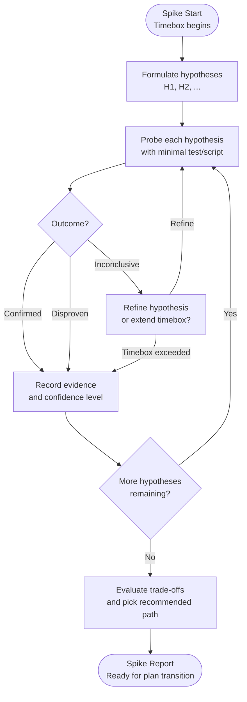

# Spike Exploration Report: Jev as a decision gate in `ai-skills`

## 1. Objective & Timebox

- **Objective:** Decide whether Jev (TypeSafe AI's System One model) belongs in this repository's decision-making, by measuring it against `classifySkipIf` — a rule already in production, already unit-tested, and already correct on the surface it covers.
- **Timebox Budget:** One session. T1–T4 all ran within it; the 200-call probe took about 55 seconds of serial wall clock.
- **Deliverable:** This report, plus the raw evidence in `spike-out/two-class.json` and the response cassette in `spike-out/jev-cassette.json`.

**Verdict: the gate fails for `skip_if`. Jev does not belong there, and this report explains where it does belong instead.**

The verdict is narrower than "Jev is bad". The measured numbers are excellent. What failed is the specific question of whether a 273 ms network call should replace a correct in-process regex.

## 1b. Spike Flow



## 2. Hypothesis Matrix

| # | Hypothesis | Test / Probe Method | Outcome | Confidence |
|---|---|---|---|---|
| H1 | A balanced corpus with a production-grade reference label exists in this workspace | Harvest `run[].cmd` from 296 vault plan files, label each with `classifySkipIf` | **Confirmed** — 200 unique commands, 144 behavioural / 56 loose | High |
| H2 | Jev can match the production classifier on that corpus | 200 serial `POST /v1/systemone` calls, one `choice` question each, replay proven byte-identical | **Confirmed** — agreement 0.995 (199/200) | High |
| H3 | Jev's stated confidence tracks its accuracy | ECE over 10 bins, Brier score, both hand-checked against arithmetic fixtures | **Confirmed** — ECE 0.011, Brier 0.005 | High |
| H4 | Jev is fast and cheap enough to sit in a plan-execution hot path | Wall-clock per call, cost recomputed from API-reported input tokens | **Confirmed as measured** — mean 273 ms, p95 331 ms, $0.0000207/call | High |
| H5 | At least one disagreement is a case where `classifySkipIf` is wrong | Inspect all disagreements | **Disproven** — one disagreement, and the regex is right in it | High |
| H6 | Jev's latency and price are competitive against the rule it would replace | Compare against `classifySkipIf`, which runs in-process with no I/O | **Disproven** — 273 ms and a network hop against a regex that returns in microseconds and costs nothing | High |

## 3. Measured results

```
model           jev-1.13.0
sample          200 commands
agreement       0.995  (199/200)
ECE             0.011
Brier           0.005
latency ms      mean 273  p50 265  p95 331  max 540
cost USD        0.004129  (98,319 input tokens, ~0.0000207 per call)
retries         0
replay          byte-identical to record
cassette scan   clean
```

Confusion matrix, oriented from the reference label:

| | predicted loose | predicted behavioural |
|---|---|---|
| **reference loose (56)** | 56 | 0 |
| **reference behavioural (144)** | 1 | 143 |

### Vendor claims versus measurement

| Claim | Source | Measured |
|---|---|---|
| 70–500 ms latency | TypeSafe docs | 273 mean, 331 p95, 540 max — inside the stated range |
| $0.042 per 1M input tokens | TypeSafe pricing page | 98,319 tokens → $0.004129. Consistent, and the token count is reported separately so a price change stays visible |
| Output tokens free | TypeSafe pricing page | Not independently verified; irrelevant at 36 output tokens per call |

## 4. Adjudication of the single disagreement

```
cmd         git ls-files scripts | rg -c 'anim|effect-control|effect-coverage'
project     ram-audit
source      01 - Projects/ram-audit/plans/2026-09-30-plasma-animation-audit.md#T11
reference   behavioural
Jev         loose  (p 0.88, confidence 0.77)
```

**Adjudicated: `classifySkipIf` is right. Jev is wrong.**

The production comment states the rule at `scripts/ultra-plan-runner.mjs:56`:

> A tool invocation qualifies even when a grep filters its output, **because the tool has to succeed first**.

For this command nothing can fail because the behaviour regressed. If the Plasma animation work were reverted tomorrow, `git ls-files scripts` still exits 0, `rg -c` still matches the three script paths that still exist, and the command still prints `3`. Contrast `bun test x.test.mjs`, which exits non-zero when the assertion it guards stops holding. That is the whole distinction the rule is drawing, and this command sits on the file-probe side of it.

This is a judgement about this repository's standards rather than an arithmetic fact, so it is recorded as such. It is also the only disagreement in 200, which is itself the finding: Jev agreed with the production rule on every case that was not this shape.

## 5. Why the gate fails despite excellent numbers

The plan fixed the decision rule before the probe ran, in three conditions. Two passed and one failed.

| Condition | Required | Measured | Result |
|---|---|---|---|
| 1 | agreement ≥ 0.85 | 0.995 | pass |
| 2 | ECE ≤ 0.10 | 0.011 | pass |
| 3 | at least one disagreement where the regex is wrong | 0 | **fail** |

Condition 3 is the one that decides it, and it was written that way on purpose. **Agreement alone proves a model can imitate a correct rule. That is not a reason to add a network call to a path that currently has none.**

The comparison that matters is not model-versus-model. It is:

| | `classifySkipIf` | Jev |
|---|---|---|
| Latency | in-process, microseconds | 273 ms mean, network hop |
| Cost | $0 | $0.0000207 per call |
| Determinism | total | probabilistic |
| Correct on this surface | 200/200 by construction | 199/200 measured |
| Failure mode | none | network error, 429, timeout, silent drift on `jev-latest` |
| Already tested | yes, in production | no |

Paying 273 ms and a network hop to reproduce a regex that is already correct, already unit-tested, and already faster than the process that would call it is a net loss. There is no configuration of that trade that makes sense.

**Verdict: `gate fails`.**

## 6. Where Jev does belong

The measured model is genuinely good. Agreement 0.995 with ECE 0.011 means its stated confidence is trustworthy — which is a rarer property than it sounds, and it is the property `RLCD` training is supposed to buy. The problem was never the model. The problem was that this particular decision was already solved.

So the question becomes: where in this repository is a decision that is *not* already solved by a rule, is semantic, is bounded to a known answer space, and does not sit in a loop where a wrong answer is expensive?

There is exactly one in `SKILL.md`, and it is the answer to the question:

### Recommended integration: the Creative & Convergent design proposal

`SKILL.md:117` and the master file at `:621` both require this output:

> 2–3 alternatives, trade-offs, and one recommendation

Today the agent generates those alternatives by free-form reasoning, and every one of them is plausible-sounding text. There is no check that three alternatives are actually *different*, that the trade-offs are *real*, or that the recommendation follows from them rather than from whichever option was written first.

That is precisely the shape Jev is built for:

| Requirement | Fits Jev |
|---|---|
| A defined answer space | yes — the alternatives the agent itself generated are the `criteria` |
| Semantic, not arithmetic | yes — "are these two proposals actually different approaches?" |
| Verdict consumed by code | yes — collapse near-duplicates, flag an unsupported trade-off |
| Runs once per design phase | yes — not in the TDD loop |
| Wrong answer is cheap | yes — a poor proposal list is caught by the human gate that already follows |
| Fits System One | yes — a bounded judgement, not open-ended generation |

Concretely: after the agent drafts 2–3 alternatives, one `choice` call asks which of them are genuinely distinct approaches, with the alternatives as `criteria`. Near-duplicates collapse, and the ones that survive are the ones worth putting in front of the human.

Why this and not the 4-tier authorization gate that the first version of this plan targeted: that decision needs a corpus this workspace does not have. Harvesting real actions yields 94% in a single tier, so agreement could not fail and calibration had no minority class to measure. The alternative proposal has no such requirement — its answer space is defined by the agent at call time, and its quality bar is a human judgement at the gate that already exists.

**Cost framing:** at $0.0000207 per call and 273 ms, one call per design phase is invisible. The entire argument against Jev was cost against an in-process regex, and that argument does not apply to a decision that has no regex.

## 7. Epistemic unknowns

**Known unknowns addressed:**
- Whether a balanced, machine-labelled corpus exists in this workspace. It does: 200 commands, two populated classes.
- Whether Jev's agreement, calibration, latency, and price match its published claims. They match.
- Whether Jev can beat or match a production rule on that rule's own surface. It matches almost perfectly and is still not worth adopting there.

**Unknown unknowns discovered during the spike:**

- **The reference label is not pure ground truth.** About twenty rows are `test -f …` and `test -s …`, which `FILE_PROBE` classifies as `loose`. Semantically these sit close to the line: `test -f` does prove a file exists, though it cannot fail because behaviour regressed. Jev agreed with the label on all of them, which means either Jev is following the criteria closely or the label happens to match its reading. These rows were not adjudicated individually because they produced no disagreement — and that is itself a gap in the evidence, not a clean result.
- **Version drift is real and unmeasured.** `jev-latest` is a moving alias. This probe ran entirely against `jev-1.13.0`. A re-run next month may not be comparable, and the cassette pins the version so at least the comparison is reproducible.
- **The corpus is not randomly distributed.** All 56 `loose` rows come almost entirely from one project, dawnbook, which contributed 45 of them. The classes are balanced in aggregate but not in provenance, so the 0.995 is partly a statement about dawnbook's command style.
- **Single-observation calibration.** Each command was asked once. A model that is right 199 times by luck and wrong once is indistinguishable from one that is reliably right, and only a repeated-measures run would separate those.

## 8. Architectural trade-offs

**Option A — do not integrate Jev anywhere.**
- Pros: no new dependency, no network in any code path, no API key to manage, nothing to re-verify when `jev-latest` moves.
- Cons: leaves a genuinely well-calibrated model unused; the Creative & Convergent output keeps being unverified prose.
- Performance impact: none.

**Option B — integrate into the Creative & Convergent proposal only.**
- Pros: one call per design phase, on a decision that has no existing rule; the answer space is defined at call time so there is no corpus to build; cost and latency are irrelevant at that frequency; the human gate that follows already catches a bad list.
- Cons: adds an API dependency and a key to manage; the value is a quality improvement to a step a human already reviews, so the measurable benefit is soft.
- Performance impact: 273 ms once per design phase.

**Option C — replace `classifySkipIf` with Jev.**
- Pros: would catch shapes the regex misses.
- Cons: this is what the spike measured and rejected. 273 ms and a network hop to reproduce a correct in-process regex.
- Performance impact: strictly negative.

**Recommendation: Option B, as a follow-up spike, not an integration.** Option B's own premise deserves its own test — whether Jev actually collapses near-duplicate proposals — before anything is wired into `SKILL.md`.

## 9. Decision & next steps

- **Recommended Path:** Option B, scoped as follow-up spike F5. This spike's mandate was `skip_if`; it did not authorise an integration anywhere else.
- **Rejected:** Option C, on measured evidence.
- **Deferred:** Option A as a standing default for every decision that already has a deterministic rule. That is the generalisable lesson: *a calibrated model earns a place where no rule exists, not where a correct one does.*

Follow-ups are ranked in §8 of the plan (`docs/code-plan/plans/2026-09-30-jev-decision-gate-spike.md`). F2 and F4 were closed by this spike. F1 is dropped: the 4-tier authorization gate stays unmeasured until someone produces a labelled corpus, and it should not be built on the assumption that a good model is a good label.

## 10. Why version 1 of this plan was abandoned

Recorded so a later session does not repeat it.

| v1 defect | Evidence |
|---|---|
| Corpus fabricated from commit subjects | 60 of 77 rows were `git commit -m "<subject>"` reconstructions; commit subjects are not actions |
| Single-class corpus | 96.1% `low`, two tiers used, zero `high` |
| Calibration unmeasurable | no minority class to bin against |
| Agreement could not fail | any arm answering "low" would score about 96% |

The general lesson is worth more than this spike: **a corpus that clears a size threshold can still be useless if its classes are degenerate.** v1's 77 rows passed its own "at least 40" precondition and measured nothing. T1 now fails closed with `E_PRECOND_IMBALANCE` instead of that.
