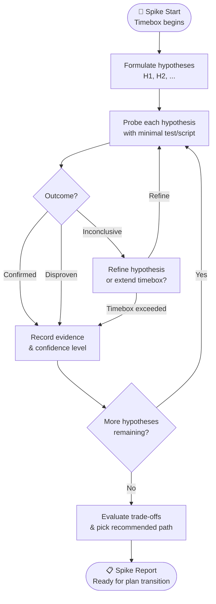

# Spike Exploration Report: Can a design-alternative near-duplicate corpus exist in this workspace?

## 1. Objective & Timebox
- **Objective:** Determine whether a Jev two-class dedupe probe over *design alternatives* can be run at all — i.e. whether the workspace contains enough real near-duplicate alternative pairs to give the probe a minority class worth measuring. This is the corpus-feasibility spike for follow-up F6 of `2026-09-30-jev-decision-gate-spike.md`.
- **Timebox Budget:** 1 hour. Spent: ~35 minutes, most of it on the admission test and its determinism lock rather than on the count itself.
- **Deliverable:** This report, plus `scripts/spike-alt-corpus.mjs` and its test. **Verdict: `corpus not viable`.**

## 1b. Spike Flow



## 2. Hypothesis Matrix

| # | Hypothesis | Test / Probe Method | Outcome | Confidence |
|---|---|---|---|---|
| H1 | The workspace contains >= 30 within-set alternative pairs | `bun scripts/spike-alt-corpus.mjs` over all 295 registry plans | **Disproven** — 4 | High |
| H2 | At least 8 of those pairs are near-duplicate by a human reading | Per-pair adjudication recorded in `ADJUDICATIONS`, row by row | **Disproven** — 0 | High |
| H3 | Pairs can be harvested deterministically, so the count is a fact and not a script artefact | Re-run and input-reversal tests on `buildCorpus` | **Confirmed** — byte-identical both ways | High |
| H4 | Cross-set pairs could pad the corpus to the 30-pair bar | `crossPairs` counted separately and excluded from `classBalance.total` | **Confirmed, deliberately not used** — 6 cross-set pairs exist | High |
| H5 | Jev can be probed on this corpus | Requires H1 and H2; T2 never entered | **Not reached** — halted by §5 condition 2 | High |

### Measured counts

Registry: `plans.publish.json`, enumerated 2026-09-30.

```
plans enumerated              295     (plan §2 recorded 294; two plan files were
                                       written between the measurement and the run)
alternative sets with >= 2
  real alternative bodies       2
within-set pairs                4
  near-duplicate                0
  distinct                      4
  unlabelled                    0
synthetic (excluded)            0
cross-set (excluded)            6
```

The two sets, in full:

| Set | Alternatives |
|---|---|
| `Snipset 2026-09-06-clipboard-profanity-filter.md` | A: add words to `SENSITIVE_PATTERNS` · B: independent deterministic detector + persisted per-entry policy · C: local/cloud language model |
| `Snipset 2026-09-17-website-release-pinning-followup-implementation-plan.md` | A: restore `scripts/coverage/assert-thresholds.mjs` · B: remove the `assert-thresholds` reference from `package.json:17` |

T1's output, verbatim, exit 1:

```
E_PRECOND_IMBALANCE: near-duplicate 0, distinct 4.
Calibration cannot be measured against an empty minority class, and an agreement
number over these rows would be the class prior rather than a result.
Nothing written to spike-out/alt-corpus.json.

This is the plan's RED phase, not a malfunction. Plan §5 condition 2 requires at
least 8 near-duplicate pairs; the workspace has none that a human wrote after
genuinely weighing two routes.
EXIT=1
```

`spike-out/alt-corpus.json` does not exist. It was never written: the degenerate branch writes nothing, which is the difference between a refusal and a warning.

## 3. Adjudication of all four within-set pairs

Every pair is here, not a sample. The verbatim texts live in the harvest output; what is recorded is the judgement and its reason.

| Pair | Label | Rationale |
|---|---|---|
| `profanity:A:B` | distinct | a lookup list versus a detector with persisted per-entry policy — two mechanisms, not two phrasings |
| `profanity:A:C` | distinct | a curated word list versus a language model — the question is whether context is available |
| `profanity:B:C` | distinct | a deterministic detector versus a model — offline and inspectable versus probabilistic |
| `pinning:A:B` | distinct | restore the gate versus delete it — opposite actions, not competing phrasings |

Four decisions, four rationales, zero `near-duplicate`. Note what each one is: the alternatives disagree about *what to build*. A near-duplicate pair would be two texts that agree about what to build and disagree only about how to say it. These plans do not contain that, because a plan that had already narrowed to one design has no reason to write down the three it rejected in three different wordings.

## 4. Epistemic unknowns

- **Known unknowns addressed.** Whether the workspace can support this probe. It cannot, and the count is now a command: `bun scripts/spike-alt-corpus.mjs` reproduces it in ~40 ms with no network and no key.
- **Unknown unknowns discovered.**
  - **Pair ordering was a determinism bug.** The first version of `pairsOf` ordered a pair by position in the file, so reversing the bullets in a plan produced different `pairKey`s, different row ids, no adjudication lookup, and every row silently scored unlabelled. The input-reversal test caught it. Pairs are now ordered by letter. This is the kind of defect that would have produced a *quietly wrong* corpus rather than a crashed one.
  - **Only 14 plans have a trade-offs/options *heading* at all** (plan §2), but the heading is not what determines whether alternatives exist: neither of the two usable sets carries one. Requiring a heading would have dropped 2 of the 4 pairs that do exist. The heading is recorded on the set and is not an admission criterion.
  - **`unlabelled` is its own class in the balance check**, not a fallback to `distinct`. An unlabelled row exits 1. Guessing the label is the fabrication the parent spike's v1 was dropped for.
- **Unverified.** Everything about Jev on this corpus, because Jev was never called. No claim in this report about model performance is measured or implied.

## 5. Architectural trade-offs

- **Option A — collect ~8 real near-duplicate pairs by hand.** Pros: produces a corpus that could actually falsify a claim. Cons: it is a labelling project with no ground truth to check the labels against, it is exactly the work "nothing in this repository generates on demand" (plan §6 T3 Step 4), and the person creating the pairs already knows the answer, so the adjudication is not independent. Cost: real, and unbounded here.
- **Option B — close F6 as `corpus not viable`.** Pros: costs one command and one report; preserves the bar as written rather than moving it to fit; the count is reproducible by anyone. Cons: the question "does Jev do dedupe well enough to be worth 273 ms" stays open — but it stays open *and named*, instead of being answered by a corpus that could not have answered it.

## 6. Decision & Next Steps

- **Recommended Path:** **`corpus not viable`** — verdict applied from plan §5, which was fixed before T1 ran and was not edited after.

  §5 requires all four conditions. Condition 1 fails (4 pairs, not 30) **and** condition 2 fails (0 near-duplicate, not 8). Both failures are independently sufficient, and both are in the "condition 1 or 2" bucket that §5 assigns `corpus not viable`. Conditions 3 and 4 were never reached: `TYPESAFE_API_KEY` is unset, and T2 is `HALTED-UPSTREAM`, so no probe exists to replay. §5 reserves `insufficient evidence` for the case where *only* 3 or 4 fail — that case is not reachable here, because 1 and 2 already decided it.

  **`corpus not viable` is a success under AC-5.** The spike was designed to find out whether the corpus exists, and a refusal with the counts printed is the answer. What would *not* be a success is padding to 30 with the 6 cross-set pairs: separating "a profanity filter" from "a coverage gate" is a test of whether the model can read, and §5 excludes them from condition 1 for exactly that reason.

- **Transition to Plan:** No implementation plan. F6 closes with this verdict.

  **Unblocking condition (plan §6 T3 Step 4), stated as a real cost:** the workspace would need roughly 8 real near-duplicate alternative pairs, written by an agent that genuinely considered two routes and converged on one, so that two texts describe the same design in different words. Nothing here generates those on demand, and asking an agent to paraphrase its own alternatives would be the fabrication v1 was dropped for — the paraphraser and the adjudicator would be the same mind. If the measurement is wanted, the corpus has to be collected by hand; that cost is not estimated here because it was not incurred.

  Until then the honest statement is narrow and should not be widened: **this says nothing about whether Jev is good at dedupe.** It says the workspace cannot produce a corpus on which that question is answerable. The parent spike's verdict — `gate fails`, agreement 0.995 / ECE 0.011 / $0.004129 against a correct in-process regex — is unaffected by this report and was not re-measured.

## 7. Hypothesis verdict summary

| | |
|---|---|
| Verdict | **`corpus not viable`** |
| Deciding condition | §5 condition 2 (0 near-duplicate vs 8 required); condition 1 also fails (4 vs 30) |
| T1 | exit 1, `E_PRECOND_IMBALANCE`, nothing written |
| T2 | not entered — `HALTED-UPSTREAM` |
| API key | never used; `TYPESAFE_API_KEY` unset |
| Reproduce | `bun scripts/spike-alt-corpus.mjs` |
| Tests | `bun test scripts/spike-alt-corpus.test.mjs` — 15 pass |
