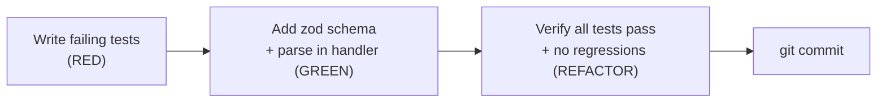

# Worked Example: Add Input Validation to a REST Endpoint

> This is a **complete, filled-in example** of the `super-ultra-code-plan` pipeline
> running end-to-end on a real-sized task. Use this as a reference when the agent
> starts drifting or you want to see what correct output looks like at each phase.
>
> Scenario: A Node.js/Bun + Express API. The `POST /users` endpoint accepts raw JSON
> with no validation. The goal: add strict input validation using `zod`.

---

## Step 1 — Classify

**Path chosen: Bounded** (< 2 files, single behavior, no API contract change for consumers)

Reasoning:
- Touch 2 files: `src/routes/users.ts` + `src/routes/users.test.ts`
- No DB schema change, no new dependency beyond `zod` (already installed)
- Observable behavior: malformed requests now return 400 instead of 500 or silent corruption

---

## Step 2 — Brainstorming (Bounded path: short design note)

**Intent & Scope**
- Goal: `POST /users` rejects invalid payloads with a structured 400 error before touching DB
- Non-goals: authentication, rate limiting, output format changes
- Acceptance criteria:
  - Missing `email` field → 400 `{ error: "email is required" }`
  - Invalid email format → 400 `{ error: "email must be a valid email" }`
  - Missing `name` field → 400 `{ error: "name is required" }`
  - Valid payload → 201, existing behavior unchanged

**Design decision:** Use `zod` (already a dependency) — no new package. Parse at route handler entry, before any DB call. Return first error only (not all errors) — simpler UX for this API.

**Rejected:** `express-validator` (not installed, overkill for this scope).

---

## Step 3 — Implementation Plan



Target files:
- `src/routes/users.test.ts` — 3 new test cases
- `src/routes/users.ts` — add zod parse at handler entry

**Hard gate passed:** Human approved scope above before any code.

---

## Step 4 — TDD: RED Phase

Write failing tests FIRST. No production code yet.

```typescript
// src/routes/users.test.ts  (additions only — existing tests untouched)

describe('POST /users — input validation', () => {
  it('returns 400 when email is missing', async () => {
    const res = await app.request('/users', {
      method: 'POST',
      body: JSON.stringify({ name: 'Alice' }),
      headers: { 'Content-Type': 'application/json' },
    });
    expect(res.status).toBe(400);
    const body = await res.json();
    expect(body.error).toBe('email is required');
  });

  it('returns 400 when email format is invalid', async () => {
    const res = await app.request('/users', {
      method: 'POST',
      body: JSON.stringify({ name: 'Alice', email: 'not-an-email' }),
      headers: { 'Content-Type': 'application/json' },
    });
    expect(res.status).toBe(400);
    const body = await res.json();
    expect(body.error).toBe('email must be a valid email');
  });

  it('returns 400 when name is missing', async () => {
    const res = await app.request('/users', {
      method: 'POST',
      body: JSON.stringify({ email: 'alice@example.com' }),
      headers: { 'Content-Type': 'application/json' },
    });
    expect(res.status).toBe(400);
    const body = await res.json();
    expect(body.error).toBe('name is required');
  });
});
```

**Run tests — confirm RED:**
```
$ rtk bun test src/routes/users.test.ts

  POST /users — input validation
    ✗ returns 400 when email is missing        (received status 500)
    ✗ returns 400 when email format is invalid (received status 201)
    ✗ returns 400 when name is missing         (received status 201)

  3 failed, 4 passed
```

Failure is for the right reason — no validation exists yet. Proceed to GREEN.

---

## Step 5 — TDD: GREEN Phase

Minimal production code to make tests pass:

```typescript
// src/routes/users.ts
import { z } from 'zod';

const CreateUserSchema = z.object({
  name: z.string({ required_error: 'name is required' }).min(1, 'name is required'),
  email: z
    .string({ required_error: 'email is required' })
    .email('email must be a valid email'),
});

app.post('/users', async (c) => {
  const body = await c.req.json();

  const result = CreateUserSchema.safeParse(body);
  if (!result.success) {
    const firstError = result.error.errors[0];
    return c.json({ error: firstError.message }, 400);
  }

  // existing DB logic unchanged below
  const user = await db.users.create({ data: result.data });
  return c.json(user, 201);
});
```

**Run tests — confirm GREEN:**
```
$ rtk bun test src/routes/users.test.ts

  POST /users — input validation
    ✓ returns 400 when email is missing        (12ms)
    ✓ returns 400 when email format is invalid (8ms)
    ✓ returns 400 when name is missing         (9ms)

  POST /users — existing behavior
    ✓ creates user with valid payload          (31ms)

  4 passed, 0 failed
```

---

## Step 6 — TDD: REFACTOR Phase

Green. Now clean up — no behavior change:

- Extracted `CreateUserSchema` to top of file (already done above — no further refactor needed)
- Checked: no magic strings, error messages match spec exactly
- Checked: no changes to unrelated code

**Run full suite — confirm 0 regressions:**
```
$ rtk bun test

  src/routes/users.test.ts       4 passed
  src/routes/auth.test.ts        7 passed
  src/routes/products.test.ts    12 passed
  src/services/db.test.ts        9 passed

  32 passed, 0 failed
  Exit 0
```

---

## Step 7 — Verification Before Completion

| Check | Command | Exit | Evidence |
|---|---|---|---|
| Target tests | `rtk bun test src/routes/users.test.ts` | 0 | 4 passed, 0 failed |
| Full regression | `rtk bun test` | 0 | 32 passed, 0 failed |
| Type check | `bun run typecheck` | 0 | 0 errors |
| No secrets in diff | `git diff --stat` | — | 2 files, +28 lines |

All checks pass. Completion claim is safe to make.

---

## Step 8 — Finishing & Git Commit

```
$ git status
M  src/routes/users.ts
M  src/routes/users.test.ts

$ git add src/routes/users.ts src/routes/users.test.ts

$ git commit -m "feat(users): add zod input validation to POST /users

Rejects malformed payloads with structured 400 errors before DB call.
Returns first validation error only. Existing behavior unchanged.

Tests: 3 new cases (missing email, invalid email, missing name) all GREEN."
```

---

## What Correct Pipeline Output Looks Like

| Phase | What you should see |
|---|---|
| Classify | One clear path label (Spike / Bounded / Architectural) with 2-sentence justification |
| Brainstorm | Intent, non-goals, acceptance criteria, one design decision with rejected alternative |
| Plan | Mermaid diagram + target files list + hard gate confirmation |
| RED | Test code written, tests run, failure output pasted, failure is for the right reason |
| GREEN | Minimal production code, tests run again, all pass, output pasted |
| REFACTOR | Brief statement of what was cleaned, re-run confirms still green |
| Verify | Filled verification table with real command output |
| Commit | Conventional commit message with rationale |

> If any phase is missing or skipped, the pipeline is not complete —
> even if the code "works".
