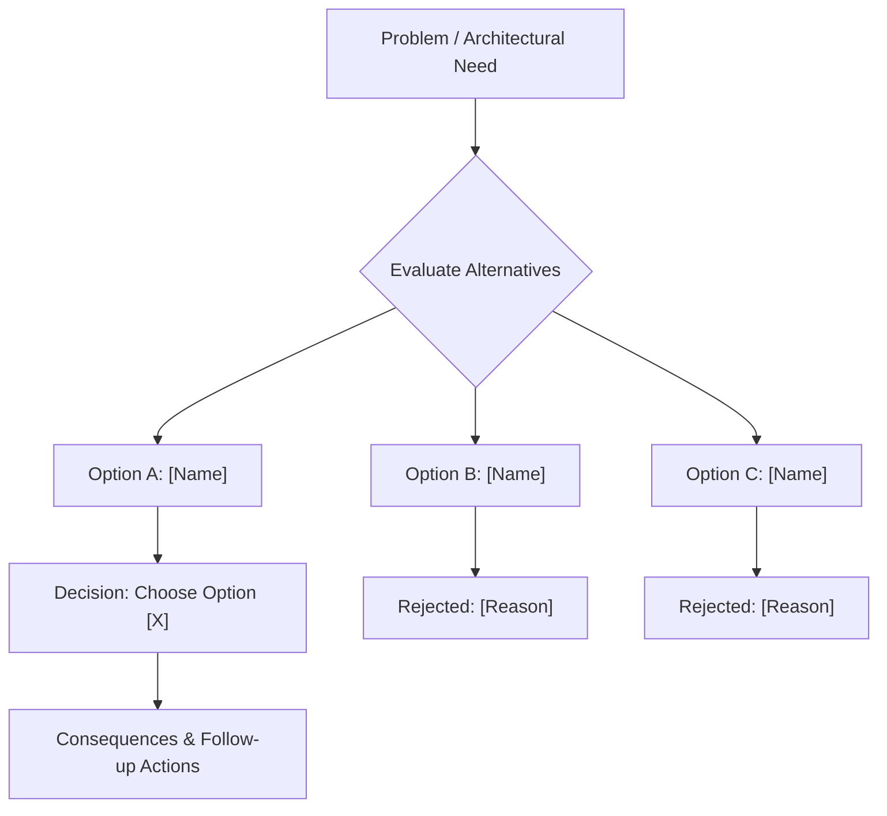

# ADR [Number]: [Short Title of Architectural Decision]

> Architecture Decision Record (ADR). Captures a significant architectural choice,
> trade-offs evaluated, and consequences.

## 1. Metadata
- **Status:** Proposed | Accepted | Superseded | Deprecated
- **Deciders:** [List architects, engineers, or agents involved]
- **Date:** [YYYY-MM-DD]
- **Supersedes / Superseded By:** [ADR Number or N/A]

## 2. Context & Problem Statement
- [Describe the context, technical forces, limitations, and user needs motivating this decision.]

## 3. Decision Drivers & Constraints
- [Driver 1: e.g. Low latency SLA under 50ms]
- [Driver 2: e.g. Memory footprint below 100MB]
- [Constraint 1: e.g. Must run offline without external API call]

## 4. Decision Flow & Alternatives Considered

### Option A: [Option Name]
- **Description:** [Summary of approach]
- **Pros:** [Positive impacts]
- **Cons:** [Negative impacts or operational costs]

### Option B: [Option Name]
- **Description:** [Summary of approach]
- **Pros:** [Positive impacts]
- **Cons:** [Negative impacts or operational costs]

## 5. Decision Outcome
- **Chosen Option:** [Option X], because [justification with metrics or clear architectural fit].

## 6. Consequences & Risks
- **Positive Consequences:** [What becomes easier or faster]
- **Negative Consequences / Trade-offs:** [Technical debt, complexity, or constraints introduced]
- **Mitigation Strategy:** [How the risks will be contained or observed]

## 7. Implementation & Verification Notes
- [Implementation pointers, migration order, or test checks required to validate this decision.]
