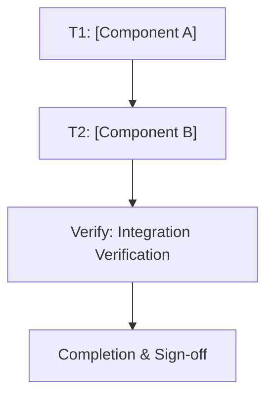

# [Feature Name] Implementation Plan

> The YAML frontmatter above is the single source of truth for routing, dependency order, retry, and idempotency. Prose and checklists below only explain and must never contradict it. Every `Task N` heading, its `tasks[].id`, and its Mermaid node id must be the same identifier; a mismatch is a pre-execution blocker. Commands stay tool-agnostic and directly runnable (no MCP/rtk required to execute this plan).

## 1. Intent & Scope
- **Goal:** [Concise description of target capability or fix]
- **Non-Goals:** [Explicit boundaries of what is out of scope]
- **Acceptance Criteria:**
  - [ ] AC-1: [Criterion 1 — observable, testable]
  - [ ] AC-2: [Criterion 2]
  - [ ] AC-3: [Criterion 3]

## 2. Visual Implementation Map

> Node ids (`T1`, `T2`, ...) must match `tasks[].id` in frontmatter and the task headings below.

## 3. Global Constraints
- Non-negotiable constraints, safety rules, and platform compatibility requirements.
- Dependency constraints (e.g. no new external runtime packages unless approved).
- Performance and memory limits.

## 4. Work Breakdown & Task Checklist

### Task T1: [Component Name]
- **Interfaces:**
  - Consumes: [exact signatures from earlier tasks, or `none`]
  - Produces: [exact names/types consumed by later tasks]
- **Preconditions (assert FIRST; fail-fast, never improvise a substitute):**
  - [ ] Dependency: `<cmd> --version` exits 0 (else abort: `E_PRECOND_DEP`)
  - [ ] Input contract: <VAR> defined and satisfies <constraint> (else abort: `E_PRECOND_INPUT`)
  - On failure: STOP this task, do NOT guess a substitute, record to §6 Error Ledger, continue only tasks independent of T1.
- **Idempotency Check (BEFORE Step 1):**
  - [ ] Skip when `skip_if` (frontmatter) exits 0 → mark `SKIPPED-IDEMPOTENT`. A checked box alone never justifies a skip.
- [ ] **Step 1 — Failing Test (RED):** cmd: `bun test path/to/file1.test.ts` | expect: exit non-zero for the right reason | retry: 0
- [ ] **Step 2 — Implementation (GREEN):** minimal code to pass the test
- [ ] **Step 3 — Verify:** cmd: `bun test path/to/file1.test.ts` | expect: exit 0, 0 failures | retry: 1 (transient only) | on_fail: mark FAILED, write §6, halt only downstream (`depends_on` includes T1), keep independent tasks running
- [ ] **Step 4 — Commit:** `git add <files> && git commit -m "feat: ..."`

### Task T2: [Component Name]
- **Interfaces:**
  - Consumes: [outputs of T1]
  - Produces: [exact names/types]
- **Preconditions (assert FIRST; fail-fast):**
  - [ ] Upstream: artifact from T1 exists at `path/to/file1.ts` (else abort: `E_PRECOND_UPSTREAM`)
  - On failure: STOP, record to §6, continue only tasks independent of T2.
- **Idempotency Check (BEFORE Step 1):**
  - [ ] Skip when `skip_if` exits 0 → `SKIPPED-IDEMPOTENT`.
- [ ] **Step 1 — Failing Test (RED):** cmd: `bun test path/to/file2.test.ts` | expect: exit non-zero | retry: 0
- [ ] **Step 2 — Implementation (GREEN):** minimal code to pass
- [ ] **Step 3 — Verify:** cmd: `bun test path/to/file2.test.ts` | expect: exit 0, 0 failures | retry: 1 (transient only) | on_fail: mark FAILED, write §6, halt downstream, keep independent running
- [ ] **Step 4 — Commit:** `git add <files> && git commit -m "feat: ..."`

## 5. Verification Matrix Before Completion
| Check | Command | Exit Code | Fresh Evidence | Status |
|---|---|---|---|---|
| Unit Tests | `bun test` | 0 | 0 failures | Pending |
| Type Check | `bun run typecheck` | 0 | 0 errors | Pending |
| Lint Check | `bun run lint` | 0 | 0 warnings | Pending |
| Build Check | `bun run build` | 0 | Build succeeded | Pending |

## 6. Error Ledger (aggregated at end; independent tasks not halted)
| Task | Step | Classification | Exit | Root cause | Retry used | Fallback | Status |
|---|---|---|---|---|---|---|---|
| [T?] | [n] | [environment] | [1] | [cause] | [0/1] | [none] | `FAILED-ISOLATED` |

- Classification: `code` | `test` | `contract` | `environment` | `infrastructure` | `pre-existing`.
- Status: `FAILED-ISOLATED` | `FAILED-BLOCKING` | `RESOLVED` | `DEFERRED`.

## 7. Human Approval Gate
- [ ] Partner / Human approval received for this plan before implementation begins.
