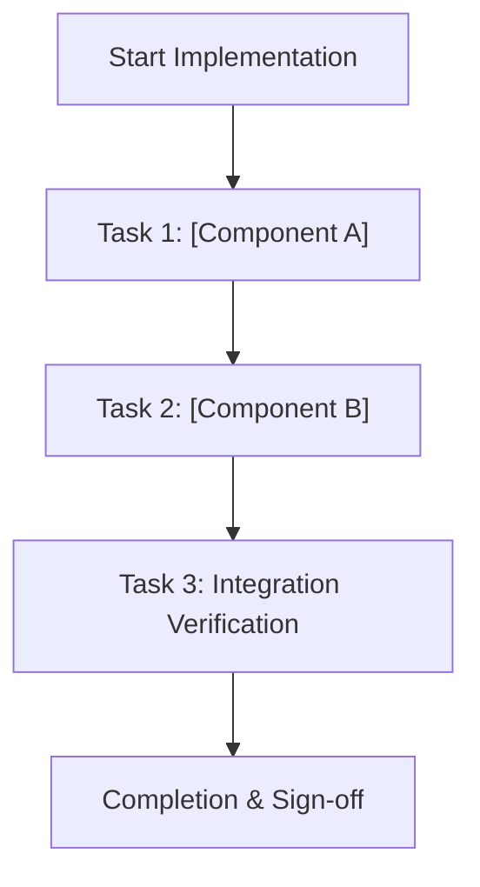

# [Feature Name] Implementation Plan

## 1. Intent & Scope
- **Goal:** [Concise description of target capability or fix]
- **Non-Goals:** [Explicit boundaries of what is out of scope]
- **Acceptance Criteria:**
  - [ ] Criterion 1
  - [ ] Criterion 2
  - [ ] Criterion 3

## 2. Visual Implementation Map

## 3. Global Constraints
- Non-negotiable constraints, safety rules, and platform compatibility requirements.
- Dependency constraints (e.g. no new external runtime packages unless approved).
- Performance & memory limits.

## 4. Work Breakdown & Task Checklist

### Task 1: [Component Name]
- [ ] **Target Files:**
  - `path/to/file1.ts`
  - `path/to/file1.test.ts`
- [ ] **Failing Test (RED):**
  - Command: `rtk bun test path/to/file1.test.ts`
  - Expected Failure: Describe expected failure before code exists.
- [ ] **Implementation (GREEN):**
  - Minimal implementation details to pass the test.
- [ ] **Verification & Refactor:**
  - Command: `rtk bun test path/to/file1.test.ts` (Exit 0)

### Task 2: [Component Name]
- [ ] **Target Files:**
  - `path/to/file2.ts`
  - `path/to/file2.test.ts`
- [ ] **Failing Test (RED):**
  - Command: `rtk bun test path/to/file2.test.ts`
- [ ] **Implementation (GREEN):**
  - Minimal implementation details to pass the test.
- [ ] **Verification & Refactor:**
  - Command: `rtk bun test path/to/file2.test.ts` (Exit 0)

## 5. Verification Matrix Before Completion
| Check | Command | Exit Code | Fresh Evidence | Status |
|---|---|---|---|---|
| Unit Tests | `rtk bun test` | 0 | 0 failures | ⏳ Pending |
| Type Check | `bun run typecheck` | 0 | 0 errors | ⏳ Pending |
| Lint Check | `bun run lint` | 0 | 0 warnings | ⏳ Pending |
| Build Check | `bun run build` | 0 | Build succeeded | ⏳ Pending |

## 6. Human Approval Gate
- [ ] Partner / Human approval received for this plan before implementation begins.
