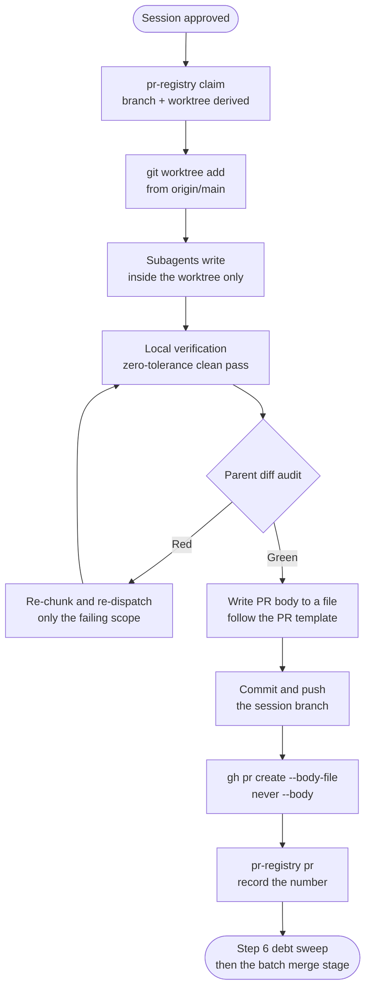

# Pull Request: [Imperative title, matching the codebase's language]

> One PR per **session**, never one per subagent. Twenty subagents inside one
> session produce one PR. Twenty sessions produce twenty PRs.
>
> The branch and worktree are **derived, not chosen**:
> `bun scripts/pr-registry.mjs claim --plan <plan-id> --session <slug>` prints
> both. Copy them from that output. A hand-written branch name is how two panes
> end up pushing to the same ref.

## 1. Delivery Metadata

| Field | Value |
|---|---|
| Session slot | `[session slug from pr-registry claim]` |
| Plan | `[docs/code-plan/plans/YYYY-MM-DD-<name>.md]` |
| Base branch | `main` |
| Head branch | `<plan-id>/<session-slug>` |
| Worktree | `[path printed by pr-registry claim]` |
| Type of change | feature / bug fix / breaking / refactor / docs / test / chore |
| Reviewer | `[who, or "none requested"]` |

## 2. What This Changes

[One paragraph. What is different after this merges. Not a list of files: the
file list is already in the diff, and repeating it makes the reviewer read it
twice.]

**Non-goals:** [what this deliberately does not do, so a reviewer does not
audit for something that was never claimed]

A section that does not apply to this change is removed, not filled with a
placeholder. An empty table or a row that says nothing is worse than an absent
section, because a reviewer cannot tell an omitted section from a section
nobody checked.

## 3. Acceptance Criteria

| ID | Criterion | Task | Check | Evidence |
|---|---|---|---|---|
| AC-1 | [observable condition] | T1 | `[command]` | exit 0, [n] passed |

A row with no evidence is not done. "Tests pass" is not evidence; the command
and its exit code are.

## 4. Local Verification Evidence

> Every row below was produced on the machine holding the working tree, before
> this branch was pushed. No hosted runner was asked to verify anything, and no
> commit was pushed in order to make someone else's check run.

| Gate | Command | Exit | Result |
|---|---|---|---|
| Focused tests | `[bun test path/to/file.test.ts]` | 0 | [n passed, 0 failed] |
| Lint | `[bun run lint]` | 0 | 0 errors, 0 warnings |
| Type check | `[bun run typecheck]` | 0 | 0 errors |
| Build | `[bun run build]` | 0 | completed |

Pre-existing warnings outside the changed surface are reported in section 7,
not carried as part of this PR.

Command output longer than a screen goes inside a `
` block with a
one-line summary of what it shows. The gate table keeps the command, the exit
code, and the result, because that is what a reviewer scans. The raw log is
evidence a reviewer expands only when a number in the table looks wrong.

## 5. Independent Review

- [ ] A reviewer that did not produce the work read the diff, or a documented
      self-review exists and says so. The work never grades itself silently.
- [ ] The parent diff audit ran: `git diff` inspected, targeted tests re-run in
      the parent, every subagent success claim re-verified rather than trusted.
- [ ] Every finding that met the 8-point qualification filter is either fixed in
      this PR or listed in section 7. A finding is never closed verbally.

**Reviewer verdict:** `correct` | `not correct`. [One to three sentences of
justification, plus the conditions that would change it]

## 6. Risk, Rollout, Rollback

| Concern | Answer |
|---|---|
| Blast radius | [which surfaces can break if this is wrong] |
| Rollout | [default / flag / staged; state it when not the default] |
| Health signal | [what proves this is healthy in use, not just in tests] |
| Rollback | [the exact revert, and who can run it] |
| Compatibility | [consumers affected, versioning or migration decision] |

`N/A` with a reason is a valid answer. A blank cell is not.

## 7. Pre-Existing Issues and Deferred Debt

Observed while working, deliberately not fixed here. Each is a debt item, so
each carries a ceiling and a trigger.

- `[path:line]` [issue]. `defer: <ceiling>, <upgrade-trigger>`

## 8. Checklist

- [ ] Branch and worktree came from `pr-registry claim`, not from memory.
- [ ] Nothing was committed directly to the base branch.
- [ ] Title is imperative and the body is in the codebase's language, not the
      language the request arrived in.
- [ ] No em dash in this body, the commit messages, or any user-visible string
      in the diff.
- [ ] No attribution footer, watermark, badge, or co-author line anywhere in the
      body, the commits, or the branch name: no `Generated with <tool>`, no `🤖`,
      no `Co-Authored-By`, no `Signed-off-by`, no vendor or model name, and no
      `ai/` prefix on the branch. An artifact ends where its content ends. If a
      credit is genuinely wanted, the user named the exact text; an invented one
      is a defect even when the name is correct, and one already published a
      false authorship claim on PR #15.
- [ ] No secrets, tokens, `.env` content, or unrelated cleanup in the diff.
- [ ] Every acceptance criterion maps to a check and to evidence.
- [ ] No reference to this conversation, to the session that produced the
      change, or to an earlier exchange. The reviewer has none of that context,
      so the sentence tells them nothing. Restate the fact instead of pointing
      at the exchange.
- [ ] No path outside this repository's commit history. The plan path under
      `docs/code-plan/plans/` is allowed because it ships in the diff; a vault
      mirror path or a scratch file under `/tmp` is not, because the reviewer
      cannot open either one.
- [ ] Read the body twice asking "can this be shorter?" and cut it both times.
      Exit codes, evidence rows, and the exact rollback are never cut; the
      surrounding prose is.
- [ ] Any acronym a reviewer outside this team might not know is expanded on
      first use. Identifiers that are schema labels (`AC-1`, `T1`, `P0` to
      `P3`) keep their short form, and a term used in the surrounding code is
      named the way the code names it.
- [ ] PR body written to a file and posted with `--body-file`, never `--body`.
- [ ] Registered in the registry: `bun scripts/pr-registry.mjs pr <session> --number <N>`.

