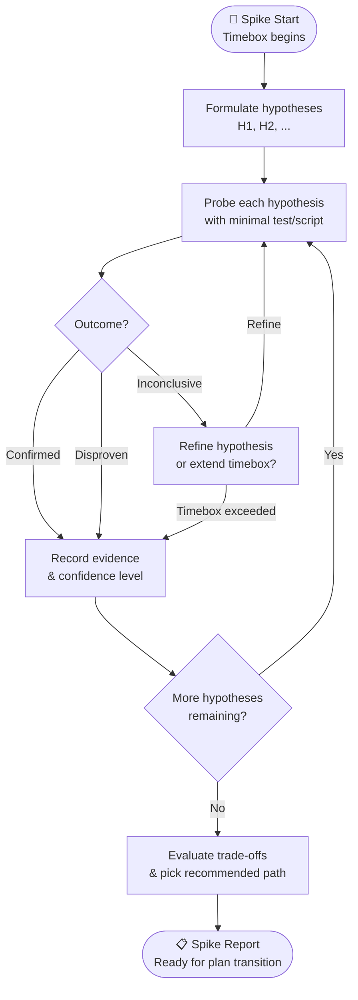

# Spike Exploration Report: [Topic / Hypothesis]

## 1. Objective & Timebox
- **Objective:** [What uncertainty or risk is being evaluated?]
- **Timebox Budget:** [e.g. 30 minutes / 1 hour]
- **Deliverable:** [Findings report, architecture decision, or proof-of-concept diff]

## 1b. Spike Flow

## 2. Hypothesis Matrix
| # | Hypothesis | Test / Probe Method | Outcome | Confidence |
|---|---|---|---|---|
| H1 | [e.g. Library X handles streaming responses properly] | [Minimal script probe via sandbox] | Confirmed / Disproven | High / Med / Low |
| H2 | [e.g. Memory overhead stays below 50MB] | [Benchmark test] | Confirmed / Disproven | High / Med / Low |

## 3. Discovered Epistemic Unknowns
- **Known Unknowns Addressed:** [What was researched and answered]
- **Unknown Unknowns Discovered:** [Unexpected boundaries, platform quirks, or version constraints discovered during the spike]

## 4. Architectural Trade-offs
- **Option A:** [Pros / Cons / Performance impact]
- **Option B:** [Pros / Cons / Performance impact]

## 5. Decision & Next Steps
- **Recommended Path:** [Chosen approach based on empirical spike evidence]
- **Transition to Plan:** [Ready for Architectural / Bounded path implementation plan]
