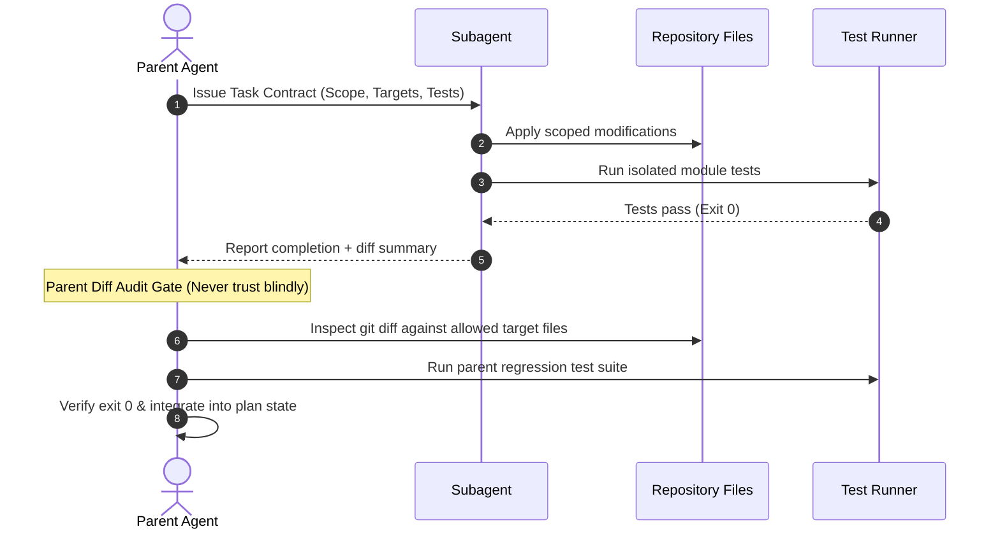

# Subagent Task Contract: [Subagent Role / Task Name]

> Use this template to define an isolated workstream before delegating to a child or sibling subagent.
> Enforces explicit boundaries, strict non-overlapping file scopes, and parent verification gates.

## 1. Delegation Metadata
- **Task ID:** [e.g. task-auth-service-01]
- **Subagent Role:** [e.g. Database Migrator / Component Refactorer]
- **Parent Goal:** [Link to active plan and parent milestone]
- **Delegation Mode:** `share` | `branch` | `isolated-files`

## 2. Delegation & Audit Lifecycle

## 3. Strict Scope & File Boundaries
- **Permitted Target Files:**
  - `path/to/specific/file.ts`
  - `path/to/specific/file.test.ts`
- **Strictly Prohibited Files:**
  - Any files outside the permitted list above
  - Shared lockfiles, environment configuration, or deployment scripts

## 4. Input Preconditions & Invariants
- [Precondition 1: e.g. Base interfaces already committed on branch]
- [Invariant 1: e.g. Do not change existing public function signatures]

## 5. Required Implementation & Tests
- **Target Behavior:** [Describe the exact capability or fix to implement]
- **Failing Test (RED):**
  - Command: `[command]`
  - Expected Error: [Expected failure message prior to implementation]
- **Passing Verification (GREEN):**
  - Command: `[command]`
  - Expected Output: Exit 0, 0 failures

## 6. Parent Diff Audit Gate Checklist
- [ ] Subagent modified ONLY the permitted target files.
- [ ] No extraneous refactoring or whitespace reformatting in adjacent lines.
- [ ] No hardcoded secrets, temporary scratch files, or mock outputs left behind.
- [ ] Targeted tests executed fresh by parent and exited 0.
- [ ] Output integrated into parent task state log.
