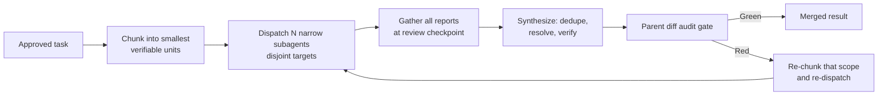
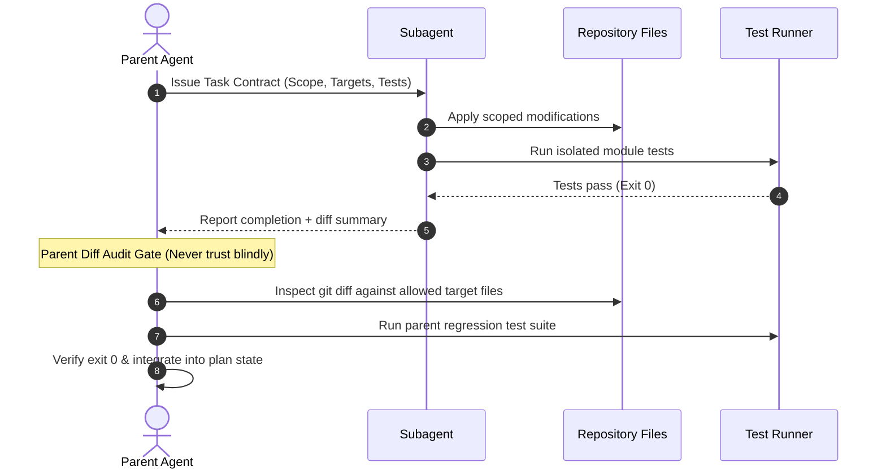

# Subagent Task Contract: [Subagent Role / Task Name]

> Use this template to define an isolated workstream before delegating to a child or sibling subagent.
> Enforces explicit boundaries, strict non-overlapping file scopes, and parent verification gates.

## 1. Delegation Metadata
- **Task ID:** [e.g. task-auth-service-01]
- **Subagent Role:** [e.g. Database Migrator / Component Refactorer]
- **Parent Goal:** [Link to active plan and parent milestone]
- **Delegation Mode:** `share` | `branch` | `isolated-files`
- **Session slot:** [from `bun scripts/pr-registry.mjs claim`]
- **Working directory:** [the session worktree path. Every relative path in this contract resolves inside it.]
- **Head branch:** `<plan-id>/<session-slug>`

## 1a. Git Boundary (read before dispatch)
You edit files and run tests. You do **not** touch git state.

- **Never run:** `git commit`, `git add`, `git checkout`, `git switch`, `git merge`, `git rebase`, `git stash`, `git reset`, `git push`, `gh`, or any other command that writes git state.
- **Why:** the git index is shared mutable state with no per-writer lock. Two subagents staging at once produce a commit containing a half-applied change from the other, and that commit was never tested in that shape.
- **Do not commit "to be safe."** The deliverable is the tested file state, not the commit. If you already committed, say so in your report so the parent can `git reset --soft HEAD~1` and keep the changes.
- **Stay inside your permitted files.** A file outside the list is a report, not an edit: name it in your report and let the parent decide.
- Your report states what you changed and the verification output. The parent stages, commits, and pushes.

## 1b. Task Chunking & Fan-Out Plan (written before dispatch)
The parent chunks the work into the smallest independently verifiable units, then assigns one unit per subagent. Target 10+ narrow subagents when the task supports it.

| Chunk ID | Single-purpose scope | Owner subagent | Permitted target files | Expected output | Verification command |
|---|---|---|---|---|---|
| C1 | [one behavior / one file] | [role] | `path` | [artifact] | `cmd` |
| C2 | [...] | [...] | `path` | [...] | `cmd` |
| CN | [...] | [...] | `path` | [...] | `cmd` |

- **Fan-out count:** [N] subagents (below the 10 floor? state the reason: atomic task, no subagent tool in this runtime, or inseparable shared state)
- **Chunk boundary check:** [ ] every chunk has exactly one owner, [ ] every planned unit is covered, [ ] no two chunks write the same file
- **Disjoint scopes are a safety property, not a licence to ignore the seams.** Every chunk's `impacts` (frontmatter of the parent plan) names the surfaces it can break, including ones no chunk owns. Before dispatch, the parent checks each of those surfaces against the chunk list and gives it an owner. A surface that belongs to no chunk is still a consumer: either it is assigned, or it is recorded in the parent plan's follow-up backlog with a finish line. The gap between chunks is where a broken consumer lives, and the per-chunk file scope is what would otherwise hide it.
- **Re-dispatch rule:** a red chunk is re-chunked and re-dispatched alone, never by restarting the whole batch

## 2. Delegation & Audit Lifecycle

## 3. Strict Scope & File Boundaries
- **Permitted Target Files:**
  - `path/to/specific/file.ts`
  - `path/to/specific/file.test.ts`
- **Strictly Prohibited Files:**
  - Any files outside the permitted list above
  - Shared lockfiles, environment configuration, or deployment scripts

## 4. Input Preconditions & Invariants
- [Precondition 1: e.g. Base interfaces already committed on branch]
- [Invariant 1: e.g. Do not change existing public function signatures]
- **Impact reporting is mandatory, not optional.** If this chunk changes a shared interface, an exported shape, a config key, a CLI flag, or a documented rule, the report states it in one line, whether or not the subagent could fix it: `IMPACT: <surface> - <what breaks> - <evidence command>`. The parent then either assigns it to a chunk or records it in the follow-up backlog with a finish line. A subagent that keeps a discovered breakage to itself has not finished the task; it has moved the failure somewhere the parent cannot see it.

## 5. Required Implementation & Tests
- **Target Behavior:** [Describe the exact capability or fix to implement]
- **Failing Test (RED):**
  - Command: `[command]`
  - Expected Error: [Expected failure message prior to implementation]
- **Passing Verification (GREEN):**
  - Command: `[command]`
  - Expected Output: Exit 0, 0 failures
- **Consumers of this change:** [the surfaces from the parent plan's `impacts` that this chunk touches, each checked with its own command]

## 6. Gather & Synthesize Checkpoint (parent side)
- [ ] All subagent reports collected at the review checkpoint; none skipped, none pasted raw as the result.
- [ ] Duplicate and restated findings removed.
- [ ] Conflicting claims between overlapping reports resolved from the evidence, not by picking the newest report.
- [ ] Each subagent's success claim re-verified by the parent (diff, log, exit status).
- [ ] **Every `IMPACT:` line from every report is now either a task in the plan or a `defer:` line in the backlog — zero unassigned.** A name that reached the gather checkpoint and left with no owner is the exact failure this contract exists to prevent: the subagent was forbidden to edit the file, the parent never queued it, and the consumer stays broken while all chunks report green. Count the `IMPACT:` lines and the owners; the two numbers must match.
- [ ] Every surface named in the parent plan's `impacts` is either updated or verified unchanged, with the command that showed it.
- [ ] Only new findings, blockers, and evidence merged into the parent task state.

## 7. Parent Diff Audit Gate Checklist
- [ ] Subagent modified ONLY the permitted target files.
- [ ] No extraneous refactoring or whitespace reformatting in adjacent lines.
- [ ] No hardcoded secrets, temporary scratch files, or mock outputs left behind.
- [ ] Targeted tests executed fresh by parent and exited 0.
- [ ] Output integrated into parent task state log.
- [ ] Integrated by explicit path (`git add <path>`), never `git add .`.
- [ ] Committed by the parent on the session branch, never on the base branch.

## 8. Session Integration

- [ ] `bun scripts/pr-registry.mjs state <session> verified` set before any PR number is recorded.
- [ ] PR body follows `templates/pull-request-template.md`, written to a file, posted with `--body-file`.
- [ ] `bun scripts/pr-registry.mjs pr <session> --number <N>` recorded, so this session appears in the merge order.
- [ ] Follow-ups selected in the Step 6 debt sweep land on this same branch and PR, not on a second PR.
