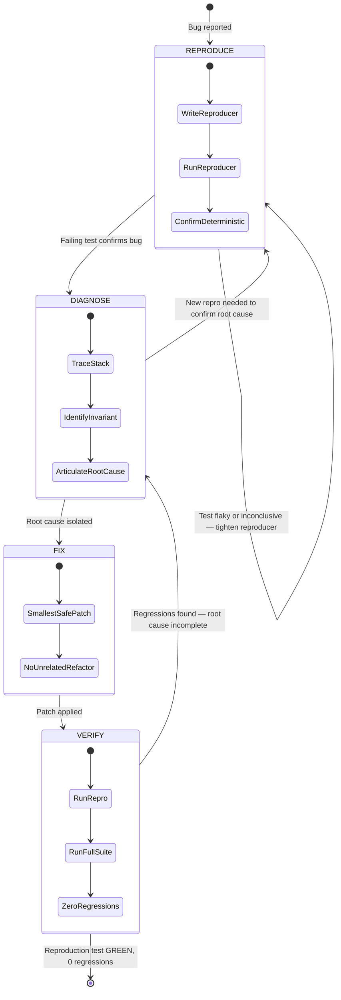

# Systematic Debugging Log: [Issue Description]

## 1. Issue Summary
- **Reported Bug:** [User description or error symptom]
- **Environment:** [OS, runtime, package version, commit hash]
- **Affected Subsystem:** [Module, endpoint, or component]

## 1b. Debugging Loop



## 2. Phase 1 — Deterministic Reproduction (Failing Test First)
- **Minimal Reproducer Test / Command:**
  ```bash
  rtk bun test path/to/repro.test.ts
  ```
- **Observed Failure Output:**
  ```
  [Paste exact error message, call stack, or failure exit code]
  ```
- **Confirmation:** [ ] Confirmed fails deterministically for the exact reason reported.

## 3. Phase 2 — Root Cause Analysis (RCA)
- **Execution Trace:** [Step-by-step trace of state leading up to error]
- **Violated Invariant:** [What invariant, boundary condition, or contract broke?]
- **Root Cause Explanation:** [Why did this occur?]

## 4. Phase 3 — Smallest Safe Localized Fix
- **Target File(s):** `path/to/source.ts`
- **Fix Description:** [Describe the minimal change applied without unrelated refactoring]
- **Patch Preview:**
  ```diff
  - // problematic line
  + // localized fix
  ```

## 5. Phase 4 — Regression Verification
- **Reproduction Test Status:**
  - Command: `rtk bun test path/to/repro.test.ts`
  - Output: Exit 0, 1 passed, 0 failed.
- **Full Suite Status:**
  - Command: `rtk bun test`
  - Output: Exit 0, all existing tests passed.
- **Verdict:** [ ] Bug resolved with 0 regressions.
