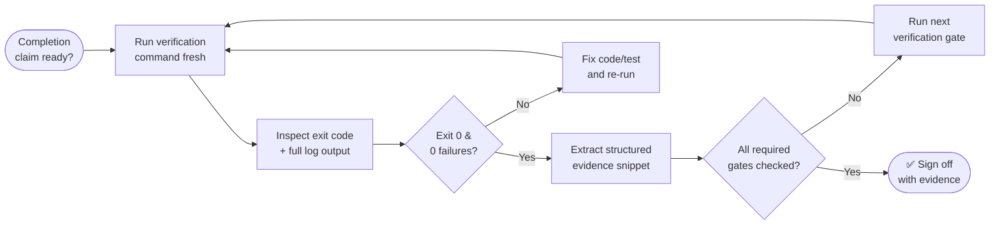

# Verification Checklist Before Completion

## 1. Scope & Acceptance Criteria Sign-Off
- [ ] Stated intent from approved plan is 100% satisfied.
- [ ] No unrequested features, speculative code, or out-of-scope refactoring added.
- [ ] All requested acceptance criteria verified.

## 2. Working Tree & Git Hygiene
- [ ] `git status` inspected: clean state, only expected files modified or staged.
- [ ] All temporary scratch files, debug logs, and repro scripts deleted.
- [ ] No hardcoded tokens, secrets, or API keys present in git diff.
- [ ] Commit message conforms to Conventional Commits format (`feat:`, `fix:`, `docs:`, etc.).

## 2b. Evidence Gate Flow

## 3. Fresh Evidence Table
| Verification Gate | Exact Command | Exit Code | Verified Evidence / Summary | Verdict |
|---|---|---|---|---|
| Unit Tests | `[command]` | 0 | [e.g. 15 passed, 0 failed] | ✅ PASSED |
| Integration Tests | `[command]` | 0 | [e.g. 4 passed, 0 failed] | ✅ PASSED |
| Type Check | `[command]` | 0 | 0 errors found | ✅ PASSED |
| Linter | `[command]` | 0 | 0 lint warnings / errors | ✅ PASSED |
| Production Build | `[command]` | 0 | Build completed successfully | ✅ PASSED |
| Manual / UI Walk | `[command/url]` | 0 | Verified functional end-to-end | ✅ PASSED |

## 4. Pull Request Delivery

- [ ] Session slot claimed with `bun scripts/pr-registry.mjs claim`; branch and worktree copied from its output, not written from memory.
- [ ] `git worktree add` created before any subagent was dispatched; subagents wrote only inside it.
- [ ] No direct commit or push to the base branch. No `--force` on a branch that already has a PR.
- [ ] Every subagent's git state untouched: no subagent ran `git commit`, `add`, `checkout`, `switch`, `merge`, `rebase`, `stash`, `reset`, `push`, or `gh`.
- [ ] Each integrated chunk staged by explicit path, never `git add .`.
- [ ] Body written to a file and posted with `gh pr create --body-file`, following `templates/pull-request-template.md`.
- [ ] PR number recorded: `bun scripts/pr-registry.mjs pr <session> --number <N>`.
- [ ] Session state walked `isolated → active → verified → open` in order, with `verified` set before the PR number.

## 5. Final Completion Verdict
- **Timestamp:** [ISO Timestamp]
- **Commit / State:** [Git commit hash or branch]
- **PR:** `[owner/repo#<number>]` or `not applicable (read-only assessment)`
- **Evidence Verified By:** [Agent / Auditor]
- **Status:** APPROVED FOR COMPLETION / READY FOR PR
- **Merge authority:** [who merges into the base branch. Never the session that produced the work.]
